# Java Engineering Deep Dives


> Production-grade hands-on implementations of the algorithms, data structures,
> concurrency primitives, and API protocols that underpin real distributed systems —
> each with working demos, benchmarks, and detailed design documentation.

---

## Architecture Map

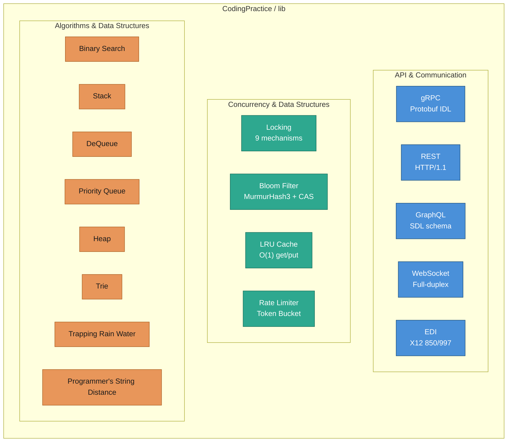

---

## Table of Contents

| # | Topic | Category | Key Techniques | README |
|---|---|---|---|---|
| 1 | [gRPC](#1-grpc) | API Protocol | Protobuf, stubs, bidirectional | [README](lib/src/main/java/org/pk/practices/design/api/grpc/README.md) |
| 2 | [REST API](#2-rest-api) | API Protocol | HTTP/1.1, CRUD, error handling | [README](lib/src/main/java/org/pk/practices/design/api/rest/README.md) |
| 3 | [GraphQL](#3-graphql) | API Protocol | SDL, resolvers, mutations | [README](lib/src/main/java/org/pk/practices/design/api/graphql/README.md) |
| 4 | [WebSocket](#4-websocket) | API Protocol | Full-duplex, rooms, broadcast | [README](lib/src/main/java/org/pk/practices/design/api/websocket/README.md) |
| 5 | [EDI (X12)](#5-edi-x12) | API Protocol | ISA envelope, 850/997, parsing | [README](lib/src/main/java/org/pk/practices/design/api/edi/README.md) |
| 6 | [Locking](#6-locking--concurrency) | Concurrency | 9 lock types, benchmarks | [README](lib/src/main/java/org/pk/practices/design/locking/README.md) |
| 7 | [Bloom Filter](#7-bloom-filter) | Data Structures | MurmurHash3, CAS, FPP math | [DESIGN](lib/src/main/java/org/pk/practices/design/bloomfilter/DESIGN.md) |
| 8 | [LRU Cache](#8-lru-cache) | Data Structures | Doubly-linked list + HashMap | Source |
| 9 | [Rate Limiter](#9-rate-limiter) | Concurrency | Token Bucket algorithm | Source |
| 10 | [DSA](#10-algorithms--data-structures) | Algorithms | Search, Trees, DP, Queues | Source |
| 11 | [AWS Lambda](#11-aws-lambda) | Cloud / Serverless | Handler contract, event shapes, `Context` | [README](lib/src/main/java/org/pk/practices/aws/lambda/README.md) |
| 12 | [AWS SQS](#12-aws-sqs) | Cloud / Messaging | Visibility timeout, redelivery, DLQ | [README](lib/src/main/java/org/pk/practices/aws/sqs/README.md) |
| 13 | [Video Streaming Platform](#13-video-streaming-platform) | System Design | Upload/transcode pipeline, ABR, CDN, DRM | [DESIGN](lib/src/main/java/org/pk/practices/design/videoStreaming/DESIGN.md) |

---

## Quick Start

```bash
git clone <repo-url>
cd CodingPractice

# Run any hands-on (change mainClass in lib/build.gradle.kts)
./gradlew :lib:run
```

All entry points:

```kotlin
// lib/build.gradle.kts — switch mainClass to run any demo:
"org.pk.practices.design.locking.LockingDemo"              // Locking benchmarks
"org.pk.practices.design.bloomfilter.BloomFilterDemo"      // Bloom filter
"org.pk.practices.design.api.edi.EdiDemo"                  // EDI round-trip
"org.pk.practices.design.api.websocket.ChatServer"         // port 8083
"org.pk.practices.design.api.graphql.GraphQlServer"        // port 8082
"org.pk.practices.design.api.rest.RestApiServer"           // port 8081
"org.pk.practices.design.api.grpc.client.Tester"           // port 8080
"org.pk.practices.aws.lambda.LambdaLocalDemo"               // AWS Lambda handlers (no port — CLI)
"org.pk.practices.aws.sqs.SqsLocalDemo"                     // AWS SQS local queue simulator (no port — CLI)
"org.pk.practices.design.videoStreaming.VideoStreamingDemo" // Upload/transcode/ABR pipeline (no port — CLI)
```

---

## 1. gRPC

**Protocol:** HTTP/2 + Protocol Buffers (binary framing, multiplexed streams)

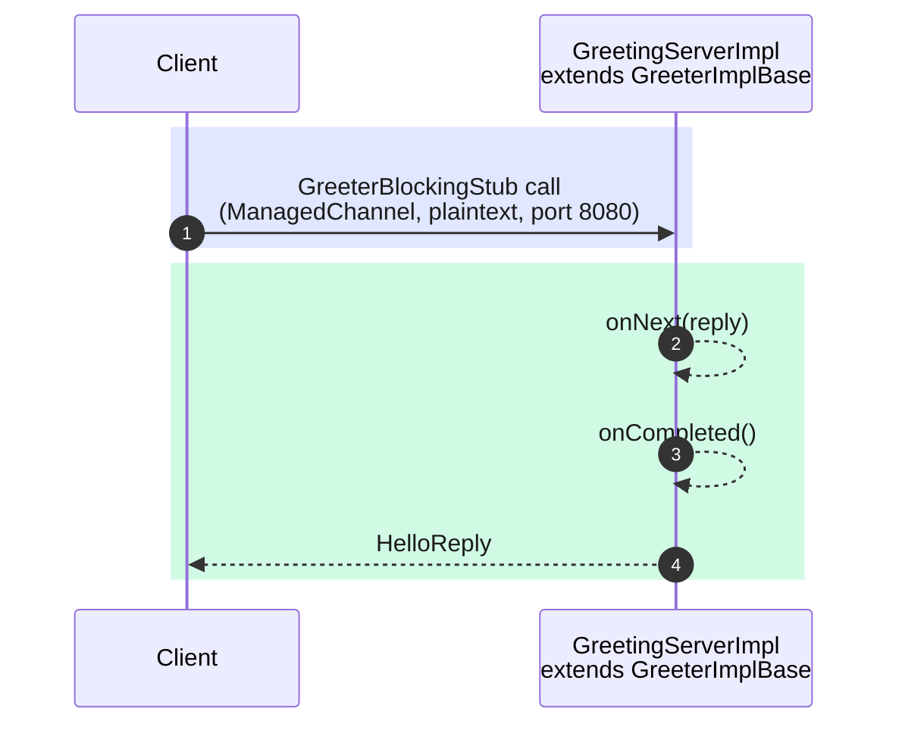

| Component | Class | Role |
|---|---|---|
| Proto IDL | `src/main/proto/GreetingService.proto` | Contract definition |
| Server | `grpc/server/GreetingServerImpl.java` | Implements generated `GreeterImplBase` |
| Client | `grpc/client/GreetingClient.java` | Uses `GreeterBlockingStub`, `AutoCloseable` |
| Wiring | `grpc/client/Tester.java` | Boots server, runs client, graceful shutdown |

**Key concepts:** `.proto` SDL → code generation → type-safe stubs; `StreamObserver` pattern;
`ManagedChannelBuilder`; `awaitTermination`; channel lifecycle management.

```bash
# build.gradle.kts: mainClass = "org.pk.practices.design.api.grpc.client.Tester"
./gradlew :lib:run
```

[Detailed README →](lib/src/main/java/org/pk/practices/design/api/grpc/README.md)

---

## 2. REST API

**Protocol:** HTTP/1.1 — stateless request/response over Javalin 6 (embedded Jetty)

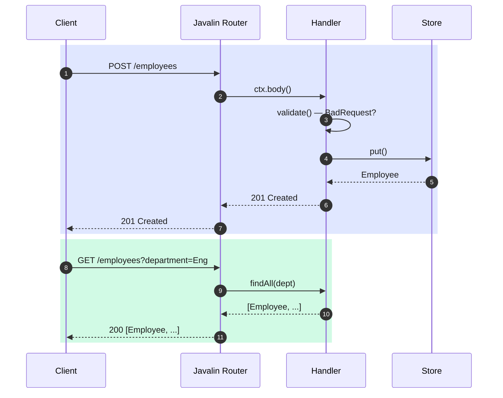

| Verb | Path | Status | Description |
|---|---|---|---|
| `GET` | `/employees` | 200 | List all; `?department=` filter |
| `GET` | `/employees/{id}` | 200 / 404 | Get by ID |
| `POST` | `/employees` | 201 | Create; returns `Location` header |
| `PUT` | `/employees/{id}` | 200 / 404 | Full replace |
| `DELETE` | `/employees/{id}` | 204 / 404 | Remove |

**Key concepts:** REST resource design; proper HTTP verb semantics; 400/404/500 error mapping;
global exception handler; `ConcurrentHashMap` + `AtomicLong` as in-memory store; graceful shutdown hook.

```bash
# mainClass = "org.pk.practices.design.api.rest.RestApiServer"
./gradlew :lib:run
curl -s -X POST http://localhost:8081/employees \
  -H "Content-Type: application/json" \
  -d '{"name":"Alice","department":"Engineering","salary":95000}'
```

[Detailed README →](lib/src/main/java/org/pk/practices/design/api/rest/README.md)

---

## 3. GraphQL

**Protocol:** HTTP/1.1 POST — single endpoint, query language in the body

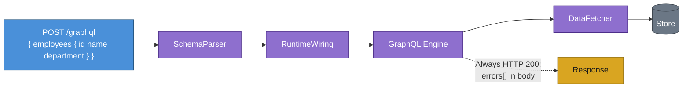

**Schema-first design:**

```graphql
type Query {
  employees(department: String): [Employee!]!
  employee(id: ID!): Employee
}
type Mutation {
  createEmployee(input: CreateEmployeeInput!): Employee!
  updateEmployee(id: ID!, input: UpdateEmployeeInput!): Employee
  deleteEmployee(id: ID!): Boolean!
}
```

**Key concepts:** SDL → `SchemaParser` → `RuntimeWiring` → `SchemaGenerator` pipeline;
`DataFetcher<T>`; `env.getArgument()` for typed args; partial update via `input.containsKey()`;
`result.toSpecification()` for wire format; HTTP 200 always — errors live in the `errors[]` array.

```bash
# mainClass = "org.pk.practices.design.api.graphql.GraphQlServer"
./gradlew :lib:run
curl -s -X POST http://localhost:8082/graphql \
  -H "Content-Type: application/json" \
  -d '{"query":"{ employees { id name salary } }"}'
```

[Detailed README →](lib/src/main/java/org/pk/practices/design/api/graphql/README.md)

---

## 4. WebSocket

**Protocol:** HTTP/1.1 Upgrade → persistent full-duplex TCP — no polling, push-based

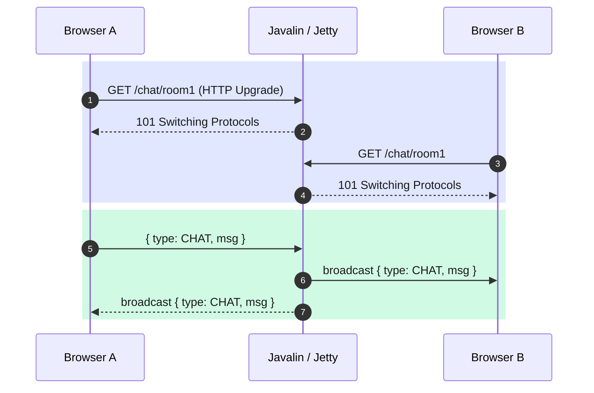

**Lifecycle hooks implemented:**

| Hook | Handler method | What happens |
|---|---|---|
| `onConnect` | `ChatHandler.onConnect` | Resolve username, join room, broadcast JOIN |
| `onMessage` | `ChatHandler.onMessage` | Validate, broadcast CHAT to room |
| `onClose` | `ChatHandler.onClose` | Leave room first, then broadcast LEAVE |
| `onError` | `ChatHandler.onError` | Log only — `onClose` always follows |

**Key insight:** `WsContext` object identity changes per event; sessions stored by `sessionId()`
(stable across all four hooks) in a `ConcurrentHashMap<String, WsContext>`.

```bash
# mainClass = "org.pk.practices.design.api.websocket.ChatServer"
./gradlew :lib:run
# Test with websocat:
websocat "ws://localhost:8083/chat/engineering?username=Alice"
```

[Detailed README →](lib/src/main/java/org/pk/practices/design/api/websocket/README.md)

---

## 5. EDI (X12)

**Protocol:** Plain-text wire format — no HTTP, no JSON. Used in retail, healthcare, finance.

```
ISA*00*          *00*          *ZZ*ACME-CORP      *ZZ*WIDGET-LLC     *260719*1000*^*00501*000000001*0*P*:~
GS*PO*ACME-CORP*WIDGET-LLC*20260719*1000*1*X*005010~
ST*850*0001~
BEG*00*NE*PO-2026-00123**20260719~        ← Purchase Order
PO1*1*10*EA*9.99**UP*00012345678905~      ← Line item
PID*F****Blue Widget~                     ← Description
CTT*1*10~
SE*8*0001~
GE*1*1~
IEA*1*000000001~
```

**Round-trip architecture:**

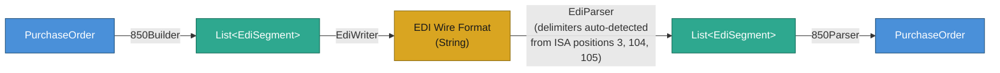

**Two-layer design:** `EdiParser` (generic — any X12 document) → `PurchaseOrder850Parser`
(850-specific state machine). Adding support for a new transaction set (810 Invoice, 856 ASN)
only requires a new translator — the core layer is untouched.

**Key concepts:** ISA/GS/ST envelope hierarchy; element separator, segment terminator, composite
separator; 1-based element access (`PO1**04** = unit price`); SE01 segment count; sender/receiver
reversal in 997 ACK; PO1+PID correlation via pending-state pattern.

```bash
# mainClass = "org.pk.practices.design.api.edi.EdiDemo"
./gradlew :lib:run
```

[Detailed README →](lib/src/main/java/org/pk/practices/design/api/edi/README.md)

---

## 6. Locking & Concurrency

**9 mechanisms benchmarked and demonstrated** with a pluggable `LockingStrategy` interface.

### Mutual Exclusion Strategies (benchmarked head-to-head)

| Strategy | Class | Mechanism | Reentrant | Fairness opt. |
|---|---|---|---|---|
| `synchronized` | `SynchronizedStrategy` | Intrinsic monitor (JVM) | Yes | No |
| `ReentrantLock` | `ReentrantLockStrategy` | Explicit lock + `tryLock` / `lockInterruptibly` | Yes | Yes |
| `ReadWriteLock` | `ReadWriteLockStrategy` | Shared reads / exclusive writes | Yes | Yes |
| `StampedLock` | `StampedLockStrategy` | Optimistic read (lock-free read path) | **No** | No |
| `AtomicLong` | `AtomicStrategy` | CAS — `LOCK CMPXCHG` instruction | N/A | N/A |

### Benchmark Results (10 threads, indicative)

```
WRITE-HEAVY (all threads increment)
  Strategy             Throughput        Notes
  ──────────────────────────────────────────────────────────
  synchronized         ~26 M ops/s       Baseline
  ReentrantLock        ~55 M ops/s       Faster due to JIT optimisations
  ReentrantLock(fair)  ~364 K ops/s      FIFO overhead — predictable but slow
  StampedLock          ~97 M ops/s       Write lock with no fairness queue
  AtomicLong           ~35 M ops/s       CAS — spins under high contention

READ-HEAVY (8 readers + 2 writers, 600 ms)
  Strategy             Throughput        Notes
  ──────────────────────────────────────────────────────────
  synchronized         ~36 M ops/s       Readers block each other
  ReadWriteLock        ~25 M ops/s       Overhead from lock acquisition
  StampedLock          ~703 M ops/s      Optimistic reads — 20× vs. synchronized
  AtomicLong           ~1.7 B ops/s      Volatile reads — no locking at all
```

### Coordination Primitives (demos)

| Primitive | Use case | Key property |
|---|---|---|
| `Semaphore(N)` | DB connection pool — max N concurrent holders | No ownership; any thread may release |
| `CountDownLatch` | Wait for N services to start before serving traffic | One-shot; cannot reset |
| `CyclicBarrier` | Phased parallel computation — all threads sync between phases | Reusable; runs barrier action |
| `Phaser` | Multi-phase ETL pipeline with dynamic thread registration | Dynamic parties; `onAdvance` hook |

```bash
# mainClass = "org.pk.practices.design.locking.LockingDemo"
./gradlew :lib:run
```

[Detailed README →](lib/src/main/java/org/pk/practices/design/locking/README.md)

---

## 7. Bloom Filter

**Probabilistic set membership** — answers "definitely not in set" with certainty, or
"probably in set" with bounded false-positive probability. Zero false negatives.

```
  put("example.com/page"):
    h1, h2 = MurmurHash3.hash128("example.com/page")
    for i in 0..k-1:
      bit[ (h1 + i·h2) mod m ] = 1     ← Kirsch-Mitzenmacher double hashing

  mightContain("example.com/page"):
    all k bits == 1  →  "probably present"
    any bit == 0     →  "definitely absent"  (guaranteed)
```

**Configuration math:**

| Parameter | Formula | Example (1M elements, 1% FPP) |
|---|---|---|
| Bits `m` | `ceil(−n·ln(p) / (ln2)²)` | 9,585,059 bits → **1.1 MB** |
| Hash fns `k` | `round((m/n)·ln2)` | 7 |
| Memory saving vs. `HashSet<String>` | — | ~72× (80 MB → 1.1 MB) |

**Implementation highlights:**
- `MurmurHash3` (x64, 128-bit) — pure Java, produces `long[]{h1, h2}` in one pass
- `AtomicLongArray` + CAS loop — lock-free concurrent bit setting
- `BloomFilterConfig` as immutable record — factory validates and derives `m`, `k`
- `UrlDeduplicator` facade — URL normalisation + deduplication for web crawler use case
- Binary serialization — `writeTo` / `readFrom` for persistence and distribution

```bash
# mainClass = "org.pk.practices.design.bloomfilter.BloomFilterDemo"
./gradlew :lib:run
```

[Design Document →](lib/src/main/java/org/pk/practices/design/bloomfilter/DESIGN.md)

---

## 8. LRU Cache

**O(1) get and put** via a doubly-linked list + `HashMap` — the same strategy used
by `LinkedHashMap` and Redis's LRU eviction.

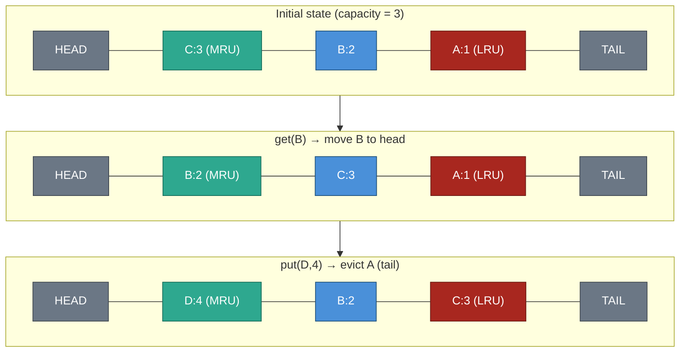

| Operation | Data structure | Time complexity |
|---|---|---|
| `get(key)` | `HashMap` lookup → pointer move | O(1) |
| `put(key, value)` | `HashMap` insert + head insert + optional tail evict | O(1) |
| Eviction target | Tail of doubly-linked list | O(1) |

**Source:** [`design/caching/`](lib/src/main/java/org/pk/practices/design/caching/)

---

## 9. Rate Limiter

**Token Bucket algorithm** — allows short bursts up to bucket capacity while enforcing
a long-term average rate.

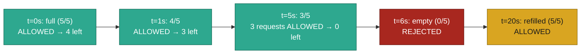

**Key properties:**
- Bursty traffic is absorbed up to `capacity` tokens
- Steady-state rate is bounded to `capacity / windowSize` requests/period
- Per-client configs (`ClientAConfig`, `ClientBConfig`, `ClientCConfig`) allow different SLAs

**Source:** [`design/ratelimiter/`](lib/src/main/java/org/pk/practices/design/ratelimiter/)

---

## 10. Algorithms & Data Structures

| Class | Algorithm / Structure | Technique |
|---|---|---|
| `BinarySearch` | Binary search on sorted array | Divide and conquer, O(log n) |
| `StackExample` | LIFO stack | Array / LinkedList push-pop |
| `DeQueueExample` | Double-ended queue | O(1) head and tail insert/remove |
| `PriorityQueueExample` | Priority queue | Heap ordering, natural comparator |
| `HeapExample` | Binary heap | `PriorityQueue` sift-up / sift-down |
| `Trie` | Prefix tree | Node with `isEndOfWord` flag, char branching |
| `TrappingRainWaterProblem` | Trapping Rain Water | Two-pointer / prefix max arrays, O(n) |
| `ProgrammersString` | String edit distance | Dynamic programming |

**Source:** [`dsa/`](lib/src/main/java/org/pk/practices/dsa/)

---

## 11. AWS Lambda

**Two real handler shapes** — plain POJO in/out, and the API Gateway
proxy-integration shape — invoked directly with no AWS account, no Docker,
and no deployment.

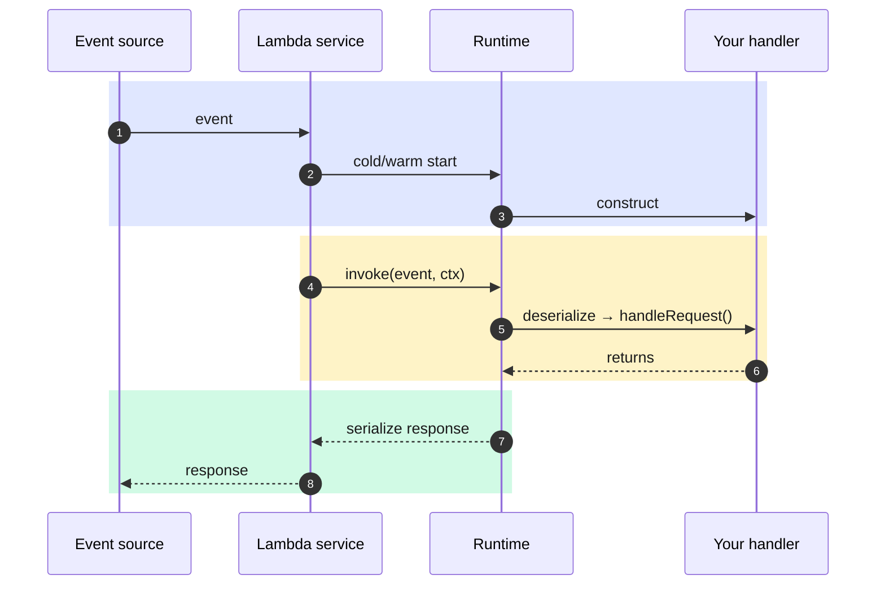

**Key concepts:** `RequestHandler<Input, Output>` is the entire contract with
the runtime; `Context` carries request-scoped metadata (request ID, remaining
time budget, the CloudWatch-backed logger) that only the runtime can
construct — so local testing needs a hand-written stand-in (`LocalContext`).

```bash
# mainClass = "org.pk.practices.aws.lambda.LambdaLocalDemo"
./gradlew :lib:run
```

[Detailed README →](lib/src/main/java/org/pk/practices/aws/lambda/README.md)

---

## 12. AWS SQS

**A hand-rolled, in-memory queue** implementing SQS's real semantics —
visibility timeout, at-least-once redelivery, receipt-handle invalidation,
dead-letter queue redirect — no AWS SDK, no Docker, no network.

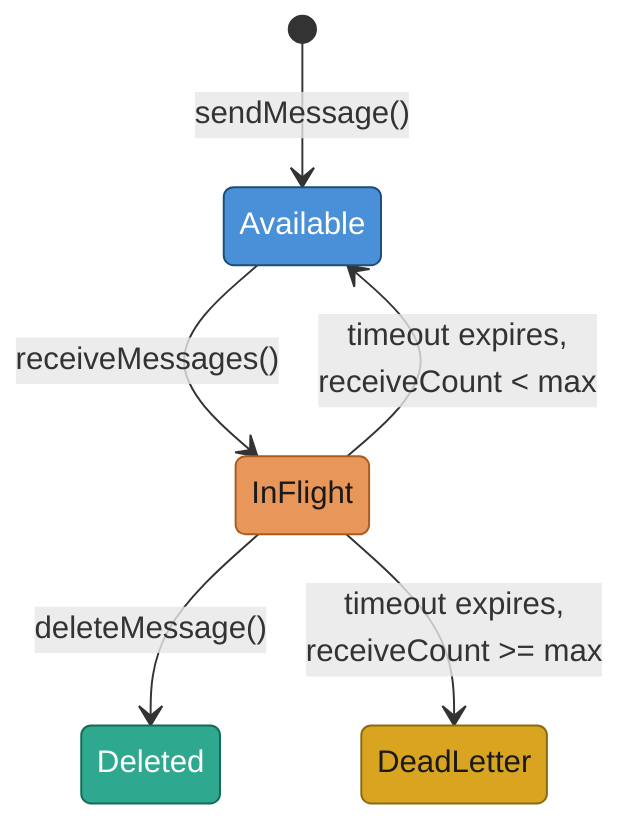

**Key concepts:** a receipt handle is a single-use claim token minted fresh
on every receive, not the same as the message ID — deleting with a stale
handle (from before a redelivery) must fail. No background timer: every
public call lazily sweeps expired in-flight messages back to `available`,
or to the DLQ once `maxReceiveCount` is exhausted.

Two ways to run it — a scripted CLI walkthrough, or a small local web UI
shaped like the real AWS SQS console (queue picker, live counts, send/poll/
delete/extend buttons, plus a **Start/Stop** toggle for a real background
`QueueConsumer` that polls, processes, and deletes messages on its own —
still no AWS anywhere behind it):

```bash
# mainClass = "org.pk.practices.aws.sqs.SqsLocalDemo"       (CLI walkthrough)
# mainClass = "org.pk.practices.aws.sqs.SqsConsoleServer"   (web UI, port 8084)
./gradlew :lib:run
```

[Detailed README →](lib/src/main/java/org/pk/practices/aws/sqs/README.md)

---

## 13. Video Streaming Platform

A YouTube/Netflix-shaped system design — upload & ingestion, transcoding
pipeline, storage tiers, adaptive bitrate streaming, CDN/edge caching,
metadata/search/recommendation, DRM/security, and a full distributed-
systems reliability section — each evaluated with a tools/technology
tradeoffs table. The upload → transcode → ABR-manifest happy path (plus
the partial-failure and poison-video/DLQ scenarios) is also implemented
as real, runnable Java in the same package.

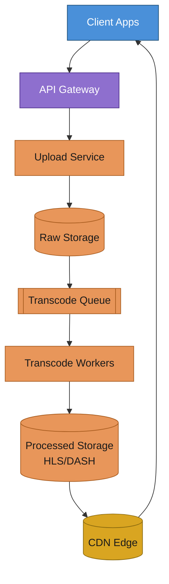

Blue = client, purple = API gateway (the only door in), orange = the
async upload/transcode pipeline, gold = the CDN — note the CDN arrow
back to the client bypasses the gateway entirely, which is what keeps
playback traffic off the control plane. See the design doc's
[§3.1](lib/src/main/java/org/pk/practices/design/videoStreaming/DESIGN.md#31-walking-the-diagram--user-interaction)
for the full walkthrough.

**Key concepts:** per-title encoding ladders and H.264-first/AV1-backfill
as the dominant efficiency levers; CMAF single-encode dual-packaging
(HLS+DASH); hybrid throughput+buffer adaptive bitrate; tiered DRM (signed
URLs vs. full multi-DRM) matched to content sensitivity; split SQL/NoSQL
metadata store by write-volume shape, not one database for everything.

The transcode job queue is a real `LocalSqsQueue` + `QueueConsumer`
imported directly from `org.pk.practices.aws.sqs` — not a simulation of
one — so the retry/redelivery/dead-letter behavior demonstrated there is
literally what runs this pipeline's failure paths too. See the design
doc's [§12](lib/src/main/java/org/pk/practices/design/videoStreaming/DESIGN.md#12-implementation-notes)
for exactly what's real vs. simplified, and
[§10](lib/src/main/java/org/pk/practices/design/videoStreaming/DESIGN.md#10-where-this-connects-to-other-practices-in-this-repo)
for the rate limiter, locking, and Bloom filter connections that remain
design-only.

```bash
# mainClass = "org.pk.practices.design.videoStreaming.VideoStreamingDemo"
./gradlew :lib:run
```

[Detailed design →](lib/src/main/java/org/pk/practices/design/videoStreaming/DESIGN.md)

---

## Tech Stack

| Layer | Technology | Version | Role |
|---|---|---|---|
| Language | Java | 23 | Records, sealed types, pattern matching |
| Build | Gradle | 9.2 | Multi-module build, protobuf plugin |
| HTTP framework | Javalin | 6.3.0 | REST, GraphQL, WebSocket (embedded Jetty) |
| Serialization | Jackson Databind | 2.17.2 | JSON; `-parameters` flag for record support |
| RPC | gRPC / Netty | 1.82.1 | HTTP/2, binary framing |
| IDL | Protocol Buffers | 3.25.5 | Code generation from `.proto` |
| Query language | graphql-java | 23.0 | SDL schema, runtime wiring |
| Logging | SLF4J Simple | 2.0.13 | Javalin/Jetty log output |
| Utilities | Apache Commons Math, Guava | latest | Supporting utilities |

---

## Repository Structure

```
CodingPractice/
├── lib/
│   └── src/main/
│       ├── java/org/pk/practices/
│       │   ├── aws/
│       │   │   ├── lambda/            AWS Lambda handlers (POJO + API Gateway shapes)
│       │   │   └── sqs/               AWS SQS local queue simulator (visibility, DLQ) + console server
│       │   ├── design/
│       │   │   ├── api/
│       │   │   │   ├── grpc/          gRPC server + client + proto
│       │   │   │   ├── rest/          Javalin REST API (CRUD)
│       │   │   │   ├── graphql/       GraphQL server (SDL + resolvers)
│       │   │   │   ├── websocket/     Chat server with rooms
│       │   │   │   └── edi/           X12 850/997 parser + builder
│       │   │   ├── bloomfilter/       Bloom filter + URL deduplicator
│       │   │   ├── caching/           LRU Cache (O(1))
│       │   │   ├── locking/           9 locking mechanisms + benchmarks
│       │   │   ├── ratelimiter/       Token Bucket rate limiter
│       │   │   └── videoStreaming/    DESIGN.md + upload/transcode/ABR pipeline demo
│       │   └── dsa/                   Classic algorithms & data structures
│       ├── proto/                     Protobuf IDL files
│       └── resources/
│           ├── graphql/               GraphQL SDL schema files
│           └── sqs-console/           SQS console UI (index.html, style.css, app.js)
└── build.gradle.kts                   Dependencies + mainClass switcher
```

---

## Navigation by Concept

**"I want to understand how services talk to each other"**
→ [gRPC](#1-grpc) · [REST](#2-rest-api) · [GraphQL](#3-graphql) · [WebSocket](#4-websocket) · [EDI](#5-edi-x12)

**"I want to understand thread safety and lock trade-offs"**
→ [Locking & Concurrency](#6-locking--concurrency)

**"I want to see probabilistic data structures"**
→ [Bloom Filter](#7-bloom-filter)

**"I want classic interview prep"**
→ [LRU Cache](#8-lru-cache) · [Rate Limiter](#9-rate-limiter) · [DSA](#10-algorithms--data-structures)

**"I want to see a serverless/cloud compute example"**
→ [AWS Lambda](#11-aws-lambda)

**"I want to understand how a message queue actually works internally"**
→ [AWS SQS](#12-aws-sqs)

**"I want to see a large-scale system design with real tradeoffs"**
→ [Video Streaming Platform](#13-video-streaming-platform)
