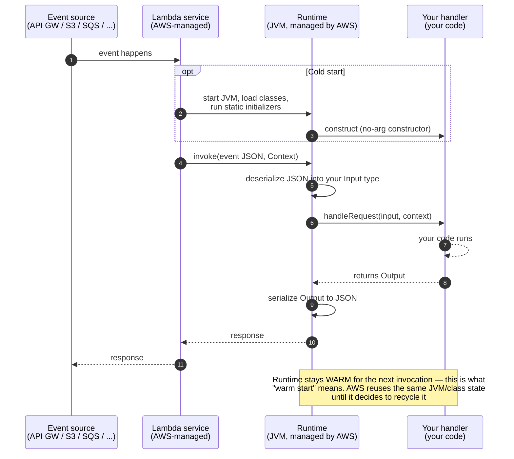
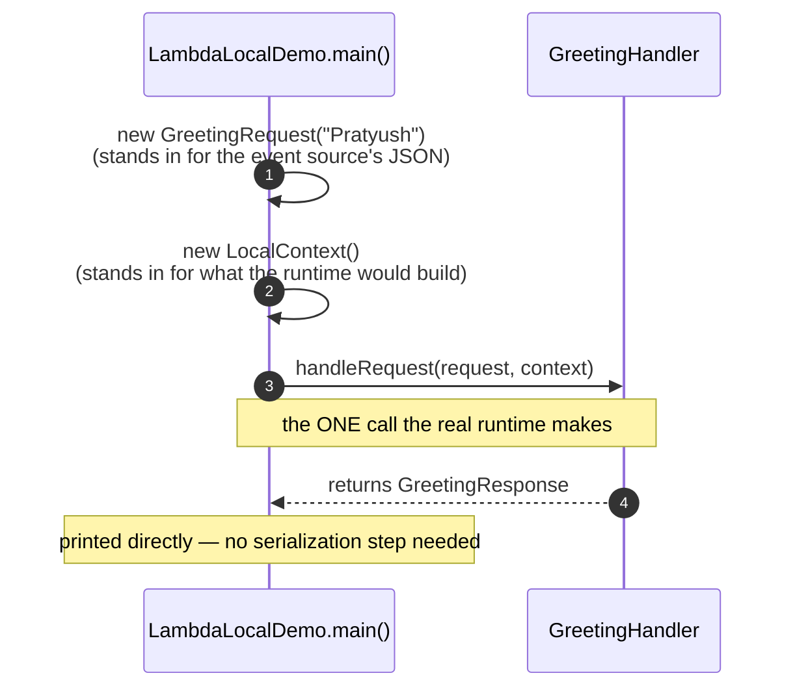

# AWS Lambda Hands-On

Two real AWS Lambda handlers — the canonical "plain POJO" shape and the
"behind API Gateway" shape — invoked locally with no AWS account, no
Docker, and no deployment. Just the handler code and a hand-written stand-in
for what the real Lambda runtime would otherwise hand it.

---

## What is AWS Lambda?

| Aspect | Detail |
|---|---|
| **What it is** | A managed compute service that runs your code in response to events, without you provisioning or managing a server |
| **Unit of deployment** | A "function" — one handler method (or class), packaged as a zip/JAR or container image |
| **Invocation model** | Something else (API Gateway, S3, SQS, EventBridge, a direct SDK call, ...) hands the Lambda **service** an event; the service starts (or reuses) a runtime, calls your handler, returns whatever it gives back |
| **Billing** | Per invocation + per millisecond of execution time — nothing runs (and nothing costs) between invocations |
| **Cold start** | The first invocation after a period of inactivity pays the cost of starting a fresh runtime (JVM startup, class loading, static init) before your handler even runs |
| **Handler contract (Java)** | Implement `RequestHandler<Input, Output>` — `handleRequest(Input, Context)` is the entire interface between your code and the runtime |

---

## Project Layout

```
aws/lambda/
├── GreetingHandler.java          # Plain POJO in/out — the "hello world" Lambda shape
├── GreetingRequest.java          # { "name": "..." }
├── GreetingResponse.java         # { "message": "..." }
├── ApiGatewayHandler.java        # API Gateway proxy-integration shape — manual routing/status/JSON
├── LocalContext.java             # Hand-written stand-in for Context — real Lambda never lets you construct one
└── LambdaLocalDemo.java          # Main entry point — invokes both handlers directly
```

---

## How a Real Deployed Lambda Invocation Works



Everything above the "Your handler" column is infrastructure you never write
or see — it's what "serverless" is actually buying you. Your entire
contribution is the handler class and whatever `Input`/`Output` POJOs it
declares.

---

## How This Local Practice Differs

There is no Lambda service, no runtime, and no event source here — just the
handler code, called directly:



No cold start, no JSON (de)serialization by a runtime, no event source —
this exercises exactly the one method boundary (`handleRequest`) that
matters for the handler's own logic, and nothing else. That's a deliberate
trade: fast, dependency-free iteration on handler code, at the cost of never
seeing what a *real* invocation environment does (environment variables,
`/tmp` being the only writable disk, the 15-minute max runtime, IAM
permissions, VPC networking, ...). See **Going Further** below for closing
that gap.

---

## The Two Handler Shapes

### 1. `GreetingHandler` — plain POJO in/out

```java
public class GreetingHandler implements RequestHandler<GreetingRequest, GreetingResponse> {
    @Override
    public GreetingResponse handleRequest(GreetingRequest request, Context context) {
        context.getLogger().log("greeting '" + request.getName() + "'");
        String name = (request.getName() == null || request.getName().isBlank()) ? "world" : request.getName();
        return new GreetingResponse("Hello, " + name + "!");
    }
}
```

This is what you get invoking a Lambda directly — via the AWS SDK, the CLI
(`aws lambda invoke`), or another Lambda calling this one. The runtime
deserializes whatever JSON the caller sent straight into `GreetingRequest`
(Jackson, wired in by the runtime — not something the handler configures)
and serializes whatever `GreetingResponse` comes back. No HTTP semantics
anywhere in this path — a status code, a header, a body — those only exist
once something in front of the Lambda (API Gateway, an ALB) puts them there.

### 2. `ApiGatewayHandler` — behind an HTTP API

```java
public class ApiGatewayHandler implements RequestHandler<APIGatewayProxyRequestEvent, APIGatewayProxyResponseEvent> {
    @Override
    public APIGatewayProxyResponseEvent handleRequest(APIGatewayProxyRequestEvent request, Context context) {
        if ("GET".equals(request.getHttpMethod()) && "/hello".equals(request.getPath())) {
            String name = request.getQueryStringParameters().getOrDefault("name", "world");
            return jsonResponse(200, Map.of("message", "Hello, " + name + "!"));
        }
        return jsonResponse(404, Map.of("error", "Not found"));
    }
}
```

API Gateway's **proxy integration** hands the Lambda the *entire* HTTP
request — method, path, query string, headers, body — as one
`APIGatewayProxyRequestEvent` POJO (from `aws-lambda-java-events`), and the
handler is responsible for building the *entire* HTTP response back,
status code included. There's no routing framework here on purpose: this is
what you get before reaching for one (API Gateway's own route-mapping
config, or a library like Spring Cloud Function) — every `if` in this
handler is a route a framework would otherwise dispatch for you.

### `Context` and `LocalContext`

`Context` is the one piece of request-scoped metadata a handler gets that
isn't part of the event: `getAwsRequestId()`, `getRemainingTimeInMillis()`
(check this before starting something that might not finish in time),
`getLogger()` (writes to CloudWatch Logs in real Lambda). AWS gives no way
to construct a real one yourself — the runtime is the only thing that ever
builds one — so testing outside that runtime means writing a stand-in.
`LocalContext` does the minimum: plausible fake values for everything, a
logger that just prints to stdout.

---

## Running

```bash
./gradlew :lib:run
```

(`application.mainClass` in `lib/build.gradle.kts` currently points at
`LambdaLocalDemo` — switch it to try any other practice's demo instead, per
the comment block there.)

## Expected Output

```
=== GreetingHandler (plain POJO in/out) ===
[LOCAL-LAMBDA-LOG] Invocation <uuid> — greeting 'Pratyush'
Response: GreetingResponse{message='Hello, Pratyush!'}
[LOCAL-LAMBDA-LOG] Invocation <uuid> — greeting 'null'
Response (no name given): GreetingResponse{message='Hello, world!'}

=== ApiGatewayHandler (API Gateway proxy integration shape) ===
[LOCAL-LAMBDA-LOG] GET /hello
GET /hello?name=Pratyush -> 200 {"message":"Hello, Pratyush!"}
[LOCAL-LAMBDA-LOG] GET /does-not-exist
GET /does-not-exist -> 404 {"error":"Not found: GET /does-not-exist"}
```

---

## Key Concepts Summary

| Concept | Where you see it |
|---|---|
| Handler contract | `RequestHandler<Input, Output>.handleRequest()` — the entire interface to the runtime |
| Event-shape-in, POJO-out | `GreetingHandler` — Jackson (the runtime's, not yours) maps JSON ↔ POJO automatically |
| Proxy integration | `ApiGatewayHandler` — the *whole* HTTP request/response is your problem, not a framework's |
| Request-scoped metadata | `Context` — request ID, remaining time budget, the CloudWatch-backed logger |
| No constructible `Context` | `LocalContext` — a hand-written stand-in, since AWS only ever builds one for you |
| Cold vs. warm start | See the real-invocation diagram — the runtime persists across invocations until AWS recycles it |
| Local ≠ real runtime | See the local-practice diagram — no cold start, no event source, no deserialization step here |

---

## Going Further

This practice deliberately stops at "call the handler method directly." To
get closer to how a deployed Lambda actually behaves — a real invoke API, an
actual JSON event on the wire, `sam local start-api` serving HTTP the way
API Gateway would — the next steps are the
[AWS SAM CLI](https://docs.aws.amazon.com/serverless-application-model/latest/developerguide/using-sam-cli.html)
(`sam local invoke`, `sam local start-api`) or the
[Lambda Runtime Interface Emulator](https://github.com/aws/aws-lambda-runtime-interface-emulator)
directly — both need Docker, and SAM additionally needs its own CLI
installed. Neither changes a line of the handler code above; they only
change what calls `handleRequest()` and how.
