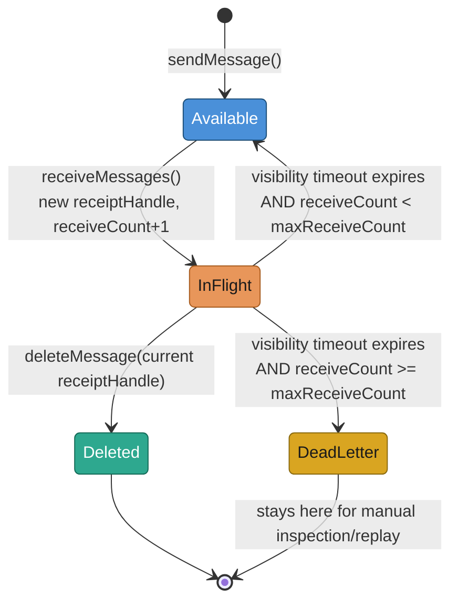
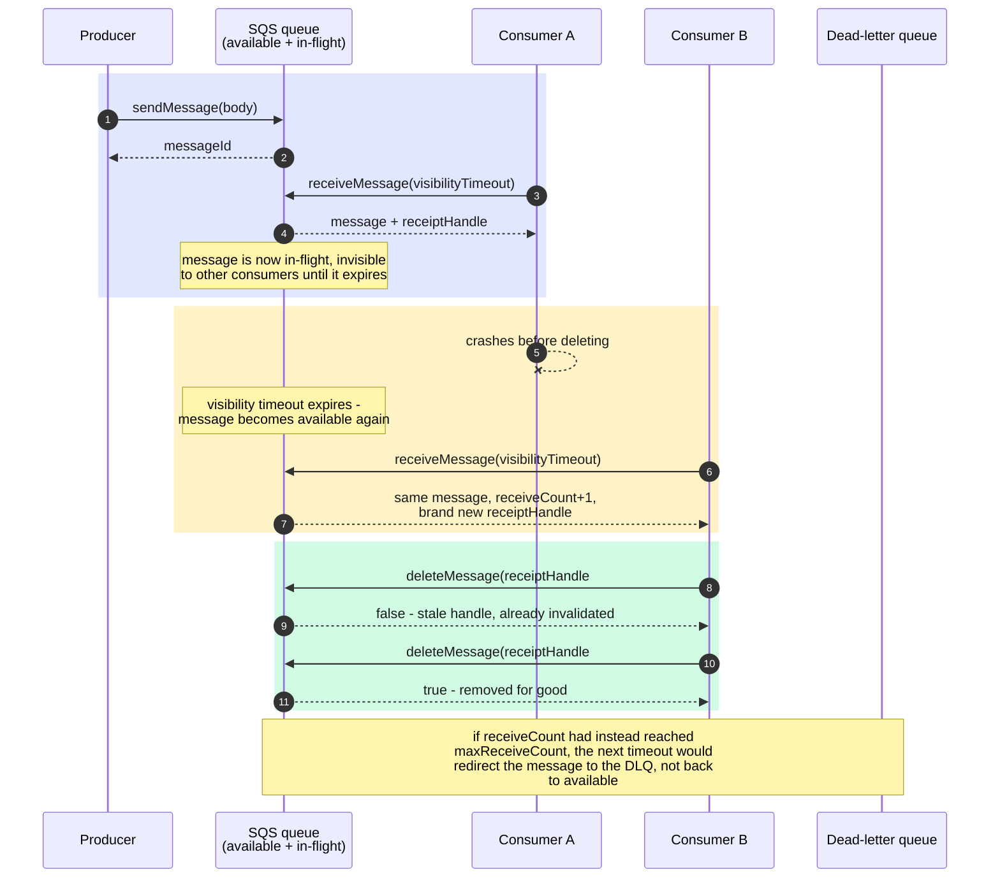
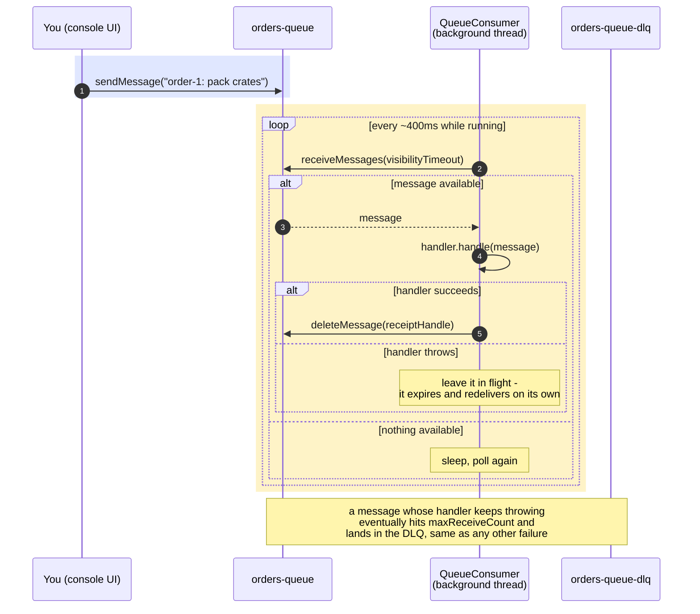

# AWS SQS Hands-On

A from-scratch, in-memory implementation of SQS's actual queue semantics —
visibility timeouts, at-least-once redelivery, receipt-handle invalidation,
dead-letter queues — with no AWS SDK, no Docker, no network. The point isn't
to practice calling someone else's client; it's to build the state machine
that makes SQS behave the way it does, so the gotchas (a stale receipt
handle, a "lost" message that was actually redelivered) stop being surprises.

---

## What is AWS SQS?

| Aspect | Detail |
|---|---|
| **What it is** | A managed, durable message queue — producers send messages, consumers receive and delete them |
| **Delivery guarantee** | At-least-once, not exactly-once (Standard queues) — a message can be delivered more than once, and consumers must be idempotent |
| **Visibility timeout** | When a consumer receives a message, it becomes invisible to other consumers for a configured window — not deleted, just hidden, until the consumer explicitly deletes it |
| **Receipt handle** | A single-use token returned by each receive, required to delete or extend visibility for that specific receive — not the same as the message ID |
| **Redelivery** | If the visibility timeout expires before the message is deleted (consumer crashed, took too long, etc.), the message becomes available again — with a **new** receipt handle |
| **Dead-letter queue (DLQ)** | After a message has been received (and timed out without being deleted) `maxReceiveCount` times, it's redirected to a separate DLQ instead of being redelivered forever |
| **Ordering** | Standard queues make **no** ordering guarantee — this practice keeps FIFO-ish ordering for a readable demo, but real Standard SQS may deliver out of order |

---

## Project Layout

```
aws/sqs/
├── Message.java              # What receiveMessages() hands back — id, receipt handle, body, receive count
├── LocalSqsQueue.java         # The queue itself — available/in-flight state, timeouts, redelivery, DLQ redirect
├── QueueConsumer.java         # Reusable poll-process-delete background worker (the "consumer" side)
├── SqsLocalDemo.java          # Scripted CLI walkthrough — same lifecycle, real timing, no browser needed
└── SqsConsoleServer.java      # Javalin server: producer UI (Send) + a QueueConsumer wired to a Start/Stop toggle
    resources/sqs-console/     # (in lib/src/main/resources) index.html + style.css + app.js for that UI
```

---

## Message Lifecycle



A message is in exactly one of these states at a time. `Available` and
`InFlight` are the two halves of `LocalSqsQueue`'s internal state — a
`Deque` for the former, a `receiptHandle -> (message, expiry)` map for the
latter. Nothing here runs on a background timer: every public call
(`receiveMessages`, `deleteMessage`, `changeMessageVisibility`,
`approximate*Count`) first sweeps the in-flight map for anything whose
timeout has already elapsed. That's a deliberate match for how real SQS
works too — there's no server-push notification of "hey, it's visible
again"; the next thing that looks at the queue just finds it there.

## Redelivery and the Stale Receipt Handle



This is the whole reason SQS hands out a fresh receipt handle on every
receive instead of reusing the message ID: it lets the queue tell "the
consumer that's currently supposed to have this message" apart from "some
earlier consumer that lost its claim." Deleting with an old handle has to
fail — otherwise a crashed consumer's stale handle could delete a message
a *different*, still-working consumer is currently processing.

---

## Producer and Consumer

`LocalSqsQueue` itself doesn't care who's on either end — `sendMessage` is
the whole producer contract, and `receiveMessages`/`deleteMessage` are the
whole consumer contract. `QueueConsumer` wraps the latter into an actual
background worker so "consuming" means something more than a single manual
poll:



`QueueConsumer` is deliberately generic — construct it with any
`LocalSqsQueue` and a `MessageHandler` (a `(Message) -> void` that may
throw), and it owns the poll/process/delete loop and its own thread.
`SqsConsoleServer` wires one to `orders-queue` with a handler that
simulates real work (a 300ms sleep) and a deliberate poison-message rule:
any body containing `fail` always throws. That handler is the only
queue-specific part — everything else (retry via redelivery, eventual
dead-lettering) falls out of the state machine `LocalSqsQueue` already
implements, for free.

**Trying it**: start the console, hit **Start consumer**, then send a
normal message (gets processed and deleted within ~400ms) and one
containing `fail` (gets retried across three redeliveries, visible in the
activity log as each attempt fails, then shows up under the
`orders-queue-dlq` tab).

---

## `LocalSqsQueue` — the Core Methods

```java
public String sendMessage(String body)

public List<Message> receiveMessages(int maxMessages, Duration visibilityTimeout)

public boolean deleteMessage(String receiptHandle)

public boolean changeMessageVisibility(String receiptHandle, Duration newTimeout)
```

Internally, `available` is an `ArrayDeque<InternalMessage>` and `inFlight`
is a `Map<String receiptHandle, InFlightEntry>` where `InFlightEntry` pairs
a message with the `Instant` its visibility expires. A private
`sweepExpired()` runs at the top of every public method: it walks
`inFlight`, and for anything past its expiry, either moves it back onto
`available` (redelivery) or — if `receiveCount >= maxReceiveCount` and a
dead-letter queue was configured — hands it to that queue's internal
`enqueueDirectly()` instead, preserving the original message ID and its
accumulated `receiveCount`.

**A bug this surfaced while building it**: `deleteMessage` and
`changeMessageVisibility` originally skipped the `sweepExpired()` call —
only `receiveMessages` had it. That meant a receipt handle whose message
had *already* timed out, but hadn't yet been swept by some other call,
would still be sitting in the `inFlight` map — so `deleteMessage` on a
truly stale handle could incorrectly return `true`. The fix was to sweep
at the start of all four public methods, not just the one that happened to
need it for its own logic. This is exactly the kind of gotcha that stays
invisible if you only ever call a real SQS client and never build the
state machine behind it.

---

## Running

Two ways to exercise the same `LocalSqsQueue`:

```bash
./gradlew :lib:run
```

runs whichever class `application.mainClass` in `lib/build.gradle.kts`
currently points at — switch between them (or any other practice's demo)
using the comment block there:

- **`SqsLocalDemo`** — the scripted CLI walkthrough described below (happy
  path → crash/redelivery → DLQ), driven entirely by `Thread.sleep()`, no
  browser needed.
- **`SqsConsoleServer`** — a small Javalin web UI, shaped like the real AWS
  SQS console: pick a queue (`orders-queue` or its `orders-queue-dlq`), see
  live available/in-flight counts, send a test message, poll for messages,
  and delete or extend each one by its receipt handle from the page. Starts
  on **http://localhost:8084/**. There's still no AWS anywhere in this path
  — it's the exact same `LocalSqsQueue` class, just with buttons instead of
  a script. Useful for triggering redelivery/DLQ scenarios by hand: poll,
  then just wait past the visibility timeout without clicking Delete.

## Expected Output

```
=== 1. Happy path: send, receive, delete ===
Sent order-1 (...) and order-2
  available=2 inFlight=0
Received: Message[messageId=..., receiptHandle=..., body=order-1: pack 3 crates, receiveCount=1]
Deleted with its receipt handle -> true
  available=1 inFlight=0

=== 2. Consumer crash: received but never deleted ===
Received: Message[..., body=order-2: pack 1 pallet, receiveCount=1] (consumer now 'crashes' and never deletes it)
  available=0 inFlight=1
Sleeping past the 2s visibility timeout...
Delete with the OLD (now-stale) receipt handle -> false (expired the moment it timed out — this must be false)
Redelivered: Message[..., receiveCount=2] — same messageId, receiveCount now 2, brand new receiptHandle
  available=0 inFlight=1

=== 3. Repeated failures -> dead-letter queue ===
(already timed out twice above; letting it time out until maxReceiveCount=3 is reached)
Receive attempt 3: Message[..., receiveCount=3] (still never deleted)
Sleeping past the visibility timeout one last time to trigger the DLQ redirect...
Main queue available/in-flight: 0/0
Dead-letter queue available: 1
In DLQ: Message[..., receiveCount=4] (original messageId preserved: true)
```

(UUIDs vary per run; the shape and counts don't.)

---

## Key Concepts Summary

| Concept | Where you see it |
|---|---|
| Visibility timeout | `InFlightEntry.visibleAt` — the message stays hidden from other receives until this instant passes |
| Receipt handle as a claim token, not an ID | `Message.receiptHandle()` — fresh per receive; `Message.messageId()` stays constant for the message's life |
| At-least-once delivery | Section 2 of the demo — the same message is delivered twice because the first consumer never deleted it in time |
| Lazy expiry sweep | `sweepExpired()` — called at the top of every public method, no background thread needed |
| Dead-letter redirect | `maxReceiveCount` + `deadLetterQueue` constructor args — a message that fails too many times stops coming back |
| Original message ID preserved into the DLQ | `enqueueDirectly()` reuses the same internal message object rather than minting a new one |

---

## Going Further

This practice is a **Standard** queue's semantics only. Real SQS also
offers **FIFO** queues — strict per-message-group ordering plus
content-based or explicit deduplication within a 5-minute window — which
would need group-aware receive logic and a dedup cache, a distinct enough
feature to be its own follow-up rather than folded in here. Beyond that,
closing the gap to a real SQS client means either the
[AWS SDK v2 `SqsClient`](https://docs.aws.amazon.com/sdk-for-java/latest/developer-guide/home.html)
against a real queue, or a local SQS-compatible server
([ElasticMQ](https://github.com/softwaremill/elasticmq) or
[LocalStack](https://github.com/localstack/localstack), both need Docker)
to practice the wire protocol and SDK surface — neither changes the state
machine above; they'd only change what's calling it.
