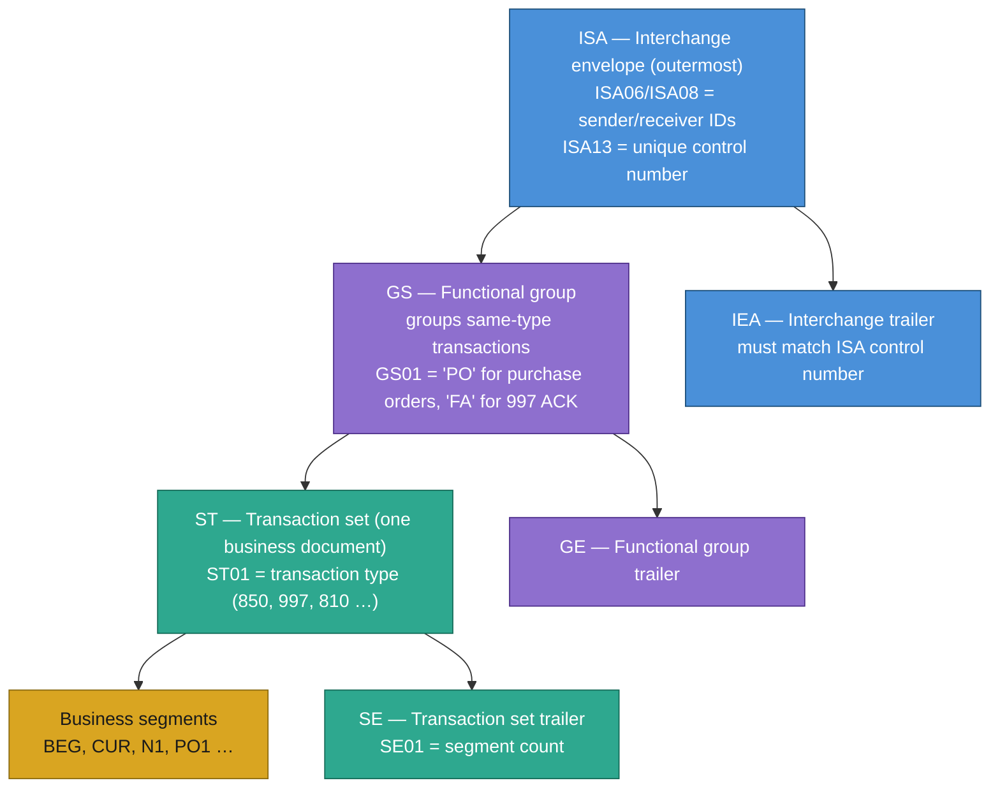
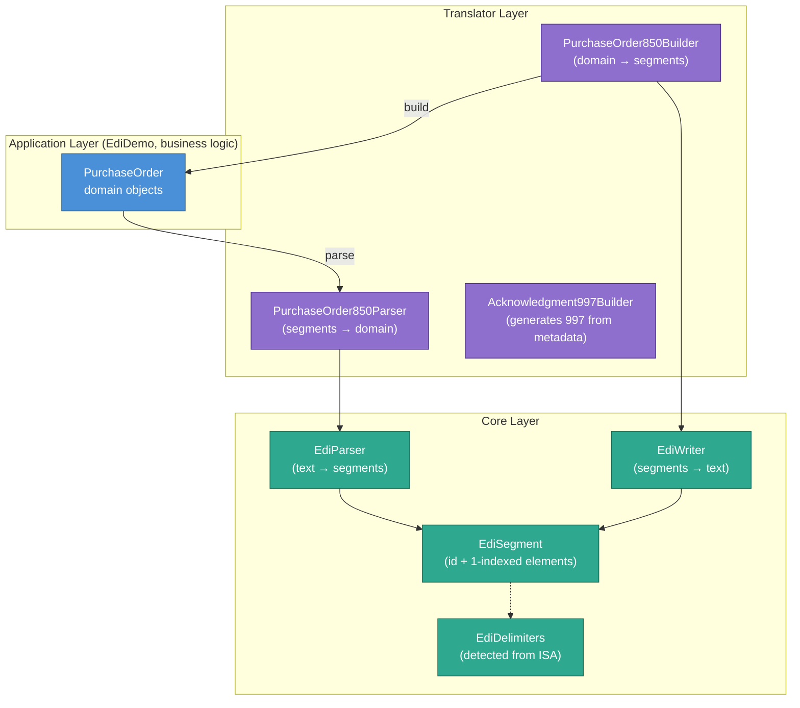
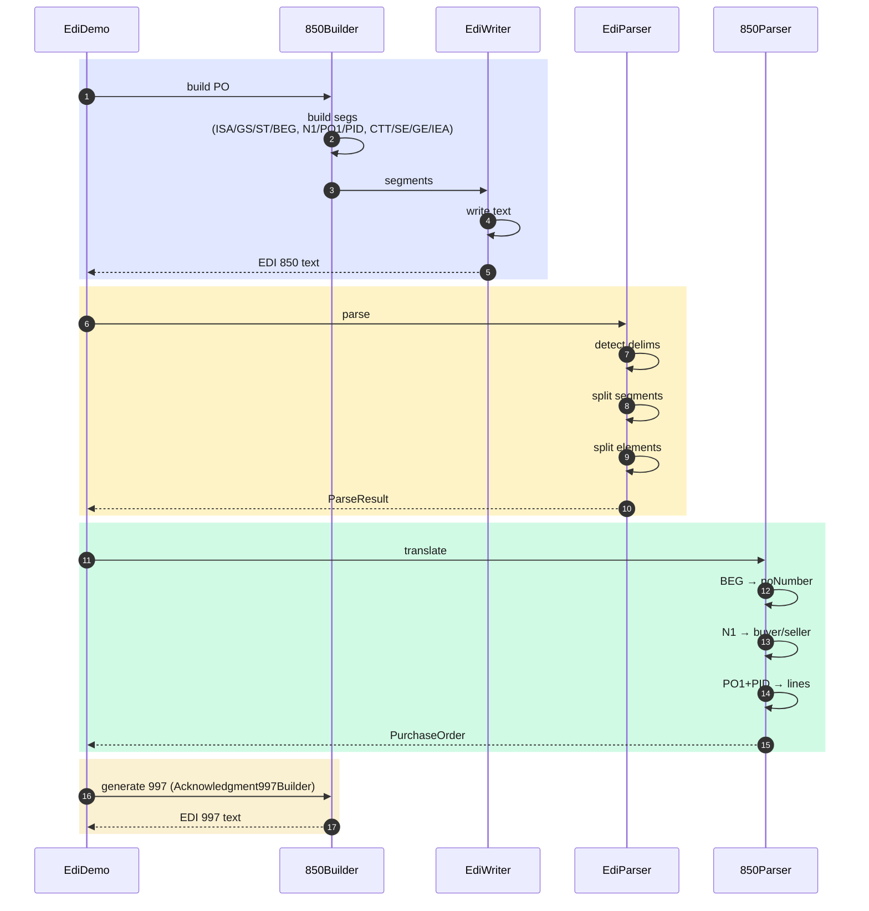

# EDI Hands-On

A pure-Java implementation of X12 Electronic Data Interchange covering:
delimiter-aware parsing, 850 Purchase Order generation and parsing, and 997 Functional
Acknowledgment generation — with no external EDI libraries.

---

## What is EDI?

Electronic Data Interchange is a standardised format for exchanging business documents
between organisations. Instead of emailing a PDF purchase order, companies transmit
structured text files that their systems can parse automatically.

| Aspect | Detail |
|---|---|
| **Standard** | X12 (North America: retail, healthcare, finance) / EDIFACT (international) |
| **Wire format** | Flat text with delimiter-separated fields — compact, no XML overhead |
| **Transport** | AS2, SFTP, FTP, VAN (Value Added Network) |
| **Common uses** | Purchase Orders (850), Invoices (810), Ship Notices (856), Acknowledgments (997) |

---

## Project Layout

```
src/main/java/org/pk/practices/design/api/edi/
├── EdiDemo.java                        # Main entry point — full round-trip demonstration
├── core/
│   ├── EdiDelimiters.java              # Delimiter chars detected from the ISA segment
│   ├── EdiSegment.java                 # One segment: ID + 1-indexed elements
│   ├── EdiParser.java                  # EDI text → List<EdiSegment>
│   └── EdiWriter.java                  # List<EdiSegment> → EDI text
├── model/
│   ├── Party.java                      # Buyer / seller / ship-to
│   ├── PurchaseOrderLine.java          # One PO1 line item
│   ├── PurchaseOrder.java              # Complete 850 domain model
│   └── AcknowledgmentStatus.java       # Enum: ACCEPTED / ACCEPTED_WITH_ERRORS / REJECTED
└── translator/
    ├── PurchaseOrder850Parser.java     # List<EdiSegment> → PurchaseOrder
    ├── PurchaseOrder850Builder.java    # PurchaseOrder → List<EdiSegment> (full envelope)
    └── Acknowledgment997Builder.java   # Generates 997 ACK segment list
```

---

## X12 Document Anatomy

```
ISA*00*          *00*          *ZZ*ACME-CORP      *ZZ*WIDGET-LLC     *260719*1000*^*00501*000000001*0*P*:~
GS*PO*ACME-CORP*WIDGET-LLC*20260719*1000*1*X*005010~
ST*850*0001~
BEG*00*NE*PO-2026-00123**20260719~
CUR*BY*USD~
DTM*002*20260726~
N1*BY*ACME Corp*92*BUYER-001~
N1*SE*Widget LLC*92*VENDOR-001~
PO1*1*10*EA*9.99**UP*00012345678905~
PID*F****Blue Widget~
PO1*2*5*EA*24.99**UP*00098765432109~
PID*F****Premium Gadget~
CTT*2*15~
SE*12*0001~
GE*1*1~
IEA*1*000000001~
```

### Envelope hierarchy



### Segment structure

```mermaid
flowchart LR
    ID["PO1<br/>segment ID"] -->|"* separator"| P1["01: 1"] -->|"*"| P2["02: 10"] -->|"*"| P3["03: EA"] -->|"*"| P4["04: 9.99"] -->|"*"| P5["05: (empty)<br/>optional field"] -->|"*"| P6["06: UP"] -->|"*"| P7["07: 00012345678905"] -->|"~ terminator"| END(["end of segment"])

    classDef idCls fill:#4a90d9,stroke:#1c4e78,color:#ffffff
    classDef elemCls fill:#2ea88f,stroke:#146b58,color:#ffffff
    classDef emptyCls fill:#6b7785,stroke:#3d454e,color:#ffffff
    classDef termCls fill:#d9a521,stroke:#8a6a0f,color:#1a1a1a
    class ID idCls
    class P1,P2,P3,P4,P6,P7 elemCls
    class P5 emptyCls
    class END termCls
```



Elements are referenced by segment ID + 2-digit position: **PO101**, **PO102**, etc.
Empty elements (two consecutive separators) represent optional fields.

---

## Architecture

### Two-layer design



---

### Full Round-Trip Flow



---

### 850 Segment to Domain Object Mapping

```
EDI Segment                     Domain Field
────────────────────────────────────────────────────────────
BEG*00*NE*PO-2026-00123**20260719~
  BEG01 = "00"               → purposeCode
  BEG03 = "PO-2026-00123"   → poNumber
  BEG05 = "20260719"         → poDate (LocalDate)

CUR*BY*USD~
  CUR02 = "USD"              → currency

DTM*002*20260726~
  DTM01 = "002" (qualifier)  → (selects deliveryDate field)
  DTM02 = "20260726"         → requestedDeliveryDate (LocalDate)

N1*BY*ACME Corp*92*BUYER-001~
  N101 = "BY"                → buyer.roleCode
  N102 = "ACME Corp"         → buyer.name
  N103 = "92"                → buyer.idQualifier
  N104 = "BUYER-001"         → buyer.id

PO1*1*10*EA*9.99**UP*00012345678905~
  PO101 = "1"                → line.lineNumber
  PO102 = "10"               → line.quantity
  PO103 = "EA"               → line.unitOfMeasure
  PO104 = "9.99"             → line.unitPrice
  PO106 = "UP"               → line.productCodeQualifier
  PO107 = "00012345678905"   → line.productCode

PID*F****Blue Widget~
  PID05 = "Blue Widget"      → line.description (for preceding PO1)
```

---

## Running

```bash
./gradlew :lib:run
```

---

## Expected Output

```
──────────────────────────────────────────────────────────────────────
  GENERATED X12 850 — Purchase Order
──────────────────────────────────────────────────────────────────────
ISA*00*          *00*          *ZZ*ACME-CORP      *ZZ*WIDGET-LLC     *260719*1000*^*00501*000000001*0*P*:~
GS*PO*ACME-CORP*WIDGET-LLC*20260719*1000*1*X*005010~
ST*850*0001~
BEG*00*NE*PO-2026-00123**20260719~
CUR*BY*USD~
DTM*002*20260726~
N1*BY*ACME Corp*92*BUYER-001~
N1*SE*Widget LLC*92*VENDOR-001~
PO1*1*10*EA*9.99**UP*00012345678905~
PID*F****Blue Widget~
PO1*2*5*EA*24.99**UP*00098765432109~
PID*F****Premium Gadget~
PO1*3*20*CS*4.50**UP*00055512340001~
PID*F****Value Pack~
CTT*3*35~
SE*16*0001~
GE*1*1~
IEA*1*000000001~

──────────────────────────────────────────────────────────────────────
  PARSED 850 — Domain Object
──────────────────────────────────────────────────────────────────────
  PO Number   : PO-2026-00123
  Purpose     : 00
  PO Date     : 2026-07-19
  Delivery    : 2026-07-26
  Currency    : USD
  Buyer       : ACME Corp (BUYER-001)
  Seller      : Widget LLC (VENDOR-001)
  Lines       :
    #1  qty=10    UOM=EA  price=$9.99      [UP:00012345678905]  Blue Widget     → $99.90
    #2  qty=5     UOM=EA  price=$24.99     [UP:00098765432109]  Premium Gadget  → $124.95
    #3  qty=20    UOM=CS  price=$4.50      [UP:00055512340001]  Value Pack      → $90.00
  Grand Total : $314.85

──────────────────────────────────────────────────────────────────────
  GENERATED X12 997 — Functional Acknowledgment
──────────────────────────────────────────────────────────────────────
ISA*00*          *00*          *ZZ*WIDGET-LLC     *ZZ*ACME-CORP      *260719*1000*^*00501*000000002*0*P*:~
GS*FA*WIDGET-LLC*ACME-CORP*20260719*1000*1*X*005010~
ST*997*0001~
AK1*PO*1~
AK2*850*0001~
AK5*A~
AK9*A*1*1*1~
SE*6*0001~
GE*1*1~
IEA*1*000000002~
```

---

## Key Concepts Summary

| Concept | Where you see it |
|---|---|
| ISA envelope | `PurchaseOrder850Builder` — outermost wrapper with sender/receiver IDs |
| Delimiter detection | `EdiDelimiters.fromIsa()` — reads positions 3, 104, 105 of the ISA |
| Segment splitting | `EdiParser` — splits on segment terminator, then element separator |
| 1-based element access | `EdiSegment.element(int)` — matches X12 spec notation (BEG03, PO104…) |
| ISA fixed-width fields | ISA06/ISA08 must be exactly 15 chars — padded with spaces |
| SE01 segment count | Computed dynamically: count segments from ST through SE inclusive |
| PO1 + PID correlation | `PurchaseOrder850Parser` — pending line state flushed when next PO1 or CTT arrives |
| Sender/receiver swap | 997 builder reverses ISA06/ISA08 — receiver of 850 becomes sender of 997 |
| AK1/AK2/AK5/AK9 | 997 segments that reference the original group/transaction control numbers |
| Two-layer parse | `EdiParser` (generic) → `PurchaseOrder850Parser` (850-specific) |
| Pure Java | No external EDI library — delimiters, splitting, formatting all hand-written |
