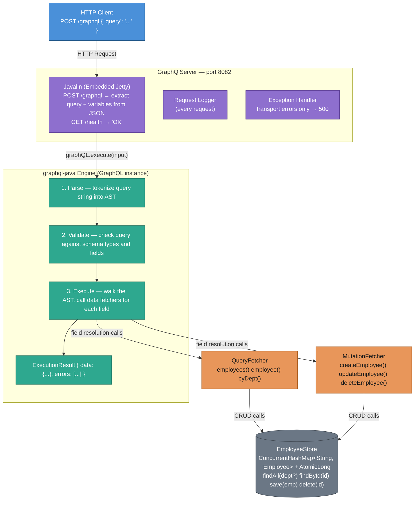
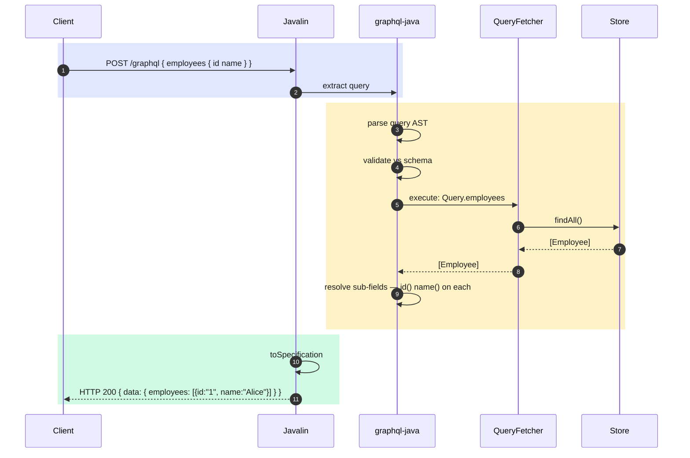
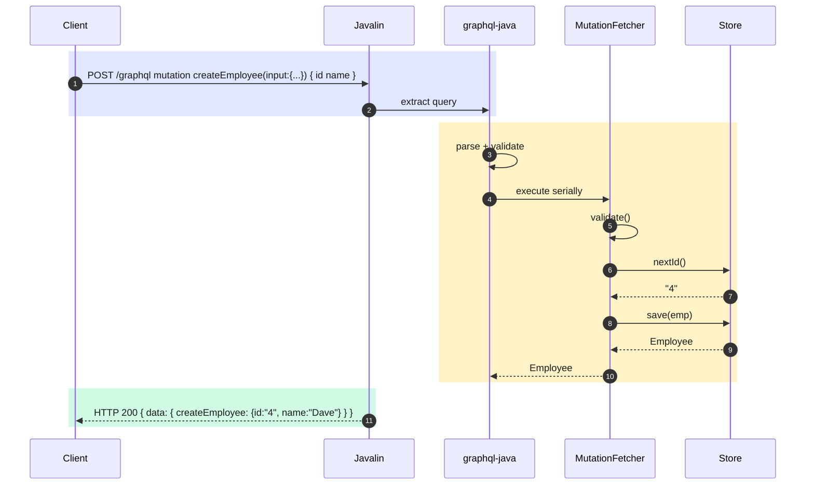
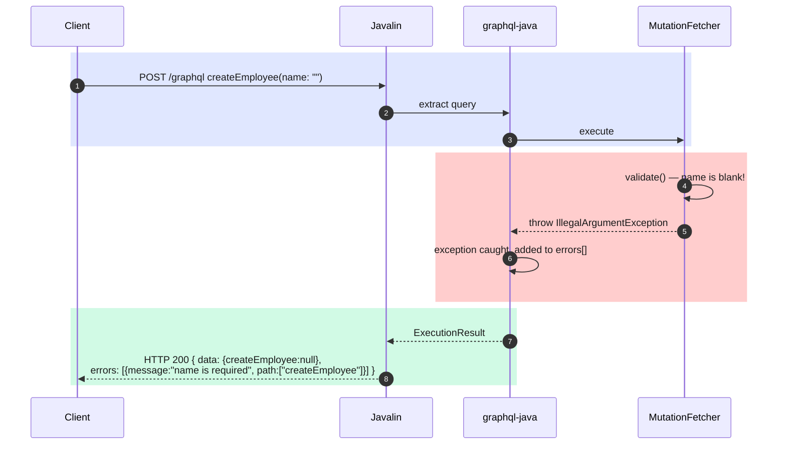

# GraphQL Hands-On

A production-patterned Employee CRUD GraphQL API built with graphql-java and Javalin.
Covers the full GraphQL lifecycle: SDL schema design, data fetcher wiring, query execution,
mutations, partial updates, error handling, and HTTP transport.

---

## What is GraphQL?

GraphQL is a query language and runtime for APIs. Clients describe exactly the data they
need; the server returns exactly that — no more, no less.

| Concept | Meaning |
|---|---|
| **Single endpoint** | All operations go to `POST /graphql` — there are no per-resource URLs. |
| **Client-driven shape** | The client writes the query; the response mirrors that shape exactly. |
| **Typed schema** | An SDL file defines every type, field, and argument — the contract between client and server. |
| **Queries** | Read operations (like GET in REST). |
| **Mutations** | Write operations (like POST/PUT/DELETE in REST). |
| **No versioning** | Add fields to the schema without breaking existing clients (they just don't ask for them). |

---

## Project Layout

```
src/
├── main/
│   ├── resources/graphql/
│   │   └── schema.graphqls              # SDL schema (source of truth)
│   └── java/org/pk/practices/design/api/graphql/
│       ├── GraphQlServer.java           # HTTP server + GraphQL endpoint
│       ├── schema/
│       │   └── SchemaBuilder.java       # Parse SDL → wire fetchers → GraphQL instance
│       ├── fetcher/
│       │   ├── EmployeeQueryFetcher.java    # Data fetchers for Query type
│       │   └── EmployeeMutationFetcher.java # Data fetchers for Mutation type
│       ├── model/
│       │   └── Employee.java            # Domain model returned by fetchers
│       └── store/
│           └── EmployeeStore.java       # Thread-safe in-memory repository
```

---

## Architecture

### Component Layers



---

### Request Lifecycle — Query (read)



---

### Request Lifecycle — Mutation (write)



---

### Error Path — Validation Failure

GraphQL errors surface in the response body (HTTP status stays 200):



---

## Schema Walkthrough (`schema.graphqls`)

```graphql
type Query {
    employees: [Employee!]!          # non-null list of non-null employees
    employee(id: ID!): Employee      # nullable — null means "not found"
    employeesByDepartment(department: String!): [Employee!]!
}

type Mutation {
    createEmployee(input: CreateEmployeeInput!): Employee!
    updateEmployee(id: ID!, input: UpdateEmployeeInput!): Employee   # nullable
    deleteEmployee(id: ID!): Boolean!
}

type Employee {
    id: ID!
    name: String!
    department: String!
    salary: Float!
}

input CreateEmployeeInput { name: String!  department: String!  salary: Float! }
input UpdateEmployeeInput { name: String   department: String   salary: Float  }
#                                  ↑ no !  → optional fields = partial update
```

**Non-null (`!`) rules:**
- `Employee!` — the field will never be null (server contract)
- `[Employee!]!` — both the list and each element are guaranteed non-null
- `Employee` (no `!`) — the field may be null (used where "not found" is a valid outcome)

---

## Running

```bash
./gradlew :lib:run
```

The server starts on **port 8082**:
```
[main] INFO GraphQlServer - GraphQL API listening on http://localhost:8082/graphql
```

All requests go to a single endpoint: `POST http://localhost:8082/graphql`.

---

## Expected Output & curl Examples

### Query — list all employees
```bash
curl -X POST http://localhost:8082/graphql \
     -H "Content-Type: application/json" \
     -d '{"query": "{ employees { id name department salary } }"}'
```
```json
{
  "data": {
    "employees": [
      {"id":"1","name":"Alice","department":"Engineering","salary":95000.0},
      {"id":"2","name":"Bob","department":"Marketing","salary":75000.0},
      {"id":"3","name":"Carol","department":"Product","salary":85000.0}
    ]
  }
}
```

---

### Query — request only specific fields (no over-fetching)
```bash
curl -X POST http://localhost:8082/graphql \
     -H "Content-Type: application/json" \
     -d '{"query": "{ employees { name department } }"}'
```
```json
{
  "data": {
    "employees": [
      {"name":"Alice","department":"Engineering"},
      {"name":"Bob","department":"Marketing"},
      {"name":"Carol","department":"Product"}
    ]
  }
}
```
> Only `name` and `department` are returned — `id` and `salary` are never fetched.

---

### Query — get one employee by ID
```bash
curl -X POST http://localhost:8082/graphql \
     -H "Content-Type: application/json" \
     -d '{"query": "{ employee(id: \"1\") { id name salary } }"}'
```
```json
{"data": {"employee": {"id":"1","name":"Alice","salary":95000.0}}}
```

---

### Query — employee not found (null, not an error)
```bash
curl -X POST http://localhost:8082/graphql \
     -H "Content-Type: application/json" \
     -d '{"query": "{ employee(id: \"99\") { id name } }"}'
```
```json
{"data": {"employee": null}}
```
> HTTP 200. `null` data is the GraphQL idiom for "not found" on a nullable field.

---

### Query — filter by department
```bash
curl -X POST http://localhost:8082/graphql \
     -H "Content-Type: application/json" \
     -d '{"query": "{ employeesByDepartment(department: \"Engineering\") { id name } }"}'
```
```json
{"data": {"employeesByDepartment": [{"id":"1","name":"Alice"}]}}
```

---

### Mutation — create employee
```bash
curl -X POST http://localhost:8082/graphql \
     -H "Content-Type: application/json" \
     -d '{
       "query": "mutation CreateEmp($input: CreateEmployeeInput!) { createEmployee(input: $input) { id name department salary } }",
       "variables": { "input": { "name": "Dave", "department": "Finance", "salary": 80000 } }
     }'
```
```json
{"data": {"createEmployee": {"id":"4","name":"Dave","department":"Finance","salary":80000.0}}}
```
> **Variables** keep the query string static and values in a separate JSON object —
> easier to parameterise in code and avoids injection risks.

---

### Mutation — partial update (only salary changes)
```bash
curl -X POST http://localhost:8082/graphql \
     -H "Content-Type: application/json" \
     -d '{
       "query": "mutation { updateEmployee(id: \"1\", input: { salary: 105000 }) { id name salary } }"
     }'
```
```json
{"data": {"updateEmployee": {"id":"1","name":"Alice","salary":105000.0}}}
```
> `name` and `department` are omitted from the input — they retain their existing values.

---

### Mutation — delete employee
```bash
curl -X POST http://localhost:8082/graphql \
     -H "Content-Type: application/json" \
     -d '{"query": "mutation { deleteEmployee(id: \"2\") }"}'
```
```json
{"data": {"deleteEmployee": true}}
```

---

### Error — validation failure (name blank)
```bash
curl -X POST http://localhost:8082/graphql \
     -H "Content-Type: application/json" \
     -d '{
       "query": "mutation { createEmployee(input: { name: \"\", department: \"IT\", salary: 70000 }) { id } }"
     }'
```
```json
{
  "data": {"createEmployee": null},
  "errors": [
    {
      "message": "name is required",
      "path": ["createEmployee"],
      "locations": [{"line":1,"column":12}]
    }
  ]
}
```
> HTTP status is still **200**. The `errors` array in the body carries the problem detail.

---

## Key Concepts Summary

| Concept | Where you see it |
|---|---|
| SDL schema | `schema.graphqls` — types, fields, arguments, non-null markers |
| Schema parsing | `SchemaParser.parse(reader)` in `SchemaBuilder` |
| Runtime wiring | `newRuntimeWiring().type(...)` in `SchemaBuilder` |
| Data fetcher | `EmployeeQueryFetcher` / `EmployeeMutationFetcher` — implements `DataFetcher<T>` |
| `DataFetchingEnvironment` | `env.getArgument("id")` in fetcher methods |
| Sub-field resolution | `PropertyDataFetcher` calls `employee.name()` automatically |
| Query execution | `graphQL.execute(input)` in `GraphQlServer` |
| Response format | `result.toSpecification()` → `{"data":{...}, "errors":[...]}` |
| Null = not found | `employee(id: "99")` returns `{"employee": null}` — HTTP 200 |
| Errors in body | Fetcher exceptions → `errors[]` array, never HTTP 4xx/5xx |
| Input types | `CreateEmployeeInput` / `UpdateEmployeeInput` — typed mutation payloads |
| Partial update | `UpdateEmployeeInput` has no `!` — omitted fields keep existing value |
| Variables | `"variables": {"input": {...}}` — keep query strings static and reusable |
| Single endpoint | All operations: `POST /graphql` |
| Thread-safe store | `ConcurrentHashMap` + `AtomicLong` in `EmployeeStore` |
| Graceful shutdown | `Runtime.addShutdownHook` in `GraphQlServer` |
