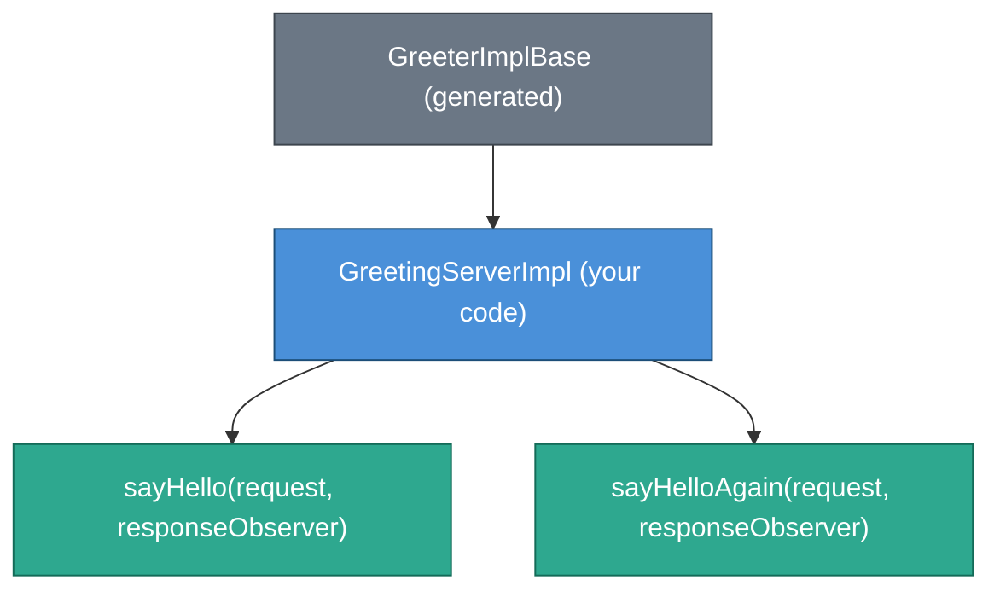
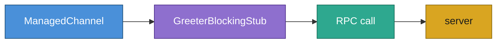
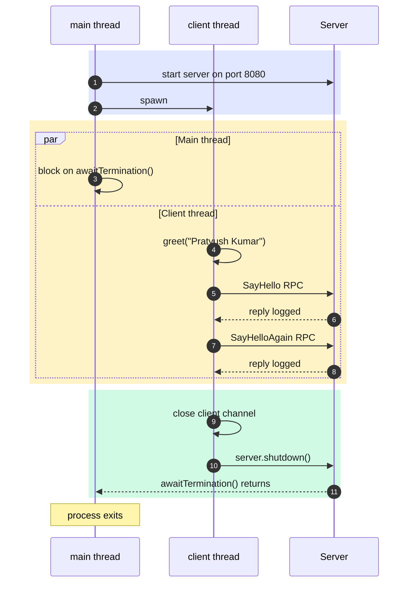

# gRPC Hands-On

A minimal end-to-end gRPC example in Java demonstrating how to define a service contract
in Protobuf, implement the server, and call it from a client — all within a single project.

---

## What is gRPC?

gRPC is a high-performance Remote Procedure Call (RPC) framework built on HTTP/2.
You define your service contract once in a `.proto` file. The protobuf compiler then
generates all the boilerplate networking code (serialization, stubs, base classes) so
you only write business logic.

Key properties:
- **Binary protocol** (protobuf) — compact on the wire, strongly typed.
- **HTTP/2** — multiplexed streams, header compression, bidirectional streaming.
- **Code generation** — never write serialization or transport code by hand.
- **Four RPC patterns** — unary, server-streaming, client-streaming, bidirectional streaming.
  This example uses **unary** (one request → one response).

---

## Project Layout

```
src/
├── main/
│   ├── proto/
│   │   └── GreetingService.proto          # Service contract (source of truth)
│   └── java/org/pk/practices/design/api/grpc/
│       ├── server/
│       │   └── GreetingServerImpl.java    # Server-side RPC implementation
│       └── client/
│           ├── GreetingClient.java        # gRPC client
│           └── Tester.java                # Main entry point (runs server + client)
```

Generated by the protobuf compiler at build time (do **not** edit manually):
```
build/generated/source/proto/main/
├── grpc/org/pk/practices/design/api/grpc/proto/
│   └── GreeterGrpc.java                  # Stubs + GreeterImplBase
└── java/org/pk/practices/design/api/grpc/proto/
    └── GreetingService.java              # HelloRequest + HelloReply message classes
```

---

## Step 1 — The Proto Schema

**`src/main/proto/GreetingService.proto`**

```protobuf
syntax = "proto3";
package org.pk.practices.design.api.grpc.proto;

service Greeter {
  rpc SayHello      (HelloRequest) returns (HelloReply) {}
  rpc SayHelloAgain (HelloRequest) returns (HelloReply) {}
}

message HelloRequest {
  string name = 1;
}

message HelloReply {
  string message = 1;
}
```

What each part means:

| Element | Purpose |
|---|---|
| `syntax = "proto3"` | Use the proto3 language version (simpler defaults than proto2). |
| `package` | Controls the Java package of the generated classes. |
| `service Greeter` | Declares a gRPC service. Each `rpc` entry becomes a method on the generated stub. |
| `rpc SayHello (HelloRequest) returns (HelloReply)` | A **unary** RPC: one request in, one reply out. Streaming RPCs use `stream` keyword. |
| `message HelloRequest` | A protobuf message. The `= 1` is the field **tag number** (binary encoding identifier, not a default value). |

The protobuf compiler (`protoc`) reads this file and generates:
- `GreetingService.java` — immutable `HelloRequest` and `HelloReply` builder classes.
- `GreeterGrpc.java` — `GreeterImplBase` (extend on the server) and `GreeterBlockingStub` (use on the client).

---

## Step 2 — The Server

**`server/GreetingServerImpl.java`**



The gRPC framework deserializes incoming bytes into a `HelloRequest`, calls your override,
and then serializes whatever you put into `responseObserver` back onto the wire.

Unary handler pattern:
```java
responseObserver.onNext(reply);    // send the response
responseObserver.onCompleted();    // signal: no more messages
```

For error cases use `responseObserver.onError(throwable)` instead of `onCompleted`.

The server is started in `Tester.java` using `ServerBuilder`:
```java
Server server = ServerBuilder.forPort(8080)
        .addService(new GreetingServerImpl())
        .build()
        .start();
```

Multiple service implementations can be registered on a single `Server` instance.

---

## Step 3 — The Client

**`client/GreetingClient.java`**



| Component | Role |
|---|---|
| `ManagedChannel` | Manages the underlying HTTP/2 connection pool, reconnection, and load balancing. One instance can be shared across threads and reused for many calls. |
| `GreeterBlockingStub` | Generated proxy. Each method call blocks the calling thread until the server replies. |
| `usePlaintext()` | Disables TLS — fine for local development. Production must use TLS credentials. |

`GreetingClient` implements `AutoCloseable` so the channel is always shut down via
try-with-resources, releasing Netty background threads:
```java
try (GreetingClient client = new GreetingClient("localhost", 8080)) {
    client.greet("Pratyush Kumar");
}
```

gRPC also provides `GreeterStub` (async callbacks) and `GreeterFutureStub` (`ListenableFuture`)
for non-blocking patterns. The blocking stub is the simplest starting point.

---

## Step 4 — Running

The `Tester` class starts the server and runs the client in the same JVM:



The client runs on a separate thread because `server.awaitTermination()` on the main thread
blocks until `server.shutdown()` is called — running both on the same thread would deadlock.

### Run command

From the project root (`CodingPractice/`):

```bash
./gradlew :lib:run
```

The `generateProto` task runs automatically before compilation, producing the generated
Java classes under `build/generated/source/proto/`.

---

## Expected Output

```
Server started on port 8080
Jul 19, 2026 10:00:00 AM org.pk.practices.design.api.grpc.client.GreetingClient greet
INFO: Sending greeting requests for: Pratyush Kumar
Jul 19, 2026 10:00:00 AM org.pk.practices.design.api.grpc.client.GreetingClient callSayHello
INFO: SayHello response: Hello Pratyush Kumar
Jul 19, 2026 10:00:00 AM org.pk.practices.design.api.grpc.client.GreetingClient callSayHelloAgain
INFO: SayHelloAgain response: Hello again Pratyush Kumar
Server shut down
```

---

## Gradle Configuration Reference

The following additions to `build.gradle.kts` enable gRPC code generation:

```kotlin
plugins {
    id("com.google.protobuf") version "0.9.5"
}

dependencies {
    implementation("io.grpc:grpc-protobuf:1.82.1")      // protobuf integration
    implementation("io.grpc:grpc-stub:1.82.1")           // stub classes
    runtimeOnly("io.grpc:grpc-netty-shaded:1.82.1")     // HTTP/2 transport
    compileOnly("org.apache.tomcat:annotations-api:6.0.53") // @Generated on JDK 9+
}

protobuf {
    protoc {
        artifact = "com.google.protobuf:protoc:3.25.5"   // the protobuf compiler
    }
    plugins {
        create("grpc") {
            artifact = "io.grpc:protoc-gen-grpc-java:1.82.1" // gRPC Java plugin
        }
    }
    generateProtoTasks {
        all().forEach { it.plugins { create("grpc") } }
    }
}
```

---

## Key Concepts Summary

| Concept | Where you see it |
|---|---|
| Proto schema | `GreetingService.proto` |
| Generated message classes | `GreetingService.HelloRequest`, `GreetingService.HelloReply` |
| Generated server base | `GreeterGrpc.GreeterImplBase` |
| Generated client stubs | `GreeterGrpc.GreeterBlockingStub` |
| Server implementation | `GreetingServerImpl extends GreeterImplBase` |
| RPC response pattern | `onNext(reply)` then `onCompleted()` |
| Channel lifecycle | `ManagedChannel` — create once, close on `AutoCloseable.close()` |
| Transport | HTTP/2 via Netty (grpc-netty-shaded) |
