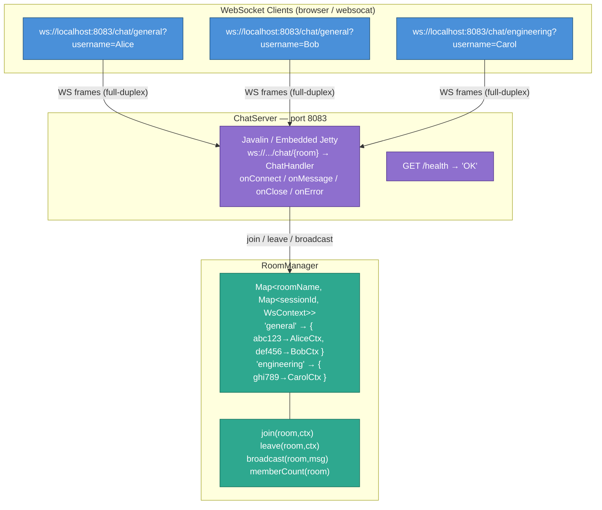
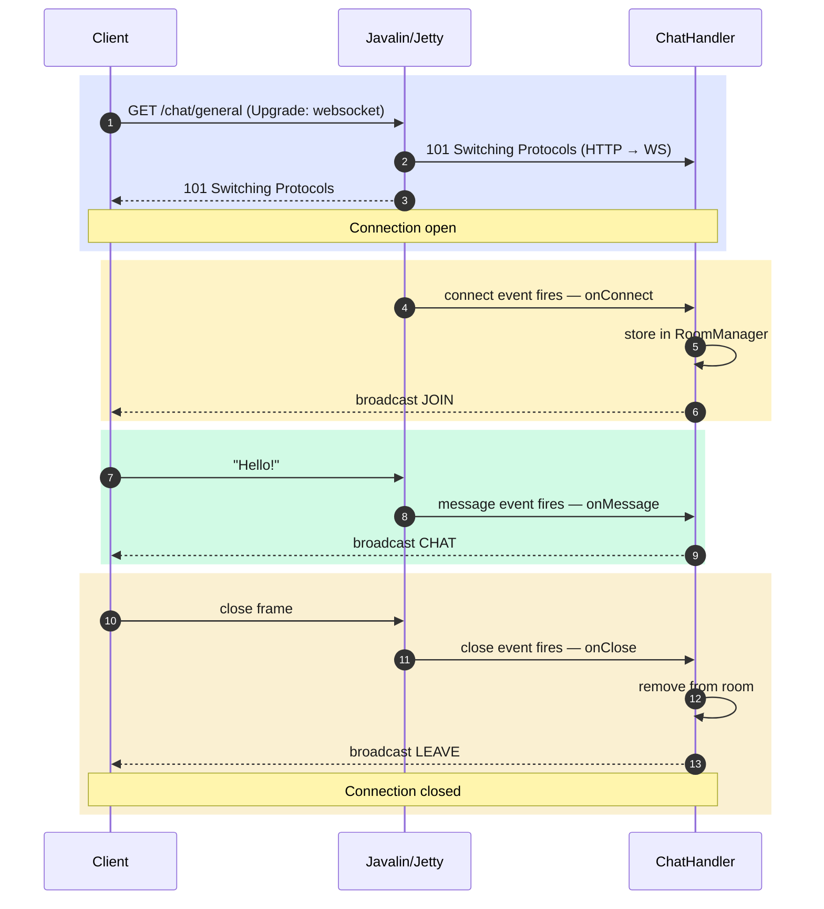
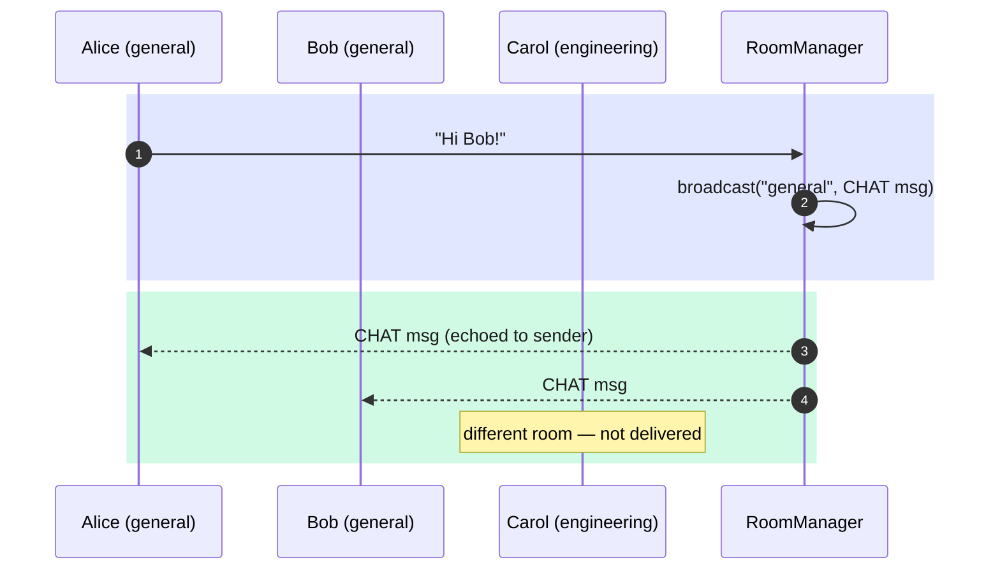
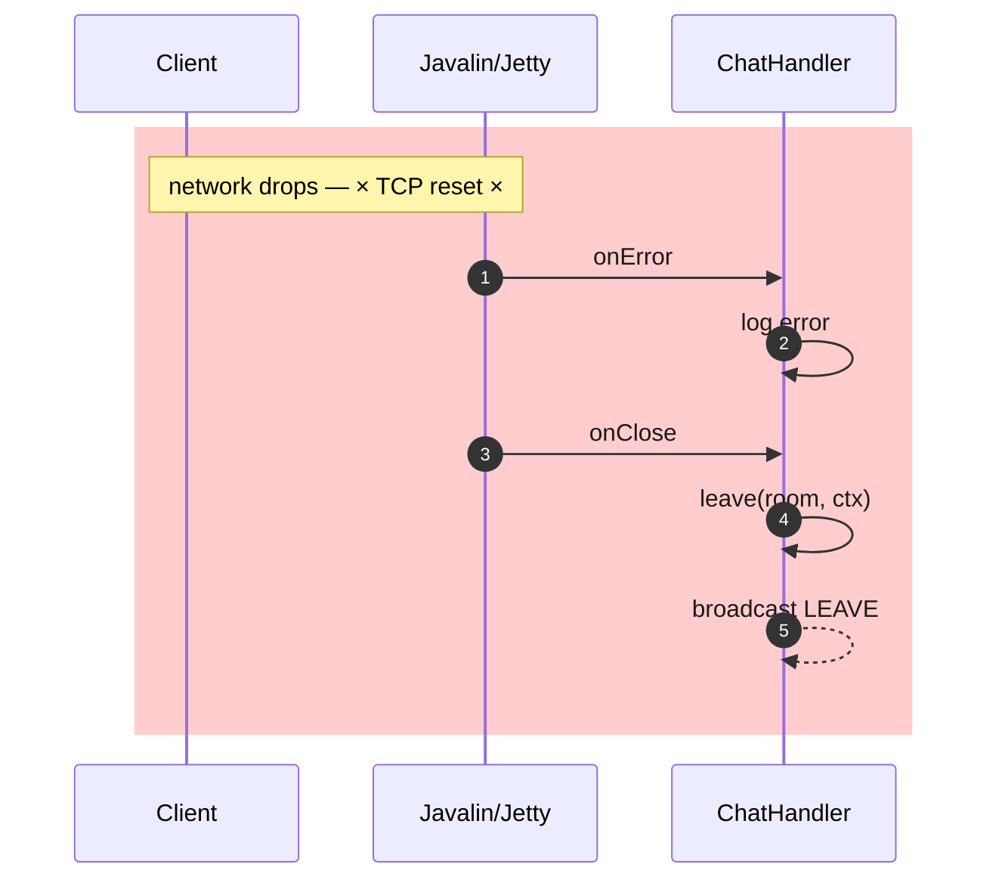

# WebSocket Hands-On

A production-patterned multi-room chat server built with Javalin (embedded Jetty).
Demonstrates the full WebSocket lifecycle: connection upgrade, session state, message
broadcasting, room isolation, graceful disconnect, and error handling.

---

## WebSocket vs HTTP

| | HTTP | WebSocket |
|---|---|---|
| **Direction** | Client initiates, server replies | Either side sends at any time |
| **Connection** | Opens and closes per request | Stays open until explicitly closed |
| **Server push** | Not possible (polling workaround) | Native — server pushes without a request |
| **Overhead** | ~800 bytes headers per message | 2–10 bytes framing per message |
| **Use cases** | CRUD APIs, page loads | Chat, live feeds, collaborative editing |

WebSocket starts as an HTTP request with an `Upgrade: websocket` header. The server
responds `101 Switching Protocols` and the TCP connection then speaks the WebSocket
framing protocol for its entire lifetime.

---

## Project Layout

```
src/main/java/org/pk/practices/design/api/websocket/
├── ChatServer.java              # Server setup, WebSocket route, wiring
├── model/
│   ├── ChatMessage.java         # Wire format — JSON DTO sent over the socket
│   └── MessageType.java         # Enum: JOIN | CHAT | LEAVE | ERROR
├── room/
│   └── RoomManager.java         # Thread-safe room registry + broadcast
└── handler/
    └── ChatHandler.java         # Four lifecycle hooks: onConnect / onMessage / onClose / onError
```

---

## Architecture

### Component Layers



---

### Connection Lifecycle



---

### Message Broadcasting (multi-client)



---

### Error Path



---

## Layer Walkthrough

### `model/MessageType.java`
An enum with four values (`JOIN`, `CHAT`, `LEAVE`, `ERROR`). Having an explicit type field
in every message means clients can render each category differently without parsing content.

### `model/ChatMessage.java`
Immutable record with factory methods:
```java
ChatMessage.join("Alice", "general")   // type=JOIN,  sender="Alice"
ChatMessage.chat("Alice", "general", "Hello!")  // type=CHAT
ChatMessage.leave("Alice", "general")  // type=LEAVE
ChatMessage.error("general", "...")    // type=ERROR, sender="server"
```
All factories stamp the current UTC time via `Instant.now()`.

### `room/RoomManager.java`
The core of the server. Holds:
```
Map<roomName, Map<sessionId, WsContext>>
```
Key design decisions:
- **Keyed by session ID, not context object** — each WebSocket event creates a new
  `WsContext` wrapper. Using the session ID (stable for a connection's lifetime) avoids
  identity issues when removing from `onClose` what was added in `onConnect`.
- **`ConcurrentHashMap` at both levels** — Javalin dispatches events on Jetty threads
  concurrently. No global lock is needed.
- **Serialise once, send to all** — the `ChatMessage` is converted to JSON once per
  broadcast call, then the same string is sent to every member in the room.
- **Empty rooms are pruned** — avoids unbounded map growth in long-running servers.

### `handler/ChatHandler.java`
One method per lifecycle event. Session state (the username) is stored with
`ctx.attribute("username", value)` in `onConnect` and read back in subsequent events.
The Jetty session's attribute map persists for the connection's lifetime.

```
onConnect  → resolve username → join room → broadcast JOIN
onMessage  → read username   → broadcast CHAT  (blank messages dropped)
onClose    → leave room      → broadcast LEAVE (departing client already removed)
onError    → log only        → onClose fires next and does the cleanup
```

### `ChatServer.java`
Three responsibilities:
1. **Wiring** — construct `RoomManager` and `ChatHandler`.
2. **Routing** — `app.ws("/chat/{room}", ws -> { ... })` wires the four event handlers.
3. **Cross-cutting** — HTTP request logger, HTTP exception handler, graceful shutdown hook.

---

## Running

```bash
./gradlew :lib:run
```

Expected startup output:
```
[main] INFO ChatServer - Chat server ready  →  ws://localhost:8083/chat/{room}?username={name}
[main] INFO ChatServer - Health check       →  http://localhost:8083/health
```

---

## Testing

WebSocket connections are persistent — `curl` does not support them. Use one of these
instead.

### Option 1 — `websocat` CLI (recommended)

Install: `brew install websocat`

Open **two separate terminal windows** to simulate two users in the same room:

**Terminal 1 — Alice:**
```bash
websocat "ws://localhost:8083/chat/general?username=Alice"
```

**Terminal 2 — Bob:**
```bash
websocat "ws://localhost:8083/chat/general?username=Bob"
```

Type a message in Terminal 1 and press Enter. Both terminals receive the broadcast.

### Option 2 — Browser JavaScript console

Open any tab, press F12, go to the Console tab:

```javascript
// Open connection
const ws = new WebSocket("ws://localhost:8083/chat/general?username=BrowserUser");

// Log incoming messages
ws.onmessage = e => console.log(JSON.parse(e.data));

// Send a message
ws.send("Hello from the browser!");

// Close connection
ws.close();
```

---

## Expected Output

### Server logs (two clients joining and chatting)
```
INFO  ChatServer  - GET /chat/general -> 101 (2ms)
INFO  ChatHandler - 'Alice' connected to room 'general' (session: abc123, members now: 1)
INFO  ChatServer  - GET /chat/general -> 101 (1ms)
INFO  ChatHandler - 'Bob' connected to room 'general' (session: def456, members now: 2)
INFO  ChatHandler - [general] Alice: Hello Bob!
INFO  ChatHandler - 'Bob' disconnected from room 'general' (code: 1000, reason: '')
INFO  RoomManager - Session def456 left room 'general' (1 members remain)
```

### Messages received by Alice (JSON over the socket)
```json
{"type":"JOIN","sender":"Alice","room":"general","content":"Alice joined the room","timestamp":"2026-07-19T10:00:00.123Z"}
{"type":"JOIN","sender":"Bob","room":"general","content":"Bob joined the room","timestamp":"2026-07-19T10:00:05.456Z"}
{"type":"CHAT","sender":"Alice","room":"general","content":"Hello Bob!","timestamp":"2026-07-19T10:00:10.789Z"}
{"type":"LEAVE","sender":"Bob","room":"general","content":"Bob left the room","timestamp":"2026-07-19T10:00:15.000Z"}
```

### Messages received by Bob (joined after Alice)
```json
{"type":"JOIN","sender":"Bob","room":"general","content":"Bob joined the room","timestamp":"2026-07-19T10:00:05.456Z"}
{"type":"CHAT","sender":"Alice","room":"general","content":"Hello Bob!","timestamp":"2026-07-19T10:00:10.789Z"}
```
> Bob does not see Alice's original JOIN because he was not in the room yet.
> Bob does not receive his own LEAVE because he was removed from the room before the broadcast.

---

## Key Concepts Summary

| Concept | Where you see it |
|---|---|
| WebSocket upgrade | `app.ws("/chat/{room}", ...)` in `ChatServer` |
| Path parameter in WS | `ctx.pathParam("room")` in `ChatHandler` |
| Query param (username) | `ctx.queryParam("username")` in `onConnect` |
| Session attribute | `ctx.attribute("username", value)` — persists across all events |
| Four lifecycle hooks | `onConnect / onMessage / onClose / onError` |
| Room registry | `Map<roomName, Map<sessionId, WsContext>>` in `RoomManager` |
| Store by session ID | Stable across context wrappers; enables `onClose` to remove `onConnect`'s entry |
| Broadcasting | Iterate room members, call `ctx.send(json)` on each |
| Serialise once | JSON string built once per broadcast, sent to N clients |
| Graceful disconnect | `onClose` removes client then broadcasts LEAVE to remaining members |
| Error handling | `onError` logs; `onClose` always follows and does cleanup |
| Room pruning | Empty rooms removed from map to prevent memory leak |
| Graceful shutdown | `Runtime.addShutdownHook` in `ChatServer` |
