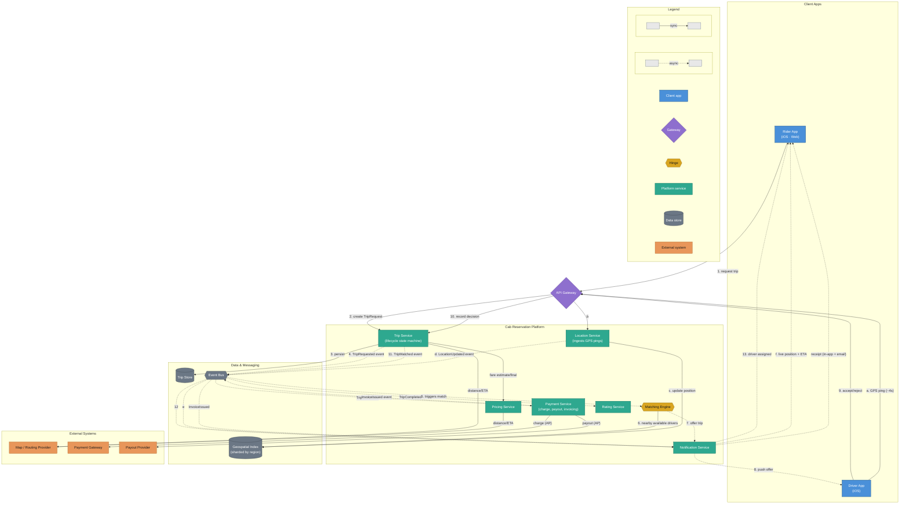
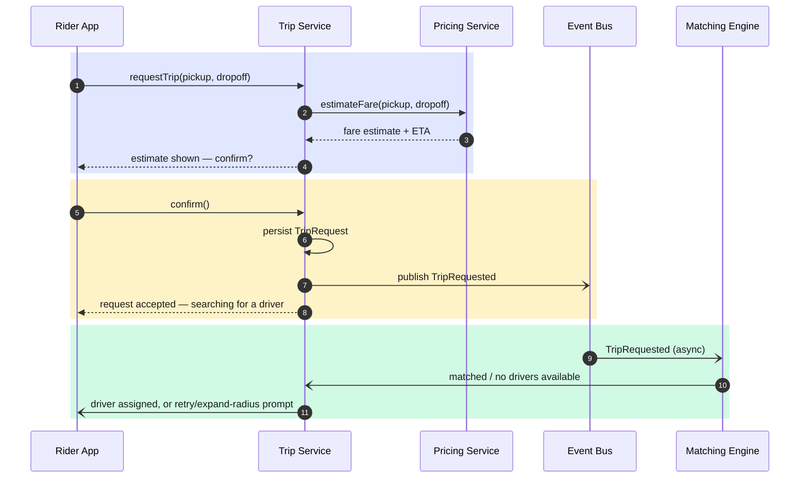
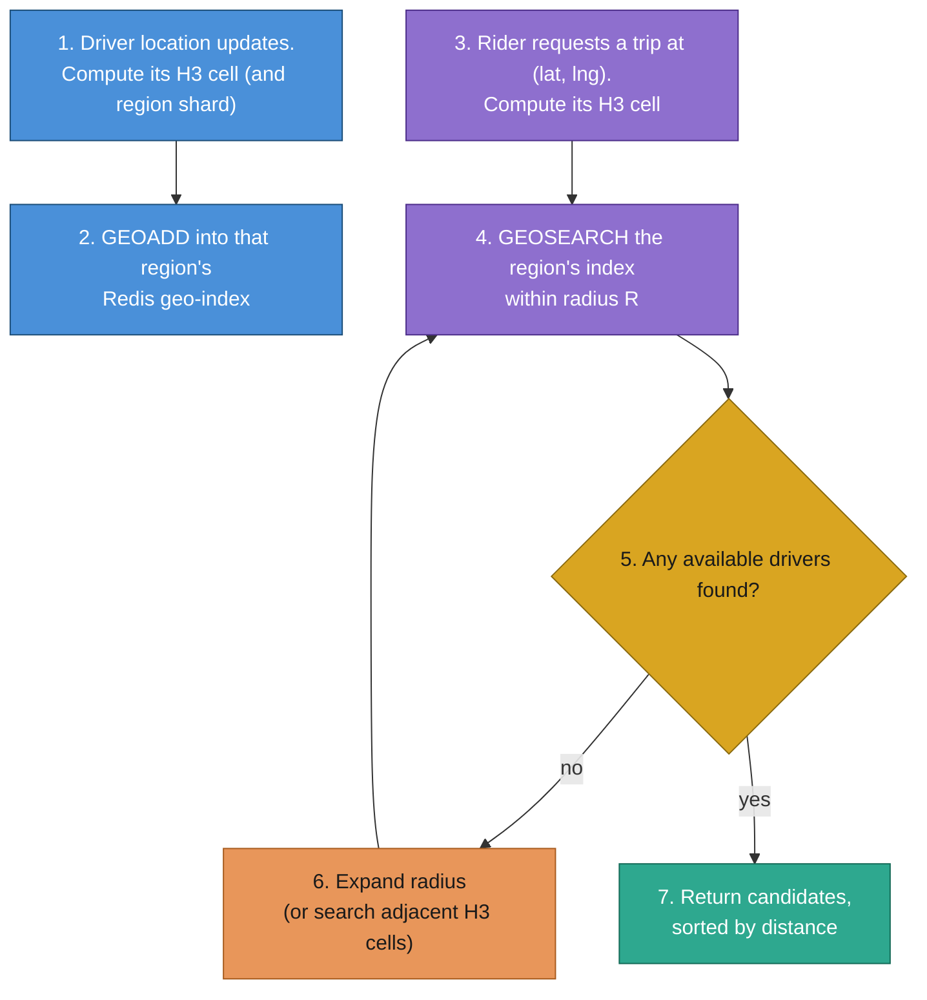
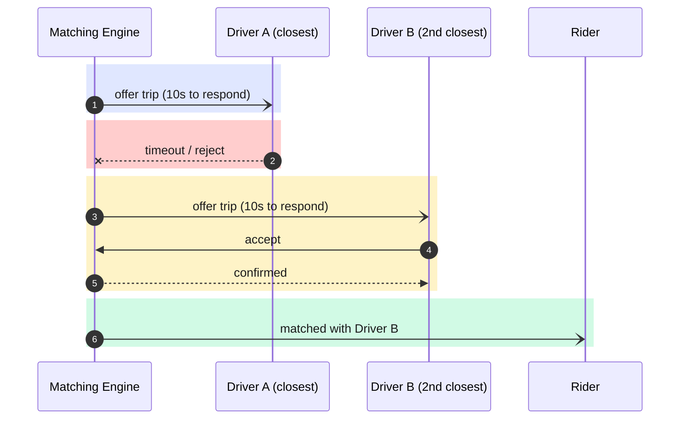
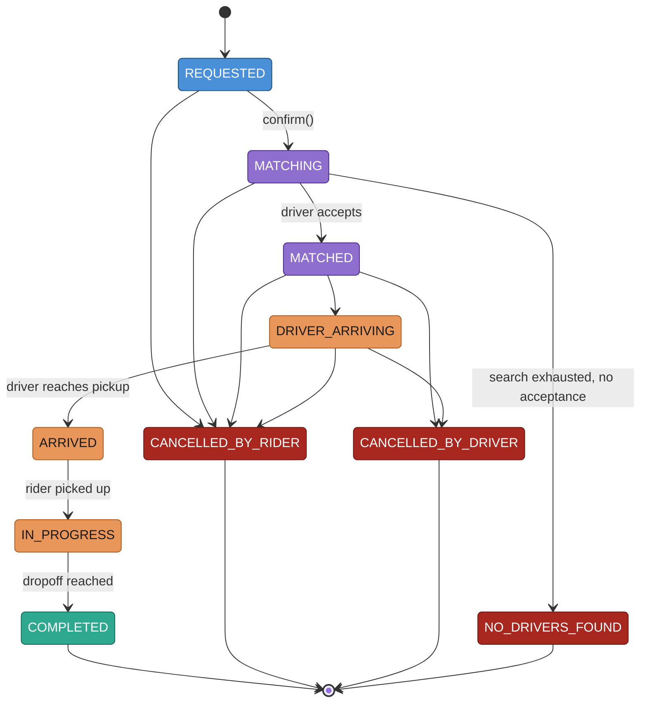
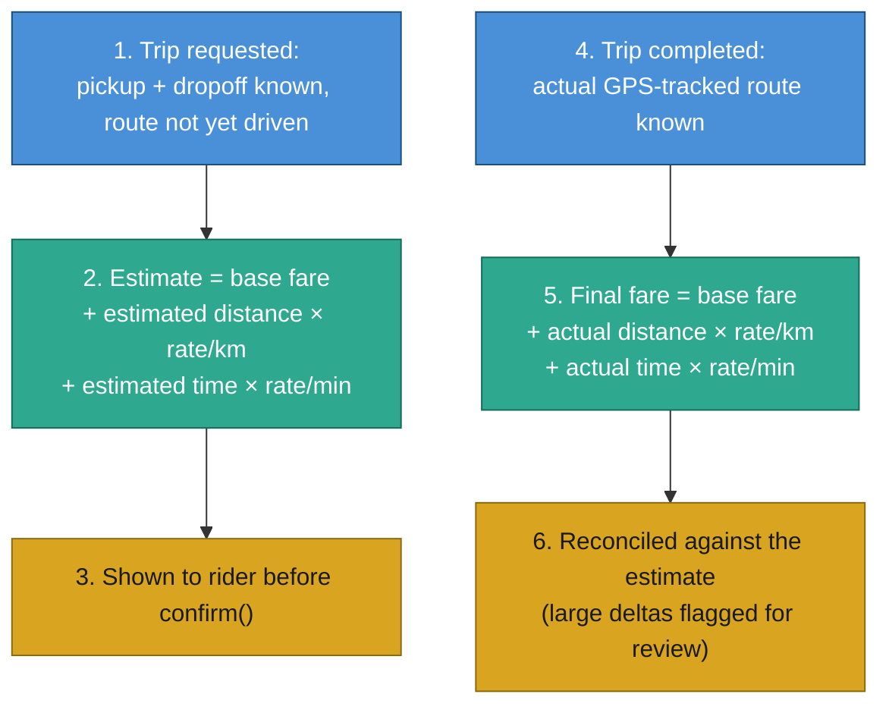
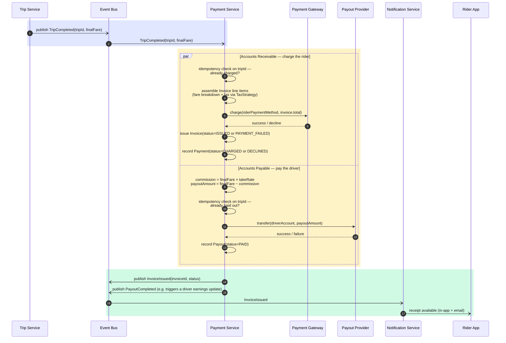
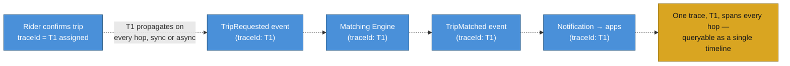

# Cab Reservation Platform — Design Document

**Use case:** A ride-hailing platform analogous to Uber/Lyft — a rider requests a
trip, the platform matches them to a nearby available driver in real time, tracks
the trip to completion, and settles payment automatically.

**Scope of this pass:** the **core ride-hailing loop** — request, match, track,
price, pay, rate. Surge-pricing internals, multiple product lines (X/Pool/XL),
driver incentive programs, promotions, and multi-region operations are
acknowledged as real parts of the actual product but are deliberately left as
extension points rather than designed in depth here (see [§11](#11-major-design-decisions--trade-offs)
and [§10](#10-extensibility)).

All diagrams below are written in [Mermaid](https://mermaid.js.org/) so they
render natively on GitHub/GitLab and stay text-diffable in version control. Each
non-trivial diagram is followed by a short walkthrough, not just the boxes.

---

## Table of Contents

1. [Requirements](#1-requirements)
2. [High-Level Architecture](#2-high-level-architecture)
3. [Domain Model](#3-domain-model)
4. [Core Capability Deep Dives](#4-core-capability-deep-dives)
   - [4.1 Trip Request](#41-trip-request)
   - [4.2 Geospatial Indexing — Finding Nearby Drivers](#42-geospatial-indexing--finding-nearby-drivers)
   - [4.3 Driver Matching & Dispatch](#43-driver-matching--dispatch)
   - [4.4 Trip Lifecycle](#44-trip-lifecycle)
   - [4.5 Real-Time Location Tracking & ETA](#45-real-time-location-tracking--eta)
   - [4.6 Pricing & Fare Calculation](#46-pricing--fare-calculation)
   - [4.7 Payment & Driver Payouts](#47-payment--driver-payouts)
   - [4.8 Ratings & Feedback](#48-ratings--feedback)
5. [Scalability](#5-scalability)
6. [Consistency & Availability Trade-offs](#6-consistency--availability-trade-offs)
7. [Observability](#7-observability)
8. [Failure Scenarios](#8-failure-scenarios)
9. [Design Patterns Used](#9-design-patterns-used)
10. [Extensibility](#10-extensibility)
11. [Major Design Decisions & Trade-offs](#11-major-design-decisions--trade-offs)
12. [Proposed Package Layout](#12-proposed-package-layout)

---

## 1. Requirements

### Functional

| Capability | Description |
|---|---|
| Request a trip | Rider specifies pickup + drop-off location; system returns a fare estimate and an ETA before confirming |
| Match to a driver | Find the best nearby *available* driver and offer them the trip |
| Track in real time | Both parties see the other's live location and an updating ETA for the duration of the trip |
| Price the trip | Fare estimate at request time; final fare computed from the actual route at completion |
| Pay automatically | Rider's saved payment method is charged the instant the trip is marked complete — no manual step |
| Pay drivers | The driver's share of the fare (fare minus platform commission) is settled to them without a manual step |
| Rate & review | Rider and driver each rate the other after the trip |
| Cancel | Either party can cancel, subject to a grace-period / cancellation-fee rule |

### Non-Functional

| Concern | Target |
|---|---|
| Match latency | A rider should see a matched driver (or a "no drivers nearby" response) in **under 5 seconds** |
| Location freshness | A driver's displayed position should never be more than a few seconds stale |
| Consistency | Strong (linearizable) for driver assignment, rider payment, and driver payout — no double-booking, no double-charge, no double-payout; eventual for driver location, ETA, and ratings — a few seconds of staleness is acceptable (see [§6](#6-consistency--availability-trade-offs)) |
| Availability | Trip request and matching must stay up through regional traffic spikes (sporting events, bad weather) |
| Scale (reference) | ~5M trips/day globally, ~1M actively-driving drivers at peak, each pinging location every ~4s |
| Client platforms | iOS — must; Web — in scope; Android — future scope (see [Client Platform Scope](#client-platform-scope) below) |

### Client Platform Scope

"Client platform" isn't one requirement, it's two different ones, because
the Rider App and the Driver App have different technical constraints —
conflating them would hide a real feasibility problem:

| App | iOS | Web | Android |
|---|---|---|---|
| **Rider App** | Must | In scope | Future scope |
| **Driver App** | Must | **Not planned** | Future scope |

**Why the Driver App excludes Web, even though it's "in scope" for Rider:**
[§4.5](#45-real-time-location-tracking--eta) requires a location ping roughly
every 4 seconds *continuously*, including while the app is backgrounded —
that's the entire basis for the location-freshness NFR above and the
250,000 pings/sec capacity figure in [§5](#5-scalability). Mobile browsers
(especially iOS Safari) aggressively suspend or throttle JavaScript timers
and geolocation callbacks the moment a tab isn't in the foreground, so a
web-based driver client cannot make the same background-tracking guarantee a
native app can. A rider, by contrast, only needs the app open in the
foreground to watch their trip — there's no equivalent background
requirement — so Web is a legitimate rider surface without compromising
[§4.5](#45-real-time-location-tracking--eta)'s design.

Practically, this means the API Gateway and every service behind it are
already platform-agnostic (they see HTTP/WebSocket traffic, not "an iOS app"
specifically), so *adding* a client platform is a client-side effort with no
backend redesign — see [§10](#10-extensibility). The one exception is that a
future Android *driver* app has to meet the same background-location bar
native iOS does; a future Android or Web *rider* app doesn't carry that
constraint.

### Why this is a genuinely hard distributed systems problem

Three things collide: (1) an extremely high-write-volume geospatial data set
(every driver, constantly moving), (2) a correctness requirement on top of it
(never double-assign a driver) that looks a lot like the capacity-reservation
race this repo's [Supply Chain platform](../supplychain/DESIGN.md#113-concurrent-booking-race-on-the-last-unit-of-capacity)
already solves for cargo capacity, and (3) a real-time UX requirement (both
sides need to see continuous position/ETA updates, not a page refresh). The
rest of this document is organized around those three axes.

---

## 2. High-Level Architecture



**How to read this diagram:** nodes are grouped into four boxes by what they
are, not by when they're used in the flow — Client Apps, the platform's own
services, its stateful data/messaging layer, and the External Systems it
depends on but doesn't own (a map provider, a payment processor, a payout
provider). Grouping the external systems together specifically makes it easy
to see this platform's entire third-party attack surface / vendor dependency
list at a glance, rather than having it scattered across the diagram wherever
each one happens to get called from. Solid arrows are synchronous — the caller is
blocked waiting on a reply (a rider's app waiting on a fare estimate, the
Matching Engine waiting on a geo-index query result). Dashed arrows are
asynchronous — the caller publishes and moves on, and whatever's downstream
reacts on its own time (see [§5](#5-scalability)'s capacity math for exactly
why: at 250,000 location writes/sec, anything in that path that blocked on a
downstream consumer would be a self-inflicted bottleneck). The numbered edges
(1–13) are the request→match happy path; the lettered edges (a–f) are the
independent, much-higher-frequency location-tracking loop running the whole
time a trip is active — notice that edges (a)–(c), the actual ping ingestion
and geo-index write, are synchronous (the driver app wants its ping
acknowledged), while (d)–(f), the fan-out to whoever's *watching* that
position, is entirely async. The Matching Engine is the hinge — it's the one
component that has to read both "who wants a ride" (from the Trip Service)
and "who's available and where" (from the Geospatial Index) to do its job.
Everything downstream of a `TripCompleted` event (pricing finalization,
rider payment, driver payout, rating) fans out independently off the event
bus — none of those need to know about each other, and none of them can slow
down the moment the trip itself is marked complete. Payment Service's own
outputs fan out the same way: `InvoiceIssued` goes back through the bus to
the Notification Service, which is what actually gets the receipt to the
rider — issuing the invoice ([§4.7](#47-payment--driver-payouts)) and
notifying the rider it exists are two decoupled steps, not one. The Legend
now covers both dimensions of the diagram's visual language — arrow style
(sync vs. async, per above) and node color/shape (what kind of thing each
box is) — so neither has to be inferred from context.

**Implementation status — `Bus` and `GeoIndex`, precisely:** both nodes
above are real in the buildable version, but not at the durability/rigor
this diagram's reasoning assumes, and it's worth being exact about the gap
rather than letting "we have an event bus" / "we have a cache" imply more
than is true. `Bus` here means a Kafka-shaped partitioned log; the actual
`InProcessEventBus` hands each `publish()` to a plain `ExecutorService`
(four threads), which is itself backed by an in-memory task queue — a real
queue in the literal sense (an event waits there between publish and a
worker thread picking it up), just not a durable or replayable one: nothing
survives a process crash, there's no partitioning, no consumer groups, no
backpressure if publishers ever outpaced those four workers. `GeoIndex` is
genuinely Redis as designed, but it's a cache only in the sense of "fast,
in-memory, fully rebuildable, never the source of truth for driver status"
— not a cache sitting in front of expensive Postgres reads. Nothing in this
build caches a query result anywhere; the one exception is a per-request
`HashMap` memoizing repeated rider/driver lookups inside a single trip-list
response (`TripController.enrichAll`), which is a function-level detail,
not an architectural cache layer. If read load ever made one worth adding,
this repo's own [Caching](../caching/DESIGN.md) design is the natural
starting point for which pattern to reach for.

---

## 3. Domain Model

| Entity | Key Fields | Notes |
|---|---|---|
| `Rider` | `riderId`, `name`, `defaultPaymentMethodId`, `rating` | |
| `Driver` | `driverId`, `name`, `vehicleId`, `status`, `rating` | `status` drives matching eligibility — see [§4.3](#43-driver-matching--dispatch) |
| `Vehicle` | `vehicleId`, `plate`, `make/model`, `productType` (e.g. `STANDARD`) | One driver ↔ one active vehicle at a time |
| `LocationPing` | `entityId`, `lat`, `lng`, `heading`, `speed`, `timestamp` | Emitted by both driver and (during an active trip) rider apps |
| `TripRequest` | `requestId`, `riderId`, `pickup`, `dropoff`, `requestedAt` | The input to matching; becomes a `Trip` once matched |
| `Trip` | `tripId`, `riderId`, `driverId`, `status`, `route`, `fare`, `createdAt`/`matchedAt`/`completedAt` | The aggregate everything else hangs off; see [§4.4](#44-trip-lifecycle) for `status` |
| `Fare` | `tripId`, `estimate`, `finalAmount`, `breakdown` (base/distance/time) | Estimate is shown before confirmation; final is computed from the actual driven route |
| `Payment` | `paymentId`, `tripId`, `amount`, `status`, `gatewayReference` | The Accounts Receivable side — one per trip, keyed so retries are idempotent — see [§6](#6-consistency--availability-trade-offs) |
| `Payout` | `payoutId`, `tripId`, `driverId`, `amount`, `status`, `providerReference` | The Accounts Payable side — `amount` is `finalFare` minus platform commission; one per trip, idempotent the same way `Payment` is |
| `Invoice` | `invoiceId`, `tripId`, `riderId`, `lineItems` (base, distance, time, tolls, tax, tip, discount), `total`, `status` (`ISSUED`/`PAYMENT_FAILED`), `issuedAt` | The rider-facing, itemized document — `total` is what actually gets charged, not a receipt computed from it; immutable once issued, a correction is a new version, never an edit in place, same discipline as `Plan` versioning in this repo's [Supply Chain platform](../supplychain/DESIGN.md#8-major-design-decisions--trade-offs) |
| `Rating` | `tripId`, `raterId`, `rateeId`, `score`, `comment` | Two rows per trip — rider→driver and driver→rider |

---

## 4. Core Capability Deep Dives

### 4.1 Trip Request



**Sequence:** a request is a two-step conversation, not one call — the rider
sees a price *before* committing, exactly like Uber/Lyft's real UX. Only
`confirm()` actually creates a durable `TripRequest` and kicks off matching;
an abandoned estimate never touches the matching pipeline. Note the second
`rect`: `confirm()` gets an immediate synchronous ack ("searching for a
driver"), *not* the match result — the rider isn't left on a blocked call for
however long matching takes. The actual match outcome arrives later,
asynchronously, off the event bus, exactly like the real app showing
"finding you a driver…" and then updating once one's found, rather than a
frozen screen.

### 4.2 Geospatial Indexing — Finding Nearby Drivers

This is the load-bearing technical decision in the whole system: every driver
is constantly moving, so "find available drivers within 3km of (lat, lng)"
has to be both **very fast to read** (riders are waiting) and **even faster to
write** (a fleet of a million drivers pinging every few seconds dwarfs the
read volume — see [§5](#5-scalability)'s capacity math).

**Options considered:**

| Approach | How it works | Strengths | Weaknesses |
|---|---|---|---|
| Naive linear scan | Compute distance to every driver, filter | Trivial to implement | O(n) per query — unusable past a few thousand drivers |
| Geohash | Encode (lat,lng) into a base-32 string; group by shared prefix in any ordered key-value store | Works with plain sorted sets / key-value stores; simple mental model | Cell edges are a problem — two points a meter apart across a boundary can share almost no prefix, forcing a search of neighboring cells too |
| Quadtree | Recursively subdivide space into 4 quadrants, finer where density is higher | Adapts to density — sparse regions stay coarse | Harder to shard across machines than a flat hash; needs a custom service, not "just" a data store feature |
| Google S2 | Sphere-projected hierarchical cells | Very precise, good area-coverage math | Steeper learning curve; its projection scheme is overkill for city-scale ride-hailing |
| **Uber H3 (hexagonal grid)** | Hierarchical hexagonal cells; every cell has exactly 6 equidistant neighbors | Uniform adjacency makes "expand the search ring" trivial and distance-uniform (unlike a square grid's diagonal-vs-edge distance quirk) | A dependency to adopt; still needs a backing store for cell→driver membership |
| **Redis `GEOADD`/`GEOSEARCH`** | Off-the-shelf geohash + sorted-set implementation, in-memory | Sub-millisecond radius queries *and* writes; battle-tested at scale; zero custom indexing code | A single Redis instance/cluster is a scaling unit — needs sharding by region for global scale |
| PostGIS | Full GIS extension on Postgres (R-tree/GiST index) | Rich spatial query language; one less moving piece if already on Postgres | Relational-write overhead is a poor fit for continuous, extremely high-frequency GPS pings |

**Decision:** partition the world into **H3 hexagonal cells** at a
city-appropriate resolution (this is the *logical* sharding key — see
[§5](#5-scalability)), and back each region's cells with an in-memory
**Redis `GEOADD`/`GEOSEARCH`** index for the actual proximity query. H3 solves
"which shard does this coordinate belong to and which neighboring shards do I
need to fan a search into"; Redis solves "give me the nearest available
drivers, fast, under continuous write pressure." Neither alone is the full
answer — H3's cells still need *something* to hold driver membership, and
Redis GEO alone doesn't give a clean regional sharding story at global scale.



**Sequence:** the write path (steps 1–2) and read path (steps 3–7) are
completely independent — a driver's location update never blocks, or is
blocked by, a rider's search. Radius expansion (step 6) is what keeps a
request in a sparse suburb from returning "no drivers" the instant a
fixed-radius search comes up empty.

### 4.3 Driver Matching & Dispatch

Two real strategies exist here, and they trade off differently:

| Strategy | How it works | Trade-off |
|---|---|---|
| **Greedy nearest-driver** | Offer the single closest available driver; on timeout/reject, offer the next-closest | Low latency per request, simple to reason about — but can be *locally* greedy in a way that's *globally* worse: locking in a driver to a farther rider can strand a closer rider who requests a second later |
| **Batched/windowed matching** | Collect open requests and available drivers over a short window (2–5s), then solve an assignment problem across all of them at once | Better global outcomes, fewer stranded riders — at the cost of a small added latency and real algorithmic complexity (this is closer to what Uber's actual dispatch system does at scale) |

**Decision:** start with **greedy nearest-driver dispatch with retry**,
consistent with this repo's convention of building the simple version first
and documenting the production-scale evolution rather than building it
up front (see [§11](#11-major-design-decisions--trade-offs)).



Notice the asymmetry: the *offer* is pushed asynchronously (the Matching
Engine doesn't hold a thread open for up to 10 seconds per candidate — it
fires the offer and moves on to servicing other requests), but the *driver's*
`accept` is a synchronous call the driver's app makes back in — they want an
immediate "yes, you got it" or "sorry, someone else already took it" rather
than wondering whether their tap registered.

**The double-dispatch race:** two different riders' requests can resolve to
the *same* closest driver at nearly the same instant. This is structurally
identical to the capacity-reservation race this repo's
[Supply Chain Matching Engine](../supplychain/DESIGN.md#113-concurrent-booking-race-on-the-last-unit-of-capacity)
already solves for cargo capacity, and the fix is the same category of tool
covered in this repo's own [Locking practice](../locking/README.md): an
atomic **compare-and-swap on the driver's status**
(`AVAILABLE → PENDING_OFFER`), not a read-then-write. Whichever request's CAS
wins gets the offer; the loser immediately moves to the next-closest driver
instead of double-offering the same one.

### 4.4 Trip Lifecycle



A `Trip` is the one aggregate every other capability reads from or writes to
— pricing reads `route`/timestamps, payment reads `fare`, rating reads
`status == COMPLETED`. Centralizing the state machine here (rather than
letting each downstream service infer "is this trip really done?" from its
own partial view) is what makes those consumers each a one-line rule instead
of a small state machine of their own.

### 4.5 Real-Time Location Tracking & ETA

**Delivery mechanism options:**

| Option | Latency | Cost | Verdict |
|---|---|---|---|
| Client polling (`GET /trip/{id}` every N seconds) | Bounded by poll interval — coarse | Simple, no persistent connections | Fine for a low-frequency check, too laggy for "watch the car move" UX |
| Push notifications | Seconds of platform-dependent delay | Cheap, works when app is backgrounded | Wrong tool for a screen that's actively open and watching |
| **WebSocket (persistent connection)** | Sub-second | One open connection per active trip, held only while a trip is active | Matches this repo's own [WebSocket practice](../api/websocket/README.md) pattern exactly — a room per active trip, broadcasting position updates to whichever party is connected |

**Decision:** a WebSocket connection scoped to the active trip, opened the
moment a trip reaches `MATCHED` and closed at `COMPLETED`/`CANCELLED` — not a
connection held for the app's entire lifetime. ETA is recomputed from the
Map/Routing Provider on every meaningful position update (not every single
ping — recomputing a full route on a 4-second cadence for every active trip
is wasted work; a simple "did the position move enough to matter"
threshold gates the recompute).

**This is also exactly where the [Client Platform Scope](#client-platform-scope)
decision comes from.** The ~4s location ping this section depends on has to
keep firing while the Driver App is backgrounded — a native iOS (or future
Android) app can hold a background location session; a mobile browser tab
cannot reliably do the same, which is why the Driver App is scoped to native
platforms only, with Web excluded rather than deferred. The Rider App has no
such constraint — it only *consumes* the WebSocket stream while foregrounded
— which is why Web is a fully in-scope rider surface today.

**Implementation status:** the buildable version in
[`cabreservation/`](../../../../../../../../../cabreservation/README.md) does not
yet have this WebSocket tier or a backend Map/Routing Provider — both remain
correct as the production-scale target, not superseded by what follows.
What's actually running today is a deliberately simpler Phase 1/2 stand-in:
the browser polls `GET /v1/trips/{id}` every second (the same "client
polling" option this section's own table ranks below WebSocket), and instead
of a backend routing abstraction, the browser calls a public third-party
routing API ([OSRM](https://project-osrm.org/)) directly to draw the
route line and compute both ETAs — "driver arriving in ~X" while
`DRIVER_ARRIVING`, "time to destination" while `IN_PROGRESS`. This is fine
at demo scale (one browser tab polling one trip) but doesn't hold up at
[§5](#5-scalability)'s numbers: every open tab hitting a free public routing
API directly, with no backend fan-out or connection reuse, is exactly the
kind of per-client external-dependency load this design's real architecture
is meant to avoid. The WebSocket + backend `RoutingProvider` upgrade
described above is still the intended next step, not an abandoned idea.

### 4.6 Pricing & Fare Calculation



The fare formula itself is a `PricingStrategy` (see [§9](#9-design-patterns-used))
precisely so that a surge multiplier, a promotional discount, or a different
product line's rate card can be swapped in later without this service's
callers changing at all — the formula's *shape* stays the same
(`base + distance×rate + time×rate`), only its *inputs* would change. Surge
pricing itself is deliberately not designed further here — it's a real
production concern this doc scopes out (see [§11](#11-major-design-decisions--trade-offs)).

### 4.7 Payment & Driver Payouts

The platform sits between two independent money movements, not one: charging
the rider (**Accounts Receivable**) and paying the driver (**Accounts
Payable**) — the same intermediary structure this repo's
[Supply Chain platform](../supplychain/DESIGN.md#410-billing--payments)
already uses for shipper invoices and operator settlements. Both are
triggered by the same `TripCompleted` event, but they settle independently:



**Sequence:** the `par` block is the actual point of this diagram — the AR
and AP branches don't wait on each other. A rider's charge succeeding or
failing has no bearing on whether the driver gets paid, and vice versa; a
declined card must never hold a driver's earnings hostage. Note the AR branch
charges `invoice.total`, not the raw `finalFare` it received from
`TripCompleted` — `invoice.total` is `finalFare` plus whatever the
`TaxStrategy` line item adds, so the amount actually charged and the amount
the itemized document says was charged are, by construction, the same
number, never two independently-computed figures that could drift apart.
The driver's payout is still commission-and-percentage math against the
underlying `finalFare` (drivers earn off the fare, not off tax collected on
the platform's behalf), so `finalFare − payoutAmount` remains the platform's
margin on the trip — the same "AR minus AP" identity your Supply Chain
platform's billing model uses for its own margin, just computed against the
pre-tax figure. Both branches reuse the same idempotency discipline —
`tripId` keys the charge *and* the payout, so a redelivered `TripCompleted`
event (expected under this repo's
[at-least-once event delivery](../supplychain/DESIGN.md#5-event-backbone--integration-layer))
must never double-charge the rider *or* double-pay the driver. Note that
Payment Service never calls back into Trip Service synchronously in either
branch — matching §2's architecture, `TripSvc` doesn't wait on either
settlement to consider the trip closed from its own perspective; only the
two external calls (to the Payment Gateway and the Payout Provider) block,
because those are the two steps where "did it actually succeed" has to be
known before moving on.

**Payout timing — a real trade-off, not designed further here:**

| Option | How it works | Trade-off |
|---|---|---|
| **Per-trip instant payout** | The driver's payout fires immediately after every completed trip | Drivers see money right away — a real product differentiator (Uber/Lyft both sell this as "Instant Pay") — at the cost of many small transfers, each carrying its own per-transaction fee |
| **Batched payout** | Payouts accumulate and settle on a fixed cadence (e.g., weekly) | Far fewer transactions, lower processing cost — at the cost of drivers waiting days for money they've already earned |

**Decision:** the diagram above shows **per-trip instant payout** — it's the
simpler first buildable version (the payout is just another leg of the same
`TripCompleted` handler, no separate accrual ledger or scheduled batch job
needed), consistent with this repo's "simple first" convention. Batched
payout is the documented production-scale evolution — it would turn the AP
branch into an accrual write (record the amount owed, don't transfer yet)
plus a scheduled job that flushes accumulated payouts on a cadence, the same
"ack immediately, settle for real later, in a batch" shape as this repo's own
[write-behind caching strategy](../caching/DESIGN.md#5-write-behind-write-back).
Either way it's a `PayoutStrategy`, the same pluggable shape as
[§4.6](#46-pricing--fare-calculation)'s pricing formula.

**How the invoice is actually issued:** it happens in three concrete steps,
all inside the AR branch above, not as a vague side effect:

1. **Assembly, before the charge is even attempted.** `Invoice` line items
   (base fare, distance, time, tolls) are pulled from `Fare.breakdown`
   ([§4.6](#46-pricing--fare-calculation)) and a tax line is computed by the
   pluggable `TaxStrategy`, keyed on the trip's region. This step *produces*
   `invoice.total` — the invoice isn't a receipt generated after the fact
   from whatever got charged, it's the source of truth for what gets charged.
2. **Issuance, immediately after the gateway responds — regardless of the
   outcome.** The `Invoice` is persisted as `ISSUED` on a successful charge,
   or `PAYMENT_FAILED` on a decline, *in both cases* — a trip that happened
   and a charge that failed still needs a document showing what's owed, which
   is exactly what feeds [§8](#8-failure-scenarios)'s "flag the rider's
   account" mitigation rather than that mitigation acting on nothing. Once
   issued, an `Invoice` is immutable — a later correction (a tip, a dispute
   adjustment) is a new version, never an edit, the same discipline as `Plan`
   versioning in your Supply Chain platform.
3. **Delivery, decoupled from issuance.** `InvoiceIssued` publishes to the
   bus like every other domain event in this design; the Notification
   Service reacts and pushes a receipt to the rider (in-app and/or email) —
   the exact same event-driven fan-out pattern §2 already uses for
   `TripMatched` and live location updates, not a bespoke mechanism invented
   just for billing. Issuance itself doesn't depend on delivery succeeding —
   a rider who never opens the receipt email still has a correctly `ISSUED`,
   queryable `Invoice`; email delivery is a notification *about* the
   invoice, not the invoice's existence.

Tax itself is deliberately shallow here: it's a named line item, computed by
a pluggable `TaxStrategy` keyed on the trip's region, but the actual
per-jurisdiction rate tables and compliance logic are scoped out the same way
surge pricing is (see [§11](#11-major-design-decisions--trade-offs)) — this
design commits to *where* tax lives in the invoice and *when* it's computed,
not to getting every jurisdiction's tax law right.

**Tips are a second charge event, not a line item computed up front.** A tip
is optional, rider-initiated, and typically added *after* `COMPLETED` — which
means it can't reuse `tripId` alone as the idempotency key the way the
original charge does in the `par` block above, since "has this trip been
charged" and "has this trip's tip been charged" are two different questions
with two different answers at two different times. A tip is its own
idempotent operation, keyed on `(tripId, TIP)`, that amends the `Invoice`
with a new line item and a corrected `total` — not a reason to reopen or
re-run the original charge.

**Implementation status:** the buildable version in
[`cabreservation/`](../../../../../../../../../cabreservation/README.md)
has both halves of the `par` block for real, running independently exactly
as designed. `BaseFarePricingStrategy` computes `fareEstimate` at request
time and `fareFinal` at completion (distance is haversine, not GPS-tracked,
both times — same simplification as [§4.5](#45-real-time-location-tracking--eta)'s
routing; only the duration input is genuinely observed the second time).
`PaymentService` (AR) charges the rider through a `FakePaymentGateway`, and
`PayoutService` (AP) pays the driver — `finalFare × (1 − 20% flat
commission)` — through a `FakePayoutProvider`, both the moment
`TRIP_COMPLETED` fires, both idempotently via `payments.trip_id UNIQUE` /
`payouts.trip_id UNIQUE` — the same DB-level guarantee this design leans on
for driver assignment (§4.3), not just an application-level check. A driver
sees their full earnings history via `GET /v1/drivers/me/payouts`. What's
still just this section's prose, not code: `Invoice` assembly, issuance,
and delivery, the pluggable `TaxStrategy`, tips, and batched payout
(§4.7's documented alternative to the instant payout actually built) —
nothing publishes `InvoiceIssued` yet, and the flat commission rate isn't
itself a pluggable `PayoutStrategy` the way §4.7's prose frames it, just a
constant.

### 4.8 Ratings & Feedback

A `TripCompleted` event triggers a rating prompt to both apps; the two
resulting `Rating` rows (rider→driver, driver→rider) are symmetric and
independent — a driver rating a rider doesn't block or wait on the rider
rating the driver. A running average feeds `Driver.rating`/`Rider.rating`,
which is itself just one more input the Matching Engine *could* weight in
future (e.g., don't offer a very low-rated rider's request to a driver right
above the platform's minimum-acceptable-rating floor) — not designed further
here, but the hook is exactly the event-driven fan-out already in place.

---

## 5. Scalability

| Component | Stateful? | Scaling approach |
|---|---|---|
| Trip Service | Stateless (delegates to Trip Store) | Horizontal, behind a load balancer |
| Matching Engine | Stateless (reads the geospatial index) | Horizontal; naturally shards by region since a match never needs to search outside a rider's own city |
| Location Service | Stateless (writes through to the geo index) | Horizontal; partitioned the same way as the index it writes to |
| Pricing / Payment / Notification / Rating | Stateless | Horizontal |
| Geospatial Index (Redis GEO) | Stateful | Sharded by region/H3-cell-range — a city's drivers colocate on one shard, so a match is never a cross-shard scatter-gather |
| Trip Store | Stateful | Sharded by `hash(tripId)` |
| Event Bus | Stateful (partitioned log) | Partitioned by `tripId`/`driverId` for per-entity ordering |

**Capacity math (reference numbers, not a load-test substitute):**

```
Location pings
  1M active drivers × 1 ping / 4s ≈ 250,000 pings/sec average
    → this dwarfs every other write path in the system — it is the
      write-volume-defining number, which is exactly why the geospatial
      index has to be an in-memory store, not a relational one (§4.2)

Trip requests
  5M trips/day → 5,000,000 / 86,400s ≈ 58/sec average, ~300/sec at peak
    → three orders of magnitude below location-ping volume; the matching
      read path was never the bottleneck, the location write path is

Active WebSocket connections
  worst case: every active trip has one open connection per side
  ~500K trips in flight at a single moment (global peak) → ~1M connections
    → connection-count scaling (not message-rate scaling) is the relevant
      concern for the real-time tracking tier
```

The one-line takeaway: **this system is dominated by location-write
throughput, not by match-request or payment volume** — every capacity and
technology decision above (Redis over Postgres for the geo index, H3 for
regional sharding) traces back to that one number.

---

## 6. Consistency & Availability Trade-offs

This section is how [§1](#1-requirements)'s Consistency requirement — strong
for assignment and payment, eventual for location/ETA/ratings — actually gets
satisfied, split by data class rather than applied uniformly:

- **Driver assignment — CP-leaning.** Two riders must never both believe
  they've been matched to the same driver. This needs the same atomic
  compare-and-swap discipline as the [double-dispatch race](#43-driver-matching--dispatch)
  above — a brief unavailability during a retry is fine; a silently
  double-booked driver is not.
- **Payment & payout — CP-leaning.** A trip results in exactly one rider
  charge and exactly one driver payout — both idempotent on `tripId`, the
  same mechanism as [§4.7](#47-payment--driver-payouts).
- **Driver location / ETA — AP-leaning.** Always show *something*, even if
  it's a couple of seconds stale — a rider staring at a frozen map is worse
  than one looking at a position that's very slightly behind reality.
- **Ratings — AP-leaning.** Eventually-consistent aggregation into a running
  average is fine; nothing downstream needs the average to reflect the very
  latest rating within milliseconds.

This is the same "split by data class, not one uniform model" position this
repo's [Supply Chain platform](../supplychain/DESIGN.md#7-consistency--availability-trade-offs)
takes for the same underlying reason: correctness-critical state (money,
exclusive assignment) and read-heavy, staleness-tolerant state (position,
aggregate ratings) don't belong on the same consistency budget.

---

## 7. Observability

Nothing in this design says how anyone would *know* it's working. That's a
real gap, and a sharper one than usual for this system specifically, for
three reasons already built into the design above:

1. **The architecture is mostly asynchronous** ([§2](#2-high-level-architecture)).
   A single trip request's real path is `Rider → Trip → Bus → Match → Bus →
   Notify → Driver` — logs on any one service, read in isolation, can't
   answer "why did *this* trip take 8 seconds to match" when the 8 seconds
   are spread across five services and two event-bus hops.
2. **The core guarantees are safety properties, not performance ones.** The
   CAS on driver status ([§4.3](#43-driver-matching--dispatch)) and the
   idempotent payment/payout ([§4.7](#47-payment--driver-payouts)) must be
   *provably* true in production — a regression there doesn't show up as
   "slow," it shows up as a driver silently double-booked, a rider silently
   double-charged, or a driver silently paid twice.
3. **§1 states hard numeric targets** (match latency under 5s, location
   freshness of a few seconds) that are meaningless as *requirements* unless
   something is actually measuring whether they're being met.

### 7.1 The Three Pillars, Scoped to This System

| Pillar | What it answers here | Example |
|---|---|---|
| Metrics | Is the system healthy right now, in aggregate? | Match latency p99 against the §1 SLA; event-bus consumer lag |
| Structured logs | What exactly happened, for one specific trip? | Every log line for a `tripId` correlated together, across every service that touched it |
| Distributed tracing | Where did the time go, across every async hop one request took? | One trace, keyed by `tripId`, spanning `Trip → Bus → Match → Bus → Notify → Driver` as a single timeline |



Metrics alone would tell you match latency is high; logs alone would give you
five services' worth of unrelated-looking lines to manually stitch together
by timestamp and hope nothing else happened at the same second. Tracing is
what makes the *shape* of §2's async architecture debuggable at all.

### 7.2 Domain-Specific Golden Signals

| Signal | What it measures | Why it matters |
|---|---|---|
| Match latency (p50/p95/p99) | Time from `confirm()` to `MATCHED` or `NO_DRIVERS_FOUND` | The only way to know whether §1's "under 5 seconds" target is actually being met, not just designed for |
| Match funnel | Trip counts by status transition (`MATCHING`→`MATCHED`, →`NO_DRIVERS_FOUND`, →`CANCELLED_BY_RIDER`) | Distinguishes "no supply nearby," "drivers rejecting offers," and "riders bailing while waiting" — three different problems with three different fixes |
| Driver supply health | % of drivers `AVAILABLE` vs. `PENDING_OFFER` vs. `ON_TRIP`; time since each driver's last location ping | A driver stuck in `PENDING_OFFER` (an offer that never resolved) silently shrinks the matchable supply pool without anything else looking wrong |
| Event bus consumer lag | Per consumer group — Matching, Notification, Payment, Rating | Every async hop in §2 is only as fresh as its consumer keeping up; lag here delays everything downstream while no single service reports itself as "down" |
| Payment success/failure rate | % of `TripCompleted` events resulting in a successful charge within N seconds | The production-side measurement of §1's payment-correctness requirement, not just a code-level guarantee |
| WebSocket connection count & churn | Active connections; connect/disconnect rate | The dominant scaling concern for the tracking tier per [§5](#5-scalability) — a capacity-planning input, not just a liveness check |

### 7.3 Correctness Canaries — Auditing the Invariants, Not Just Performance

The signals above catch the system running *slow*. They don't catch the
system being subtly *wrong* — and §1's two strong-consistency guarantees are
exactly the kind of thing that can silently regress (a bad deploy, a race
introduced by an unrelated change) without a single latency or error-rate
metric ever moving. So alongside the golden signals, three standing queries
should run continuously against production state itself, not against
request/response behavior:

- **Double-assignment canary:** alert if any `Driver` is ever found attached
  to more than one non-terminal `Trip` at the same time. Per
  [§4.3](#43-driver-matching--dispatch)'s CAS, this should be structurally
  impossible — the canary is what confirms it still is, rather than trusting
  the guarantee forever once it's been code-reviewed once.
- **Double-charge canary:** alert if any `tripId` is ever found with more
  than one `Payment` row in `CHARGED` status. Same idea, for
  [§4.7](#47-payment--driver-payouts)'s AR idempotency guarantee.
- **Double-payout canary:** the AP mirror of the above — alert if any
  `tripId` is ever found with more than one `Payout` row in `PAID` status. A
  regression here is worse than a metrics problem — it's the platform's own
  money silently leaking out twice per trip.

These two are the direct operational counterpart to [§1](#1-requirements)'s
Consistency requirement and [§6](#6-consistency--availability-trade-offs)'s
CP-leaning decisions — a design document's stated invariant is only as good
as something actually checking, continuously, that it holds in the running
system. Several of [§8](#8-failure-scenarios)'s failure scenarios are exactly
what the golden signals above are meant to surface before a rider or driver
has to report them.

The shape of this whole section — collectors feeding metrics, a rule engine
evaluating thresholds, an alert manager routing to on-call — is the same
architecture this repo's own [Fleet Monitoring platform](../fleetmonitor/DESIGN.md)
already designed in depth, for a different domain (disk health instead of
ride-hailing). The point of this section isn't to re-derive that plumbing;
it's to name what specifically needs measuring for a ride-hailing platform —
the collector-to-alert-manager pipeline itself would be the same shape either way.

---

## 8. Failure Scenarios

| Failure | Impact | Mitigation |
|---|---|---|
| No drivers found near a rider | Trip stuck in `MATCHING` | Expand search radius / adjacent H3 cells progressively; if still empty, `NO_DRIVERS_FOUND` with an explicit retry-later prompt rather than an indefinite spinner |
| Driver cancels after accepting | Rider believes they have a driver | Immediately re-trigger matching for the same `TripRequest`, excluding the cancelling driver, transparently to the rider where possible |
| Rider cancels before pickup | Driver already en route | Cancellation fee if past a grace period, keyed off `matchedAt` timestamp, not a manual judgment call |
| GPS signal lost mid-trip | Displayed position freezes | Fall back to last-known-position + estimated speed/heading; flag the trip `STALE` in the UI rather than silently freezing it, the same "don't lie about freshness" instinct as this repo's [Fleet Monitoring platform](../fleetmonitor/DESIGN.md) |
| Payment declines at trip completion | Trip must still close | Mark the trip `COMPLETED` regardless — the ride already happened — but flag the rider's account and block new trip requests until resolved, the same "block at the gate, don't fail silently later" pattern as [Supply Chain's credit-risk check](../supplychain/DESIGN.md#410-billing--payments) |
| Driver payout fails (bad bank details, provider outage) | Driver isn't paid for a trip they completed | The AP mirror of the row above — the rider was still charged (AR is unaffected, since [§4.7](#47-payment--driver-payouts)'s two branches are independent), so retry the payout on a backoff and flag the driver's account for review rather than silently dropping the money owed |
| App disconnects mid-trip | Client loses live updates | The server-side `Trip` state machine is the source of truth regardless of any client's connection state; reconnecting simply re-subscribes to the current state, nothing is lost |
| Concurrent double-dispatch of one driver | Two riders could believe they got the same driver | Atomic CAS on driver status ([§4.3](#43-driver-matching--dispatch)) — the losing request is retried against the next-closest driver, never surfaced to the rider as an error |

---

## 9. Design Patterns Used

| Pattern | Where | Why |
|---|---|---|
| State Machine | Trip lifecycle ([§4.4](#44-trip-lifecycle)) | Makes illegal transitions structurally impossible (e.g., `COMPLETED` before `IN_PROGRESS`) |
| Strategy | Pricing formula ([§4.6](#46-pricing--fare-calculation)), payout timing ([§4.7](#47-payment--driver-payouts)) | Swap the fare formula or the instant-vs-batched payout timing without touching the coordinating service |
| Adapter | Map/Routing Provider, Payment Gateway, Payout Provider | Normalize a third-party API to one internal shape |
| Observer / Pub-Sub | Event bus ([§2](#2-high-level-architecture)) | Payment, payout, rating, and notification all react to `TripCompleted` independently, with no knowledge of each other |
| Optimistic Concurrency (CAS) | Driver status transition ([§4.3](#43-driver-matching--dispatch)) | Prevents the double-dispatch race without a heavyweight lock held for the whole matching decision |
| Facade | Rider/Driver-facing API over the internal service graph | One integration surface per audience |

---

## 10. Extensibility

| To add... | Do this | Core services untouched? |
|---|---|---|
| A new product line (Pool, XL) | Add a `productType` filter to the matching query and a rate card to `PricingStrategy` | Yes |
| Surge pricing | Implement a new `PricingStrategy` that multiplies the base formula by a demand signal | Yes |
| A new payment method | Implement a `PaymentGateway` adapter | Yes |
| A new payout method (e.g., a new country's bank rails) | Implement a `PayoutProvider` adapter | Yes |
| Switching payout timing (instant ↔ batched) | Swap the `PayoutStrategy` implementation | Yes |
| A new city/region | Provision a new geospatial index shard and H3 cell range — data-only | Yes |
| A new tax jurisdiction | Implement/configure a `TaxStrategy` for that region — data-only for a rate change, code-only for a new calculation rule | Yes |
| Tipping | Add a `(tripId, TIP)`-keyed charge path that amends the `Invoice`, per [§4.7](#47-payment--driver-payouts) | Yes |
| Scheduled (future) rides | A new `TripRequest` field (`scheduledFor`) and a scheduler that triggers matching at the right time instead of immediately | Yes |
| Android Rider App | Build against the existing platform-agnostic API Gateway — no backend change | Yes |
| Android Driver App | Same, but must independently clear the same background-location bar native iOS does (see [Client Platform Scope](#client-platform-scope)) before it can carry real trips | Yes |

---

## 11. Major Design Decisions & Trade-offs

| Decision | Chosen | Alternative considered | What was traded away |
|---|---|---|---|
| Geospatial index | H3 regional sharding + Redis GEO per shard ([§4.2](#42-geospatial-indexing--finding-nearby-drivers)) | PostGIS on the primary relational store | Relational-write overhead unsuitable for continuous high-frequency GPS pings, in exchange for sub-millisecond geo queries at the write volume §5 computes |
| Matching algorithm | Greedy nearest-driver with retry ([§4.3](#43-driver-matching--dispatch)) | Batched/windowed global assignment | Occasionally locally-suboptimal matches, in exchange for a simple, low-latency first buildable version — batching is the documented production-scale evolution, not a redesign |
| Real-time updates | WebSocket scoped to the active trip ([§4.5](#45-real-time-location-tracking--eta)) | Client polling | A held connection per active trip, in exchange for sub-second position/ETA freshness |
| Driver assignment consistency | CP — atomic CAS on driver status | Optimistic UI + reconcile-later | Slightly more coordination on the assignment write path, in exchange for it being structurally impossible to double-book a driver |
| Pricing scope | Base + distance + time only, surge left as a `PricingStrategy` extension point | Full surge/demand-pricing engine designed up front | A less "Uber-complete" pricing story now, in exchange for not over-building a subsystem outside this pass's chosen scope |
| Driver payout timing | Per-trip instant payout ([§4.7](#47-payment--driver-payouts)) | Batched payout on a fixed cadence | More, smaller transfers (and their per-transaction fees), in exchange for the simplest first buildable version — no separate accrual ledger or scheduled batch job |
| Invoicing & tax depth | `Invoice` exists as a real, itemized, immutable document with tax as a pluggable `TaxStrategy` line item; per-jurisdiction rate tables and corporate/consolidated billing are not designed | Full multi-jurisdiction tax compliance and corporate billing designed up front | A less "enterprise-ready" billing story now, in exchange for not over-building a compliance subsystem outside this pass's chosen scope — the same call as surge pricing |
| Account/session model | Lightweight PBKDF2-hashed password + opaque bearer-token session (mirroring this repo's [Supply Chain](../supplychain/DESIGN.md) auth pattern) — not designed anywhere above, added when the buildable version needed a real multi-user identity story | No auth — trust an `accountId` the caller supplies, deferred to an API Gateway concern | A first-party auth surface this doc didn't originally scope, in exchange for a system that's actually usable by more than one trusted caller |

*Real-time updates' "Chosen" column above is the production-scale target,
not what's running today — see [§4.5](#45-real-time-location-tracking--eta)'s
Implementation Status for the interim client-polling + direct-to-OSRM
version actually built.*

---

## 12. Proposed Package Layout

```
cabreservation/
├── CabReservationDemo.java             # Main entry point — end-to-end scenario
├── rider/
│   ├── Rider.java
│   └── RiderService.java
├── driver/
│   ├── Driver.java
│   ├── DriverStatus.java               # AVAILABLE / PENDING_OFFER / ON_TRIP / OFFLINE
│   ├── Vehicle.java
│   └── DriverService.java
├── trip/
│   ├── TripRequest.java
│   ├── Trip.java
│   ├── TripStatus.java                 # state machine (§4.4)
│   └── TripService.java
├── geo/
│   ├── LocationPing.java
│   ├── GeoIndex.java                   # interface — pluggable geospatial backend (§4.2)
│   └── H3CellResolver.java
├── matching/
│   └── MatchingEngine.java             # nearest-driver dispatch + CAS-based assignment (§4.3)
├── pricing/
│   ├── Fare.java
│   └── PricingStrategy.java            # base/distance/time formula; surge is a future implementation
├── payment/
│   ├── Payment.java                    # Accounts Receivable — rider charge (§4.7)
│   ├── PaymentStatus.java
│   ├── Payout.java                     # Accounts Payable — driver payout (§4.7)
│   ├── PayoutStatus.java
│   ├── PayoutStrategy.java             # instant vs. batched timing; pluggable (§4.7)
│   ├── Invoice.java                    # itemized, immutable, rider-facing document (§4.7)
│   ├── LineItem.java                   # base/distance/time/tolls/tax/tip/discount
│   ├── TaxStrategy.java                # pluggable per-region tax line item; rate tables not implemented
│   └── gateway/
│       ├── PaymentGateway.java         # Adapter — pluggable payment processor
│       └── PayoutProvider.java         # Adapter — pluggable payout/bank-transfer processor
├── rating/
│   └── Rating.java
└── eventbus/
    ├── DomainEvent.java
    └── EventBus.java                   # in-process pub/sub for the POC
```

This mirrors [§2](#2-high-level-architecture)'s architecture one-to-one, and
follows this repo's established convention (see the
[Supply Chain](../supplychain/DESIGN.md#12-implementation-roadmap) and
[Video Streaming](../videoStreaming/DESIGN.md) platforms) of a single-JVM,
in-memory implementation as the first buildable version — `GeoIndex`,
`PaymentGateway`, and `PayoutProvider` are interfaces specifically so the
in-memory demo implementation and a real Redis/Stripe/bank-rail-backed one
are swappable without touching `MatchingEngine` or `TripService`.

**Implementation note:** the layout actually built diverged from the
in-tree/in-memory shape above — see [§11](#11-major-design-decisions--trade-offs)'s
phased-build decision to make this a **standalone module with real
infrastructure** (its own `build.gradle.kts`, a real Postgres `TripStore`
and `DriverRepository`, real Redis for `GeoIndex`) rather than an in-memory
POC, plus the `auth/` package the Account/session decision above added and
an `api/` package (`AuthController`, `TripController`, `DriverController`)
that isn't shown here at all since this proposed layout predates having a
real HTTP surface. The authoritative, up-to-date structure lives in
[`cabreservation/`](../../../../../../../../../cabreservation/README.md)
itself, not in this section — treat what's above as the original design
intent for the package *boundaries* (rider/driver/trip/geo/matching/pricing/
payment/rating/eventbus still hold), not as a current file listing.
