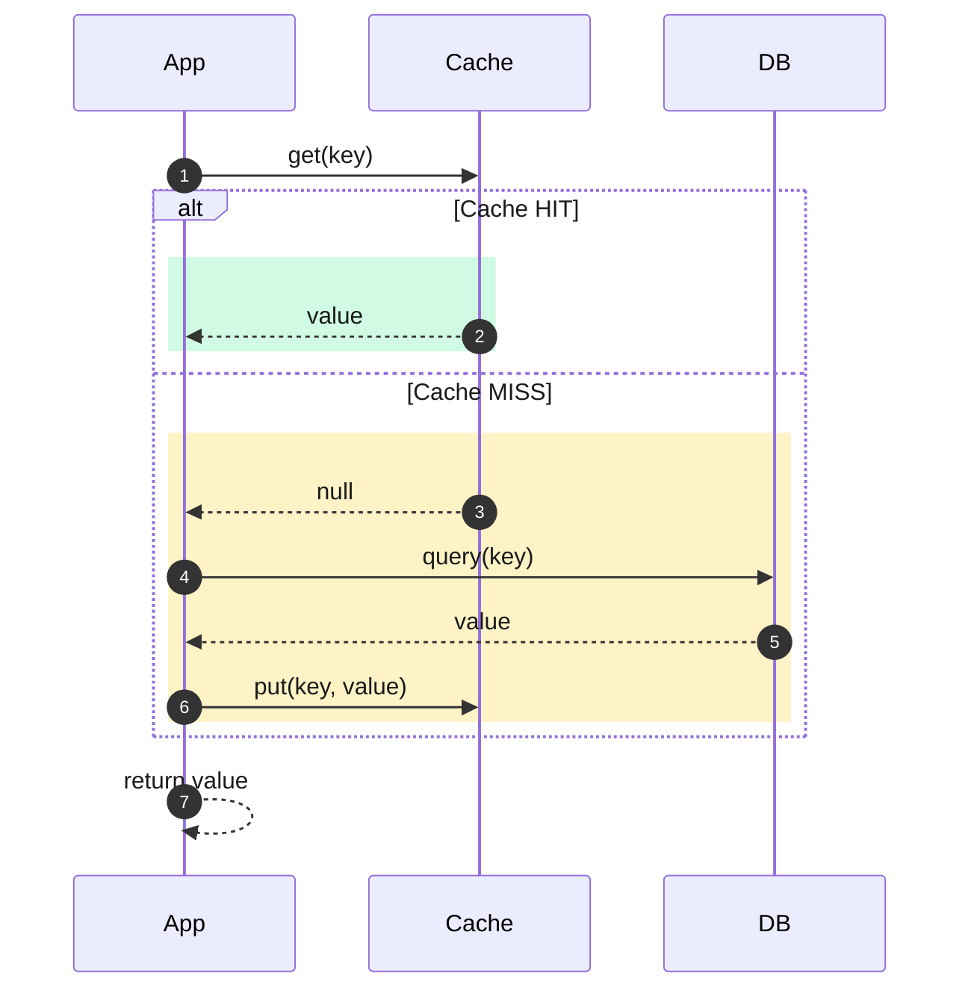
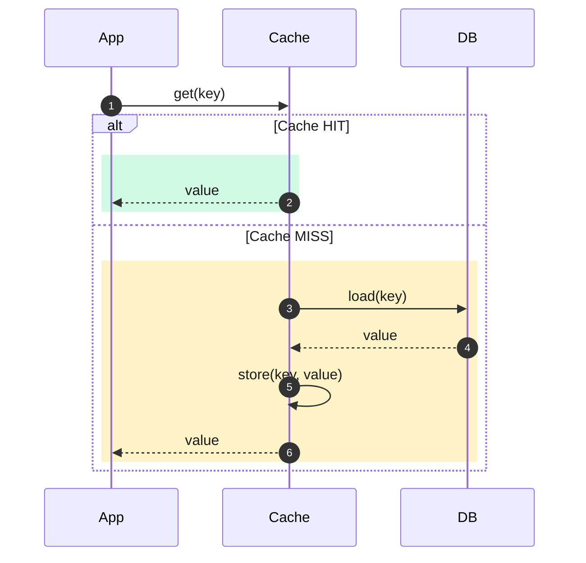
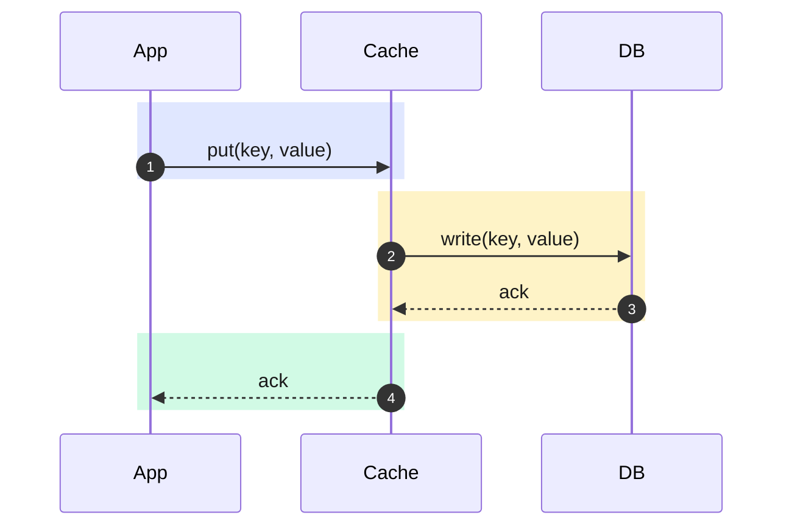
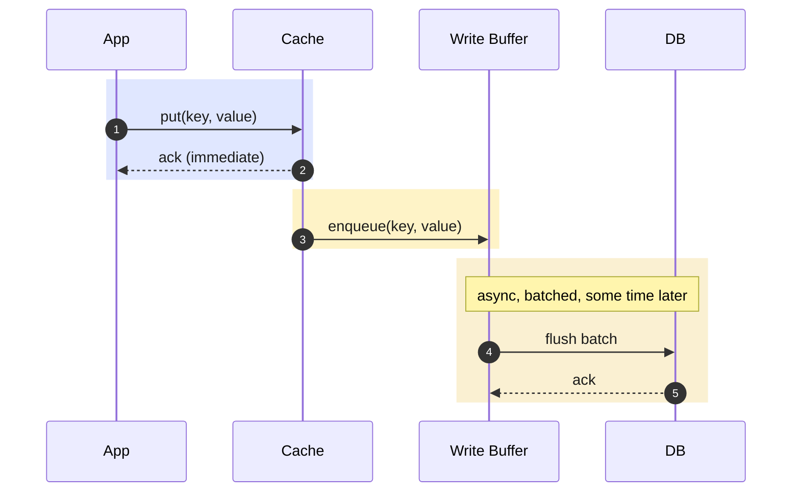
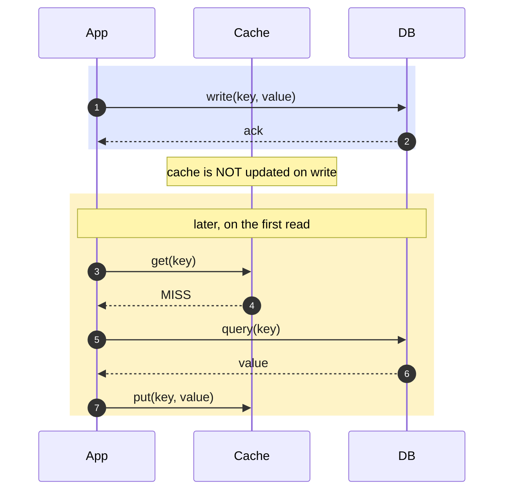
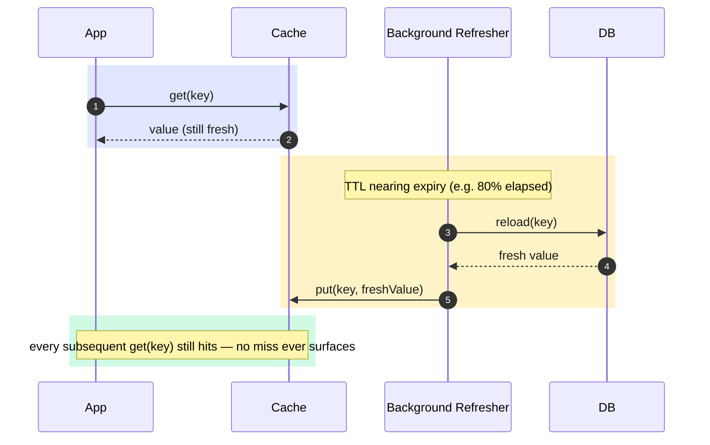
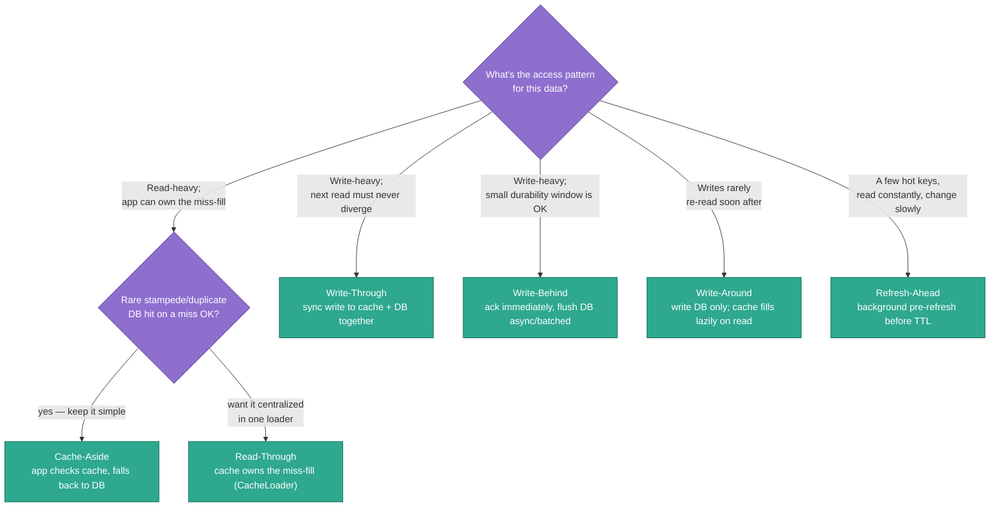
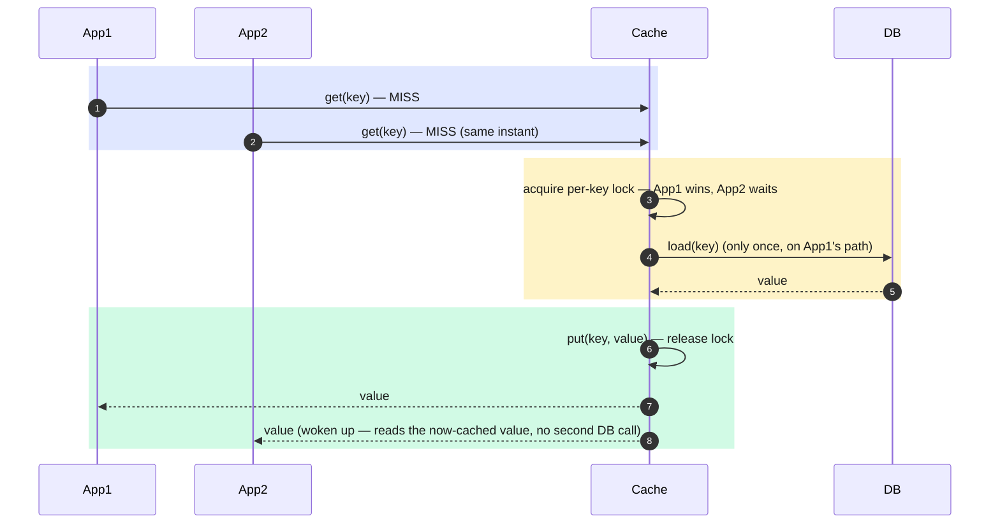

# Caching Strategies — Design Document

**Scope:** Caching *strategies* — how an application, a cache, and the
source of truth (a database or another service) coordinate on reads and
writes. This is a different axis from **eviction policy** (which entry gets
thrown out when the cache is full), which this repo already covers concretely
in [`LruCache.java`](LruCache.java) (O(1) LRU via a `HashMap` + doubly-linked
list — see the top-level [README's LRU Cache section](../../../../../../../../../README.md#8-lru-cache)).

Get the strategy wrong and no eviction policy saves you: you can serve stale
data forever, lose writes on a crash, or hammer the database on every single
request no matter how cleverly entries are evicted.

---

## 1. The Three Participants

Every strategy below is just a different answer to one question: **on a read,
and on a write, who talks to whom, in what order, and who owns the miss-fill
logic?**

- **Application** — the code that wants a value for a key.
- **Cache** — fast, size-bounded, volatile (Redis, Caffeine, Memcached, an
  in-process `Map`).
- **Source of truth** — the database, a downstream service, or anything the
  cache is a copy of.

---

## 2. Cache-Aside (Lazy Loading)

The application owns the miss-fill logic. The cache is a dumb key-value
store that doesn't know the source of truth exists.

**Write path:** the application writes the DB directly; the cache is either
left alone (goes stale until the entry's TTL expires or it's evicted) or
explicitly invalidated (`cache.delete(key)`) so the next read re-fills it.

**Pros:** simple; only requested keys are ever cached (no wasted memory on
cold data); cache and DB can use completely different technologies.
**Cons:** every miss costs a round trip *plus* the app has to remember to
populate the cache — forget that line and every request becomes a miss; a
sudden burst of misses on the same hot key can stampede the DB (§9).

**When to use:** the default choice for read-heavy workloads where the
occasional stale read or double DB hit on a miss is tolerable — user
profiles, product catalog pages, search results.

**Example:** a web app looks up a user's profile. `GET /users/42` checks
Redis first; on a miss it queries Postgres, writes the row back to Redis with
a 10-minute TTL, and returns it. The next 42 requests for user 42 in that
window never touch Postgres.

---

## 3. Read-Through

Same miss behavior as cache-aside, but the **cache** owns the loading logic
instead of the application. The app only ever calls `cache.get(key)` — it
never talks to the DB directly.

**Pros:** callers can't forget to populate the cache — it's not their job;
one loader implementation is the single place miss-handling logic lives
(retries, dedup, negative caching all live there once).
**Cons:** requires a cache library/layer that supports pluggable loaders
(Guava/Caffeine `LoadingCache`, a Spring `@Cacheable` proxy, a sidecar); the
cache now has a dependency on the DB, which cache-aside avoids.

**When to use:** whenever the cache library gives you a `CacheLoader`
abstraction and you want miss-handling centralized rather than duplicated at
every call site.

**Example:** a Caffeine `LoadingCache<UserId, User>` built with
`.build(userId -> userRepository.findById(userId))`. Every call site just
does `cache.get(id)` — nobody writing a new endpoint can forget to check the
cache first, because there's no "first" to forget.

---

## 4. Write-Through

Writes go to the cache, and the cache **synchronously** writes the DB before
acknowledging the caller. Cache and DB can never diverge.

**Pros:** strong consistency — the next read (from cache or DB) always sees
the latest write; no invalidation logic needed anywhere else.
**Cons:** every write pays the DB's latency, since the cache can't ack until
the DB does — write-through doesn't actually make writes *faster*, it makes
reads faster while keeping writes exactly as safe as writing the DB directly.

**When to use:** data where the very next read must never see a stale value
— account balances, inventory counts, anything where "the cache said one
thing and the DB says another" is a real bug, not just a UX nit.

**Example:** an e-commerce checkout decrements `availableQuantity` in Redis
and Postgres together, in the same logical write. A second shopper's
availability check a millisecond later — whether it hits Redis or Postgres —
sees the decremented count, never the stale one.

---

## 5. Write-Behind (Write-Back)

Writes go to the cache, the cache acks **immediately**, and the write to the
DB happens asynchronously afterward — often batched with other pending
writes.

**Pros:** lowest possible write latency — the DB is completely off the
critical path; batching many buffered writes into one DB round trip is far
more efficient than one write per request.
**Cons:** a durability window — if the cache (or the buffer) crashes before
a flush, that write is gone; the DB is briefly "behind" the cache, so a
reader that bypasses the cache sees stale data.

**When to use:** very high write throughput where losing the last few
seconds of writes on a crash is an acceptable trade — metrics ingestion,
view/like counters, telemetry, anything where "approximately durable,
eventually persisted" beats "slow but bulletproof."

**Example:** a CPU's L1/L2 cache in write-back mode: a register write only
updates the cache line and marks it dirty; the write to main memory happens
later, often coalesced with other writes to the same line. Application-level
analogs: buffering page-view counters in Redis and flushing aggregated totals
to a data warehouse every few seconds instead of writing every single view.

---

## 6. Write-Around

Writes go **straight to the DB**, bypassing the cache entirely. The cache
only gets populated the normal cache-aside way, on a subsequent read.

**Pros:** avoids flooding the cache with data that was written once and may
never be read again — write-through/write-behind would otherwise cache every
write regardless of whether it's ever re-read.
**Cons:** the first read after any write is a guaranteed miss (a small,
predictable latency tax); if a key is written and re-read immediately, this
is strictly worse than write-through.

**When to use:** write-heavy workloads where freshly written data is rarely
read again soon — bulk imports, audit/event logs, write-once analytics
records — so there's no point spending cache space on it up front.

**Example:** an audit-logging service inserts millions of immutable log rows
a day into Postgres; almost none are read within the next hour, and most are
never read at all except by a rare compliance query. Caching every insert
would just evict genuinely hot data to make room for rows nobody re-reads.

---

## 7. Refresh-Ahead

For a *small set of very hot, slowly-changing keys*, a background job
proactively reloads the value **before** its TTL expires, so a request for
that key never has to wait on a miss.

**Pros:** hot keys effectively never miss — read latency stays flat even as
the underlying value changes; smooths out load instead of a thundering herd
right at expiry (see §9).
**Cons:** wastes DB load refreshing keys that turn out to have gone cold
(nobody's reading them anymore, but the refresher doesn't know that without
tracking access patterns); only pays off for a small, identifiable hot set —
refreshing everything ahead of time defeats the point of a cache.

**When to use:** a handful of extremely hot, slowly-changing keys where a
predictable refresh cost beats an unpredictable stampede — homepage
configuration, feature flags, a leaderboard's top-N, a stock ticker's last
trade price.

**Example:** Guava's `CacheBuilder.refreshAfterWrite(...)` — reads past the
refresh window still return the old value immediately (never blocking) while
a reload happens in the background, only replacing the entry once the reload
completes.

---

## 8. Choosing a Strategy

Strategies aren't mutually exclusive on the read/write axis — write-around's
read path *is* cache-aside, and refresh-ahead is layered on top of whichever
read strategy is already in place. The tree above picks the dominant concern
first.

---

## 9. Comparison Table

| Strategy | Owns miss-fill | Write latency (app-perceived) | Consistency | Primary risk |
|---|---|---|---|---|
| Cache-Aside | Application | Low (write bypasses cache logic) | Eventual — stale until TTL/invalidation | Stampede on a hot-key miss |
| Read-Through | Cache (loader) | Low | Eventual (same as cache-aside) | Same stampede risk, centralized in the loader |
| Write-Through | — (read side unaffected) | High — blocked on the DB write | Strong — cache and DB never diverge | A slow/failed DB write blocks the whole operation |
| Write-Behind | — | Lowest — DB never on the critical path | Weak, short-term — cache ahead of DB by up to one flush interval | Data loss if the buffer/cache dies before flushing |
| Write-Around | Application (on the read side) | Low | Cache stale/absent until the next read | First read after any write is a guaranteed miss |
| Refresh-Ahead | Background job | N/A (orthogonal to writes) | Very fresh for hot keys | Wasted reloads on keys that went cold |

---

## 10. Failure Modes (and How They're Already Solved Elsewhere in This Repo)

### 10.1 Cache Stampede (Thundering Herd)

A hot key expires or gets evicted, and every concurrent request for it misses
at once, all hammering the DB simultaneously for the same value.

**Mitigation — single-flight / request coalescing:** only the first miss on
a key actually queries the DB; every other concurrent request for that same
key waits on the first one's result instead of issuing its own query. This
is exactly a **mutual-exclusion problem on a per-key lock** — see this repo's
[Locking practice](../locking/README.md) for the exact mechanics
(`ConcurrentHashMap<Key, Lock>` + `ReentrantLock`, or `computeIfAbsent`'s
built-in per-key atomicity).

### 10.2 Cache Penetration

Repeated requests for a key that doesn't exist in the DB *either* — nothing
to cache, so every single request skips the cache and hits the DB, forever.
A common attack vector (querying random/invalid IDs on purpose).

**Mitigations:**
- **Negative caching** — cache the "not found" result too, with a short TTL,
  so repeated lookups of the same missing key don't all reach the DB.
- **A Bloom filter in front of the DB** — this repo's own
  [Bloom Filter](../bloomfilter/DESIGN.md) is exactly this pattern: check
  `mightContain(key)` before ever querying the DB; a `false` result is a
  guaranteed absence, so the DB is never queried for keys that provably
  don't exist.

### 10.3 Cache Avalanche

A large number of keys are all set with the same TTL (e.g., a bulk warm-up
at deploy time) and all expire at the same moment, causing a burst of misses
across many *different* keys simultaneously — not a stampede on one key, but
an avalanche across all of them.

**Mitigation:** add random jitter to every TTL (`baseTtl + random(0, jitter)`)
so expirations spread out over time instead of clustering; for the read path
specifically, refresh-ahead (§7) sidesteps this entirely for the hottest
keys by never letting them reach expiry in the first place.

---

## 11. Eviction Policy Is a Separate, Orthogonal Choice

Every strategy above still needs an answer to "the cache is full, what gets
thrown out?" — that's the eviction policy, independent of which strategy is
wired up above it.

| Policy | Evicts | Good for | This repo |
|---|---|---|---|
| LRU (Least Recently Used) | The entry not accessed for the longest time | General-purpose; recently-used data tends to be reused soon | [`LruCache.java`](LruCache.java) — O(1) via `HashMap` + doubly-linked list |
| LFU (Least Frequently Used) | The entry accessed the fewest times | Skewed access patterns where popularity is more predictive than recency | — |
| FIFO | The oldest inserted entry, regardless of access | Simplicity over hit rate; rarely optimal | — |
| TTL / Time-based Expiry | Any entry older than a fixed age | Data with a known freshness requirement (quotes, tokens) | — |
| Random | A random entry | Surprisingly competitive under uniform access; trivial to implement | — |

None of these decide *when* a value gets computed or written back — that's
entirely the job of the strategies in §2–§7. A write-through cache can use
LRU eviction; a cache-aside cache can use TTL eviction; the two choices are
independent.

---

## 12. Real-World Examples

| System | Strategy | Why |
|---|---|---|
| CDN edge cache (CloudFront, Akamai, Fastly) | Cache-Aside + TTL | Origin is the source of truth; edge nodes pull on miss and expire on TTL — no origin push needed |
| Guava / Caffeine `LoadingCache` | Read-Through | A `CacheLoader` centralizes miss-handling so every call site is just `cache.get(key)` |
| Redis in front of Postgres for inventory counts | Write-Through | The next availability check must never see a stale count |
| CPU L1/L2/L3 cache (write-back mode) | Write-Behind | Register writes must be fast; memory sync is coalesced and deferred |
| View/like counters flushed to a warehouse periodically | Write-Behind | Losing the last few seconds on a crash is cheaper than a DB write per view |
| Bulk data migration / audit log ingestion | Write-Around | Freshly written rows are rarely re-read immediately; caching them wastes space |
| Feature-flag / homepage-config services | Refresh-Ahead | A handful of extremely hot keys where a predictable background refresh beats an unpredictable stampede |

---

## 13. Summary

- **Cache-aside** and **read-through** answer the same question (what
  happens on a read miss) — the only difference is who owns the loading
  code: the application, or the cache itself.
- **Write-through**, **write-behind**, and **write-around** answer a
  different question (what happens on a write) and trade off write latency
  against consistency and durability, in that order — through is safest and
  slowest, behind is fastest and least durable, around defers the decision
  entirely to the next read.
- **Refresh-ahead** is an optimization layered on top of any of the above,
  applicable only to a small, genuinely hot subset of keys.
- Eviction policy (§11) is a separate axis entirely — pick a strategy first,
  then pick an eviction policy independently.
