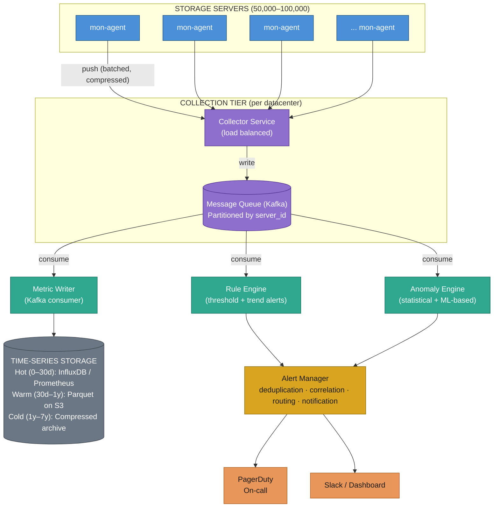
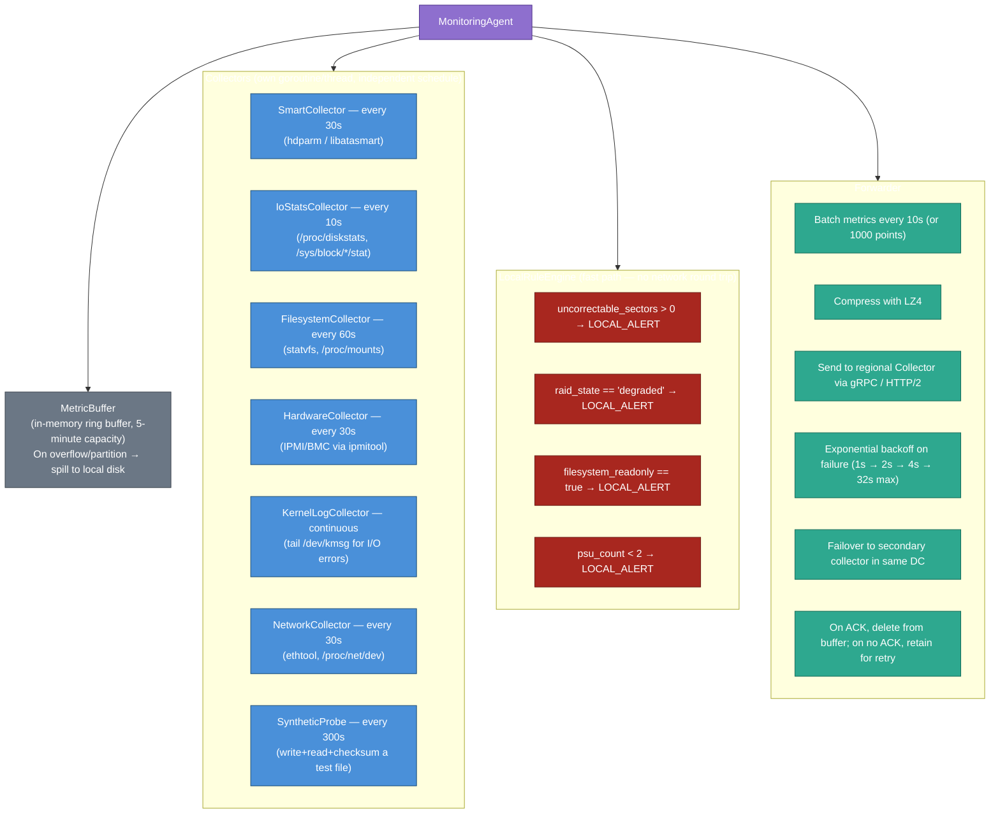
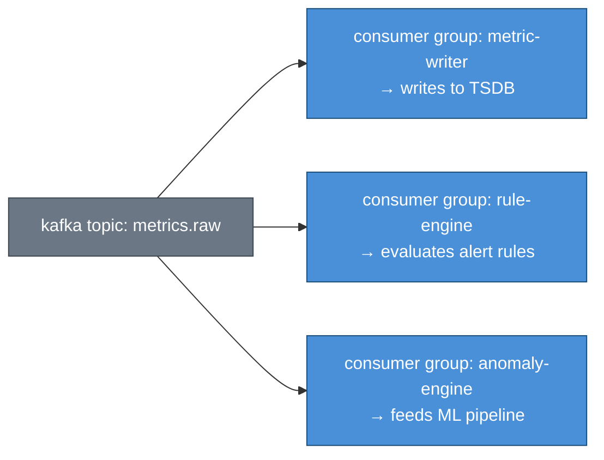
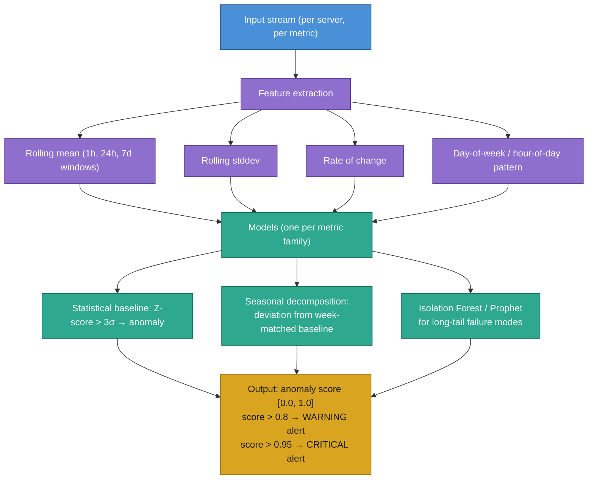
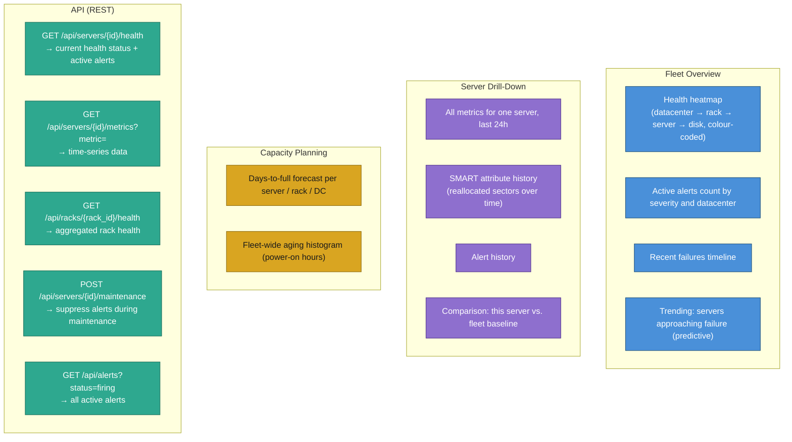
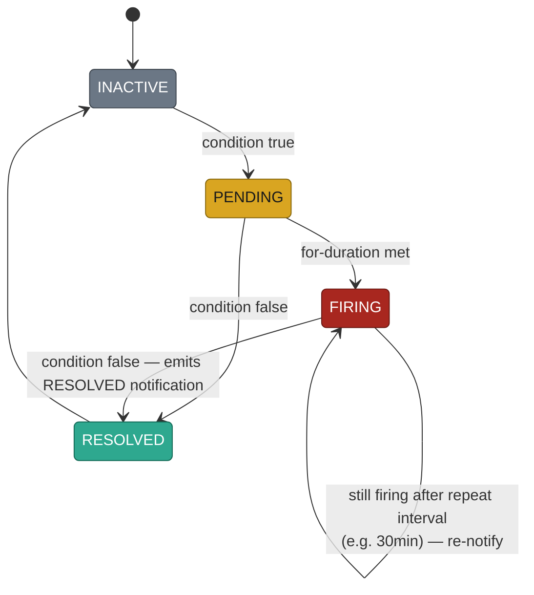

# Fleet Storage Server Monitoring System — Design Document

**Problem**: A fleet of tens of thousands of storage servers must be monitored continuously.
When a server starts failing, operators must be notified quickly enough to take action
before data loss or service degradation occurs.

**Scale target**: 50,000–100,000 servers, global datacenters, < 60s from fault to alert.

---

## Table of Contents

1. [Requirements](#1-requirements)
2. [What "Going Bad" Means](#2-what-going-bad-means)
3. [High-Level Architecture](#3-high-level-architecture)
4. [Component Deep Dives](#4-component-deep-dives)
   - 4.1 Monitoring Agent
   - 4.2 Collection Pipeline
   - 4.3 Detection Engine
   - 4.4 Alert Manager
   - 4.5 Storage
   - 4.6 Dashboard & API
5. [Data Model](#5-data-model)
6. [Scale Analysis](#6-scale-analysis)
7. [Failure Detection Strategies](#7-failure-detection-strategies)
8. [Alert Correlation & Storm Prevention](#8-alert-correlation--storm-prevention)
9. [Reliability of the Monitor Itself](#9-reliability-of-the-monitor-itself)
10. [Trade-offs & Design Decisions](#10-trade-offs--design-decisions)
11. [Operational Considerations](#11-operational-considerations)

---

## 1. Requirements

### Functional

| Capability               | Description                                                                   |
|--------------------------|-------------------------------------------------------------------------------|
| Continuous monitoring    | Collect health metrics from every server at regular intervals                 |
| Multi-signal detection   | Disk SMART data, I/O performance, temperature, filesystem, network, hardware  |
| Tiered alerting          | CRITICAL (page now), WARNING (ticket), INFO (dashboard)                       |
| Fleet-level view         | Aggregate health across racks, datacenters, regions                           |
| Fault attribution        | Distinguish server failure vs. rack failure vs. network failure               |
| Historical analysis      | Query past metrics to understand failure progression                          |
| Predictive alerting      | Detect degradation trends before hard failure                                 |
| Alert routing            | Route to correct on-call team by datacenter, service owner                    |

### Non-Functional

| Property       | Target                                                             |
|----------------|--------------------------------------------------------------------|
| Scale          | 100,000 servers, ~10M metrics/minute                               |
| Detection latency | < 60s from fault onset to alert firing                          |
| Alert accuracy | False-positive rate < 2%; false-negative rate < 0.1%              |
| Availability   | Monitor system itself at 99.99% (cannot afford blind spots)        |
| Durability     | No metric data loss during collector restarts or network partition  |
| Retention      | 30 days hot, 1 year warm, 7 years cold (compliance)               |

---

## 2. What "Going Bad" Means

Storage servers fail in several distinct modes. The monitoring system must detect all of them.

### 2.1 Disk / Media Failures (most common)

The industry standard for disk health is **S.M.A.R.T. (Self-Monitoring, Analysis and Reporting Technology)**. Key attributes:

```
Attribute                 ID    Severity  What it means
──────────────────────────────────────────────────────────────────────────────
Reallocated Sector Count   5   WARNING   Bad sectors remapped to spare area.
                                          Any non-zero value = disk degrading.
                                          Rising rate = imminent failure.
Spin Retry Count          10   WARNING   Spindle motor couldn't spin up cleanly.
Command Timeout Count    188   WARNING   Commands are timing out internally.
Uncorrectable Errors     198   CRITICAL  Sectors that can't be read at all.
                                          Even 1 = possible data loss. Page now.
Pending Sector Count     197   WARNING   Unstable sectors queued for reallocation.
Temperature              194   WARNING   High temp accelerates aging. > 60°C = alert.
Power-On Hours             9   INFO      Age proxy. > 50,000 hours = replacement plan.
Read Error Rate            1   WARNING   Raw read errors from the surface.
```

### 2.2 Performance Degradation

```
Metric                     Alert condition
───────────────────────────────────────────────────────────
I/O await time             > 500ms sustained for 60s
IOPS drop                  > 40% drop from 7-day baseline
Write throughput           < 50% of expected for disk class
I/O queue depth            > 64 sustained for 60s
```

### 2.3 Hardware / Subsystem Failures

```
Component        Detection method         Severity
────────────────────────────────────────────────────────
RAID controller  /proc/mdstat, MegaCLI    CRITICAL — degraded array
PSU              IPMI/BMC sensor          CRITICAL — single PSU left
HBA              dmesg errors             CRITICAL — I/O path failure
NIC              ethtool, ip stats        WARNING → CRITICAL
Fans             IPMI sensor              WARNING — thermal risk
```

### 2.4 Filesystem / OS Level

```
Condition                Signal               Severity
────────────────────────────────────────────────────────────────
Read-only remount        /proc/mounts        CRITICAL — OS detected FS error
Capacity > 95%           statvfs()           CRITICAL — writes will fail
Inode exhaustion > 95%   statvfs()           CRITICAL — new files blocked
dmesg I/O errors         kernel ring buffer   WARNING/CRITICAL
```

### 2.5 Silent / Soft Failures (hardest to detect)

- **Bit rot**: Data corrupted in place without media error (checksum mismatch)
- **Latent sector errors**: Sector readable most of the time, fails under load
- **Intermittent connectivity**: NIC resets that self-recover but cause I/O hiccups

Detection requires **data integrity scrubbing** (periodic checksummed reads) and
**synthetic I/O probes** in addition to passive SMART monitoring.

---

## 3. High-Level Architecture



---

## 4. Component Deep Dives

### 4.1 Monitoring Agent

A lightweight daemon running on **every storage server**. Written in a low-overhead
language (Go or C). Consumes < 1% CPU and < 50 MB RAM.



**Why local disk spill?**

If the collector is unreachable (network partition, rolling upgrade), the agent must
not drop metrics. Local disk buffer allows the agent to survive partitions of up to
several hours and replay when connectivity resumes. Critical because storage server
failures often coincide with the network events that caused them.

**Why a local rule engine?**

Some failures are so severe (uncorrectable sectors, RAID degraded) that we cannot
afford the latency of the full pipeline. A local alert written to `/run/monitor/alerts`
can be picked up by a separate sidecar process that phones home via a different path
(IPMI out-of-band network, if the main data network is down).

### 4.2 Collection Pipeline


**Collector Service** (per datacenter, 3-10 nodes):
- Stateless HTTP/gRPC endpoint
- Validates incoming metric batches (schema, timestamp sanity, server ID existence)
- Writes directly to Kafka without any business logic
- Autoscales based on incoming byte rate

**Kafka** (per datacenter, 5+ brokers):
- Topic: `metrics.raw` — one partition per 500 servers ≈ 200 partitions
- Partitioning key: `server_id` — ensures one server's metrics always go to the same partition (ordered processing per server)
- Replication factor: 3 (survive 2 broker failures)
- Retention: 24 hours (enough for consumer lag recovery)
- Throughput target: 200 MB/s per DC (comfortably within Kafka's range)

**Consumer groups**:


Each consumer group reads the topic independently. Adding a new consumer group adds
a new processing pipeline without touching existing ones.

### 4.3 Detection Engine

Two parallel engines read from Kafka:

#### Rule Engine (low-latency, deterministic)

Evaluates a set of configured rules against each incoming metric batch.

```
Rule {
    name:        "uncorrectable-sectors"
    metric:      "smart.uncorrectable_sector_count"
    condition:   VALUE > 0
    severity:    CRITICAL
    for:         0s             // fire immediately — no grace period
    annotations:
        summary:  "Uncorrectable disk sectors on {{ server_id }}"
        runbook:  "https://wiki/runbooks/uncorrectable-sectors"
}

Rule {
    name:        "high-io-await"
    metric:      "io.await_ms"
    condition:   VALUE > 500
    severity:    WARNING
    for:         60s            // must be sustained for 60s to avoid flapping
    annotations:
        summary:  "High I/O await on {{ server_id }}: {{ value }}ms"
}

Rule {
    name:        "capacity-critical"
    metric:      "fs.used_pct"
    condition:   VALUE > 95
    severity:    CRITICAL
    for:         300s
}
```

The `for` clause implements a **grace period**: the condition must hold continuously
for the specified duration before the alert fires. Eliminates most false positives
from transient spikes.

#### Anomaly Engine (ML-based, higher latency)

Detects deviations that threshold rules miss:



**Example anomaly the rule engine misses**: A disk's reallocated sector count is 50
(stable for 3 months, so no threshold alert). Today it jumped to 65 — an increase of
15 in one day vs. a 7-day average of 0.1/day. The anomaly engine fires a WARNING;
the threshold rule does not.

### 4.4 Alert Manager

Receives raw alert events from both engines. Responsibilities:

#### Deduplication

```
Same alert (same server_id + metric + condition) firing continuously
→ emit ONE alert event, then silence until:
   - condition resolves (emit RESOLVED)
   - re-notify after configurable repeat interval (default: 4h for WARNING, 1h for CRITICAL)
```

#### Correlation / Blast Radius Detection

```
Incoming alerts in a 2-minute window:

  SCENARIO A: 3 servers in same rack fail simultaneously
    Before correlation: 3 separate CRITICAL pages (3 on-call wakeups)
    After correlation:  1 "RACK FAILURE: rack-07 (3 servers affected)" page
    Reason: likely a rack power or top-of-rack switch failure, not individual server faults.

  SCENARIO B: 200 servers across 5 racks fail simultaneously  
    Correlation: datacenter-level network or power event → 1 DC-WIDE incident

  SCENARIO C: 1 server fails; no correlated events
    Normal individual server failure → route to storage-ops on-call
```

Correlation logic:
```
group_key = (datacenter, rack, failure_type)
window = 2 minutes

if alerts_in_window(group_key) >= RACK_THRESHOLD (5):
    suppress individual alerts
    emit RACK_INCIDENT alert
    
if rack_incidents_in_window(datacenter) >= DC_THRESHOLD (3):
    suppress rack alerts
    emit DC_INCIDENT alert
```

#### Inhibition

```
If RAID_DEGRADED fires for server X:
    inhibit DISK_LATENCY_HIGH for server X  (the latency is a symptom, not a separate cause)
    
If DC_INCIDENT fires for datacenter D:
    inhibit all individual server alerts in datacenter D
```

#### Routing

```
severity = CRITICAL  → PagerDuty (page on-call engineer immediately)
severity = WARNING   → Slack #storage-alerts + JIRA ticket (business hours)
severity = INFO      → Dashboard only (no human notification)

Route by tag:
  datacenter = "dal1" → on-call team "infra-dal"
  service = "ceph"    → on-call team "storage-ceph"
```

### 4.5 Storage

#### Time-Series DB (hot path, 0–30 days)

**InfluxDB** or **VictoriaMetrics** (handles 1M+ writes/sec with compression):
- Tag-indexed: `server_id`, `datacenter`, `rack`, `disk_id`, `metric_family`
- Continuous queries to downsample: keep 10s resolution for 7 days; 1m resolution for 30 days
- High availability: 3-node cluster with anti-entropy replication

#### Warm path (30 days – 1 year)

Export from TSDB to **Parquet files on S3/GCS** via nightly batch job:
- Partitioned by `date / datacenter / metric_family`
- Queryable via Athena / BigQuery / Spark for historical analysis, capacity planning
- 10–20× compression vs. raw data

#### Cold path (1 year – 7 years)

Further compressed archives (zstd). Rarely accessed — only for compliance audits,
post-mortem analysis of long-term failure patterns.

#### Config / Inventory DB (PostgreSQL)

```sql
servers (
    server_id TEXT PRIMARY KEY,
    datacenter TEXT,
    rack TEXT,
    row TEXT,
    slot INT,
    hardware_model TEXT,
    capacity_tb NUMERIC,
    commissioned_at TIMESTAMPTZ,
    decommissioned_at TIMESTAMPTZ,
    owner_team TEXT
)

alert_rules (...)
notification_channels (...)
maintenance_windows (...)
```

Used to validate incoming metric `server_id` against known fleet, look up owner teams
for routing, and suppress alerts during planned maintenance.

### 4.6 Dashboard & API



---

## 5. Data Model

### Metric Point

```
MetricPoint {
    server_id:    string     // "srv-dal1-r07-s03"   (structured ID encoding DC/rack/slot)
    datacenter:   string     // "dallas-1"
    rack:         string     // "rack-07"
    metric_name:  string     // "smart.reallocated_sector_count"
    timestamp:    int64      // Unix nanoseconds
    value:        float64
    tags: {
        disk_id:   string    // "sda" / "nvme0n1" (per-disk metrics)
        disk_type: string    // "hdd" / "ssd" / "nvme"
        interface: string    // "sata" / "sas" / "nvme"
    }
}
```

### Alert

```
Alert {
    alert_id:      uuid
    rule_name:     string     // "uncorrectable-sectors"
    server_id:     string
    severity:      enum       // CRITICAL | WARNING | INFO
    state:         enum       // PENDING | FIRING | RESOLVED | SILENCED
    metric:        string
    condition:     string     // "smart.uncorrectable_sector_count > 0"
    value:         float64    // value that triggered
    threshold:     float64
    fired_at:      timestamp
    resolved_at:   timestamp?
    annotations: {
        summary:   string
        runbook:   string     // link to ops runbook
        datacenter: string
        rack:       string
    }
    labels: {
        owner_team: string    // for routing
        env:        string    // "production"
    }
}
```

### Server Health Score

A composite score [0–100] for fleet-level overview:

```
health_score = 100
  - SMART_penalty(reallocated_sectors, uncorrectable_errors, pending_sectors)
  - IO_penalty(await_ms, iops_deviation_pct)
  - FS_penalty(used_pct, inode_used_pct)
  - HW_penalty(temperature, psu_count, fan_status)

score >= 90 : GREEN
score  60–89: YELLOW (watch)
score  30–59: ORANGE (degraded)
score  <  30: RED    (critical)
```

---

## 6. Scale Analysis

### Metric ingestion math

```
Servers:                  50,000
Metrics per server:       ~120  (30 SMART + 20 I/O + 10 FS + 20 HW + 20 network + 20 synthetic)
Average collection interval: ~25s (mix of 10s I/O + 30s SMART + 60s FS + 300s synthetic)

Raw data points/sec:
  50,000 × 120 metrics / 25s = 240,000 data points/sec = 14.4M points/min

Per point wire size (compressed with LZ4):
  ~20 bytes (server_id encoded as int, metric_id as int, delta timestamp, delta value)

Raw ingestion bandwidth:
  240,000 × 20 bytes = 4.8 MB/s per DC (trivial for a 10 Gbps network)

Kafka throughput needed:
  4.8 MB/s producer → 14.4 MB/s at replication factor 3 → well within 1 Gbps broker NIC

TSDB write rate:
  240,000 writes/sec → InfluxDB/VictoriaMetrics handle 1M+/sec per node

Storage per day (uncompressed):
  240,000 × 86,400s × 20 bytes = 415 GB/day

With TSDB compression (10–20× for time-series):
  ~25–40 GB/day compressed = ~10 TB/year for hot path
  Parquet warm path: ~1 TB/year (additional 10× from columnar compression)
```

### Collector fleet sizing

```
Each Collector node:
  Handles ~5,000 agents (fan-in)
  Network: 5,000 × 50 KB/s peak push = 250 MB/s (needs 2.5 Gbps NIC)

Collector nodes needed per DC:
  50,000 agents / 5,000 per node = 10 Collector nodes per DC
  Run 12 for N+2 redundancy

Kafka brokers:
  200 MB/s sustained throughput, 3× replication = 600 MB/s disk write
  5 brokers × 500 MB/s each = 2.5 GB/s capacity → 4× headroom
```

### Alert processing

```
Expected alert rate (normal operations):
  0.1% of 50,000 servers trigger a new alert per hour = 50 alerts/hour = trivial

During incident (e.g., DC-wide power event):
  50,000 / 20 DCs = 2,500 servers affected simultaneously
  2,500 raw alerts → after correlation: 1 DC-INCIDENT alert + a handful of rack alerts
  Alert storm prevention critical here
```

---

## 7. Failure Detection Strategies

Four complementary strategies, layered for defence-in-depth:

### 7.1 Threshold-Based (Immediate, Deterministic)

Simple, fast, no false negatives for known failure signatures.

```
Signal: smart.uncorrectable_sector_count
Rule:   value > 0 → CRITICAL (fire immediately)

Signal: fs.used_pct
Rule:   value > 95 for 5min → CRITICAL

Signal: hardware.psu_count
Rule:   value < 2 → CRITICAL (only one PSU remaining)
```

**Limitations**: Only catches known failure modes. Cannot detect novel failure patterns.
Tuning thresholds is manual and requires domain expertise.

### 7.2 Trend / Rate-of-Change Detection

Catches gradual degradation that never crosses a threshold in a single sample.

```
Signal: smart.reallocated_sector_count
Rule:   rate_of_change_per_day > 5   → WARNING
        (even if absolute value is 20 — stable for months — sudden acceleration matters)

Signal: io.await_ms
Rule:   7d_moving_average > 1.5 × 30d_moving_average  → WARNING
        (latency trending up significantly above its own history)

Signal: fs.used_pct
Rule:   linear_extrapolation(7d_trend) reaches 95% within 14 days → WARNING
        (capacity planning: gives 2 weeks to act before crisis)
```

Implementation:
```
Each metric series → sliding window aggregator
  → computes: 1h_avg, 24h_avg, 7d_avg, 30d_avg
  → computes: rate_per_hour, rate_per_day
  → computes: days_to_threshold (linear extrapolation)
  → emits synthetic metrics: "smart.reallocated_sectors.rate_per_day"
     which the Rule Engine evaluates like any other metric
```

### 7.3 Anomaly Detection (Statistical Baseline)

Detects deviations from a server's own historical normal — adapts automatically
without requiring manual threshold tuning.

```
Algorithm: Modified Z-score on rolling window

For each metric M on server S:
  μ = rolling_mean(M, window=7d)
  σ = rolling_stddev(M, window=7d)
  z = (current_value - μ) / σ

  if z > 3.0 (3 standard deviations):  WARNING
  if z > 5.0 (5 standard deviations):  CRITICAL

Seasonal decomposition:
  io.await_ms has a 24h seasonal pattern (peak at business hours)
  → decompose signal into trend + seasonal + residual
  → apply Z-score to residual only (removes expected daily variation)
```

**What this catches that thresholds miss**:
- A fast SSD normally has 0.1ms await. It's now at 2ms. No threshold fires (2ms is
  "normal" for spinning disk). Z-score fires: (2 - 0.1) / 0.05 = 38σ → CRITICAL.
- A HDD normally has 150ms await (old, busy disk). It's at 180ms. Threshold would fire
  (if set for 150ms). Z-score: (180 - 150) / 20 = 1.5σ → no alert. Correct.

### 7.4 Predictive / ML-Based (Proactive)

Train a binary classifier on historical data: {metrics at time T} → {failure within 7 days}.

```
Feature vector per server:
  [reallocated_sectors, reallocated_sectors_rate, uncorrectable_errors,
   pending_sectors, avg_io_await, io_await_trend, temperature,
   temperature_trend, power_on_hours, error_log_count, ...]

Model: Gradient Boosted Tree (XGBoost)
  - Trained on 2 years of historical data
  - Label: "did this server fail within 7 days of this snapshot?"
  - Features from the snapshot 7 days before the failure

Output: P(failure within 7 days)
  P > 0.8 → "PREDICTED FAILURE" WARNING (schedule proactive replacement)
  P > 0.95 → escalate to CRITICAL (evacuate data now)
```

**Retraining**: Weekly on a sliding window of the last 2 years. Model served via a
lightweight inference endpoint (microsecond latency per prediction).

**Industry data**: Google's 2007 study found S.M.A.R.T. alone predicts only ~56% of
disk failures. Their subsequent work showed that adding I/O error rates and temperature
trends improved prediction to ~85%. ML on the full feature set pushes this further.

### 7.5 Heartbeat / Liveness (Dead Man's Switch)

If an agent stops sending metrics, that itself is a signal.

```
Expected heartbeat interval: 30s (every agent must send at least one batch)
Tolerance: 2 × interval = 60s

Timeline:
  t=0s    Agent last seen
  t=60s   Collector marks server UNKNOWN
  t=90s   Alert fires: "Agent silent: srv-dal1-r07-s03 (90s no data)"
  t=300s  If still silent and no IPMI OOB response: escalate to CRITICAL

Distinguish from:
  Network partition    → other servers in same rack also silent
  Planned maintenance  → maintenance window suppresses this alert
  Hard crash           → IPMI OOB (out-of-band) shows powered off
```

---

## 8. Alert Correlation & Storm Prevention

A rack-level power failure affecting 100 servers should generate **one incident**, not
100 pages waking up 100 on-call engineers with identical alerts.

### Grouping Hierarchy

```
Individual server failure
  ↓ if N ≥ 5 servers in same rack within 2 minutes
Rack-level incident (e.g., rack-07 in dal1)
  ↓ if M ≥ 3 racks in same DC within 2 minutes
Datacenter-level incident (e.g., dal1 partial power event)
  ↓ if P ≥ 2 DCs in same region within 5 minutes
Region-level incident
```

### Inhibition Rules

```
When DISK fires for server X AND RAID_DEGRADED fires for the same server:
  → DISK is a symptom of RAID_DEGRADED; inhibit DISK, surface only RAID_DEGRADED

When DC_INCIDENT fires for datacenter D:
  → Inhibit all individual server alerts in D (they are subsumed)
  → Inhibit all rack alerts in D

When MAINTENANCE_WINDOW is active for server X:
  → Inhibit ALL alerts for X
```

### Alert Deduplication State Machine



---

## 9. Reliability of the Monitor Itself

The monitoring system is critical infrastructure. If it fails silently, we lose
visibility into server failures. This requires careful design of the monitor's own reliability.

### Agent Resilience

```
Failure: Collector unreachable
Action:  Agent buffers to local disk; retries with backoff; fails over to secondary collector
Max buffer: 4 hours of metrics at 120 metrics/30s = 57,600 points ≈ 5 MB — trivial

Failure: Agent process crashes
Action:  Supervised by systemd (Restart=always, RestartSec=5s)
         Alert fires if agent is down > 90s (heartbeat check)

Failure: Agent host OS hangs (not just the agent process)
Action:  IPMI watchdog timer reboots the host after 60s with no OS heartbeat
         Out-of-band monitoring (IPMI over dedicated management network) reports the reboot
```

### Collection Tier Resilience

```
Kafka: 3+ broker cluster, RF=3 — survives 2 broker failures without data loss
Collector: stateless, 3+ nodes behind load balancer — any node failure is transparent
ZooKeeper / KRaft: 5-node quorum — survives 2 failures
```

### What monitors the monitor?

```
External watchdog: a separate, isolated system (different infrastructure, different team)
  - Periodically injects synthetic test metrics from known servers
  - Verifies they appear in the TSDB within 120s
  - If not: alerts the platform-ops team (not the storage-ops team)
  - Uses a separate alerting channel (not the same PagerDuty integration being monitored)

Canary servers: a handful of servers intentionally put into known-bad states
  - One server has its SMART error injected via mock
  - The monitoring system must alert on it within 60s or a pipeline health check fails
```

### Cross-Region Monitoring

```
Each datacenter's monitoring stack is monitored by the neighbouring datacenter.
  dal1 → monitors → dal2
  dal2 → monitors → sjc1
  sjc1 → monitors → dal1

If dal1 goes dark: sjc1 fires "dal1 monitoring pipeline is silent"
This is the heartbeat pattern applied at the datacenter level.
```

---

## 10. Trade-offs & Design Decisions

### Push vs. Pull

| Approach | Pros | Cons | Decision |
|----------|------|------|----------|
| **Push** (agent sends to collector) | Agent controls timing; works behind NAT/firewall; handles backpressure locally | Agent config drift; hard to change collection interval centrally | **CHOSEN** |
| Pull (collector scrapes each server) | Simpler collector; Prometheus model | 100k open TCP connections to collector; scrape schedule at collector; firewall issues | Not viable at 100k scale |

### Time-Series DB Choice

| Option | Write scale | Query | Ops complexity | Decision |
|--------|-------------|-------|---------------|----------|
| InfluxDB | High | InfluxQL/Flux | Medium | Good fit |
| VictoriaMetrics | Very high | PromQL | Low | Best fit at scale |
| Prometheus + Thanos | Medium | PromQL | High (Thanos) | Good for global view |
| TimescaleDB | Medium | SQL | Medium | Good for ad-hoc analysis |

**Recommendation**: VictoriaMetrics for the hot TSDB (excellent write performance,
native PromQL, single-node can handle 1M+ writes/sec). Thanos or Grafana Mimir for
long-term global aggregation if multi-region query is needed.

### Alert threshold tuning

- **Too sensitive**: Alert fatigue → on-call ignores alerts → real failures missed
- **Too lenient**: Failures go undetected → data loss

**Resolution**: Start lenient. Instrument every alert with "was this actionable?" tracking.
Tune thresholds based on 6 months of historical data. Use the anomaly engine's adaptive
baselines to reduce threshold-tuning burden over time.

### In-band vs. out-of-band monitoring

**In-band**: Agent sends metrics over the same network used by the server for data traffic.
Simple; same credentials. Problem: a network failure takes out both the server and its monitoring.

**Out-of-band**: IPMI/BMC on a separate management network. Works even if the OS is down.
Problem: BMC metrics are limited (power, temperature, fan — not SMART or filesystem).

**Decision**: Both. SMART, I/O, FS → in-band agent. Power, temperature, fan, liveness → IPMI OOB.
If in-band agent goes silent, OOB confirms whether the server is powered and the OS is alive.

---

## 11. Operational Considerations

### Maintenance Windows

```
PUT /api/servers/{id}/maintenance
  { "start": "2026-07-20T02:00Z", "end": "2026-07-20T04:00Z", "reason": "firmware upgrade" }

Effect: Alert Manager suppresses all alerts for that server during the window.
        Metrics continue to flow and are stored (post-maintenance analysis).
        Auto-expires: if the window ends and server is still unhealthy, alerts resume.
```

### Runbooks

Every alert must link to a runbook:
```yaml
annotations:
  runbook: "https://wiki/runbooks/uncorrectable-sectors"
```

The runbook for uncorrectable sectors covers:
1. SSH to server, run `smartctl -a /dev/sda`
2. Identify which disk is affected
3. Check RAID status (`mdadm --detail /dev/md0`)
4. If data is redundant: flag disk for replacement, trigger hot-spare rebuild
5. If no redundancy: evacuate data immediately, escalate to data-recovery team

### Decommission Workflow

When a server is flagged for replacement:
1. Alert fires (via monitoring system)
2. Ops team acknowledges, creates replacement ticket
3. Server put in MAINTENANCE_WINDOW
4. Data evacuated (if applicable)
5. Server decommissioned in inventory DB → `decommissioned_at` set
6. Agent uninstalled; metrics stop flowing
7. Server removed from heartbeat monitoring

Without step 6 the monitoring system would permanently alert on a decommissioned server.

### Configuration-as-Code

Alert rules, routing rules, and notification channels stored in a Git repo.
Changes reviewed via PR and applied via GitOps pipeline. This prevents:
- Untracked threshold changes ("who turned off that alert?")
- Config drift between environments
- Inability to roll back a bad rule change that causes an alert storm

---

## Summary: Key Design Principles

| Principle                  | Application                                                          |
|---------------------------|----------------------------------------------------------------------|
| **Fail-open for detection**| On pipeline failure, age-out → UNKNOWN → alert; never silently drop |
| **Defence-in-depth**       | Four detection strategies (threshold + trend + anomaly + predictive)|
| **Layered aggregation**    | Agent → Collector → Kafka → TSDB; each layer independently durable  |
| **Correlation over noise** | Group rack/DC events; one incident not 1000 pages                   |
| **The monitor is monitored**| External watchdog + canary servers verify end-to-end pipeline        |
| **Runbook-first alerting** | Every alert has a runbook; on-call knows exactly what to do          |
| **Adaptive baselines**     | Anomaly engine adapts to each server's normal; no global thresholds  |
| **Out-of-band escape hatch**| IPMI/BMC monitoring survives OS and in-band network failures        |
