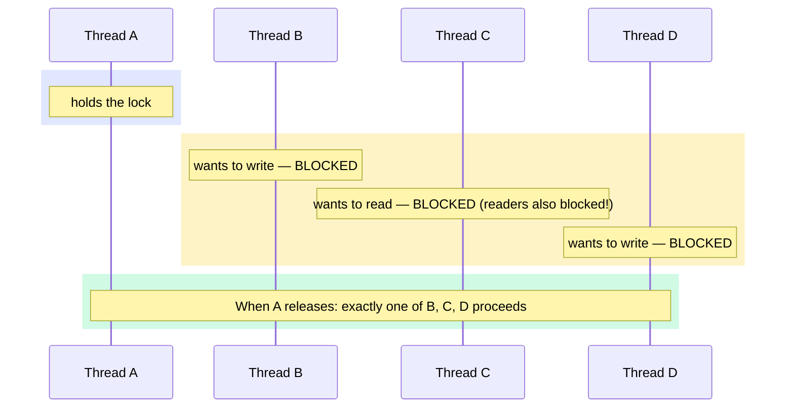
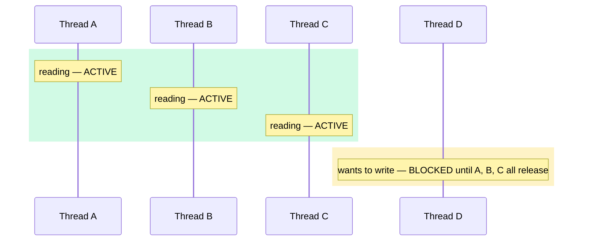
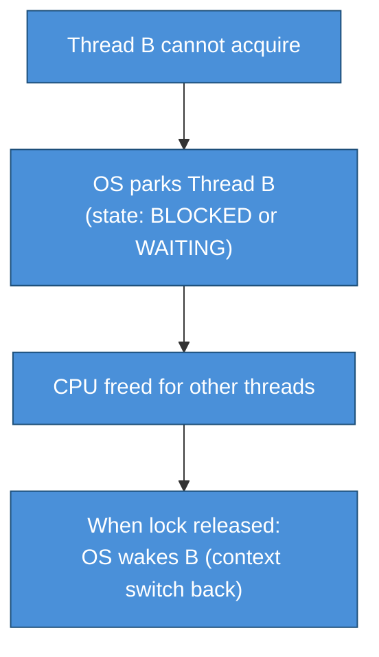
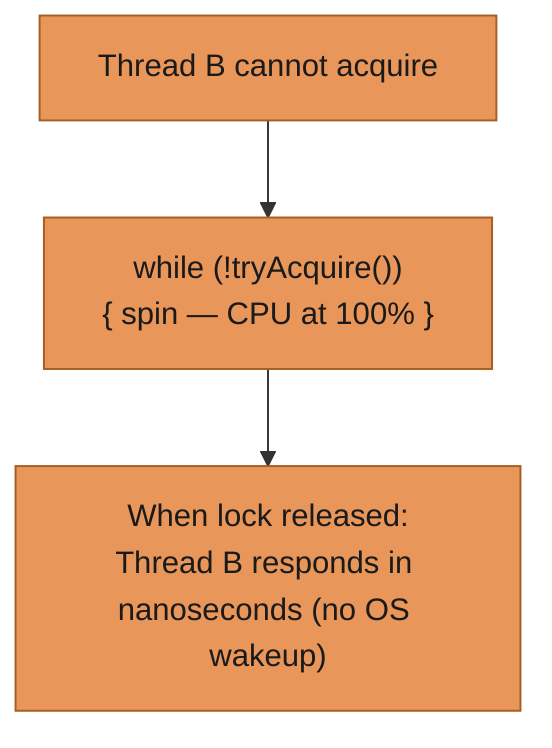
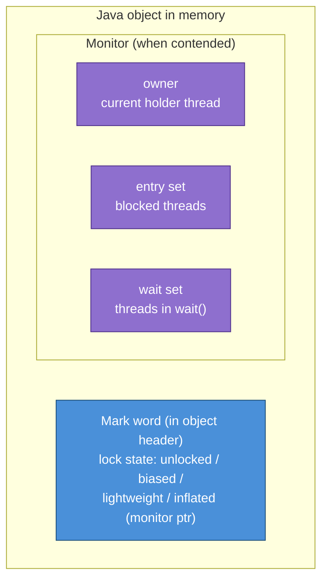
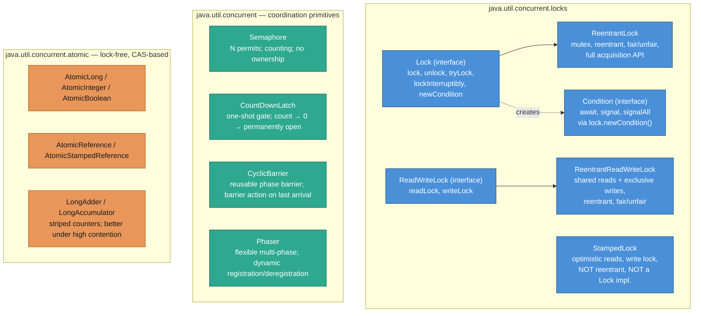
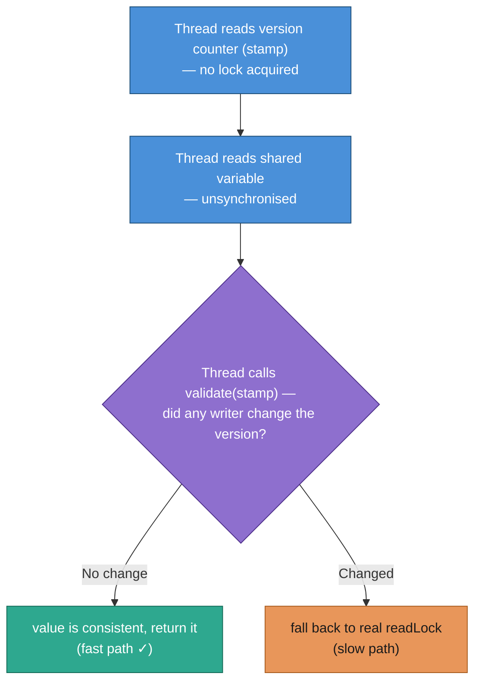
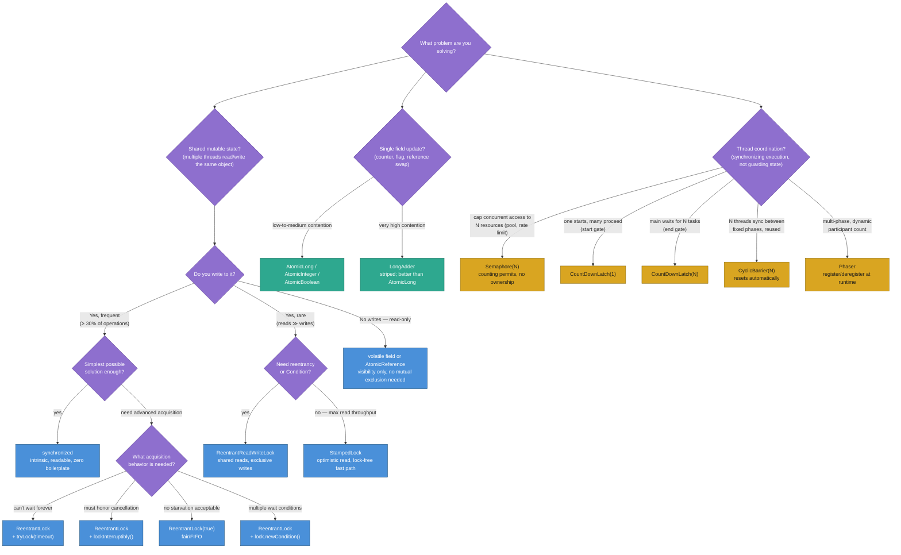

# Java Locking Hands-On

A comprehensive, benchmarked, extensible tour of every major Java locking mechanism —
from the `synchronized` keyword to lock-free CAS — plus the coordination primitives
`Semaphore`, `CountDownLatch`, `CyclicBarrier`, and `Phaser`.

---

## Package Layout

```
locking/
├── LockingDemo.java                    # Main entry point
├── LockingExample.java                 # Original simple ReentrantLock demo
├── strategy/
│   ├── LockingStrategy.java            # Interface (Strategy pattern)
│   ├── SynchronizedStrategy.java       # synchronized keyword
│   ├── ReentrantLockStrategy.java      # ReentrantLock (+ tryLock, interruptible)
│   ├── ReadWriteLockStrategy.java      # ReentrantReadWriteLock
│   ├── StampedLockStrategy.java        # StampedLock with optimistic read
│   └── AtomicStrategy.java             # AtomicLong — lock-free CAS
├── benchmark/
│   ├── BenchmarkResult.java            # Immutable result record
│   └── LockBenchmark.java              # write-heavy + read-heavy benchmark runner
└── demo/
    ├── SemaphoreDemo.java              # DB connection pool (counting semaphore)
    ├── CountDownLatchDemo.java         # Service startup (one-shot gate)
    ├── CyclicBarrierDemo.java          # Parallel word count (reusable barrier)
    └── PhaserDemo.java                 # ETL pipeline (flexible multi-phase)
```

---

## Extensibility: Adding a New Strategy

Implement `LockingStrategy` and add it to the list in `LockingDemo.strategies()`:

```java
public class MyLockStrategy implements LockingStrategy {
    @Override public String name()        { return "MyLock"; }
    @Override public String description() { return "..."; }
    @Override public void  increment()    { /* acquire, counter++, release */ }
    @Override public long  value()        { /* read counter */ }
    @Override public void  reset()        { /* counter = 0 */ }
}
```

```java
// In LockingDemo.strategies():
private static List<LockingStrategy> strategies() {
    return List.of(
        new SynchronizedStrategy(),
        new MyLockStrategy(),      // ← add here
        ...
    );
}
```

The benchmarks run automatically for every strategy in that list.

---

## Locking Concepts — Types and When to Use

Before diving into implementations, it helps to understand the conceptual categories
that every locking mechanism falls into. Each lock in `java.util.concurrent` is a
combination of choices from the categories below.

---

### The Core Problem: Why Locks Exist

Three distinct problems arise when threads share mutable state without synchronisation:

**1. Atomicity failure — the read-modify-write race**

A single logical operation that requires multiple machine instructions can be
interleaved with another thread's instructions in between.

```
  Thread A: read counter (= 5)
  Thread B: read counter (= 5)    ← B reads before A has written
  Thread A: write counter = 6
  Thread B: write counter = 6     ← B's write clobbers A's
  Result: 6 (expected 7) — one update is silently lost
```

**2. Visibility failure — CPU caches and compiler reordering**

Modern CPUs maintain per-core caches. A write by Thread A may stay in A's cache
and never be flushed to main memory before Thread B reads.

```
  Thread A writes: done = true;
  Thread B reads:  while (!done) { spin(); }   ← may loop forever
                                                   (B's cache line is stale)
```

**3. Ordering failure — instruction reordering**

CPUs and JIT compilers reorder instructions for performance. The order a thread
writes is not necessarily the order other threads observe.

```
  Thread A: data = compute();   ← CPU may reorder: publish ready first!
            ready = true;
  Thread B: if (ready) use(data);   ← sees ready=true but stale data — crash
```

**Locks solve atomicity and ordering. `volatile` solves visibility only.**

---

### Category 1 — By Access Model: Exclusive vs. Shared

This is the most fundamental distinction between lock types.

**Exclusive Lock (Mutex — Mutual Exclusion)**

Only one thread may hold the lock at any time. All other threads block,
regardless of whether they intend to read or write.



Java classes: `synchronized`, `ReentrantLock`, `StampedLock.writeLock()`

**When to use:**
- Any write to shared mutable state
- A read that must be consistent with a prior write in the same operation
- Small critical sections where the simplicity outweighs the read-blocking cost

**When NOT to use:**
- Read-dominated workloads — readers block each other unnecessarily (use Shared lock)

---

**Shared Lock (Read Lock)**

Multiple threads may hold the lock simultaneously as long as no thread holds the
write lock. Readers proceed concurrently; a writer blocks until all readers release.



Java classes: `ReentrantReadWriteLock.readLock()`, `StampedLock.readLock()`

**When to use:**
- Caches, configuration stores, route tables — state that is read often but written rarely
- Reads are non-trivial in duration (if reads are nanoseconds, lock overhead dominates)

**When NOT to use:**
- Write rate is moderate-to-high — the write lock still serialises everything
- You need reentrancy or `Condition` variables (use `ReentrantReadWriteLock`, not `StampedLock`)

---

### Category 2 — By Wait Strategy: Blocking vs. Spinning

How does a thread behave while waiting for a lock it cannot acquire?

**Blocking Lock**

The OS parks (sleeps) the thread. No CPU is consumed while waiting. A context switch
is required to both park and wake the thread (roughly 1–10 µs of overhead).



Java: `synchronized`, `ReentrantLock`, `ReadWriteLock`

**Best for:** Long-held locks or high thread counts where CPU burning during a wait
would be wasteful. The 1–10 µs context switch cost is amortised over the wait time.

---

**Spin Lock (Busy-Wait)**

The thread loops continuously, repeatedly attempting to acquire. CPU is consumed
while waiting, but zero wake-up latency when the lock becomes available.



Java: CAS loops in `AtomicLong`, `AtomicReference` are a form of spin lock.

**Best for:** Very short critical sections (a few instructions) where the spin time
is less than the cost of a context switch. Harmful under high contention — wastes
an entire core for the duration of the wait.

---

**Adaptive Spinning (Hybrid)**

The JVM spins briefly before deciding to block. If the lock is released during
the spin window, no context switch is needed. The spin duration adapts based on
observed contention history.

Java: `synchronized` uses adaptive spinning automatically. `ReentrantLock` does too
via its underlying `AbstractQueuedSynchronizer` implementation.

---

### Category 3 — By Acquisition Strategy: Pessimistic vs. Optimistic

**Pessimistic Locking**

Assumes conflicts will happen. Acquires the lock before accessing shared state.
No other thread can modify the data while the lock is held — no possibility of conflict.

```
  acquire lock
    → read data  (guaranteed to be consistent)
    → modify data (no interference possible)
  release lock
```

Java: `synchronized`, `ReentrantLock`, `ReadWriteLock.writeLock()`

**When to use:** Moderate-to-high write rate; when the cost of retrying a failed
optimistic attempt is expensive (e.g. a partial computation that must restart).

---

**Optimistic Locking**

Assumes conflicts are rare. Reads without acquiring a lock, then validates at
"commit time" whether a writer was concurrent. If validation fails, retry.

```
  stamp = tryOptimisticRead()     ← reads a version number; NO lock acquired
  snapshot = sharedVariable       ← unsynchronised read (may be partially stale)
  if validate(stamp):
      return snapshot             ← no writer ran concurrently; snapshot is valid ✓
  else:
      acquire real readLock()     ← a writer was concurrent; fall back to safe path
      snapshot = sharedVariable
      release readLock()
```

Java: `StampedLock.tryOptimisticRead()` + `lock.validate(stamp)`

**When to use:** Read-dominated with rare writes. `validate()` almost always succeeds,
making reads effectively free. Under high write contention, validation fails frequently
and the fallback cost erodes the advantage.

---

### Category 4 — By Reentrancy

**Reentrant (Recursive) Lock**

A thread that already holds the lock can acquire it again without deadlocking. The lock
keeps a hold count; it fully releases only when the count returns to zero.

```
  lock.lock();           // hold count: 1
    doSomething();
    lock.lock();         // hold count: 2  ← same thread, no deadlock
      doSomethingElse();
    lock.unlock();       // hold count: 1
  lock.unlock();         // hold count: 0  ← lock actually released here
```

Java: `synchronized` (implicit), `ReentrantLock`, `ReentrantReadWriteLock`

**When to use:** Any time a method that holds a lock calls another method that also
acquires the same lock. Without reentrancy, this deadlocks.

```java
// Example: remove() holds the lock and calls contains(), which also locks — safe!
public synchronized void remove(Object o) {
    if (contains(o)) {          // contains() is also synchronized on same monitor
        list.remove(o);         // works because synchronized is reentrant
    }
}
public synchronized boolean contains(Object o) { return list.contains(o); }
```

---

**Non-Reentrant Lock**

A thread that already holds the lock and tries to acquire it again will deadlock —
it waits for itself to release, which can never happen.

```
  stamp = lock.writeLock();          // Thread A holds the write lock
    doSomething();
    stamp2 = lock.writeLock();       // Thread A tries to re-acquire — DEADLOCK
```

Java: `StampedLock`

**Why accept this limitation?** `StampedLock` trades away reentrancy to enable its
optimistic read path, which offers dramatically higher read throughput.

**How to use safely:** Never let a `StampedLock`-guarded method call another method
that acquires the same `StampedLock`.

---

### Category 5 — By Fairness

**Unfair Lock (Default)**

When a lock is released, any thread — including a thread that just arrived and hasn't
been waiting — may acquire it ("barging"). The OS thread scheduler decides.

```
  Lock released. Waiting queue: [B, C, D]  (arrived in that order)
  Thread E arrives at exactly this moment
  → Thread E may acquire before B (who has been waiting longer)
```

**Advantage:** Higher average throughput. When a thread releases and immediately tries
to re-acquire, it can do so without a context switch.

**Disadvantage:** A thread can theoretically wait indefinitely if new threads keep
arriving — starvation is possible.

Java: Default for `ReentrantLock`, `ReentrantReadWriteLock`, `Semaphore`

---

**Fair Lock (FIFO)**

Threads acquire the lock strictly in the order they requested it. No barging allowed.

```
  Lock released. Waiting queue: [B, C, D, E]
  → Lock goes to B. Then C. Then D. Then E. — strictly FIFO.
```

**Advantage:** No starvation — every thread is guaranteed to eventually proceed.
Worst-case latency is bounded by queue length.

**Disadvantage:** ~2–5× lower throughput. Even when the CPU is available, a sleeping
thread must be woken (context switch) before it can acquire — barging is prohibited.

Java: `new ReentrantLock(true)`, `new ReentrantReadWriteLock(true)`, `new Semaphore(n, true)`

**When to use:** When starvation would have business consequences (billing pipelines,
audit logs, fairness-sensitive queuing systems), or when worst-case latency SLAs
matter more than average throughput.

---

### Category 6 — By Acquisition Behaviour: Timed / Try / Interruptible

These advanced acquisition modes are only available on `ReentrantLock` — not on `synchronized`.

**Unconditional (`lock()`):**
Blocks forever. Interrupt has no effect while waiting.
```java
lock.lock();   // waits indefinitely; ignores Thread.interrupt()
```

**Non-blocking try (`tryLock()`):**
Acquires only if the lock is immediately available; returns `false` otherwise.
```java
if (lock.tryLock()) {
    try { doWork(); } finally { lock.unlock(); }
} else {
    // lock is held — skip this operation or use a fallback
}
```
**Use case:** Circuit-breaker; avoiding deadlocks by backing off when a lock is unavailable.

**Timed try (`tryLock(timeout, unit)`):**
Waits up to the specified duration; returns `false` if the deadline elapses.
```java
if (lock.tryLock(500, TimeUnit.MILLISECONDS)) {
    try { doWork(); } finally { lock.unlock(); }
} else {
    throw new ServiceUnavailableException("Lock not available within SLA");
}
```
**Use case:** Service operations with latency SLAs; preventing indefinite waits on a slow lock holder.

**Interruptible (`lockInterruptibly()`):**
Throws `InterruptedException` if the thread is interrupted while waiting.
```java
lock.lockInterruptibly();   // responds to Thread.interrupt() while waiting
try { doWork(); } finally { lock.unlock(); }
```
**Use case:** Thread-pool shutdown; long-running operations that must respect cancellation.
`synchronized` and plain `lock()` ignore interrupts while waiting — a thread can be stuck forever.

---

### Category 7 — Intrinsic (Monitor) vs. Explicit Lock

**Intrinsic Lock / Monitor**

Every Java object has a built-in monitor. `synchronized` acquires it. The monitor
includes one implicit condition variable — threads call `wait()` / `notify()` /
`notifyAll()` on the guarded object.



**Limitation:** One condition variable per object. All threads waiting on different
conditions (`notEmpty` and `notFull` for a bounded queue) must share the same
wait set — `notifyAll()` wakes everyone, causing spurious wakeups.

**Explicit Lock (`Lock` interface)**

A separate object from the data it protects. Must be explicitly unlocked.
Multiple `Condition` objects per lock are possible — each with its own wait set.

```java
Lock lock = new ReentrantLock();
Condition notEmpty = lock.newCondition();   // separate wait set
Condition notFull  = lock.newCondition();   // separate wait set

// Producer only signals consumers, not other producers:
notEmpty.signal();   // precise — wakes only threads waiting on notEmpty
```

---

### Java Lock Taxonomy



---

### Properties Matrix — Every Mechanism at a Glance

| Mechanism | Exclusive | Shared read | Reentrant | Fair opt. | tryLock | Interruptible | Optimistic | Spin/CAS |
|---|:---:|:---:|:---:|:---:|:---:|:---:|:---:|:---:|
| `synchronized` | Yes | No | Yes | No | No | No | No | Adaptive |
| `ReentrantLock` | Yes | No | Yes | Yes | Yes | Yes | No | Adaptive |
| `ReadWriteLock` — read | No | **Yes** | Yes | Yes | Yes | Yes | No | Adaptive |
| `ReadWriteLock` — write | Yes | No | Yes | Yes | Yes | Yes | No | Adaptive |
| `StampedLock` — write | Yes | No | **No** | No | Yes | No | No | No |
| `StampedLock` — optimistic | No | No | N/A | N/A | N/A | N/A | **Yes** | Yes |
| `AtomicLong` / CAS | N/A | N/A | N/A | N/A | N/A | N/A | Yes | **Yes** |
| `Semaphore` | No (N permits) | N/A | No | Yes | Yes | Yes | No | No |

---

## Part 1 — Mutual-Exclusion Strategies

These implement `LockingStrategy` and are compared in the benchmarks.

---

### 1. `synchronized` — Intrinsic Monitor Lock

```java
private final Object monitor = new Object();
private long counter = 0;

public void increment() {
    synchronized (monitor) {   // acquire monitor on entry
        counter++;
    }                          // release on exit (even on exception)
}
```

**How it works:** Every Java object has a built-in monitor. `synchronized` acquires it
on entry, releases it on exit. Threads that fail to acquire go into BLOCKED state (OS
thread park — no CPU spin).

**Reentrancy:** The same thread can re-enter a synchronized block it already holds.
The JVM keeps a hold count and releases only when the outermost block exits.

**JVM optimisations:**
- **Biased locking** (< Java 15): first thread to acquire gets the lock "for free" until another thread contends.
- **Lock elision**: JIT removes locks on objects provably confined to one thread.
- **Lock coarsening**: JIT merges adjacent synchronized blocks into one.

**When to use:** Simple critical sections where simplicity > flexibility. The most readable option.

**Limitations:**
| Cannot do | Alternative |
|---|---|
| Try with timeout | `ReentrantLock.tryLock(ms, unit)` |
| Interruptible wait | `ReentrantLock.lockInterruptibly()` |
| Separate read/write paths | `ReadWriteLock` |
| Multiple condition variables | `lock.newCondition()` |

---

### 2. `ReentrantLock` — Explicit Feature-Rich Lock

```java
private final ReentrantLock lock = new ReentrantLock();

public void increment() {
    lock.lock();
    try {
        counter++;
    } finally {
        lock.unlock();    // ALWAYS in finally — prevents lock leaks
    }
}
```

**Fairness:** `new ReentrantLock(true)` uses FIFO ordering so no thread starves.
Default (unfair) is ~2-5× faster on average because it allows barging (a new
arrival can jump the queue if the lock happens to be free).

**Extended capabilities:**

```java
// 1. Try with no blocking
if (lock.tryLock()) {
    try { doWork(); } finally { lock.unlock(); }
}

// 2. Try with timeout
if (lock.tryLock(500, TimeUnit.MILLISECONDS)) {
    try { doWork(); } finally { lock.unlock(); }
}

// 3. Interruptible wait (throws InterruptedException if interrupted)
lock.lockInterruptibly();
try { doWork(); } finally { lock.unlock(); }

// 4. Multiple condition variables
Condition notEmpty = lock.newCondition();
Condition notFull  = lock.newCondition();
```

**When to use:** Whenever you need timeout-based acquisition, interruptibility,
fairness guarantees, or multiple condition variables per guarded object.

---

### 3. `ReentrantReadWriteLock` — Separate Read and Write Paths

```java
private final ReentrantReadWriteLock rwLock    = new ReentrantReadWriteLock();
private final ReadLock               readLock  = rwLock.readLock();
private final WriteLock              writeLock = rwLock.writeLock();

public void update() {   // write — exclusive
    writeLock.lock();
    try { data = newValue(); }
    finally { writeLock.unlock(); }
}

public Data get() {      // read — shared (multiple threads proceed concurrently)
    readLock.lock();
    try { return data; }
    finally { readLock.unlock(); }
}
```

**Core rule:**

| Requesting ↓ / Held → | Read lock held | Write lock held |
|---|---|---|
| Read lock | Allowed ✓ | Blocked ✗ |
| Write lock | Blocked ✗ | Blocked ✗ |

Multiple threads can read simultaneously; a writer blocks everything.

**Performance profile:**

| Workload | synchronized | ReadWriteLock |
|---|---|---|
| Write-heavy (all writes) | Baseline | ≈ same (all contend on write lock) |
| Read-heavy (90% reads) | Readers serialised | Readers proceed concurrently |
| Read-heavy (10 reader threads) | 1× throughput | Up to 10× throughput |

**Watch-out:** In the default (unfair) mode, a continuous stream of readers can
starve a waiting writer. Use `new ReentrantReadWriteLock(true)` for FIFO fairness
if writer latency matters.

**When to use:** Caches, configuration stores, directory lookups — any shared state
that is read often but written rarely, and where reads take non-trivial time.

---

### 4. `StampedLock` — Optimistic Read (Lock-Free Read Path)

```java
private final StampedLock lock = new StampedLock();

public long value() {
    // ── Fast path: optimistic (NO lock) ──────────────────────────────────
    long stamp = lock.tryOptimisticRead();  // just reads a version counter
    long snapshot = counter;                // unsynchronised read
    if (lock.validate(stamp)) {
        return snapshot;   // no writer was concurrent — value is consistent
    }

    // ── Slow path: real shared read lock ─────────────────────────────────
    stamp = lock.readLock();
    try { return counter; }
    finally { lock.unlockRead(stamp); }
}

public void increment() {
    long stamp = lock.writeLock();
    try { counter++; }
    finally { lock.unlockWrite(stamp); }
}
```

**How optimistic read works:**


In a write-rare workload, `validate` almost always succeeds — reads are effectively
lock-free. Under high write contention, the fallback rate increases.

**StampedLock vs. ReadWriteLock:**

| Feature | ReadWriteLock | StampedLock |
|---|---|---|
| Concurrent reads | Yes | Yes + lock-free path |
| Reentrant | Yes | **No — deadlock if re-acquired** |
| Condition variables | Yes | **No** |
| Read → Write upgrade | No | Yes (`tryConvertToWriteLock`) |
| Throughput (read-heavy) | High | Very high |

**Critical limitations:**
- **Not reentrant** — a thread holding a stamp must not try to acquire the same lock again.
- **No Condition support** — cannot use `await`/`signal`.

**When to use:** High-frequency reads with rare writes where reentrancy and Conditions
are not needed: rate tables, routing caches, configuration snapshots.

---

### 5. `AtomicLong` — Lock-Free CAS

```java
private final AtomicLong counter = new AtomicLong(0);

public void increment() {
    counter.incrementAndGet();  // single LOCK CMPXCHG instruction on x86
}
```

**How CAS works:**
```
Pseudocode of incrementAndGet():
  do {
      current = get();           // volatile read
      next    = current + 1;
  } while (!compareAndSet(current, next));
                                 // atomically: if mem == current, set to next
                                 //             else retry
```

**Lock-free vs. blocking:**
```
Thread blocked on synchronized/ReentrantLock:
  → kernel puts thread to sleep → context switch → wake later
  → low CPU waste, high latency

Thread in AtomicLong CAS loop:
  → stays running, retries in CPU
  → zero latency on success, spin waste under high contention
```

**When to use:** Counters, statistics, sequence numbers, reference counts, retry-based
optimistic updates. Fastest under low-to-medium contention. Degrades under extreme
contention where `LongAdder` (striped counter) is better.

---

## Part 2 — Coordination Primitives

These are not general mutexes — each solves a specific coordination pattern.

---

### 6. `Semaphore` — Counting Resource Pool

```
Semaphore(N): maintains N permits
  acquire() → blocks if 0 permits, takes one permit when available
  release() → returns one permit, wakes a waiting thread
```

```java
Semaphore pool = new Semaphore(MAX_CONNECTIONS, true);  // fair = FIFO

pool.acquire();
try {
    runQuery(getConnection());
} finally {
    pool.release();   // always return the permit
}
```

**Key difference from mutex:** Semaphore has NO ownership. Any thread may call
`release()`, even if it didn't call `acquire()`. This enables producer/consumer
patterns impossible with a mutex.

**Demo:** 3 DB connections shared by 8 threads. At most 3 run queries simultaneously;
others wait in a FIFO queue. Total time ≈ `ceil(8/3) × queryTime` instead of `8 × queryTime`.

```
Connection pool: 3 connections, 8 client threads
  [Client-1] waiting (available: 3)
  [Client-1] ✓ acquired (available: 2) → running query #1
  [Client-2] ✓ acquired (available: 1) → running query #2
  [Client-3] ✓ acquired (available: 0) → running query #3
  [Client-4] waiting (available: 0)    ← blocked here
  [Client-5] waiting (available: 0)    ← blocked here
  [Client-1] released (available: 1)
  [Client-4] ✓ acquired (available: 0) → running query #4
  ...
  All 8 queries completed in ~600 ms  (sequential: 1600 ms)
```

---

### 7. `CountDownLatch` — One-Shot Barrier

```
CountDownLatch(N):
  await()     → blocks until count == 0
  countDown() → decrements count; if 0, releases all waiting threads
  (CANNOT be reset — one-shot only)
```

**Two canonical patterns:**

```java
// Pattern A — Start gate (release all workers at once)
CountDownLatch startGate = new CountDownLatch(1);
for (Worker w : workers) {
    new Thread(() -> { startGate.await(); doWork(); }).start();
}
startGate.countDown();  // releases ALL workers simultaneously

// Pattern B — End gate (wait for all workers to finish)
CountDownLatch endGate = new CountDownLatch(workers.length);
for (Worker w : workers) {
    new Thread(() -> { doWork(); endGate.countDown(); }).start();
}
endGate.await();  // blocks until every worker finishes
```

**Demo:** Application server waits for Database (400 ms), Cache (200 ms), and
Config (300 ms) to start. `await()` returns as soon as all three count down —
400 ms total, not 900 ms (sequential).

```
[DatabaseService] initialising...
[CacheService]    initialising...
[ConfigService]   initialising...
[ApplicationServer] waiting for all services...
[CacheService]    ready! (+200 ms)
[ConfigService]   ready! (+300 ms)
[DatabaseService] ready! (+400 ms)

[ApplicationServer] all services ready in 400 ms — accepting traffic!
(Sequential startup would have taken 900 ms)
```

---

### 8. `CyclicBarrier` — Reusable Phase Barrier

```
CyclicBarrier(N, barrierAction):
  await() → thread parks until N-th thread arrives
            the N-th thread runs barrierAction, then ALL are released
            barrier automatically resets for next phase
```

```java
CyclicBarrier barrier = new CyclicBarrier(WORKERS, () -> {
    System.out.println("Phase complete — aggregating...");
});

// Phase 1
doPhase1Work(myPartialResult);
barrier.await();   // all wait here; barrierAction runs; all released

// Phase 2 — every thread is guaranteed to see Phase 1 results
doPhase2Work(aggregatedResult);
barrier.await();   // reused automatically
```

**vs. CountDownLatch:**
```
CountDownLatch: count → 0 → stays open forever (one-shot)
CyclicBarrier:  count → 0 → resets automatically (reusable)
```

**Demo:** 4 workers count words in parallel shards. Barrier fires after Phase 1 and
aggregates counts. Phase 2: each worker finds its local max. Final result combines all.

---

### 9. `Phaser` — Flexible Multi-Phase with Dynamic Registration

```
Phaser(parties):
  register()                  → add a party dynamically (after construction)
  arriveAndAwaitAdvance()     → arrive at phase, wait for all, advance
  arriveAndDeregister()       → arrive, then remove self from future phases
  onAdvance(phase, parties)   → override for per-phase logic; return true to terminate
```

```java
Phaser phaser = new Phaser(WORKERS) {
    @Override
    protected boolean onAdvance(int phase, int registeredParties) {
        System.out.println("Phase " + phase + " complete");
        return phase >= NUM_PHASES - 1;  // terminate after last phase
    }
};

// Each worker thread:
for (int phase = 0; phase < NUM_PHASES; phase++) {
    doWork(phase);
    phaser.arriveAndAwaitAdvance();  // barrier per phase
}
```

**Key advantage over CyclicBarrier:** Parties can register/deregister dynamically.
For example, a worker that fails early can call `arriveAndDeregister()` so the
remaining workers are not stuck waiting for it forever.

**Demo:** 4 workers process data chunks through Extract → Transform → Load. `onAdvance`
prints a phase summary between each. Phaser terminates automatically after Load.

---

## Benchmark Results (Indicative — JVM and hardware dependent)

### Write-Heavy (10 threads × 30 000 increments = 300 000 total)

```
Strategy            | Correct | Throughput     | Notes
────────────────────────────────────────────────────────────────────────
synchronized        |  ✓      |  ~4 M ops/s   | Baseline
ReentrantLock       |  ✓      |  ~4 M ops/s   | Similar to synchronized
ReentrantLock(fair) |  ✓      |  ~0.8 M ops/s | FIFO overhead — predictable but slow
ReadWriteLock       |  ✓      |  ~3.5 M ops/s | No read advantage (all writes)
StampedLock         |  ✓      |  ~4.5 M ops/s | Write lock similar to ReentrantLock
AtomicLong          |  ✓      |  ~5 M ops/s   | No OS lock — fastest on low contention
```

### Read-Heavy (8 readers + 2 writers, 600 ms)

```
Strategy            | Throughput      | Notes
──────────────────────────────────────────────────────────────────────
synchronized        |  ~3 M ops/s    | Readers serialise each other
ReentrantLock       |  ~3 M ops/s    | Same — readers serialise
ReentrantLock(fair) |  ~0.5 M ops/s  | FIFO makes readers wait longer
ReadWriteLock       |  ~20 M ops/s   | 8 readers proceed concurrently
StampedLock         |  ~50 M ops/s   | Optimistic reads — no locking overhead
AtomicLong          |  ~60 M ops/s   | Volatile reads — fastest possible
```

The read-heavy benchmark shows the real power of `ReadWriteLock` and `StampedLock`.

---

## Decision Guide



### Real-World Examples by Mechanism

| Mechanism | Canonical real-world use |
|---|---|
| `synchronized` | Incrementing a shared counter; protecting an `ArrayList` from concurrent access |
| `ReentrantLock` | Database transaction that must time out; cancellable long-running operation |
| `ReentrantLock(fair)` | Task queue where every submitter must be served in order |
| `ReadWriteLock` | In-memory cache (`get` = read lock; `invalidate`/`put` = write lock) |
| `StampedLock` | High-frequency read of a routing table that rarely changes |
| `AtomicLong` | Request counter, metrics collector, sequence ID generator |
| `LongAdder` | High-concurrency hit counter (e.g. web analytics, rate limiter token bucket) |
| `Semaphore` | HTTP connection pool; limiting concurrent DB queries; throttling API calls |
| `CountDownLatch` | Microservice waits for Kafka, DB, and cache to be ready before accepting traffic |
| `CyclicBarrier` | Parallel matrix computation: all threads finish column N before starting N+1 |
| `Phaser` | ETL pipeline: all workers complete Extract before any start Transform |

---

## Common Pitfalls

| Pitfall | Effect | Fix |
|---|---|---|
| `lock()` without `finally { unlock() }` | Deadlock on exception | Always unlock in `finally` |
| `StampedLock` re-entry | Deadlock | Never re-acquire — not reentrant |
| `synchronized` on wrong object | No mutual exclusion | Use one shared monitor instance |
| `Semaphore.release()` without `acquire()` | Extra permit | Only release what you acquired |
| Forgetting `countDown()` in a worker | `await()` blocks forever | Call in `finally` |
| `CyclicBarrier` with broken barrier | All threads throw `BrokenBarrierException` | Reset or recreate barrier |
| Checking `if (!list.isEmpty())` before `get()` outside a lock | TOCTOU race | Entire check-then-act inside the lock |

---

## Running

```bash
./gradlew :lib:run
```

Switch back to the original example:
```bash
# In build.gradle.kts:
mainClass = "org.pk.practices.design.locking.LockingExample"
```
