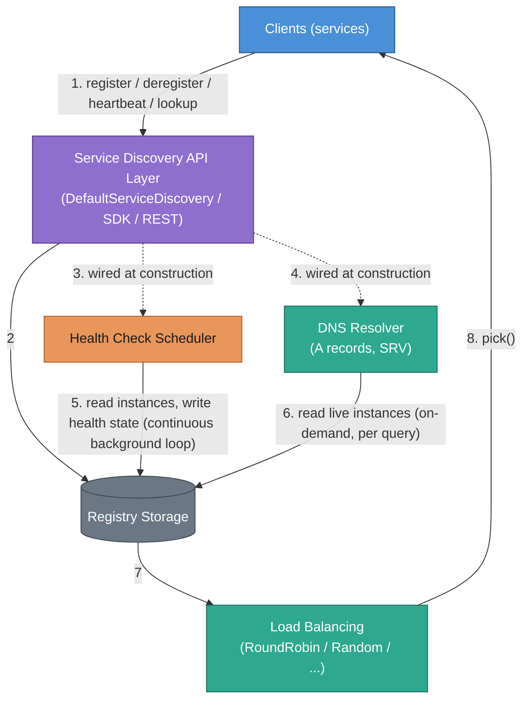
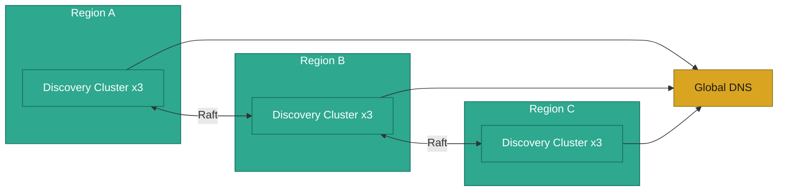
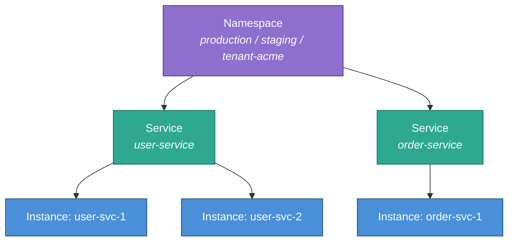
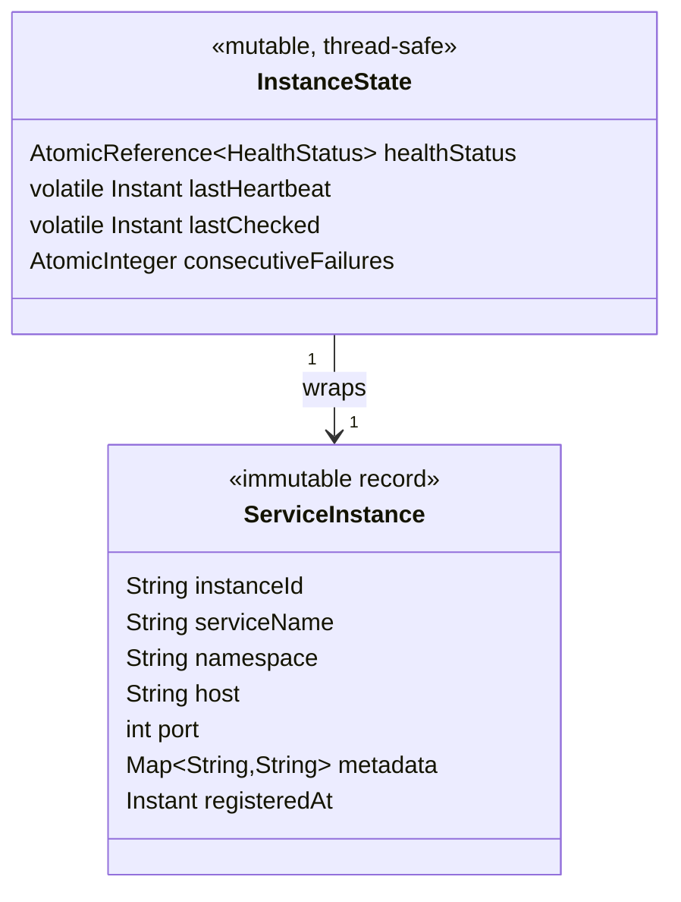
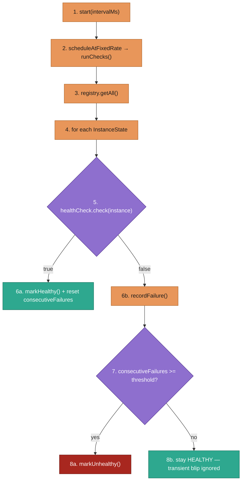
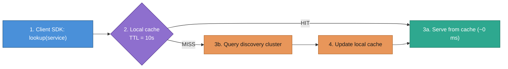
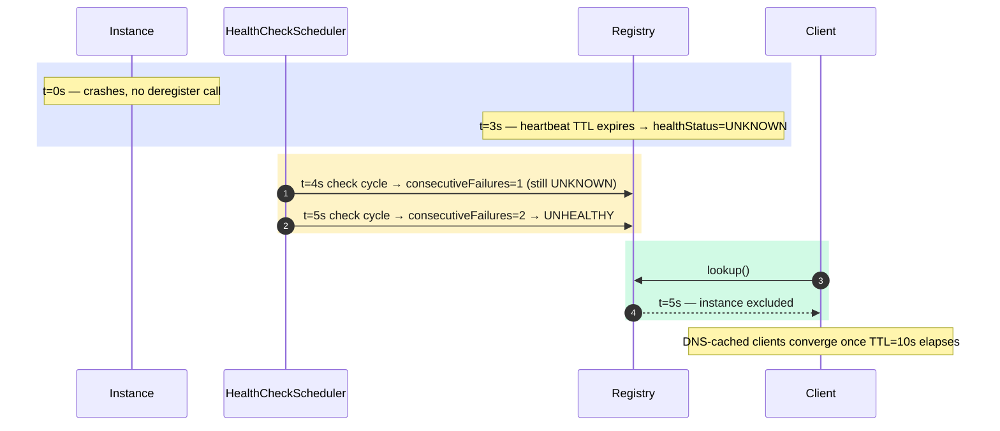
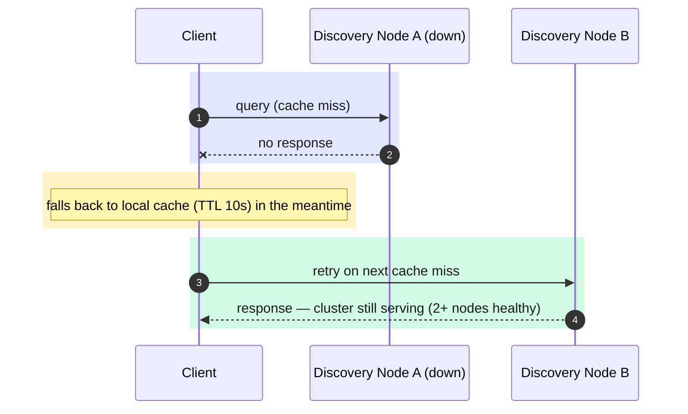
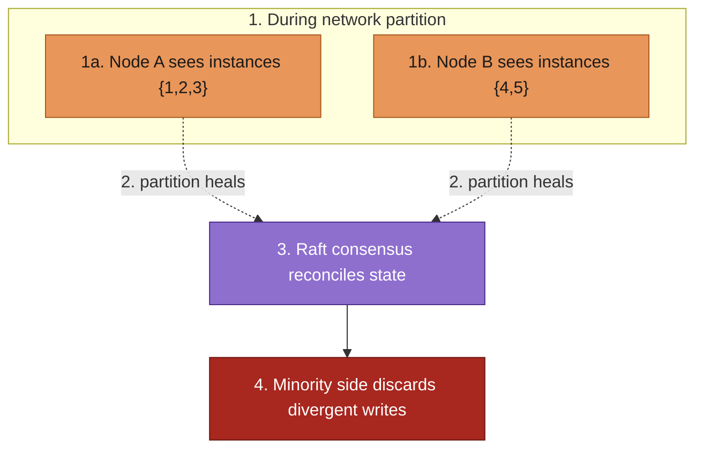

# Internal Service Discovery Platform — Design Document

**Use case**: An internal platform analogous to AWS Cloud Map — enabling microservices to
register themselves, be health-checked, and be found by peers via lookup or DNS. Target
scale: **millions of instances** across thousands of services.

All diagrams below are written in [Mermaid](https://mermaid.js.org/) rather than ASCII
art, so they render natively on GitHub/GitLab and stay text-diffable in version control.
Each diagram is followed by a short "How to read this diagram" note explaining the
flow, not just the boxes.

---

## Table of Contents

1. [Requirements](#1-requirements)
2. [High-Level Architecture](#2-high-level-architecture)
3. [Data Model](#3-data-model)
4. [Component Deep Dives](#4-component-deep-dives)
5. [Scale Strategy](#5-scale-strategy)
6. [Consistency & Availability Trade-offs](#6-consistency--availability-trade-offs)
7. [Health Check Engine](#7-health-check-engine)
8. [DNS Integration](#8-dns-integration)
9. [Load Balancing](#9-load-balancing)
10. [Failure Scenarios](#10-failure-scenarios)
11. [Design Patterns Used](#11-design-patterns-used)
12. [In-Memory vs. Production Gaps](#12-in-memory-vs-production-gaps)

---

## 1. Requirements

### Functional
| Capability      | Description                                                          |
|-----------------|----------------------------------------------------------------------|
| Register        | Service instance announces itself (host, port, metadata, namespace) |
| Deregister      | Explicit removal on graceful shutdown                                |
| Heartbeat       | Periodic keepalive to reset the TTL clock                           |
| Lookup          | Return healthy instances for a given namespace + service name        |
| Health checks   | Passive (heartbeat TTL) and active (TCP/HTTP probe)                 |
| DNS support     | Synthesise A and SRV records from the live registry                 |
| Namespacing     | Logical isolation (e.g., production / staging / tenant-xyz)         |
| Metadata filter | Route by version, canary flag, availability zone, etc.              |

### Non-Functional
- **Scale**: millions of instances, thousands of services
- **Latency**: lookup P99 < 5 ms; DNS query < 10 ms
- **Availability**: 99.99% uptime; control plane failures must not block data plane
- **Consistency**: eventual — stale data for up to TTL seconds is acceptable
- **Throughput**: 100k registrations/sec, 1M lookups/sec per cluster

---

## 2. High-Level Architecture

### Request flow



**How to read this diagram:** The API layer is the only thing clients talk to — it is
a [Facade](#11-design-patterns-used) over three independent subsystems that all share
one `Registry`. The `Health Check Scheduler` runs continuously in the background
regardless of client traffic, mutating instance health state directly in the registry.
`DNS Resolver` never caches — every query re-reads the registry, so DNS answers are
only as stale as the registry's own consistency window. `Load Balancing` operates on
whatever `lookup()` returns (already health-filtered), so a strategy never needs to
know about health state itself.

**Sequence:**
1. Client calls the API — `register`, `deregister`, `heartbeat`, or `lookup`.
2. The API delegates the call directly to the `Registry` (storage layer).
3. At construction time, the API wires the `Health Check Scheduler` with a reference to the registry — this is one-time wiring, not a per-call step.
4. Likewise, the API wires the `DNS Resolver` with a registry reference at construction.
5. Independently of any client call, the scheduler loops forever on its own timer: read every instance, probe it, write back updated health state.
6. Whenever a DNS query (`resolveA` / `resolveSrv`) arrives, the resolver reads the registry fresh — nothing is cached server-side.
7. For a `pick()` call, the registry's already health-filtered instance list is handed to the load-balancing strategy.
8. The strategy picks one instance and the API returns it to the caller.

### Production cluster layout (3+ regions)



**How to read this diagram:** Each region owns an independent 3-node cluster
replicated via Raft, so a region keeps serving writes even if the other two are
unreachable (partition tolerance — see [§6](#6-consistency--availability-trade-offs)).
Global DNS sits above all three clusters and is the only cross-region coupling on the
read path: a client resolving `user-service.production.svc.discovery` gets routed to
its nearest healthy region, not to a specific node. There is deliberately no
cross-region Raft quorum — that would make every write pay a multi-region round trip,
defeating the point of regional isolation.

---

## 3. Data Model

### Hierarchy



**How to read this diagram:** Three levels, always traversed top-down. A namespace
gives full tenant/environment isolation — two namespaces can register a service with
the same name without colliding. A lookup always specifies namespace + service name;
there is no cross-namespace query, which keeps the registry's key space a simple
three-level tree instead of a general graph.

### Why split `ServiceInstance` and `InstanceState`?



**How to read this diagram:** `InstanceState` wraps a `ServiceInstance` rather than
extending or merging with it. Keeping the registration record immutable avoids the
need to serialise/deserialise it on every health check update — only the small mutable
`InstanceState` shell is touched every check cycle. The registry can swap the health
status without touching the registration data at all. In a distributed system this
maps onto two different replication paths: registration data is durably stored in the
KV store, while health state is volatile, gossip-propagated data that is allowed to be
lost and rebuilt from scratch.

### Key structure

```
{namespace} / {serviceName} / {instanceId}  →  InstanceState
```

This three-level key structure enables:
- Full scan of a namespace for monitoring
- Fast lookup by service (most common query path)
- Direct get for heartbeat / health update

---

## 4. Component Deep Dives

### 4.1 ServiceRegistry

The storage interface is pure CRUD. The in-memory implementation uses:

```
ConcurrentHashMap<namespace,
  ConcurrentHashMap<serviceName,
    ConcurrentHashMap<instanceId, InstanceState>>>
```

**Write path** (register): `computeIfAbsent` at each level ensures maps are created
exactly once under concurrent load without explicit locking.

**Read path** (lookup): Iterates `values()` of the service map. `ConcurrentHashMap.values()`
returns a weakly consistent view — reads proceed without blocking writes.

**Deregister with pruning**: After removing an instance, if the service map is empty it
is removed to prevent unbounded memory growth over time.

### 4.2 InstanceState Thread Safety

| Field               | Concurrency mechanism   | Reason                                    |
|---------------------|-------------------------|-------------------------------------------|
| healthStatus        | AtomicReference         | CAS swap — no lost updates under contention|
| lastHeartbeat       | volatile                | Single writer (heartbeat caller); volatile ensures visibility to all readers |
| lastChecked         | volatile                | Single writer (health scheduler); same as above |
| consecutiveFailures | AtomicInteger           | Incremented by health thread, reset on recovery |

### 4.3 Health Check Scheduler



**How to read this diagram:** Every check cycle re-evaluates every instance
independently — a slow or failing instance never blocks the check of another. The
diamond in the middle is the hysteresis point: a single failed probe does not flip an
instance to UNHEALTHY, only `threshold` consecutive failures do, which is what keeps
a momentary network blip from yanking a healthy instance out of rotation.

**Sequence:**
1. `start(intervalMs)` runs once, when the platform starts.
2. The scheduler registers `runChecks()` on a fixed-rate timer.
3. Each cycle begins by pulling every `InstanceState` from the registry.
4. The scheduler iterates instances one at a time — independently, so one slow check never blocks another.
5. Each instance is probed via the injected `HealthCheck` strategy.
6a. On success: reset `consecutiveFailures` to 0 and mark the instance HEALTHY.
6b. On failure: increment `consecutiveFailures`.
7. After a failed probe, check whether the failure count has crossed the configured threshold.
8a. Threshold crossed → mark the instance UNHEALTHY; it drops out of `lookup()` / `pick()`.
8b. Threshold not yet crossed → leave it HEALTHY; a single blip is ignored (hysteresis).

**Failure threshold** prevents a single transient failure from pulling an instance out
of rotation. Default: 2 consecutive failures → UNHEALTHY.

**Thread pool**: daemon threads so the JVM can exit cleanly without `shutdown()`.

### 4.4 DNS Resolver

Records are synthesised on-demand from the live registry, not cached. This means DNS
queries always reflect the current health state (minus the client-side TTL cache).

```
A record:    user-service.production.svc.discovery → 10.0.1.1
             user-service.production.svc.discovery → 10.0.1.2  (multi-A)
SRV record:  _user-service._tcp.production.svc.discovery → 10.0.1.1:8080 pri=10 wt=10
```

### 4.5 Load Balancing

| Strategy    | State             | Use case                                   |
|-------------|-------------------|--------------------------------------------|
| RoundRobin  | AtomicLong counter| General purpose, even distribution         |
| Random      | ThreadLocalRandom | Fan-out, cache, stateless callers          |
| WeightedRR  | (not shown)       | Canary: route 5% to new version via weight |
| ConsistHash | (not shown)       | Session affinity, request coalescing       |

---

## 5. Scale Strategy

### 5.1 Partitioning (sharding)

At millions of instances, a single node cannot hold all state in memory. Shard by namespace:

```
shard_id = hash(namespace) % num_nodes
```

Each shard node owns a partition of the namespace space. Clients route to the correct
shard using consistent hashing (no central coordinator needed for routing).

### 5.2 Distributed storage

Replace `InMemoryServiceRegistry` with an etcd-backed implementation:

```
etcd key:   /discovery/{namespace}/{service}/{instanceId}
etcd value: JSON(ServiceInstance) + lease_id

Lease ID: auto-expiring lease attached to each key. If the service crashes without
deregistering, etcd expires the key when the lease TTL passes.
```

**etcd watch** enables push-based invalidation: discovery nodes subscribe to
`/discovery/{namespace}/*` and update their local cache when instances change.
This eliminates polling and reduces propagation latency from O(check_interval) to O(ms).

### 5.3 Caching layer



**How to read this diagram:** The cache check happens entirely client-side before any
network call — a hit never touches the discovery cluster. Local caching absorbs 99%+
of lookup traffic this way; the discovery cluster only receives cache misses and
watch-triggered invalidations, which is what lets a single cluster serve millions of
lookups/sec without scaling linearly with client count.

**Sequence:**
1. The client SDK receives a `lookup(service)` call.
2. It checks its local cache first (TTL = 10s).
3a. HIT → serve the cached result immediately, no network call.
3b. MISS → query the discovery cluster over the network.
4. The fresh result is written into the local cache before being returned, so the next call — until TTL expires — takes the HIT path.

### 5.4 Read replicas

Separate write-optimised leader nodes from read-optimised follower nodes. Followers
receive replication from the leader and serve all lookup / DNS queries. Only register /
deregister hit the leader.

---

## 6. Consistency & Availability Trade-offs

### Major design decisions — what was traded away

Every non-trivial choice below picked one property at the direct cost of another.
This is the decision log; the CAP discussion further down is the biggest single
instance of it.

| Decision | Chosen | Alternative(s) considered | What was traded away |
|---|---|---|---|
| Consistency model | AP — eventual consistency | CP — linearizable registry (ZooKeeper-style) | Strict consistency, in exchange for availability during partitions. A CP registry would reject reads/writes during a split; this platform serves stale data instead. See CAP position below. |
| Change propagation (this impl) | Polling at a fixed interval | Push/watch (etcd watch, gossip) | Propagation latency — O(check interval) instead of O(ms) — in exchange for zero external dependency. Tracked as a production gap in [§12](#12-in-memory-vs-production-gaps). |
| Health detection (primary signal) | Heartbeat TTL (passive) | Active probing only (TCP/HTTP from the cluster) | Depth of health signal — a heartbeat only proves the process is alive, not that it's actually serving — in exchange for working behind NAT/firewalls and O(1) cost per instance regardless of network topology. |
| Failure threshold | N consecutive failures before UNHEALTHY | Single failed check → UNHEALTHY immediately | Detection latency (2 check cycles minimum) in exchange for immunity to flapping from one transient network blip. |
| Storage backend (this impl) | In-memory `ConcurrentHashMap` | Embedded persistent store (RocksDB, etc.) | Durability — state is lost on JVM restart — in exchange for implementation simplicity at demo scale. Production path is etcd/Consul ([§5.2](#5-scale-strategy)). |
| Default load-balancing strategy | RoundRobin | Least-connections, consistent hashing | Load awareness — RoundRobin doesn't know which instance is actually least loaded — in exchange for zero telemetry dependency: it needs nothing but a counter. |
| Where load balancing happens | Both client-side (`lookup()`) and server-side (`pick()`) | Proxy-only (Envoy/NGINX sidecar) | Centralized, infra-level LB control in exchange for a library that works standalone without requiring a service mesh. [§9](#9-load-balancing) documents the proxy option as the production-common alternative. |
| Sharding key | Namespace | Service name or instance ID | Even shard distribution (some namespaces are far bigger than others) in exchange for keeping "list every service in this namespace" a single-shard query instead of scatter-gather. |
| DNS record freshness | Synthesize on every query, no server-side cache | Cache resolved records server-side | A small amount of CPU per query in exchange for not introducing a second staleness window on top of the client's own DNS TTL cache. |
| `ServiceInstance` / `InstanceState` split | Two objects, one immutable one mutable | Single mutable object holding everything | A slightly larger object graph in exchange for letting registration data (durable) and health data (fast, lossy) travel on two different replication paths — see [§3](#3-data-model). |

### CAP theorem position

This platform is **AP (Available + Partition-tolerant)**:
- During network partition, nodes serve stale (pre-partition) data rather than failing
- Consistency is eventual: data converges when the partition heals
- TTL bounds the staleness window

### Acceptable staleness

```
Max staleness = max(DNS TTL, heartbeat TTL, replication lag)
              ≈ max(10s, 3s, 50ms) = 10s (DNS-dominated)
```

For most microservice traffic, 10 seconds of stale routing is acceptable. For strict
consistency (e.g., auth token validation), use a direct registry read, not cached DNS.

### Failure modes

| Failure              | Impact                                      | Mitigation                         |
|----------------------|---------------------------------------------|------------------------------------|
| Discovery node crash | Clients use cached data                     | Multiple replicas behind VIP/LB    |
| Network partition    | Stale lookups; new registrations drop       | Client-side retry + fallback cache |
| etcd leader election | 100–500ms write pause                       | Read replicas unaffected           |
| Health check threads slow | Slow convergence to UNHEALTHY         | Larger thread pool; async checks   |
| DNS TTL too high     | Traffic to dead instances for up to TTL     | Lower TTL (5–10s) for critical svcs|

---

## 7. Health Check Engine

### Check types and selection guide

| Type | Use when |
|---|---|
| Heartbeat TTL | Instance controls its own heartbeat; works behind NAT |
| TCP connect | Port must be open; no app-level health guarantee |
| HTTP /health | App-level readiness (connection pool ready, migrations done) |
| gRPC Health | gRPC services; standard Health Checking Protocol |
| Command exec | Custom scripts, legacy systems |

### Defence-in-depth (recommended for production)

Layer multiple checks: heartbeat TTL as the fast path (catches crash), TCP connect as
the secondary path (catches zombie processes holding the port), HTTP /health as the deep
check (catches deadlocked threads, full queues, dependency failures).

### Failure threshold algorithm

```
check_result = probe(instance)
if check_result == PASS:
    consecutive_failures = 0
    status = HEALTHY
else:
    consecutive_failures += 1
    if consecutive_failures >= threshold:
        status = UNHEALTHY
    // else: still HEALTHY — transient blip ignored
```

Hysteresis: require N successive successes before recovering from UNHEALTHY (prevents
flapping). Not shown in this implementation but easy to add with a `consecutiveSuccesses`
AtomicInteger.

---

## 8. DNS Integration

### Domain naming convention

```
A record:    {service}.{namespace}.svc.discovery
SRV record:  _{service}._tcp.{namespace}.svc.discovery
```

### Multi-A record load balancing

Returning all healthy IPs in an A record lets clients use OS-level random selection
(or their HTTP client's built-in LB). Combined with a low TTL this spreads load evenly
without requiring client-side LB logic.

### SRV record priority / weight

SRV records carry routing hints that allow clients to implement:
- **Priority groups**: primary instances (priority=10) are tried before standby (priority=20)
- **Weighted routing**: canary instance at weight=5 receives 5/(5+95)=5% of traffic

### Integration path for CoreDNS

```yaml
# Corefile
.:53 {
    forward . /etc/resolv.conf
}

svc.discovery:53 {
    grpc . localhost:9053   # discovery platform exposes gRPC DNS backend
    log
    cache 10
}
```

The discovery platform implements the CoreDNS `external` gRPC plugin protocol, so
CoreDNS forwards `.svc.discovery` queries to the platform and caches responses.

---

## 9. Load Balancing

### Where to balance

```mermaid
flowchart TB
    subgraph A["Option A — Server-side pick()"]
        direction LR
        C1["Client"] -- "1. pick()" --> P1["2. Discovery Platform<br/>chooses one instance"] -- "3. 1 endpoint" --> C1
    end
    subgraph B["Option B — Client-side lookup()"]
        direction LR
        C2["Client"] -- "1. lookup()" --> P2["2. Discovery Platform"] -- "3. list of instances" --> SDK["4. SDK applies LB locally"]
    end
    subgraph C["Option C — L4/L7 proxy"]
        direction LR
        C3["Client"] -- "1" --> Proxy["Envoy / NGINX"] -- "2. routes request" --> Backends["Discovered backends"]
    end

    classDef optionA fill:#e8965a,stroke:#a85c1f,color:#1a1a1a
    classDef optionB fill:#2ea88f,stroke:#146b58,color:#ffffff
    classDef optionC fill:#8e6fce,stroke:#4d2e8a,color:#ffffff
    class C1,P1 optionA
    class C2,P2,SDK optionB
    class C3,Proxy,Backends optionC
```



**How to read this diagram:** The three options trade a round trip for control. Option
A costs an extra network hop per pick but lets the platform apply global load
information (e.g. real-time connection counts) that a client can't see. Option B skips
that hop — the SDK balances locally over a list it already cached — at the cost of
each client only seeing point-in-time snapshots. Option C removes load-balancing logic
from application code entirely by pushing it into infrastructure the client doesn't
control.

**Sequence — Option A:**
1. Client calls `pick()` on the discovery platform.
2. The platform itself chooses one instance (server-side decision).
3. Exactly one endpoint is returned to the client.

**Sequence — Option B:**
1. Client calls `lookup()`.
2. The platform returns the full list of healthy instances.
3. The list travels back over the network to the client.
4. The SDK applies its load-balancing strategy locally — no further round trip per pick.

**Sequence — Option C:**
1. Client connects to a proxy (Envoy/NGINX) instead of the discovery platform directly.
2. The proxy, which already watches the discovered backends, routes the request itself.

This implementation provides **Option A** via `pick()` and **Option B** via `lookup()`.
Option C is the most production-common pattern — the discovery platform integrates
with Envoy via xDS API or with NGINX via the NGINX Plus Service Discovery module.

### Consistent hashing (not shown — design sketch)

```java
// Key idea: map the request onto a hash ring
long requestHash = hash(sessionId or userId);
ServiceInstance pick = ring.higher(requestHash);  // clockwise lookup
// same caller → same instance → warm local cache on target
```

Use when: stateful services where the same caller must reach the same backend
(e.g., session stores, per-user caches, WebSocket connections).

---

## 10. Failure Scenarios

### Instance crash (no graceful deregister)



**How to read this diagram:** Two clocks run independently and the slower one
dominates the outage window. The heartbeat TTL (3s) plus two check cycles (1s each)
gets `lookup()` to exclude the dead instance by t=5s. But any client holding a cached
DNS answer from before the crash keeps routing to it until its own TTL (10s) expires —
that's why the total outage window below is DNS-dominated, not health-check-dominated.

**Sequence** (Mermaid `autonumber` numbers only the arrows; the `Note` lines are context, not steps):
- *(t=0s, before step 1)* The instance crashes without calling `deregister()`.
- *(t=3s, before step 1)* The heartbeat TTL expires; the registry marks the instance `UNKNOWN`.
1. *(t=4s)* First scheduled check cycle probes the instance and fails — `consecutiveFailures=1`, still `UNKNOWN`.
2. *(t=5s)* Second consecutive failure crosses the threshold (2) — the instance flips to `UNHEALTHY`.
3. A client calls `lookup()` for the service.
4. *(t=5s)* The registry returns the healthy list with the dead instance already excluded.
- *(after step 4)* Clients holding a cached DNS answer keep routing to the dead instance until their own TTL (10s) elapses — this is what makes the total outage window DNS-dominated.

**Total outage window**: up to 5s for lookup + 10s for DNS-cached clients = 15s max.

### Discovery cluster node failure



**How to read this diagram:** The client never notices a clean failover as an outage
because the local cache absorbs the gap between "Node A stopped responding" and "client
retried against Node B." The only case this doesn't cover is every node in the cluster
being down simultaneously, which is why clusters run 3+ nodes rather than 2.

**Sequence:**
1. Client queries Node A after a local cache miss.
2. Node A doesn't respond — it's the failed node.
   - *(between steps 2 and 3)* The client falls back to serving from its local cache (TTL 10s) rather than surfacing an error.
3. On the next cache miss, the client retries against Node B.
4. Node B answers normally — the cluster keeps serving uninterrupted because 2+ nodes are still healthy.

### Split-brain during network partition



**How to read this diagram:** Both sides of the partition keep serving reads and
writes — that's the AP choice from [§6](#6-consistency--availability-trade-offs) —
which is why clients on each side see *different but both available* subsets during
the split. The dotted arrows mark the point where Raft consensus resumes: whichever
side had the minority of nodes at healing time loses any writes that conflict with the
majority side's history.

**Sequence:**
1a/1b. While partitioned, Node A and Node B each keep serving their own (different) view of the registry — both remain available, per the AP choice.
2. Once the network partition heals, both nodes attempt to reconcile via Raft.
3. Raft consensus determines the authoritative state from the majority side.
4. Whichever side was the minority during the partition discards any writes that conflict with the majority's history.

For service discovery (eventual consistency tolerated), partition-time divergence is
acceptable. Registration on the minority side may need to be re-submitted after healing.

---

## 11. Design Patterns Used

| Pattern           | Where                             | Why                                                       |
|-------------------|-----------------------------------|-----------------------------------------------------------|
| **Strategy**      | `HealthCheck`, `LoadBalancingStrategy` | Swap check type / LB algorithm without changing coordinator |
| **Builder**       | `DefaultServiceDiscovery.Builder` | Many optional configuration parameters                    |
| **Facade**        | `DefaultServiceDiscovery` / `ServiceDiscovery` | Single entry point hides internal component graph |
| **Repository**    | `ServiceRegistry`                 | Separates data access from business logic                 |
| **Observer/Watch**| (production: etcd watch)          | Push invalidation instead of polling                      |
| **Immutable VO**  | `ServiceInstance`, `DnsRecord`, `LookupQuery` | Thread-safe sharing without locking           |
| **Composite check** | Layer Heartbeat + TCP + HTTP    | Defence-in-depth; each layer catches different failure mode |

---

## 12. In-Memory vs. Production Gaps

| Concern                  | This implementation          | Production implementation                 |
|--------------------------|------------------------------|-------------------------------------------|
| Storage                  | ConcurrentHashMap            | etcd / Consul KV with Raft replication    |
| Persistence              | None (lost on JVM restart)   | etcd WAL + snapshots                      |
| Crash detection TTL      | Heartbeat check in scheduler | etcd lease auto-expiry                    |
| Change propagation       | Polling (check interval)     | etcd watch → pub/sub → near-instant       |
| Scale                    | Single JVM, ~100k instances  | Sharded cluster, millions of instances    |
| Multi-region             | None                         | Raft groups per region; global DNS        |
| Authentication           | None                         | mTLS between instances and discovery      |
| Audit log                | None                         | Append-only event log per namespace       |
| Metrics                  | stats() map                  | Prometheus metrics, Grafana dashboards    |
| DNS server               | Resolver class (no server)   | CoreDNS plugin or PowerDNS backend        |
| Service mesh integration | None                         | xDS API (Envoy), SMI (service mesh APIs)  |

---

## Running the Demo

```bash
# From the CodingPractice root
./gradlew run
```

Expected output sequence:
1. Registration of 10 instances across 3 services
2. Health check startup — all instances become HEALTHY via heartbeat
3. 2 user-service instances stop heartbeating → become UNHEALTHY
4. Lookup returns only 3 healthy user-service instances
5. DNS A records for user-service (3 IPs)
6. DNS SRV records for order-service (3 endpoints with port 9090)
7. Round-robin picks cycling through healthy instances
8. Random picks for order-service
9. Deregistration of one order-service instance
10. Final statistics dashboard
