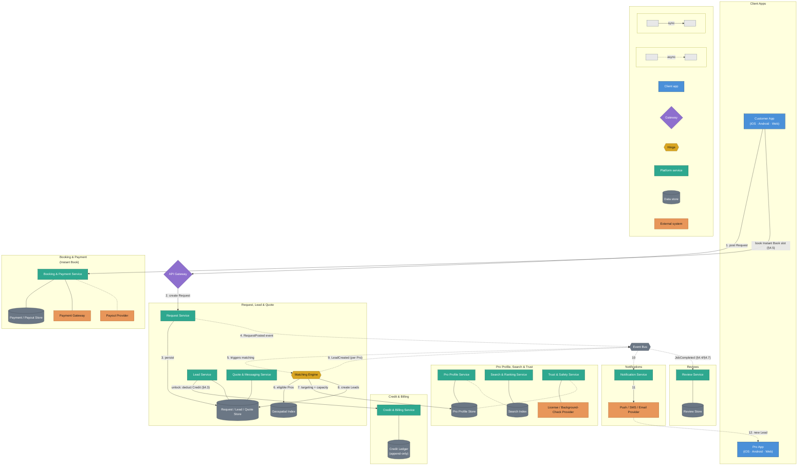
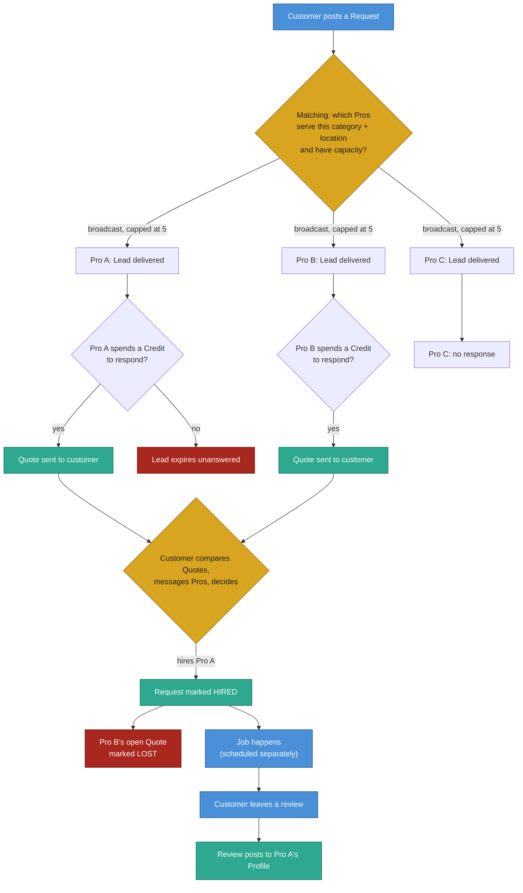
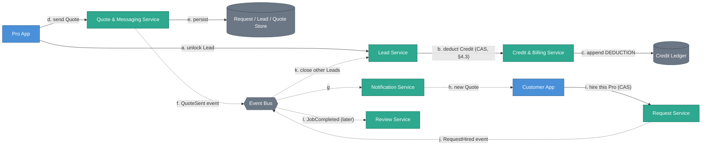
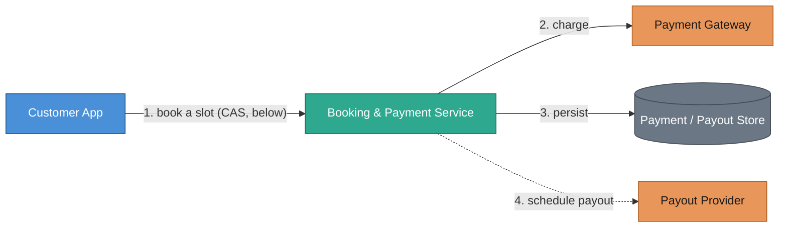

# Local Services Marketplace — Design Document

**Use case:** A two-sided marketplace connecting **Customers** who need a
local service performed (cleaning, plumbing, photography, tutoring, event
DJs, personal training, ...) with **Pros** — independent service
professionals and small businesses who perform that work.

All diagrams below are written in [Mermaid](https://mermaid.js.org/) so
they render natively on GitHub/GitLab and stay text-diffable in version
control. Each non-trivial diagram is followed by a short walkthrough, not
just the boxes.

---

## Table of Contents

1. [Requirements](#1-requirements)
   - [1.1 The Core Matching Model](#11-the-core-matching-model)
   - [1.2 Glossary](#12-glossary)
   - [1.3 Actors](#13-actors)
   - [1.4 Functional Requirements](#14-functional-requirements)
   - [1.5 Non-Functional Requirements](#15-non-functional-requirements)
   - [1.6 Client Platform Scope](#16-client-platform-scope)
   - [1.7 Trust & Safety Requirements](#17-trust--safety-requirements)
   - [1.8 Explicitly Out of Scope](#18-explicitly-out-of-scope)
2. [High-Level Architecture](#2-high-level-architecture)
3. [Domain Model](#3-domain-model)
4. [Core Capability Deep Dives](#4-core-capability-deep-dives)
   - [4.1 Posting a Request](#41-posting-a-request)
   - [4.2 Matching Requests to Pros — the Lead Lifecycle](#42-matching-requests-to-pros--the-lead-lifecycle)
   - [4.3 Credit Deduction & Idempotency](#43-credit-deduction--idempotency)
   - [4.4 Quoting, Messaging & Hiring](#44-quoting-messaging--hiring)
   - [4.5 Instant Book](#45-instant-book)
   - [4.6 Monetization — Two Genuinely Different Models](#46-monetization--two-genuinely-different-models)
   - [4.7 Reviews & Rating Aggregation](#47-reviews--rating-aggregation)
   - [4.8 Pro Search & Ranking](#48-pro-search--ranking)
5. [Scalability](#5-scalability)
6. [Consistency & Availability Trade-offs](#6-consistency--availability-trade-offs)
7. [Observability](#7-observability)
8. [Failure Scenarios](#8-failure-scenarios)
9. [Design Patterns Used](#9-design-patterns-used)
10. [Extensibility](#10-extensibility)
11. [Major Design Decisions & Trade-offs](#11-major-design-decisions--trade-offs)
12. [Proposed Package Layout](#12-proposed-package-layout)

---

## 1. Requirements

### 1.1 The Core Matching Model

Before anything else, the shape of the marketplace itself needs to be
stated precisely, because it's easy to default to assuming a system like
this "assigns" a Pro the way a dispatch system would. It doesn't. The
actual model is **broadcast, then self-select, then the customer
decides**:

- A posted Request is **broadcast** to every Pro who matches on category,
  location, and capacity — not routed to a single best candidate.
- Multiple Pros can **independently and simultaneously** respond to the
  same Request with their own Quote. That's the intended behavior, not a
  race condition to be prevented.
- The **customer** — a human, comparing Quotes, profiles, and messages —
  decides who to hire. The platform never picks a winner on the
  customer's behalf.
- A job spans **hours to weeks**, not minutes: a Request can sit open
  collecting Quotes for days before anyone is hired, and the work itself
  happens on a separately scheduled date, well after the matching moment.
- The **Pro** sets the price on their own Quote; the platform doesn't
  compute job pricing itself, except in the Instant Book flow (§4.5/§4.6).
- There is no live location tracking of either party. "Real-time" in this
  system means fast Lead notification, not a moving position on a map.

Every requirement, and every architecture decision below, is built around
"broadcast + self-select + customer chooses" as the organizing principle —
not around reserving a single scarce resource. (Two real exceptions to
that exist — hiring and Instant Book — and they get called out precisely
where they come up: §4.4 and §4.5.)

### 1.2 Glossary

Specific terminology used consistently through the rest of this document:

| Term | Meaning |
|---|---|
| **Request** (or **Project**) | A customer's description of the job they need done — category, answers to a category-specific questionnaire, location, and rough timing. The unit of work a Pro responds to. |
| **Lead** | A Request as seen from the Pro's side, once it's been matched/delivered to them. One Request can become many Leads (one per matched Pro). |
| **Quote** | A Pro's priced response to a Lead — an offer to do the described job for a stated price (or price range), sent back to the customer. |
| **Instant Book** | A category-specific alternate flow where a Pro publishes fixed pricing and open calendar slots up front, and a customer can book a specific slot directly — no quote/negotiation step. |
| **Credit** | The unit a Pro spends to unlock a Lead's full details and respond to it, in categories that use lead-based pricing (§4.6). Purchased in bundles or via subscription. |
| **Hire** | The customer's action of accepting one Pro's Quote (or completing an Instant Book), which closes out that Request as far as other Pros are concerned. |
| **Pro Profile** | A Pro's public-facing page: services offered, service area, pricing info, portfolio photos, credentials/verification badges, reviews, response-time stats. |
| **Verified Pro** | A Pro who has passed identity verification and, where applicable, license/insurance/background-check checks for their category. |

### 1.3 Actors

| Actor | Description |
|---|---|
| **Customer** | Wants a job done. Posts Requests and/or browses Pro profiles directly, receives Quotes, messages Pros, hires one, pays (directly or via the platform depending on category), leaves a review after the job. |
| **Pro** | An individual or small business performing the work. Maintains a Profile, sets a service area and category targeting preferences, receives Leads, sends Quotes, manages a calendar for Instant Book, responds to reviews. |
| **Platform (this system)** | Matches Requests to relevant Pros, distributes Leads, brokers messaging, runs the credit/subscription economy for lead-based categories, processes payment for Instant Book jobs, hosts reviews, verifies Pro credentials. |

The platform's own role is **distribution and trust** — surfacing the
right Requests to the right Pros and giving the customer enough signal to
choose safely — not **assignment**. There's no point in this system's
lifecycle where the platform itself commits a Pro to a job (Instant Book,
§4.5, is the one place it commits a *slot*, which is a narrower thing).

### 1.4 Functional Requirements

| # | Capability | Description |
|---|---|---|
| F1 | Post a Request | Customer picks a category, answers a dynamic, category-specific questionnaire (e.g., "House Cleaning" asks square footage and frequency; "Wedding Photography" asks guest count and date), and provides location + rough timing. |
| F2 | Browse/search Pros directly | Customer can search and view Pro profiles by category + location without posting a Request first — the entry point for both proactive browsing and Instant Book. |
| F3 | Match Request → Pros | The platform identifies Pros who serve that category, cover that location, and have capacity/targeting matching the Request, and delivers it to them as a Lead. |
| F4 | Deliver Leads to Pros | Matched Pros are notified of a new Lead (push/email/SMS) and can view its details, gated by category monetization rules (§4.6). |
| F5 | Send a Quote | A Pro responds to a Lead with a priced offer and/or message. Multiple Pros can quote the same Request independently — no exclusivity until hired. |
| F6 | In-app messaging | Customer and Pro exchange messages tied to a specific Request/Lead — before hiring (clarifying scope, negotiating), and after (scheduling, day-of coordination). |
| F7 | Instant Book | For eligible categories, a customer books a specific Pro's specific published time slot directly, skipping F5/F6 entirely. |
| F8 | Hire a Pro | Customer accepts one Quote (or completes an Instant Book). The Request is marked hired; other Pros' open Leads for it are marked closed/lost. |
| F9 | Reviews & ratings | After a job, the customer leaves a star rating, written review, and optionally photos, tied to that specific completed Request. Reviews aggregate onto the Pro's Profile over time. |
| F10 | Pro Profile management | A Pro maintains services offered, service area (radius or explicit zip/city list), starting price info, portfolio photos, credentials, business hours, and years in business. |
| F11 | Pro targeting preferences | A Pro sets what kinds of Leads they want to receive — budget range, job size, specific sub-categories — to avoid being shown Leads they'd never quote on. |
| F12 | Pro search ranking | Both direct Pro search (F2) and Lead-matching (F3) rank Pros using a combination of relevance, rating, responsiveness/reply rate, and (for lead-based categories) how competitively they've targeted that Lead type. |
| F13 | Credit/subscription economy | Pros in lead-based categories purchase Credits (à la carte or via a subscription with an included allotment) and spend them to unlock and respond to Leads. |
| F14 | Instant Book payment | For Instant Book jobs, the platform charges the customer's saved payment method and remits the Pro's share (minus a platform service fee) — the one case where the platform *does* touch job payment directly. |
| F15 | Lead refund / dispute | A Pro can dispute and request a Credit refund for a Lead that turns out to be fraudulent, wildly outside their service area, or unresponsive after repeated contact attempts — **not** simply for losing a fair Quote to another Pro (§4.6). |
| F16 | Request cancellation | A customer can withdraw an open Request; all Pros with an open Lead against it are notified it's no longer available. |
| F17 | Notifications | Push/email/SMS to Pros for new matching Leads and new messages; to customers for new Quotes, messages, and Instant Book confirmations. |

### 1.5 Non-Functional Requirements

| Concern | Target |
|---|---|
| Lead delivery latency | A posted Request should reach every matching Pro's notifications within seconds, not minutes — Pros compete on response speed, so slow delivery directly costs them Leads |
| Search/browse latency | Direct Pro search (F2) should return results in a few hundred ms even against a large, geographically dense Pro catalog |
| Consistency | Strong for Credit deduction, Request-hire, and Instant Book slot booking — each is a real "never do this twice" invariant (§6); eventual for search ranking freshness, review-aggregate recomputation, and notification delivery |
| Availability | Request posting and Lead distribution must stay up through demand spikes (evenings and weekends are when most home-service demand actually happens — the opposite skew from many B2B systems) |
| Scale (reference, not a target SLA) | On the order of low-single-digit-millions of Requests/month platform-wide, hundreds of thousands of active Pros, each Request typically matching 3–10 Pros (see §5 for the capacity math this drives) |
| Trust & Safety | See [§1.7](#17-trust--safety-requirements) — load-bearing enough to warrant its own section given how much of this system's integrity depends on it |
| Data retention | Message history and reviews are durable and effectively permanent (reviews are the platform's core trust asset); Lead-matching signals can be pruned/aggregated after some retention window |

### 1.6 Client Platform Scope

Two distinct apps, each genuinely required on every major platform:

| App | iOS | Android | Web |
|---|---|---|---|
| **Customer App** | Must | Must | Must — category/location landing pages are a major organic-search acquisition channel in the real product, so Web isn't optional the way it might be for a pure mobile-first product |
| **Pro App** | Must | Must | Must — Pros commonly manage Leads and messaging from a desktop during business hours, not just on the go |

Neither side has a constraint that would rule out a platform outright —
there's no continuous background-tracking requirement on either app that
would make, say, a Web experience structurally incomplete.

### 1.7 Trust & Safety Requirements

The stakes here are higher than a simple account-plus-rating model can
cover: a Pro is often let into a customer's home, and a Request can sit
open for days before a human decision — there's more surface area for
fraud, and more time for it to happen in, than a single continuous session
would allow.

| Requirement | Why it matters here specifically |
|---|---|
| Pro identity verification | Baseline requirement before a Pro can receive any Lead |
| License / insurance / background-check verification, per category | Legally required for some categories (e.g., electrical, childcare); a real trust signal for others |
| Review authenticity | A review must be tied to an actual completed, hired Request — reviews-for-hire or review-gating (only showing positive ones) undermine the platform's core trust asset |
| Fraudulent-Lead detection | Because Pros pay for Leads (§4.6 Model A), a fake/spam Request is a direct financial harm to Pros, not just a wasted platform resource — a sharper incentive problem than a simple wasted-notification cost |
| Response-rate / quality signals feeding ranking (F12) | A Pro who never responds or delivers poor work should surface less often in matching, independent of anything explicit like a suspension |

### 1.8 Explicitly Out of Scope

Acknowledged as real, deliberately not designed further in this pass:

- Full fraud-detection ML pipeline (§1.7) — flagged as a requirement, not
  designed here; §4.2/§4.3 note where a simple rules-based check plugs in.
- Enterprise/franchise Pro accounts (multi-location businesses, team
  logins, centralized billing).
- Advertising/sponsored-placement products for Pros beyond the base
  Credit/subscription model.
- International/multi-currency support.
- A public API for third-party integrations (e.g., Pros syncing their own
  CRM).
- The actual ML/scoring internals of Pro ranking (F12) — §4.8 designs the
  *inputs and where ranking sits architecturally*, not the model itself.

---

## 2. High-Level Architecture



**How to read this diagram:** nodes are grouped by **who talks to whom**,
not by what kind of thing they are — each service sits in the same box as
the store(s) it actually owns (Request/Lead/Quote, Credit, Booking/Payment,
Pro Profile/Search/Trust, Reviews, Notifications), rather than every store
in the system being pulled into one shared data-layer box that every
service would otherwise need a long arrow to reach. What kind of thing a
node is (client, service, store, external system) is instead carried
entirely by color/shape (see the Legend), so it doesn't have to also be
carried by position. The one exception is the **Event Bus** — genuinely
shared by nearly everything, so it sits on its own between the Clients and
the domain boxes rather than being claimed by any one of them. There are
three visually distinct kinds of edge here, and that's deliberate:
**numbered arrows (1–12)** trace an actual sequence —
in this case the one flow worth walking step-by-step at the whole-system
level, a Request being posted and turning into delivered Leads — solid
where the caller waits on a reply (the Matching Engine waiting on the
Geospatial Index) and dashed where it publishes and moves on (every event
crossing the Bus). A third, unnumbered set of solid/dashed edges (into
`CreditSvc`, `BookingSvc`, and `ReviewSvc`) exists purely so those three
boxes don't read as disconnected from the rest of the system — each is one
representative link standing in for a fuller flow that has its own
dedicated diagram elsewhere (linked right on the edge label), not a flow
meant to be traced step-by-step here. **Plain lines with no arrowhead and
no number** are ownership facts, not a sequence — "this service's data
lives here" — and are intentionally the quietest thing on the page so they
don't compete with the numbered flow for attention. The **Matching
Engine** is the
hinge — the one component that has to read both "what does this Request
need" (from the Request Service) and "who's eligible and where" (from the
Geospatial Index and Pro Profile Store) to do its job, mirroring how a
hinge in any dispatch-shaped system works even though nothing here is
actually being dispatched. This diagram intentionally stops at Lead
delivery — what a Pro does with a delivered Lead (unlocking it, quoting,
getting hired) is its own flow with its own actors, and gets its own
focused diagram in [§4.4](#44-quoting-messaging--hiring) rather than being
layered into this one; the same is true of Instant Book in
[§4.5](#45-instant-book). Splitting them out is what keeps any single
diagram in this document to one story at a time.

---

## 3. Domain Model

| Entity | Key Fields | Notes |
|---|---|---|
| `Customer` | `customerId`, `name`, `email`, `phone`, `defaultPaymentMethodId` | Only needs a payment method on file for Instant Book (Model B) — never for lead-based categories |
| `Pro` | `proId`, `businessName`, `email`, `phone`, `verificationStatus`, `rating`, `yearsInBusiness` | `verificationStatus` gates Lead eligibility (§1.7) |
| `ProProfile` | `proId`, `categories[]`, `serviceAreaCenter`, `serviceAreaRadiusKm`, `startingPrice`, `portfolioPhotos[]`, `businessHours` | One Pro can serve multiple categories, each with its own targeting preferences (below) |
| `ProTargetingPreference` | `proId`, `categoryId`, `minBudget`, `maxJobSize`, `subCategories[]` | F11 — filters which Leads a Pro is even offered |
| `Category` | `categoryId`, `name`, `questionnaireSchema`, `monetizationModel` (`LEAD_BASED` \| `INSTANT_BOOK`) | The questionnaire schema is data, not code — see §4.1 |
| `Request` | `requestId`, `customerId`, `categoryId`, `answers` (schema-validated JSON), `location`, `desiredTiming`, `status`, `createdAt` | `status`: `OPEN → HIRED → COMPLETED` or `OPEN → CANCELLED` |
| `Lead` | `leadId`, `requestId`, `proId`, `status`, `creditCost`, `createdAt`, `unlockedAt` | `status`: `DELIVERED → UNLOCKED → QUOTED → (WON \| LOST \| EXPIRED)` |
| `Quote` | `quoteId`, `leadId`, `price`, `message`, `sentAt`, `status` | `status`: `PENDING → (ACCEPTED \| DECLINED \| EXPIRED)` |
| `Message` | `messageId`, `requestId`, `senderId`, `senderType`, `body`, `sentAt` | Threaded per Request, visible to the Request's customer and the specific Pro on each Lead |
| `CreditTransaction` | `transactionId`, `proId`, `type` (`PURCHASE` \| `DEDUCTION` \| `REFUND`), `amount`, `leadId` (nullable), `createdAt` | Append-only ledger — a Pro's balance is a derived sum, never mutated in place (§4.3) |
| `InstantBookSlot` | `slotId`, `proId`, `categoryId`, `startTime`, `endTime`, `price`, `status` | `status`: `OPEN → BOOKED` |
| `Booking` | `bookingId`, `slotId`, `customerId`, `proId`, `price`, `status`, `paymentId` | `status`: `CONFIRMED → COMPLETED` or `CONFIRMED → CANCELLED` |
| `Payment` | `paymentId`, `bookingId`, `amount`, `status`, `gatewayReference` | AR side of Instant Book — `bookingId` unique for idempotency, same discipline as the Credit Ledger |
| `Payout` | `payoutId`, `bookingId`, `proId`, `amount`, `status`, `providerReference` | AP side of Instant Book — `bookingId` unique, settles independently of `Payment` |
| `Review` | `reviewId`, `requestId`, `customerId`, `proId`, `rating`, `text`, `photos[]`, `createdAt` | One review per `(requestId, customerId)` — enforced at write time against `Request.status = COMPLETED` |

---

## 4. Core Capability Deep Dives

### 4.1 Posting a Request

Each category's intake questionnaire is genuinely different — square
footage and cleaning frequency for House Cleaning, guest count and date
for Wedding Photography, grade level and subject for Tutoring. Modeling
these as fixed columns on a `requests` table would mean a schema migration
for every new category, forever. Instead, `Category.questionnaireSchema`
is data (a JSON Schema or equivalent), and `Request.answers` is a
schema-validated JSON blob validated against it at write time. This is the
same "formula stays fixed, inputs vary" shape used for pricing rules in
§4.6 — a pluggable *shape*, not a pluggable *code path*, since a new
category shouldn't require a deploy.

The trade-off: nothing about the questionnaire's structure is queryable
with a plain SQL `WHERE` clause (you can't cheaply ask "all requests with
square footage > 2000" across categories with a relational index the way
you could with a real column). That's an accepted cost — category-specific
analytics can index into the JSON directly or be served off the Search
Index (§4.8) instead, rather than forcing every category's fields into the
transactional schema.

### 4.2 Matching Requests to Pros — the Lead Lifecycle



**Reading this diagram:** *multiple* Pros can legitimately reach "Quote
sent to customer" for the same Request at once — B is the hinge that
decides *who gets notified*, not *who wins*. G is the actual decision
point, and it's a **human** (the customer), not the system.

**The matching query itself (edge B):** find every Pro whose
`ProProfile.categories` includes the Request's category, whose service
area (a geospatial radius query — see §11's decision on geographic units)
covers the Request's location, and whose `ProTargetingPreference` doesn't
exclude this Request's budget/size. Rank the results (§4.8's signals) and
cap delivery at **5 Pros per Lead** (§11) — broadcasting to everyone who
technically qualifies in a dense market would flood the customer with more
Quotes than they can meaningfully compare and dilute how valuable any one
Lead is to a Pro. If fewer than 5 qualify, delivery is un-capped downward
(a sparse category/location just gets fewer Leads, never zero-filled).

Unlike a system that reserves one specific resource per request, there's
no compare-and-swap needed at the *delivery* step — creating five `Lead`
rows for five different Pros are five independent inserts, not five
parties racing over one row. The two places a real race **does** need to
be prevented are §4.3 and §4.4.

### 4.3 Credit Deduction & Idempotency

This is the correctness property this design spends the most effort on —
the equivalent, for this system, of "never let two parties win the same
scarce thing." Here the scarce thing is a Pro's Credit balance, and the
failure mode to prevent is a **double-charge**: a Pro double-tapping
"Unlock," a client retrying a timed-out request, or two devices open on
the same account, must never deduct the Credit cost for the same
`(leadId, proId)` pair twice.

The mechanism is a database-level idempotency guarantee, not an
application-level "check then act":

```sql
-- lead_unlocks has a UNIQUE(lead_id, pro_id) constraint.
-- This single statement is both the idempotency check and the ledger write.
INSERT INTO lead_unlocks (lead_id, pro_id, credit_cost, unlocked_at)
VALUES (?, ?, ?, now())
ON CONFLICT (lead_id, pro_id) DO NOTHING;
-- If 0 rows affected: this (lead, pro) pair was already unlocked — return
-- the existing unlock, don't deduct again, don't error.
```

Only a successful insert (not a conflict) triggers the actual balance
deduction, appended to the Credit Ledger as a `DEDUCTION` transaction — the
ledger itself is append-only (§3), so a Pro's live balance is always a
derived `SUM` over their transactions, never a mutable counter that could
drift from its own history. This is the same shape a financial ledger
always takes, applied here specifically because Credits are real money the
Pro has paid for.

### 4.4 Quoting, Messaging & Hiring



**Reading this diagram:** one continuous story, a–l, from a Pro deciding
to spend a Credit through to the customer's hire decision closing out
every other Pro's open Quote. Step (b)/(c) is §4.3's idempotent deduction;
step (i) is §4.4's own hire compare-and-swap, described just below. Notice
(j) fans out to **two** independent consumers off the same event — closing
other Leads immediately (k), and — much later, after the job itself
happens — opening the review window (l). Those two reactions don't need to
know about each other, the same "downstream reactions fan out off one
event, independently" shape used everywhere a `RequestHired`-style event
exists in a marketplace.

A Pro who has unlocked a Lead (§4.3) sends a `Quote` — price plus an
optional message — which opens a `Message` thread scoped to that
`(Request, Pro)` pair. Multiple Pros' Quotes and message threads for the
same Request coexist independently; nothing here needs coordination
between them.

**Hiring is the second real race condition in this system.** Exactly one
`Quote` should ever end up `ACCEPTED` for a given `Request`, and the
`Request` itself should flip to `HIRED` exactly once — protecting against
a customer double-tapping "Hire," or two browser tabs open on the same
account both submitting a hire action. The fix is the same
compare-and-swap shape used everywhere else a "flip exactly once" property
is needed:

```sql
UPDATE requests SET status = 'HIRED', hired_quote_id = ?
WHERE request_id = ? AND status = 'OPEN';
-- 0 rows affected = someone else's hire action already won this race;
-- the caller's own hire attempt is rejected, not silently overwritten.
```

Once that update succeeds, every other open `Quote` on that `Request` is
marked `LOST` (an async fan-out, not part of the same transaction — those
Pros losing don't need to be informed synchronously for the hire itself to
be correct). Losing to a competing Quote is **not** a Credit-refund
trigger (§4.6) — the Pro already received what they paid for: the
opportunity to be considered.

### 4.5 Instant Book



**Reading this diagram:** deliberately the smallest diagram in this
document — this flow only ever involves five things. Step 1 is the slot
compare-and-swap described just below; steps 2–3 are synchronous (the
booking can't be confirmed to the customer until the charge result is
known), and step 4 is asynchronous — payout timing is a separate decision
(§11) from the charge itself.

Instant Book is the one flow in this entire system that reintroduces a
**true single-resource reservation** — a specific Pro's specific
`InstantBookSlot` genuinely can only be booked once, the same shape as any
system that has to prevent two customers from claiming one unit of a
scarce, non-shareable resource:

```sql
UPDATE instant_book_slots SET status = 'BOOKED'
WHERE slot_id = ? AND status = 'OPEN';
-- 0 rows affected = someone else booked this slot first; the caller
-- must be shown fresh availability, never told their booking succeeded.
```

Only after that compare-and-swap succeeds does the flow proceed to
charging the customer (§4.6 Model B) — charging before confirming the slot
would risk a paid-but-not-actually-booked state if the slot turns out to
have just been taken; reserving the slot first and charging second means a
failed charge just releases the slot back to `OPEN`, never leaving a
customer holding a slot they haven't paid for or a charge with nothing
behind it.

### 4.6 Monetization — Two Genuinely Different Models

This is the single most important structural property of the whole
system. The two models don't just differ in price computation — they
differ in **who pays whom, when, and what the platform's revenue actually
scales with.**

**Model A — Lead-based categories (the majority of the marketplace):**
The platform's paying customer is arguably the **Pro**, not the end
customer. Money moves in two completely separate places, only one of which
the platform ever touches:

1. A Pro acquires Credits — either à la carte (a fixed-size bundle
   purchase) or via a subscription (a recurring fee that includes an
   allotment of Credits, plus the option to buy more).
2. When a Request matches a Pro, that specific Lead is priced in Credits.
   This price is **not a flat per-category rate** (§11) — it varies with
   signals like estimated job value, urgency, and how many other Pros are
   being offered the same Lead (more simultaneous competition pushes the
   price up, the same dynamic an auction would produce, without
   necessarily being implemented as a literal live auction).
3. The Pro decides whether to spend Credits to unlock full contact details
   and send a Quote (§4.3). **The instant Credits are spent, the platform
   has earned that revenue** — independent of whether the customer ever
   replies, and independent of whether the Pro wins the job.
4. If hired, the actual job payment happens **directly between customer
   and Pro, off-platform** (cash, check, Venmo, the Pro's own invoice).
   The platform has no visibility into that number and takes no cut of
   it — there is no "job fare" equivalent to compute or charge.
5. F15 (Lead refund/dispute) is the only clawback path — a Pro can recover
   spent Credits if a Lead turns out fraudulent, out of their service
   area, or unresponsive after repeated contact attempts. Losing a fair
   Quote to a competing Pro (§4.4) is explicitly **not** one of those
   cases.

**The asymmetry this produces:** platform revenue in Model A scales with
**Lead volume and Pro-side competition for those Leads**, not with the
value of jobs actually performed. A Pro could spend Credits across ten
Leads, win zero jobs, and the platform has still earned its full revenue
on all ten — this is structurally a lead-generation/advertising revenue
model, not a transaction-percentage one. There is no payout side at all in
this model; the platform never pays a Pro anything.

**Model B — Instant Book categories:** A smaller set of standardized
services (the kind where price genuinely doesn't need human negotiation)
work as a real charge-then-payout pair, gated by §4.5's slot reservation:

1. A Pro publishes a fixed price for a defined service package, plus open
   calendar slots.
2. A customer books a specific slot (F7, §4.5). The platform charges the
   customer's saved payment method **at booking confirmation** (§11) —
   chosen over charging at completion specifically because "Instant"
   implies certainty; the trade-off is the platform carries the (small)
   risk of a refund if a Pro no-shows, rather than the customer carrying
   collection risk.
3. The platform keeps a service fee — a percentage of the booking price.
4. The platform remits the remainder to the Pro as a payout — **instantly
   per booking** in this first buildable version (§11), the simplest
   version with no separate accrual ledger or scheduled batch job; a
   documented future evolution, not a redesign, is to switch to a batched
   payout schedule if per-transaction processing fees justify it.

Unlike Model A, platform revenue here scales directly with **job value**,
and the platform *does* pay the Pro — this is the one place in the system
where the platform sits in the money flow on both sides of a transaction,
not just one. `Payment` and `Payout` settle independently off the same
`BookingConfirmed` event (§2), the same "downstream branches don't need to
know about each other" fan-out used for `RequestHired`.

Any later implementation has to support **both** models simultaneously,
per category — not pick one.

### 4.7 Reviews & Rating Aggregation

A `Review` can only be written against a `Request` in status `COMPLETED`,
by the `customerId` who actually hired that Pro on that Request — enforced
as a write-time check, not just a UI affordance, since review authenticity
(§1.7) is a core trust asset worth protecting at the data layer. A Pro's
displayed rating is a running average, recomputed incrementally on each
new `Review` write rather than batch-recomputed on a schedule — cheap
enough (one aggregate update per review, and reviews are a low-frequency
write relative to everything else in this system, see §5) that there's no
reason to defer it.

### 4.8 Pro Search & Ranking

Two different consumers read the same underlying signals — rating,
responsiveness/reply rate, review recency, and (for Lead-based categories)
how competitively a Pro has targeted a given job type — but use them
differently:

- **Direct search (F2):** a customer-facing ranked results page, backed
  by a dedicated Search Index (§2) rather than the transactional
  `ProProfileStore` directly, since full-text + geo + faceted filtering at
  low latency (§1.5) is a different access pattern than the
  read-your-own-writes consistency the transactional store is optimized
  for.
- **Lead-matching (F3, §4.2):** the same signals feed a *cutoff/cap*
  decision (who's in the top 5 delivered a Lead), not a full ranked page —
  a narrower use of the same inputs, not a separate scoring system.

The actual scoring formula is out of scope for this document (§1.8) —
what's fixed here is that ranking is signal-driven and shared across both
consumers, not two independently-tuned systems that could silently drift
apart on what "a good Pro" means.

---

## 5. Scalability

| Component | Stateful? | Scaling approach |
|---|---|---|
| Request Service | Stateless (delegates to Request Store) | Horizontal, behind a load balancer |
| Matching Engine | Stateless (reads the geospatial index + Pro store) | Horizontal; naturally shards by region since a match never needs to search outside a Request's own metro area |
| Lead / Quote / Messaging Services | Stateless | Horizontal |
| Credit & Billing Service | Stateless (delegates to the append-only ledger) | Horizontal; the ledger's `UNIQUE(lead_id, pro_id)` constraint is what actually needs to be correct under concurrency, not the service itself |
| Booking & Payment Service | Stateless | Horizontal |
| Search & Ranking Service | Stateless (reads the Search Index) | Horizontal; the Search Index itself shards by region the same way the geospatial index does |
| Request/Lead/Quote Store, Pro Profile Store, Payment Store | Stateful | Sharded by `hash(requestId)` / `hash(proId)` respectively |
| Credit Ledger | Stateful, append-only | Sharded by `proId` — a Pro's own ledger never needs to join across shards |
| Geospatial Index, Search Index | Stateful | Sharded by region |
| Event Bus | Stateful (partitioned log) | Partitioned by `requestId`/`proId` for per-entity ordering |

**Capacity math (reference numbers grounded in §1.5, not a load-test
substitute):**

```
Requests
  ~3M requests/month -> ~100,000/day -> ~1.2/sec average, bursty on
  evenings/weekends (§1.5) -> call it ~10/sec at peak
    -> three-plus orders of magnitude below the volumes below; posting
       a Request is the rarest write in this whole system

Leads (fan-out from Requests, capped at 5 per Request, §4.2)
  100,000 requests/day x ~5 -> ~500,000 leads/day -> ~6/sec average

Messages (the actual highest-frequency write)
  a healthy Request generates many back-and-forth messages per matched
  Pro, easily 10-20x Lead volume -> 5-10M messages/day -> tens of
  writes/sec average, bursty around whenever both parties happen to be
  online at once

Pro search / browse (F2) — the highest-frequency *read*
  browsing happens far more often than posting a Request -> tens of
  millions of queries/day is a reasonable planning assumption, which is
  exactly why F2 is backed by a dedicated Search Index (§2, §4.8) instead
  of querying the transactional Pro Profile Store directly

Credit deductions (bounded by how many Leads actually get unlocked)
  a fraction of the Lead volume above, not a separate high-volume path
```

The one-line takeaway: **this system is dominated by browse/search and
messaging volume, not by Request-posting or matching volume** — the
opposite profile from a system where a single high-frequency write (like
continuous location updates) would dominate everything else. That's
exactly why Search gets its own dedicated index (§2) rather than reusing
the transactional store, and why messaging is modeled as its own
lightweight, horizontally-scaled path rather than bolted onto the Request
Service.

---

## 6. Consistency & Availability Trade-offs

| Operation | Consistency | Why |
|---|---|---|
| Credit deduction (§4.3) | **Strong** | A Pro must never be double-charged for unlocking the same Lead — real money, enforced by a DB-level unique constraint, not an application-level check |
| Request hiring (§4.4) | **Strong** | Exactly one Quote may become `ACCEPTED`; a compare-and-swap on `Request.status` is the actual guarantee, not a UI-level "disable the button after click" |
| Instant Book slot booking (§4.5) | **Strong** | A Pro's calendar slot is a real single-unit resource; double-booking it is a real-world scheduling failure, not just a data inconsistency |
| Instant Book payment (§4.6 Model B) | **Strong** | Idempotent charge — `bookingId` unique on the Payment record — one booking, one charge, no matter how many times a client retries |
| Search/ranking freshness | **Eventual** | A few seconds of staleness in "is this Pro's rating up to date in search results" doesn't harm trust or money correctness |
| Review-aggregate recomputation | **Eventual, but low-latency in practice** | Recomputed synchronously on write (§4.7) is cheap enough that this is closer to strong than the other eventual cases, just not treated as a hard requirement |
| Notification delivery | **Eventual, best-effort** | A delayed push notification is a worse Pro experience, not a correctness bug — Leads and messages are still there whenever the Pro next opens the app |
| Pro Profile edits → search reindex | **Eventual** | A stale profile photo or price showing in search for a few seconds is a cosmetic issue |

Availability-wise, Request posting and Lead delivery (§4.2) are the paths
that must survive demand spikes (§1.5) — everything downstream of a
delivered Lead (messaging, quoting) can degrade gracefully (e.g., slower
message delivery) without the core marketplace function (a customer being
able to post and get seen) going down.

---

## 7. Observability

**Golden signals**, chosen because each maps to a real business or
correctness concern, not just infrastructure health:

| Signal | Why it's golden here |
|---|---|
| Lead delivery latency | Directly determines whether a Pro can respond before a competitor does (§1.5) |
| Credit-deduction success/failure rate | A spike in failures means Pros can't spend money they've already given the platform — a direct revenue and trust problem |
| Quote response rate (Leads that convert to a Quote) | The core health metric of the lead-based marketplace — if this drops, Pros are paying for Leads and not acting on them |
| Hire rate (Requests that convert to a hire) | The core health metric from the customer's side — if this drops, customers are posting Requests and not getting what they need |
| Instant Book booking success / payment success rate | Directly customer-money-facing; a decline here is as serious as a checkout failure on any e-commerce flow |
| Search latency | Feeds directly into F2's non-functional requirement (§1.5) |

**Correctness canaries** — SQL-shaped checks that should always return zero
rows, auditing the strong-consistency invariants from §6 directly rather
than inferring them from performance metrics:

```sql
-- No (lead, pro) pair unlocked twice
SELECT lead_id, pro_id, count(*) FROM lead_unlocks
GROUP BY lead_id, pro_id HAVING count(*) > 1;

-- No Request with more than one ACCEPTED Quote
SELECT request_id, count(*) FROM quotes
WHERE status = 'ACCEPTED' GROUP BY request_id HAVING count(*) > 1;

-- No Instant Book slot booked more than once
SELECT slot_id, count(*) FROM bookings
WHERE status IN ('CONFIRMED', 'COMPLETED')
GROUP BY slot_id HAVING count(*) > 1;

-- No booking charged more than once
SELECT booking_id, count(*) FROM payments
WHERE status = 'CHARGED' GROUP BY booking_id HAVING count(*) > 1;
```

---

## 8. Failure Scenarios

| Failure | Mitigation |
|---|---|
| Matching Engine is down when a Request is posted | The Request persists in `OPEN` with no Leads yet; a recovery sweep re-triggers matching for any `OPEN` Request with zero Leads older than a short threshold, the same "poll and catch up" shape used for any at-least-once event processing gap |
| Notification provider is down | Leads and Quotes already exist in the data layer regardless — a Pro opening the app still sees them; notification delivery is retried with backoff, but its failure never blocks the underlying Lead/Quote from existing |
| Payment Gateway fails mid-Instant-Book | The slot reservation (§4.5) already succeeded before the charge was attempted; on charge failure, the slot is released back to `OPEN` rather than left falsely `BOOKED` — never a state where a customer believes they're booked but wasn't charged, or vice versa |
| Search Index falls behind the transactional store | Search results are stale but not wrong in a money-affecting way — worth alerting on, not worth blocking writes over |
| Credit Ledger write fails after a Lead was marked `UNLOCKED` | The unlock and the ledger deduction happen in the same transaction (§4.3) specifically so this can't happen as two independently-failing steps — either both succeed or neither does |
| A Pro's targeting preferences change mid-matching-run | The in-flight match uses whatever preferences it read at query time; the next Request re-reads current preferences — no requirement to make a single matching pass transactionally consistent with preference edits happening concurrently |

---

## 9. Design Patterns Used

| Pattern | Where |
|---|---|
| **Strategy** | Category-specific questionnaire schema (§4.1) and Credit-pricing rule (§4.6) — the *shape* of "a category has a schema and a pricing rule" stays fixed; the specific schema/rule per category is swappable data or a swappable implementation, not a code branch per category |
| **Adapter** | Payment Gateway, Payout Provider, Notification Provider, License/Background-Check Provider (§2) — each is an interface this system depends on, with the real integration behind it swappable without touching the services that call it |
| **Event-driven fan-out** | Lead delivery (§4.2), notification dispatch, and review-window triggering all fan out independently off a single upstream event, so downstream consumers never need to know about each other |
| **Optimistic concurrency (compare-and-swap)** | Request hiring (§4.4), Instant Book slot booking (§4.5), and Credit-deduction idempotency (§4.3) — the three places this system has a genuine "must not happen twice" invariant |
| **Append-only ledger** | The Credit Ledger (§3, §4.3) — a Pro's balance is always derived, never a mutable counter that could drift from its own transaction history |

---

## 10. Extensibility

- **New categories** are configuration (a questionnaire schema + a
  monetization-model flag, §4.1/§4.6), not a code change or a deploy.
- **New client platforms** are free — the API Gateway is already
  platform-agnostic (§2), the same way adding a platform never required a
  backend redesign for either app.
- **New verification providers** (§1.7) plug in behind the existing
  Adapter interface (§9) without touching the Trust & Safety Service's own
  logic.
- **Switching Model B's payout timing** from instant to batched (§4.6,
  §11) is a documented evolution, not a redesign — it changes *when* the
  Payout Service acts on a `BookingConfirmed` event, not the event or the
  services around it.

---

## 11. Major Design Decisions & Trade-offs

| Decision | Chosen | Alternative considered | What was traded away |
|---|---|---|---|
| Credit pricing model | Dynamic, signal-based pricing per Lead (job value, urgency, competition — §4.6) | A flat price per category | A more complex pricing engine, in exchange for Credit cost that actually reflects what a Lead is worth, rather than charging the same for a $50 job and a $5,000 one |
| Max Pros per Lead | Capped at 5 (§4.2) | Uncapped broadcast to every eligible Pro | Fewer Quotes for the customer in very sparse markets, in exchange for not flooding the customer with more Quotes than they can meaningfully compare, and not diluting each Lead's value to the Pros who do get it |
| Instant Book eligibility | A category-level flag (§3, §4.6) — every Pro under an eligible category behaves the same way | Per-Pro opt-in regardless of category | Less individual Pro flexibility, in exchange for a customer experience that's predictable per category rather than inconsistent Pro-to-Pro |
| Off-platform payment visibility (Model A) | The platform does not attempt to capture job outcomes/pricing it never processes | Prompt customer/Pro to self-report the price paid after the job | Real GMV data for the majority of the marketplace's actual job volume, in exchange for not adding friction or asking users to report something the platform has no way to verify anyway |
| Geographic unit for service area | A radius from a Pro's base location, matched against a region-sharded geospatial index (§2, §5) | An explicit list of zip codes/neighborhoods | Less precision for a Pro who wants to exclude a specific neighborhood within an otherwise-served radius, in exchange for one simple, uniform query shape shared by both matching (§4.2) and search (§4.8) |
| Model B charge timing | At booking confirmation (§4.5, §4.6) | At job completion | The platform carries a small refund-processing risk on a Pro no-show, in exchange for the payment certainty and true "instant" experience the feature's own name promises |
| Model B payout timing | Per-booking instant payout, first buildable version (§4.6) | Batched payout on a fixed cadence | More, smaller transactions and their per-transaction processing fees, in exchange for the simplest first buildable version — no separate accrual ledger or scheduled batch job needed |

---

## 12. Proposed Package Layout

```
servicesmarketplace/
├── request/
│   ├── Request.java
│   ├── RequestStatus.java
│   ├── Category.java                   # includes questionnaireSchema, monetizationModel
│   └── RequestService.java
├── lead/
│   ├── Lead.java
│   ├── LeadStatus.java
│   └── LeadService.java
├── matching/
│   └── MatchingEngine.java             # broadcast + cap + rank, §4.2
├── quote/
│   ├── Quote.java
│   ├── QuoteStatus.java
│   ├── Message.java
│   └── QuoteMessagingService.java
├── pro/
│   ├── Pro.java
│   ├── ProProfile.java
│   ├── ProTargetingPreference.java
│   └── ProProfileService.java
├── search/
│   ├── SearchIndex.java                # interface — pluggable search backend, §4.8
│   └── RankingSignals.java
├── credit/
│   ├── CreditTransaction.java
│   ├── CreditTransactionType.java
│   └── CreditLedgerService.java        # the idempotent unlock path, §4.3
├── booking/
│   ├── InstantBookSlot.java
│   ├── Booking.java
│   ├── BookingStatus.java
│   └── BookingService.java             # the slot-reservation CAS, §4.5
├── payment/
│   ├── Payment.java
│   ├── PaymentStatus.java
│   ├── Payout.java
│   ├── PayoutStatus.java
│   └── gateway/
│       ├── PaymentGateway.java         # Adapter — pluggable payment processor
│       └── PayoutProvider.java         # Adapter — pluggable payout/bank-transfer processor
├── review/
│   ├── Review.java
│   └── ReviewService.java
├── trust/
│   ├── VerificationStatus.java
│   └── gateway/
│       └── VerificationProvider.java   # Adapter — pluggable license/background-check processor
└── eventbus/
    ├── DomainEvent.java
    └── EventBus.java
```

This mirrors §2's architecture one-to-one — `SearchIndex`,
`PaymentGateway`, `PayoutProvider`, and `VerificationProvider` are
interfaces specifically so a first buildable implementation (in-memory or
a single real backend) and a production-scale one are swappable without
touching `MatchingEngine`, `CreditLedgerService`, or `BookingService`.
