# Supply Chain Orchestration & Visibility Platform — Design Document

**Use case**: A platform that matches transportation **demand** against transportation
**supply**, then plans, executes, monitors, and reacts to the resulting shipments
across an arbitrary mix of transport modes — Ocean, Air, Road (FTL/LTL), Rail, Parcel,
and Intermodal combinations of these.

- **Demand** enters through a **Booking system**: a shipper provides the required
  transportation details, submits a booking, and tracks its status end to end.
- **Supply** enters through an **Operator Portal**: an operator configures the
  capacity they have available, sees the demand that could use it, and tracks the
  status of what they're executing.
- Bookings can be made under different types of commercial **Contract** — spot, a
  negotiated rate card, a committed-volume agreement, or an SLA-backed agreement —
  which determine pricing and, in some cases, guaranteed capacity.
- Once demand is matched to supply, the platform plans the shipment, replans it when
  reality diverges from plan, detects and handles disruptions, ingests and sequences
  milestone events from heterogeneous sources, gives every stakeholder live
  visibility, and communicates changes to the right people on the right channel.

**Design goals called out explicitly by scope**: scalable (millions of active
bookings), reusable (every mode, carrier, contract type, data source, and channel is
a plug-in, not a core-engine change), and mode-agnostic (the same core engines run
Ocean and Parcel shipments without knowing the difference).

This is the high-level design — architecture, domain model, and cross-cutting
decisions. For the component-level design (interfaces, method signatures,
algorithms, concurrency approach) behind each service named below, see
[`LLD.md`](LLD.md), whose section numbers mirror this document's §4/§14.

All diagrams are [Mermaid](https://mermaid.js.org/), not ASCII art, so they render
natively on GitHub/GitLab. Diagrams that represent a process or event flow have
numbered steps directly on the diagram, with a matching numbered walkthrough
underneath. Diagrams that show static structure (class/entity relationships, state
machines) are left unnumbered — they show valid shapes/transitions, not a single
linear sequence.

---

## Table of Contents

1. [Requirements](#1-requirements)
2. [High-Level Architecture](#2-high-level-architecture)
3. [Domain Model](#3-domain-model)
4. [Core Capability Deep Dives](#4-core-capability-deep-dives)
   - 4.1 [Demand & Supply Management](#41-demand--supply-management)
   - 4.2 [Contract Management](#42-contract-management)
   - 4.3 [Multi-Modal Transport Abstraction](#43-multi-modal-transport-abstraction)
   - 4.4 [Planning Engine](#44-planning-engine)
   - 4.5 [Replanning Engine](#45-replanning-engine)
   - 4.6 [Disruption Detection & Handling](#46-disruption-detection--handling)
   - 4.7 [Milestone Processing & Update](#47-milestone-processing--update)
   - 4.8 [Visibility (Control Tower)](#48-visibility-control-tower)
   - 4.9 [Communication & Notifications](#49-communication--notifications)
   - 4.10 [Billing & Payments](#410-billing--payments)
   - 4.11 [Trade Compliance & Documentation](#411-trade-compliance--documentation)
   - 4.12 [Upstream Demand & Procurement Planning](#412-upstream-demand--procurement-planning)
5. [Event Backbone & Integration Layer](#5-event-backbone--integration-layer)
6. [Scalability](#6-scalability)
   - 6.1 [Scaling Classification](#61-scaling-classification)
   - 6.2 [Data Partitioning & Sharding](#62-data-partitioning--sharding)
   - 6.3 [Read Scaling](#63-read-scaling)
   - 6.4 [Write & Throughput Scaling](#64-write--throughput-scaling)
   - 6.5 [Capacity Math](#65-capacity-math)
   - 6.6 [Multi-Region Deployment Topology](#66-multi-region-deployment-topology)
   - 6.7 [Autoscaling Policies](#67-autoscaling-policies)
   - 6.8 [Hot-Spot & Bottleneck Mitigation](#68-hot-spot--bottleneck-mitigation)
7. [Consistency & Availability Trade-offs](#7-consistency--availability-trade-offs)
8. [Major Design Decisions & Trade-offs](#8-major-design-decisions--trade-offs)
9. [Design Patterns Used](#9-design-patterns-used)
10. [Extensibility & Reusability](#10-extensibility--reusability)
11. [Failure Scenarios](#11-failure-scenarios)
12. [Implementation Roadmap](#12-implementation-roadmap)
13. [Proposed Package Layout](#13-proposed-package-layout)
14. [Security](#14-security)
15. [Sample Payloads](#15-sample-payloads)
    - 15.1 [Upstream: Demand & Procurement](#151-upstream-demand--procurement)
    - 15.2 [Booking, Cargo & Network](#152-booking-cargo--network)
    - 15.3 [Contract & Supply](#153-contract--supply)
    - 15.4 [Matching, Quoting & Planning](#154-matching-quoting--planning)
    - 15.5 [Generated Documents](#155-generated-documents)
    - 15.6 [Execution: Milestones, Disruption & Exceptions](#156-execution-milestones-disruption--exceptions)
    - 15.7 [Billing & Payments](#157-billing--payments)

---

## 1. Requirements

### Functional

| Capability | Description |
|---|---|
| Booking creation | A shipper provides required transportation details (origin, destination, cargo, dates, constraints) and submits a Booking |
| Booking status tracking | The shipper can track a Booking's lifecycle stage, current leg/milestone, and delivery health — not just one coarse status — from submission through delivery |
| Supply configuration | An operator configures the capacity they have available: lanes, schedule, capacity per departure, rates |
| Demand visibility for operators | An operator sees demand relevant to their supply — both confirmed workload and unmatched "open" demand |
| Demand-supply matching | The platform matches a Booking's requirements against available operator capacity |
| Contract management | Support multiple contract types (spot, rate card, committed volume, SLA) governing how a Booking is priced and allocated capacity |
| Incoterm support | Support standard Incoterms (EXW, FCA, CPT, CIP, DAP, DPU, DDP, FAS, FOB, CFR, CIF) governing cost and risk allocation between shipper and consignee |
| Rate shopping / quotes | Show the shipper multiple priced options — price, delivery window, and speed tier, including how price varies by ship date — before they commit to a Booking |
| Accounts Receivable | Invoice shippers for completed bookings, track payment status, and manage credit terms/collections |
| Accounts Payable | Settle payments owed to operators for capacity/services rendered, on their agreed payment terms |
| Accessorial charge management | Detect and bill demurrage, detention, and similar time-based charges automatically from milestone timestamps, with a proactive risk alert before any charge accrues |
| Multi-currency & FX | Quote, invoice, and settle in different currencies for shipper and operator, with FX risk handled centrally |
| Trade compliance | Screen bookings against denied-party lists, classify dangerous goods, and calculate duty from HS codes before a booking is confirmed |
| Legal documentation | Track the required document set per shipment (BOL, Commercial Invoice, Certificate of Origin, DG Declaration, etc.) and prevent a shipment from legally progressing without them |
| Demand forecasting | Predict future SKU/location need from historical consumption and seasonality |
| Procurement | Generate and track Purchase Orders to Suppliers, automatically triggering transportation Bookings on confirmation |
| Volume commitment tracking | Track actual vs. committed volume per contract period and alert on shortfall/overage |
| Network & master data | Model nodes (ports, warehouses, DCs, customer sites) and lanes that connect them |
| Multi-modal planning | Generate shipment plans across Ocean, Air, Road (FTL/LTL), Rail, Parcel, and Intermodal combinations |
| Multi-objective optimization | Plan for cost, transit time, carbon, or constraint-satisfaction (SLA, capacity) |
| Replanning | Re-optimize an active plan when a disruption or missed milestone threatens the SLA |
| Disruption detection | Ingest external signals (weather, port congestion, carrier delay feeds) and internal signals (missed milestones) to detect events that threaten a plan |
| Exception management | Turn a disruption into an actionable, assignable, trackable task with a resolution workflow |
| Milestone processing | Ingest, normalize, sequence, and de-duplicate lifecycle events for every shipment leg from heterogeneous sources — including manual updates from the Operator Portal |
| ETA prediction | Recompute predicted arrival continuously as milestones land |
| Visibility / control tower | Give every stakeholder — shipper or operator — a live, role-appropriate view of status, exceptions, and KPIs |
| Communication | Notify the right stakeholder, on the right channel, when something they care about changes |
| Multi-tenancy | Isolate data and configuration per shipper/operator/tenant on shared infrastructure |

### Non-Functional

| Property | Target |
|---|---|
| Scale | 10M+ active bookings, 100M+ milestone events/day |
| Booking-to-confirmation latency | < 2s when matching supply already exists |
| Milestone ingestion latency | < 5s from carrier/operator event to visibility update |
| Planning latency | < 2s for a single-booking plan; network-wide batch optimization can run in minutes |
| Availability | 99.95% for Booking/Visibility (revenue-facing, both portals); 99.9% for Planning (internal) |
| Consistency | Strong for Bookings/Supply/Contracts/Plans (financial commitments, capacity correctness); eventual for Visibility/Tracking (a few seconds of staleness is acceptable) |
| Extensibility | New transport mode, carrier, contract type, data source, or notification channel addable without core-engine changes |
| Auditability | Every plan version and milestone is immutable and attributable (who/what/when) |
| Secure communication | Every internal and external actor — carriers, operators, shippers, partner systems, and services talking to each other — is authenticated and authorized ([§14](#14-security)) |
| Extensible integration | Any external entity (carrier, weather/port feed, supplier ERP, payment gateway) can be onboarded as a new event source without touching existing reactors ([§5](#5-event-backbone--integration-layer)) |

---

## 2. High-Level Architecture

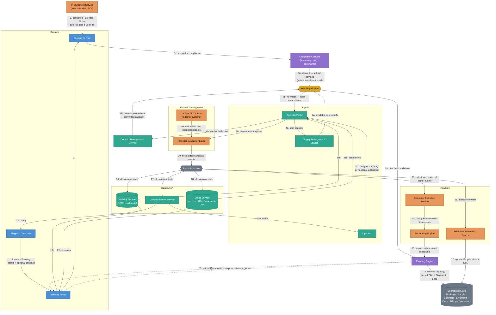

**How to read this diagram:** This is the spine of the whole platform — every
capability in [§4](#4-core-capability-deep-dives) is one node here. The Matching
Engine is the hinge between Demand and Supply, and the Contract Management Service
is a second input to it — a booking's `contractId` changes which rate and which
capacity pool the Matching Engine considers, but not how matching itself works. The
Compliance Service sits directly in front of Matching as a hard gate, not a
subscriber like Visibility/Communication/Billing — a booking that fails screening
never reaches Matching at all.
Nothing calls Visibility or Communication directly at all — both are independent
subscribers to the same event stream, which is what lets them scale, fail, and
deploy independently of the services that produce those events.

Every box here is a logical service boundary — a distinct module with its own
responsibility, talking to the others only through the event bus or a well-defined
interface — not necessarily a separate deployment. Whether it's actually one process
or many is a deliberate, separate decision; see [§8](#8-major-design-decisions--trade-offs).

**Sequence:**
0. *(Alternative entry point)* A confirmed Purchase Order can auto-generate a Booking without any shipper directly creating one ([§4.12](#412-upstream-demand--procurement-planning)) — from here on, the flow is identical to step 1 onward.
1. A shipper provides the required transportation details — optionally selecting an applicable **Contract** ([§4.2](#42-contract-management)) — and creates a Booking through the Booking Portal ([§4.1](#41-demand--supply-management)).
2. The Booking Portal forwards it to the Booking Service, the system of record for demand.
3. Separately and asynchronously, an operator either configures spot capacity or negotiates a Contract's rate card through the Operator Portal.
4a. Spot capacity configuration goes to the Supply Management Service.
4b. Contract terms go to the Contract Management Service.
5a. The Booking Service submits the new booking to the **Compliance Service** ([§4.11](#411-trade-compliance--documentation)) for denied-party screening, dangerous-goods classification, and duty calculation before anything else happens.
5b. Once cleared, the booking — including its optional `contractId` — proceeds to the Matching Engine. A block here raises a compliance `Exception` and the booking goes no further.
6a. The Matching Engine has continuous access to available spot supply from Supply Management.
6b. If the booking references a contract, the Matching Engine also pulls that contract's rate and any committed capacity pool from Contract Management ([§4.2](#42-contract-management)).
7a. If at least one candidate satisfies the booking's requirements — contract-scoped or spot — matched candidates are passed to the **Planning Engine** ([§4.4](#44-planning-engine)).
7b. If nothing currently fits, the booking is flagged unmatched and surfaced on the Operator Portal's open-demand board instead of being silently rejected.
7c. The Planning Engine prices every candidate and returns a ranked set of **Quotes** to the Booking Portal — price, delivery window, and speed tier for each, nothing reserved yet.
7d. The shipper compares them and selects one Quote.
8. The Planning Engine re-validates the selection, reserves capacity on it, and persists the `Plan`, `Shipment`, and `Legs` — this is also where the Booking transitions to `CONFIRMED`.
9. As the shipment executes, carriers/IoT/ports emit raw events in their native formats (9a); an operator can also push a status update by hand through their portal when no automated feed exists (9b).
10. The **Ingestion & Adapter Layer** ([§5](#5-event-backbone--integration-layer)) normalizes every source format into canonical events and publishes them to the event backbone.
11. The **Milestone Processing Service** ([§4.7](#47-milestone-processing--update)) consumes milestone events off the bus.
12. It validates and applies the lifecycle transition, recomputes the predicted ETA, and writes the update back to the store — then republishes a `MilestoneUpdated` event onto the bus (omitted from the diagram to keep it readable).
13. In parallel, the **Disruption Detection Service** ([§4.6](#46-disruption-detection--handling)) consumes both milestone events and external signal feeds (weather, port congestion, carrier delay APIs).
14. When a disruption or SLA breach is detected, it publishes the event and, if policy allows, routes straight to the **Replanning Engine** ([§4.5](#45-replanning-engine)).
15. The Replanning Engine re-invokes the Planning Engine with updated constraints (excluded lane/carrier, tightened deadline), producing a new plan version — looping back into step 8's machinery.
16. The **Visibility Service** ([§4.8](#48-visibility-control-tower)) consumes every domain event to keep its read-optimized control-tower projection current.
17. The **Communication Service** ([§4.9](#49-communication--notifications)) consumes the same events independently, to decide who needs to be told what.
18. The **Billing Service** ([§4.10](#410-billing--payments)) consumes the same events too — a `MilestoneUpdated` crossing the tenant's billing trigger (typically `DELIVERED`/`POD_RECEIVED`) is what generates the shipper's Invoice and the operator's Settlement.
19. Both portals query the Visibility Service directly for live status — the shipper's Booking Portal (19a) and the operator's Operator Portal (19b) — never the operational store.
20. Communication dispatches notifications to whichever side needs to know: the shipper (20a) or the operator (20b) — including volume-commitment compliance alerts from [§4.2](#42-contract-management) and payment-due reminders from [§4.10](#410-billing--payments).
21. The Billing Service likewise exposes invoices to the Booking Portal (21a) and settlements to the Operator Portal (21b).

---

## 3. Domain Model

### Glossary

| Term | Definition |
|---|---|
| Party | Any actor: Shipper, Consignee, Operator, Carrier, Freight Forwarder, Customs Broker |
| Consignee | The receiving party on a Booking — the buyer in the underlying trade, whose obligations under the Incoterm are the mirror of the Shipper's |
| Location / Node | A physical point in the network: port, airport, rail yard, warehouse/DC, customer site |
| Lane | A directed origin→destination pair, tagged with the transport mode(s) that serve it |
| Booking | The demand-side request — a shipper's ask for transportation capacity, with all required details, tracked through its own status lifecycle |
| Load Type | Whether a Booking is FCL (a full container exclusively for one shipper), LCL (consolidated with other shippers' cargo), or Breakbulk (non-containerized) |
| Container Requirement | The container type(s) and quantity a Booking needs, for FCL shipments |
| CapacityOffering | The supply-side offer — an operator's available transportation capacity on a lane: schedule, capacity per departure, rates |
| Operator | A Party (typically a Carrier or Forwarder) that supplies capacity via the Operator Portal |
| Contract | A commercial agreement between a shipper and an operator governing pricing and/or capacity guarantees for Bookings on specified lanes |
| Volume Commitment | A minimum shipping volume a shipper agrees to over a period under a Committed Volume contract |
| Incoterm | A standardized trade term (EXW, FOB, DDP, etc.) fixing which party — shipper/seller or consignee/buyer — bears cost and risk at each point in the shipment |
| Quote | A priced, non-binding option for satisfying a Booking — price, ship date, delivery window, and speed tier — valid until a short expiry |
| Speed Tier | A coarse label (Economy/Standard/Express/Priority) grouping Quotes by relative transit time on the same lane |
| Invoice | A bill issued to a shipper for a completed Booking — Accounts Receivable |
| Settlement | An amount owed to an operator for capacity/services rendered — Accounts Payable |
| Payment | A recorded money movement, inbound from a shipper or outbound to an operator, against an Invoice or Settlement |
| HS Code | A Harmonized System tariff code identifying a commodity for customs duty and restricted-goods purposes |
| Denied-Party Screening | Checking a Booking's parties against sanctions/denied-party lists before it's allowed to proceed |
| Dangerous Goods (DG) Class | The IMDG/IATA/ADR hazard classification of a cargo item, restricting which capacity may carry it |
| Transport Document | A legally required document (BOL, Commercial Invoice, Certificate of Origin, DG Declaration, etc.) gating a shipment's progress |
| Demand Forecast | A prediction of future need for a SKU at a location, used to trigger procurement |
| Supplier | A Party who supplies goods/materials (as opposed to an Operator, who supplies transportation capacity) |
| Purchase Order | A shipper's order to a Supplier for goods; its confirmation can automatically generate a Booking |
| Shipment | The execution unit created once a Booking is matched and confirmed; owns one or more Legs |
| Leg | A single-mode movement between two nodes, fulfilled against a specific CapacityOffering |
| Plan | An immutable, versioned sequence of Legs plus cost/time estimates for a Shipment |
| Milestone | A canonical lifecycle event for a Leg (e.g., DEPARTED, ARRIVED, CUSTOMS_CLEARED) |
| Disruption | A detected condition that threatens an active Plan's SLA |
| Exception | An actionable, assignable task generated from a Disruption that needs resolution |
| Control Tower | The aggregated, role-appropriate visibility view over bookings/shipments, exceptions, and KPIs |

### Entity relationships

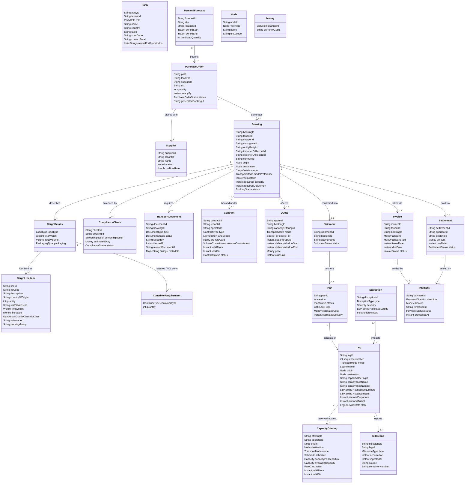

**How to read this diagram:** `Booking` and `CapacityOffering` are the two
independent inputs — one from a shipper, one from an operator — that meet only at
`Leg` (via `capacityOfferingId`). `Contract` is optional on `Booking`: when present,
it's what tells the Matching Engine ([§4.1](#41-demand--supply-management)) which
rate and which capacity pool to use instead of the default spot behavior
([§4.2](#42-contract-management)). A `Quote` is a priced, non-binding preview of one
possible `Plan` — a `Booking` can hold several while the shipper is comparing options
([§4.4](#44-planning-engine)); only the one they select ever turns into a real `Plan`.
`Plan` itself is versioned, not mutated — a shipment's history is the full list of its
plans, most recent `ACTIVE`. `CargoDetails` forks on `loadType`: FCL bookings carry
one or more `ContainerRequirement`s (type + quantity); LCL and Breakbulk bookings
instead rely on the generic weight/volume/packaging fields, since there's no
container to enumerate. Every `CargoDetails` holds one or more `CargoLineItem`s —
each with its own HS code, country of origin, and value — because customs and
trade documents ([§4.11](#411-trade-compliance--documentation)) are line-item
documents even when the shipment itself is one Booking. `Booking` names up to
three parties beyond Shipper and Consignee — `notifyPartyId`,
`importerOfRecordId`, `exporterOfRecordId` — all of which default to Consignee
and Shipper respectively when unset, but which denied-party screening
([§4.11](#411-trade-compliance--documentation)) always checks explicitly, since an
Importer of Record is often a customs broker, not either trading party.
Every one of those ID fields — plus `shipperId`, `consigneeId`, `operatorId` on
`Contract`/`CapacityOffering`/`Settlement`, and `supplierId` — resolves to the
same `Party` record: one shared directory of every actor in the system, carrying
`scacCode` (populated for Operator/Carrier-role parties, since EDI and customs
filings like ISF require it) and `taxId` (for the parties customs actually cares
about — Importer/Exporter of Record). A Forwarder/LSP `Party` populates
`relaysForOperatorIds` when it reports milestones on behalf of several
underlying Operators through one integration — that list *is* its authorization
scope ([§14](#14-security)), not "its own shipments" the way a direct carrier's
webhook is scoped. `Invoice` and `Settlement` are both derived from the same
confirmed `Plan` cost breakdown — the platform's margin is just the difference between
what it bills the shipper and what it pays the operator ([§4.10](#410-billing--payments)).
`ComplianceCheck` and `TransportDocument` both attach to `Booking` rather than `Leg`,
because screening and paperwork are properties of the shipment as a whole, not of any
one movement within it ([§4.11](#411-trade-compliance--documentation)). At the far
upstream end, `DemandForecast` and `PurchaseOrder` don't touch `Booking` at all until
a `PurchaseOrder` is confirmed — that's the one moment procurement generates a real
`Booking` and hands off into everything described above
([§4.12](#412-upstream-demand--procurement-planning)). A `Shipment`'s `Leg`s aren't
limited to moving the shipper's cargo, either — an empty-container pickup *before*
the cargo's first laden leg, and its return *after* delivery, are both modeled as
just one more `Leg` on the same `Plan`, the first before physical movement begins
and the second after the `Booking` has already reached `COMPLETED`.
`Booking.consigneeId` names the receiving `Party` separately from `shipperId`, and
each `Leg`'s `role` (`PRE_CARRIAGE` / `MAIN_CARRIAGE` / `ON_CARRIAGE` — or
`EQUIPMENT_REPOSITIONING` for the empty pickup/return legs from
[§4.1](#41-demand--supply-management), which sit outside the Incoterm matrix
entirely, since nobody in the trade relationship is responsible for empty-box
logistics) is what lets the Incoterm responsibility matrix resolve to a specific
party for a specific leg, rather than one aggregate flag for the whole shipment.

**Leg dependency**: a `Leg`'s `sequenceNumber` is what makes its order explicit,
rather than leaving it implied by position in `Plan.legs`. Leg *N* cannot begin
executing until Leg *N − 1* (same `Plan`) has reached its terminal milestone —
enforced in three places: the Planning Engine validates that consecutive legs'
`destination`/`origin` actually connect before persisting a `Plan`
([§4.4](#44-planning-engine)); Milestone Processing treats an out-of-sequence
departure the same as any other invalid transition
([§4.7](#47-milestone-processing--update)); and Replanning only reconsiders legs
from the disrupted one's `sequenceNumber` onward — everything earlier already
happened and is immutable ([§4.5](#45-replanning-engine)). This models a simple
linear chain — one predecessor per leg — deliberately, not a general dependency
graph; see [§8](#8-major-design-decisions--trade-offs) for what that trades away.

### Node types

Every `origin`/`destination` field in this document — on `Booking`, `CapacityOffering`,
`Leg`, `Supplier` — is a `Node`, and a Node is deliberately not just "an address."
What kind of facility it is changes what's required to move through it:

| Node Type | Example | Mode can change here? | Appointment / ASN required? | Typical accessorial |
|---|---|---|---|---|
| Port | Ocean terminal | Yes — ocean ↔ road/rail | No | Demurrage |
| Airport | Air cargo terminal | Yes — air ↔ road | No | Storage |
| Rail Yard / Ramp | Intermodal ramp | Yes — rail ↔ road | No | Demurrage |
| Container Depot | Empty equipment yard | No | No | N/A — equipment only |
| Container Freight Station (CFS) | LCL consolidation point | Yes — any mode, LCL only | No | Consolidation/deconsolidation fee |
| Transload Facility | Cross-dock, container → trailer | Yes — any ↔ any | Sometimes | Transload/handling fee |
| Warehouse / DC | Shipper-owned distribution center | No | Sometimes | N/A |
| Third-Party Warehouse (3PL) | Outsourced storage/fulfillment | No | Often | Handling/storage fee |
| Fulfillment Center (FC) | E-commerce/retail FC | No | Yes — dock appointment + ASN | Routing-guide chargeback if missed |
| Cross-Dock | No-storage transfer point | Sometimes | Sometimes | Handling fee |
| Customer Site | Direct-to-consignee delivery | No | Sometimes | N/A |
| Supplier Site | Procurement pickup ([§4.12](#412-upstream-demand--procurement-planning)) | No | No | N/A |
| Bonded Warehouse | Customs-held storage | No | No | Customs storage fee |

Three things key off this table directly: network-level route generation only
chains Legs of different `TransportMode`s at a node flagged mode-transition-capable
([§4.4](#44-planning-engine)); a Fulfillment Center or 3PL destination adds an
Advance Ship Notice to the required-document set ([§4.11](#411-trade-compliance--documentation));
and handling/storage/consolidation fees join detention, demurrage, and customs duty
as accessorials on the Invoice ([§4.10](#410-billing--payments)).

### Storage key structure

```
{tenantId} / {bookingId}                      →  Booking
{tenantId} / {operatorId} / {contractId}      →  Contract
{tenantId} / {bookingId} / {quoteId}          →  Quote (expires at validUntil; never promoted, only referenced)
{tenantId} / {bookingId} / invoice            →  Invoice
{operatorId} / {bookingId} / settlement       →  Settlement
{tenantId} / {bookingId} / compliance         →  ComplianceCheck
{tenantId} / {bookingId} / documents          →  list of TransportDocument
{tenantId} / {supplierId} / {poId}            →  PurchaseOrder
{operatorId} / {offeringId}                   →  CapacityOffering
{tenantId} / {shipmentId} / {planVersion}     →  Plan
{tenantId} / {legId}                          →  ordered Milestone stream
{laneId}                                      →  index of active Legs on that lane (disruption impact assessment)
{laneId} / {mode}                             →  index of open CapacityOfferings (matching + open-demand board)
```

The lane→leg index is what makes "a port strike affects 500 shipments" resolvable in
one lookup instead of a full scan — see [§4.6](#46-disruption-detection--handling).
The lane→offering index is the same idea applied to matching demand against supply.

---

## 4. Core Capability Deep Dives

### 4.1 Demand & Supply Management

This is where a Booking (demand) and a CapacityOffering (supply) are captured,
tracked, and brought together.

#### Booking lifecycle

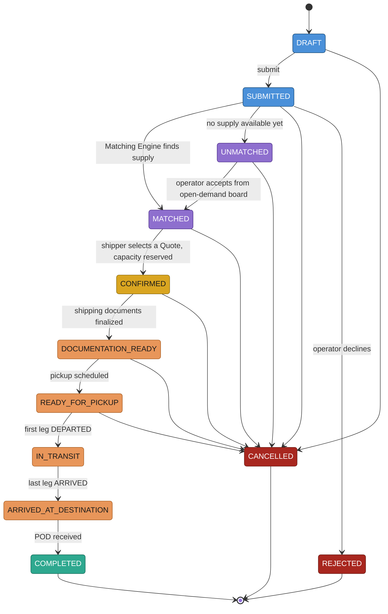

This is the authoritative lifecycle — the states that gate real business rules (can
this booking still be amended? does cancelling it now incur a fee?). It stops short
of encoding *physical* granularity (which leg, how delayed) because a multi-leg
booking's position is a property of its legs, not a single linear value — that
granularity is composed separately in [§4.8](#48-visibility-control-tower) instead of
being folded into this state machine. A Booking can also sit in `MATCHED` holding
several open `Quote`s at once — none of them reserve anything; that only happens at
the instant one is selected and the Booking moves to `CONFIRMED`
([§4.4](#44-planning-engine)).

#### Required booking details

The shipper must be able to supply everything the Matching and Planning Engines need
to act — this is the concrete answer to "provide required details for the
transportation":

| Field | Description | Required? |
|---|---|---|
| Origin / Destination | Pickup and delivery locations | Yes |
| Consignee | The receiving Party — who several Incoterms make responsible for part of the journey (table below) | Yes |
| Load type | FCL (full container), LCL (consolidated), or Breakbulk | Yes |
| Cargo details | Commodity, total weight, total volume, packaging (LCL/Breakbulk) | Yes |
| Container requirement | Container type(s) and quantity needed — table below | Yes, for FCL |
| Mode preference | A specific mode, or "any" to let matching/planning decide | No (defaults to any) |
| Required pickup window | Earliest/latest pickup time | Yes |
| Required delivery by | Deadline the shipment must arrive by | Yes |
| Contract reference | An applicable active Contract to book under ([§4.2](#42-contract-management)) | No (defaults to spot) |
| Incoterm | Which party owns cost/risk at each point in the shipment (table below) | No (defaults to tenant default) |
| Special handling | Hazmat, temperature control, high-value/insurance, fragile | No |
| Reference number | The shipper's own PO/reference, for reconciliation | No |

#### Container types (FCL)

| Container Type | Code | Typical use |
|---|---|---|
| 20' Standard (Dry) | 20GP | General dry cargo, ~28 CBM |
| 40' Standard (Dry) | 40GP | General dry cargo, ~58 CBM |
| 40' High Cube | 40HC | Bulky, lower-density cargo needing extra height |
| 45' High Cube | 45HC | Largest standard box, high-volume cargo |
| 20' / 40' Reefer | 20RF / 40RH | Temperature-controlled — perishables, pharma |
| Open Top | 20OT / 40OT | Over-height cargo, loaded from the top |
| Flat Rack | 20FR / 40FR | Oversized/out-of-gauge cargo — machinery, vehicles |
| ISO Tank | TANK | Bulk liquids and gases |

A Booking's `ContainerRequirement` list can mix types and quantities (e.g., 2×40HC +
1×20RF) — the Matching Engine treats each line independently when checking supply.

#### Incoterms

The Incoterm doesn't change how a shipment is routed — it changes who's responsible
for what, and who bears the risk, at each point along the way. "Responsible" isn't
one flag: it's a separate answer for export customs, pre-carriage, main carriage,
insurance, import customs/duty, and on-carriage — and the two entities on each end
of that split, `Booking.shipperId` and `Booking.consigneeId`
([§3](#3-domain-model)), are rarely both responsible for the same thing.

| Incoterm | Mode | Export Customs | Pre-Carriage | Main Carriage | Insurance | Import Customs & Duty | On-Carriage | Risk Transfers At |
|---|---|---|---|---|---|---|---|---|
| EXW — Ex Works | Any | Consignee | Consignee | Consignee | Consignee | Consignee | Consignee | Seller's premises, before pickup |
| FCA — Free Carrier | Any | Shipper | Shipper | Consignee | Consignee | Consignee | Consignee | Handover to the carrier at origin |
| CPT — Carriage Paid To | Any | Shipper | Shipper | Shipper | Consignee | Consignee | Consignee | Handover to the first carrier at origin |
| CIP — Carriage and Insurance Paid To | Any | Shipper | Shipper | Shipper | Shipper | Consignee | Consignee | Handover to the first carrier at origin |
| DAP — Delivered at Place | Any | Shipper | Shipper | Shipper | Shipper | Consignee | Shipper | Named destination, before unloading |
| DPU — Delivered at Place Unloaded | Any | Shipper | Shipper | Shipper | Shipper | Consignee | Shipper | Named destination, after unloading |
| DDP — Delivered Duty Paid | Any | Shipper | Shipper | Shipper | Shipper | Shipper | Shipper | Named destination, duty paid |
| FAS — Free Alongside Ship | Ocean only | Shipper | Shipper | Consignee | Consignee | Consignee | Consignee | Alongside the vessel at the port of shipment |
| FOB — Free on Board | Ocean only | Shipper | Shipper | Consignee | Consignee | Consignee | Consignee | Once loaded on board at the port of shipment |
| CFR — Cost and Freight | Ocean only | Shipper | Shipper | Shipper | Consignee | Consignee | Consignee | Once loaded on board at the port of shipment |
| CIF — Cost, Insurance and Freight | Ocean only | Shipper | Shipper | Shipper | Shipper | Consignee | Consignee | Once loaded on board at the port of shipment |

DPU is the only Incoterm where the Shipper is also responsible for unloading at
destination; DAP and DDP both stop at delivery, before unloading.

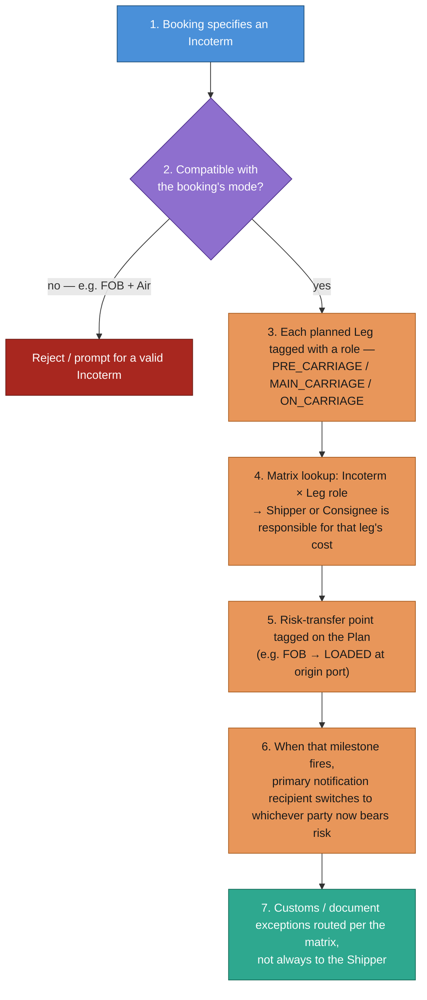

**Sequence:**
1. The shipper selects an Incoterm when creating the Booking, or it defaults per tenant (or per Contract, if one applies) — and names a Consignee, since several Incoterms make the Consignee responsible for parts of the journey.
2. It's validated against the booking's transport mode — the four sea-only terms (FAS, FOB, CFR, CIF) are rejected for Air/Road/Rail/Parcel bookings rather than silently accepted and misapplied.
3. Once planned, each `Leg` the Planning Engine creates ([§4.4](#44-planning-engine)) is tagged with a `role` — pre-carriage (origin to first hand-off), main carriage (the primary long-haul movement), or on-carriage (final hand-off to destination).
4. For each leg, a matrix lookup — this Incoterm, this leg's role — resolves to either the Shipper or the Consignee as the responsible party for that portion's cost, feeding the per-leg breakdown on the `Plan` rather than one aggregate split.
5. Separately, the specific point at which risk transfers is tagged on the Plan against the corresponding canonical milestone from the table above.
6. When that milestone actually fires during execution ([§4.7](#47-milestone-processing--update)), Communication ([§4.9](#49-communication--notifications)) switches which party is the primary recipient for subsequent disruption/exception alerts — post-transfer, that's whichever party now bears the risk.
7. A customs-related Exception ([§4.6](#46-disruption-detection--handling)) is routed per the same matrix — the Shipper under DDP's import-customs column, the Consignee under every other term, rather than a hardcoded assumption that it's always the Shipper's problem.

> **Who gets billed:** the platform always invoices whoever created the Booking
> (still called `shipperId` as the platform-facing role, even under EXW/FCA where
> the Consignee is the one arranging carriage and would be the actual Booking
> creator). The Incoterm matrix drives the *itemized, per-leg breakdown* on that
> Invoice ([§4.10](#410-billing--payments)) — useful for the booking party's own
> reconciliation with their counterparty — not a second invoice to a second party.
> See [§8](#8-major-design-decisions--trade-offs) for why.

#### Matching flow

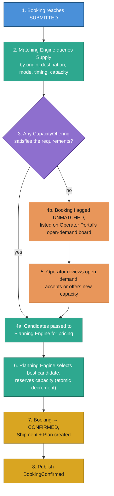

**Sequence:**
1. A Booking moves to `SUBMITTED` once the shipper has provided every required detail.
2. The Matching Engine queries Supply Management for `CapacityOffering`s that satisfy origin, destination, mode (or any mode, if unspecified), timing window, and remaining capacity. For an FCL booking, "capacity" means enough available slots of each requested `ContainerType` specifically — a 40HC request is never satisfied by a 20GP slot — while LCL/Breakbulk bookings match against aggregate weight/volume instead. If the booking references a `Contract`, this step also resolves that contract's rate and any committed capacity pool ([§4.2](#42-contract-management)) instead of using spot supply alone.
3. It checks whether at least one offering actually fits.
4a. If yes, matching candidates are handed to the Planning Engine, which prices each one and returns a ranked set of Quotes rather than auto-selecting a single winner ([§4.4](#44-planning-engine)).
4b. If nothing currently fits, the Booking is flagged `UNMATCHED` and surfaced on the Operator Portal's open-demand board — visibility into unserved demand, not a silent rejection.
5. An operator can review that board and either accept the booking against spare capacity or stand up a new `CapacityOffering` to serve it, re-entering the flow at step 4a.
6. Once the shipper selects a Quote ([§4.4](#44-planning-engine)), the Planning Engine reserves capacity — an atomic decrement on the offering's (or contract's committed pool's) `availableCapacity` so two bookings can't race for the same slot (the same class of problem as any concurrent counter — see the repo's [locking](../locking/README.md) practice for the underlying primitives).
7. The Booking transitions to `CONFIRMED`; a `Shipment` and its initial `Plan` are created exactly as described in [§4.4](#44-planning-engine).
8. A `BookingConfirmed` event is published — Visibility and Communication pick it up like any other domain event ([§2](#2-high-level-architecture)).

#### Future extension: consolidating multiple LCL bookings

Not built — this is a design sketch of how the existing model extends, not a
built capability. The gap is specific: `Leg` currently belongs to exactly one
`Plan`/`Shipment`/`Booking`, so nothing lets several bookings' cargo share one
physical container leg, which is the entire point of LCL. Everything else
needed already exists, built in anticipation of this: `LoadType.LCL`, the
Container Freight Station `NodeType` (already flagged as a consolidation point
where mode can change, [§3](#3-domain-model)), and the House BOL document
(already "consolidator's BOL to the shipper," [§4.11](#411-trade-compliance--documentation)).

The fix is one new entity plus one nullable field, not a redesign:

```
ConsolidationGroup {
    groupId
    capacityOfferingId        // the shared, LCL-capable CapacityOffering
    conveyanceName / conveyanceNumber / containerNumbers
    mblNumber                 // one Master BOL covers the whole shared container
    totalCapacity              // weight/volume ceiling
    allocatedCapacity          // running total across participating shipments
    status                     // OPEN (accepting more) / CLOSED (sealed)
}
```

`mblNumber` lives here, not on any individual Shipment, because it's issued once
per shared container — every participating shipment's House BOL
(`relatedDocumentId`, [§3](#3-domain-model)) points back to this one record.

`Leg` gains a nullable `consolidationGroupId`. Four things follow from that:

- **Matching** gains a second candidate source alongside ordinary `CapacityOffering`s: an *open* `ConsolidationGroup` on a compatible lane/mode/schedule with enough remaining capacity. Joining one is just another priced `Quote` ([§4.4](#44-planning-engine)) — the shipper never sees a difference between booking dedicated capacity and joining a shared container.
- **Milestone fan-out** needs no new pathway: a carrier event is tagged by container/conveyance number, not by booking, so ingestion resolves the `ConsolidationGroup` and republishes the same update to every participating Shipment's `Leg` — one physical event, several logical updates, through the exact mechanism [§4.7](#47-milestone-processing--update) already has.
- **Billing** prorates instead of billing the whole leg: `RateProvider.quote()` returns a per-unit rate (per CBM/kg) for a consolidated leg, and each shipment's cost is `allocatedCapacity × rate` — the same per-leg cost breakdown mechanism ([§4.10](#410-billing--payments)), keyed by allocation share instead of "the whole leg."
- **Which bookings actually get grouped together** — the bin-packing/cube-utilization decision — is a pluggable `ConsolidationStrategy`, the same Strategy pattern the planning objectives already use ([§4.4](#44-planning-engine)): swap a simple first-fit packer for a proper cube-optimizing one without touching the Matching Engine that calls it.

No change needed to `Booking`, `Plan`, the Milestone state machine, or Billing's
core mechanism — everything above is additive.

#### Booking Portal (shipper-facing)

| Capability | Description |
|---|---|
| Create Booking | Capture all required transportation details (table above) |
| Select a Contract | Choose an applicable active Contract to book under, or leave unset for spot ([§4.2](#42-contract-management)) |
| Compare quotes | See price, delivery window, and speed tier for every viable option — including how price shifts across nearby ship dates — and select one ([§4.4](#44-planning-engine)) |
| Track status | A granular composite status — lifecycle stage, current leg/milestone, and delivery health ([§4.8](#48-visibility-control-tower)) — never a direct query to the operational store |
| Amend / cancel | Edit a `DRAFT` booking, or cancel up to `CONFIRMED` (subject to cancellation policy) |
| View documents | Access generated shipping documents — the Booking Confirmation ([§4.11](#411-trade-compliance--documentation)) for full routing/provider/timeline detail, plus BOL, POD, and every compliance document |
| View & pay invoices | See issued invoices and payment status; pay outstanding balances ([§4.10](#410-billing--payments)) |

#### Operator Portal (operator-facing)

| Capability | Description |
|---|---|
| Configure supply | CRUD `CapacityOffering`s — lanes, schedule, capacity per departure, rate card, blackout dates |
| Configure contracts | Define Rate Card / Committed Volume / SLA terms for a specific shipper or segment ([§4.2](#42-contract-management)) |
| View demand | Two views: (a) bookings already confirmed against their capacity, their assigned workload; (b) the open-demand board, unmatched bookings that fit lanes they serve |
| Accept open demand | Claim an unmatched booking against spare or newly-offered capacity |
| Track & update status | View shipments they're executing; push milestone updates by hand when no automated feed exists — this is simply one more milestone ingestion adapter ([§4.7](#47-milestone-processing--update)) |
| View settlements | See pending and paid settlements for completed shipments ([§4.10](#410-billing--payments)) |
| View Rate/Load Confirmations | See exactly which legs, windows, and rates they're on the hook for, per Booking ([§4.11](#411-trade-compliance--documentation)) |

### 4.2 Contract Management

A `Contract` determines how a Booking is priced and, for some contract types, whether
it draws from a capacity pool reserved just for that shipper rather than the open
spot market.

#### Contract types

| Type | Description | Pricing | Capacity guarantee | Typical duration |
|---|---|---|---|---|
| Spot | No pre-negotiated agreement; the default when a Booking has no `contractId` | Live market rate at time of booking | Best-effort — whatever spot supply is available | Single booking |
| Rate Card / Tariff | Pre-negotiated fixed rate per lane/mode, no volume commitment | Fixed contract rate | Best-effort, still drawn from the spot pool | 3–12 months |
| Committed Volume | Shipper commits to a minimum volume; operator commits capacity + rate in return | Fixed/tiered contract rate | Reserved capacity pool, set aside from spot entirely | 6–24 months |
| SLA / Guaranteed Service | A rider adding guaranteed transit time or priority handling on top of another contract type | Inherits from underlying contract, often at a premium | Guaranteed — jumps the queue in Matching/Planning | Attached to a Rate Card or Committed Volume contract |
| Framework / Master Service Agreement | An umbrella legal agreement; actual rates and lanes live in child Rate Card contracts | N/A — defined by child contracts | N/A | 1–3 years |

#### Contract lifecycle

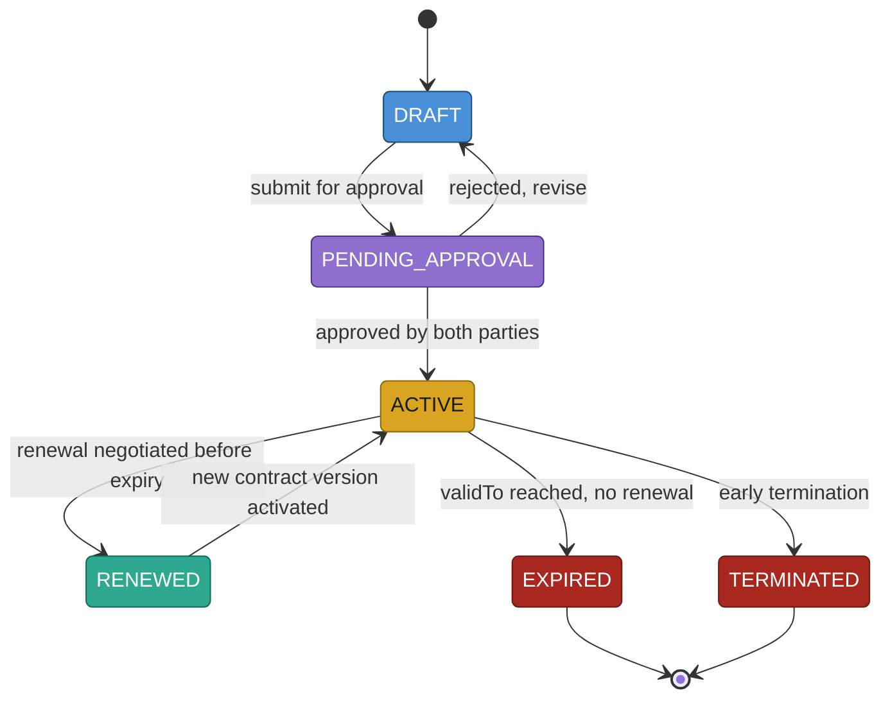

Like Plans, contracts are versioned rather than edited in place: a `RENEWED` contract
produces a new `ACTIVE` version rather than mutating the expiring one, preserving the
terms that applied to every booking made under the old version.

#### Contract-aware matching & pricing

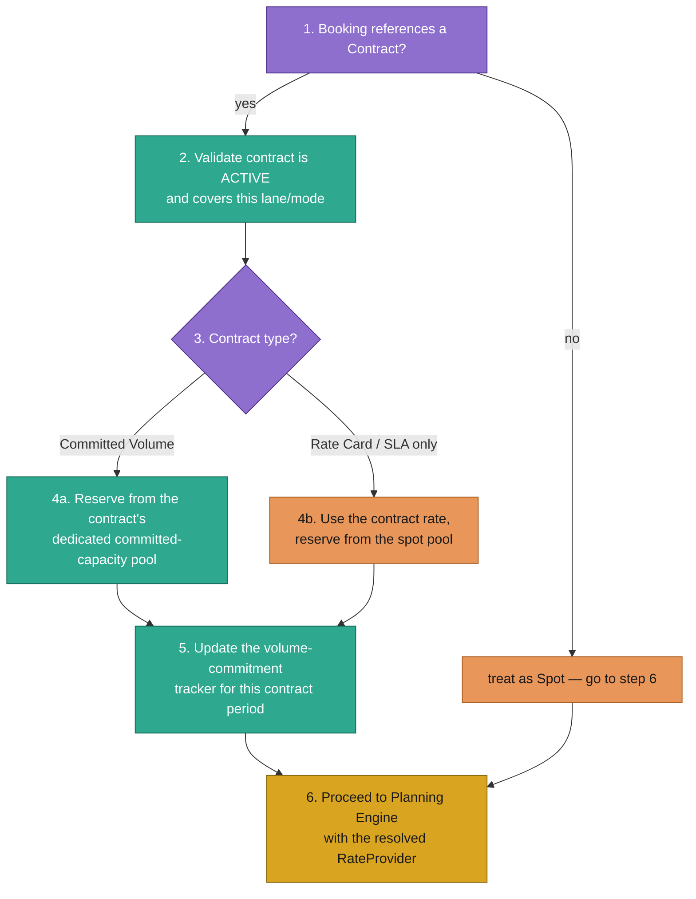

**Sequence:**
1. When a Booking is submitted, the Matching Engine checks whether it references a `Contract`.
2. If so, the contract must be validated as `ACTIVE` and in scope for the booking's lane and mode — an expired or out-of-scope contract falls back to spot behavior rather than failing the booking outright.
3. The contract's type determines what happens next.
4a. A Committed Volume contract reserves from a capacity pool set aside specifically for that contract — this capacity was never in the open/spot pool, so it can't be raced away by unrelated spot bookings.
4b. A Rate Card or SLA-only contract uses the negotiated rate but still draws from the general spot capacity pool — it guarantees price, not capacity, unless paired with a Committed Volume reservation.
5. Every booking made under a Committed Volume contract updates that contract's running volume tally for the current commitment period.
6. Either way, the Planning Engine proceeds exactly as in [§4.4](#44-planning-engine) — the only difference is which `RateProvider` implementation it was handed: `SpotRateProvider` or `ContractRateProvider`, both behind the same [Strategy interface](#9-design-patterns-used).

#### Volume commitment compliance

Each Committed Volume contract tracks a running `bookedVolume` against its
`committedVolume` for the current period (e.g., monthly) — denominated either as a
generic volume/weight figure or, for ocean contracts, directly in containers per type
(e.g., "100 × 40HC per month"):

- **Under-shipped** near period close → a `VolumeThresholdCrossed` event triggers an
  early-warning notification to the shipper's account team before a shortfall penalty
  applies ([§4.9](#49-communication--notifications)).
- **Over commitment** → once the committed pool is exhausted, further bookings under
  that contract fall through to the spot pool at the spot rate (step 4b above),
  transparently, without failing the booking.

### 4.3 Multi-Modal Transport Abstraction

All mode-specific behavior lives behind three small strategy interfaces. Neither the
Planning Engine nor the Milestone Service branches on `TransportMode` directly.

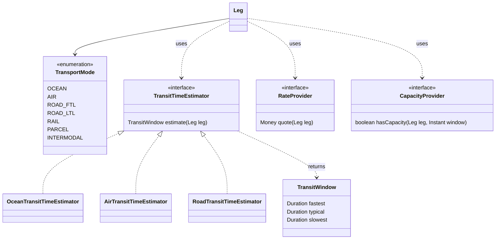

**How to read this diagram:** Adding `INTERMODAL` or a brand-new mode is writing three
small classes, not touching the Planning Engine — see [§10](#10-extensibility--reusability).
`CapacityProvider` is also what the Matching Engine calls against a `CapacityOffering`
in [§4.1](#41-demand--supply-management) — the same abstraction serves both matching
and in-flight replanning. `RateProvider` is the same interface `SpotRateProvider` and
`ContractRateProvider` both implement ([§4.2](#42-contract-management)). Two details
worth calling out for [§4.4](#44-planning-engine): `estimate()` returns a
`TransitWindow`, not a single point estimate — a delivery window is a first-class
concept here, not something bolted on afterward — and `quote()` already varies with
`leg.plannedDeparture`, since a mode's `RateCard` can define peak-season or
day-of-week multipliers. Neither interface needed to change to support quoting by
date; the behavior was already there.

Every mode reports events in its own native shape; the platform normalizes all of them
to the same canonical milestone taxonomy:

| Canonical Milestone | Ocean | Air | Road (FTL/LTL) | Rail | Parcel |
|---|---|---|---|---|---|
| BOOKED | Booking confirmed with carrier | Space confirmed | Load tendered & accepted | Railcar ordered | Label created |
| EMPTY_DISPATCHED | Empty container dispatched to shipper | N/A (no container) | Empty trailer dispatched to shipper | Empty container/railcar dispatched to shipper | N/A (no container) |
| ORIGIN_GATE_IN | Container gated in at port | Cargo received at warehouse | Trailer arrives at shipper dock | Railcar spotted at origin | Package received at facility |
| LOADED | Container loaded on vessel | AWB loaded on flight | Trailer loaded & sealed | Railcar loaded | Package scanned into vehicle |
| DEPARTED | Vessel departure | Flight wheels-up | GPS exits origin geofence | Train departs origin yard | Vehicle departs facility |
| IN_TRANSIT | Ocean transit / transshipment | In flight | En route (GPS pings) | En route | Out for delivery / in transit hub |
| ARRIVED | Vessel arrival at destination port | Flight wheels-down | GPS enters destination geofence | Train arrives destination yard | Arrived at destination facility |
| CUSTOMS_HOLD / CLEARED | Import customs hold/clear | Import customs hold/clear | Border-crossing hold/clear | Border-crossing hold/clear | Rare (cross-border parcel) |
| DELIVERED | Container gated out to consignee | Cargo released to consignee | POD signed | Railcar released | Delivered, signature captured |
| EMPTY_RETURNED | Empty container returned to depot | N/A (no container) | Empty trailer released back to carrier | Empty container/railcar released back to rail carrier | N/A (no container) |

`EMPTY_DISPATCHED` and `EMPTY_RETURNED` are the two canonical milestones that
bookend the cargo's journey rather than being part of it — they fire on `Leg`s that
move the *container*, not the shipment: one before `ORIGIN_GATE_IN`, when the empty
box is positioned at the shipper (before the Booking has even left `READY_FOR_PICKUP`,
[§4.1](#41-demand--supply-management)), and one after `DELIVERED`, once the Booking
has already reached `COMPLETED`. Together they bound the two windows — origin and
destination — in which detention can accrue: `EMPTY_DISPATCHED → ORIGIN_GATE_IN`
on one end, `DELIVERED → EMPTY_RETURNED` on the other, both computed from actual
timestamps instead of entered by hand ([§4.10](#410-billing--payments)). The Legs
that carry these two milestones are tagged `role = EQUIPMENT_REPOSITIONING`
([§3](#3-domain-model)), not `PRE_CARRIAGE`/`ON_CARRIAGE` — they're outside the
Incoterm responsibility matrix, since they move the container, not the cargo.

### 4.4 Planning Engine

The Planning Engine has two entry points instead of one: `quote()` prices every
viable option and shows all of them to the shipper; `confirm()` locks in the one they
picked. Nothing is reserved until `confirm()` succeeds.

```java
public interface PlanningEngine {
    List<Quote> quote(Booking booking, List<CapacityOffering> candidates, PlanningConstraints constraints);
    Plan confirm(Booking booking, Quote selectedQuote);
}
```

| Objective strategy | Optimizes for | Surfaced to the shipper as |
|---|---|---|
| CostOptimized | Lowest total landed cost | "Economy" quotes |
| SpeedOptimized | Shortest transit time | "Express" / "Priority" quotes |
| CarbonOptimized | Lowest estimated emissions | An "Eco" quote, shown alongside the others |
| Balanced(weights) | Weighted blend of cost/time/carbon | "Standard" quotes — the default view |
| ConstraintOnly | Any feasible plan meeting hard constraints | Used internally under scarce supply; not shown as its own tier |

#### Quote flow

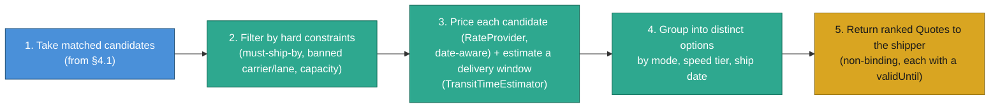

**Sequence:**
1. Start from the candidate `CapacityOffering`s the Matching Engine already resolved as feasible ([§4.1](#41-demand--supply-management)) — no need to search the network from scratch for a booking that's already been matched.
2. Candidates that still violate a hard constraint — miss the required ship-by date, use a banned carrier/lane, or exceed available capacity — are discarded.
3. Every surviving candidate is priced with its `RateProvider` — `SpotRateProvider` or `ContractRateProvider` depending on whether the booking references a Contract ([§4.2](#42-contract-management)) — and given a delivery window from its `TransitTimeEstimator` ([§4.3](#43-multi-modal-transport-abstraction)). Because pricing is already a function of the candidate's ship date, the same lane naturally produces different Quotes for different departure dates.
4. Near-duplicate candidates collapse into a handful of distinct options grouped by mode, speed tier, and ship date, so the shipper compares a short list, not every raw candidate.
5. The ranked `Quote`s are returned. Nothing is reserved — a Quote is a priced promise, not a commitment, and carries a short `validUntil` because both price and availability can change before the shipper decides.

#### Confirm flow

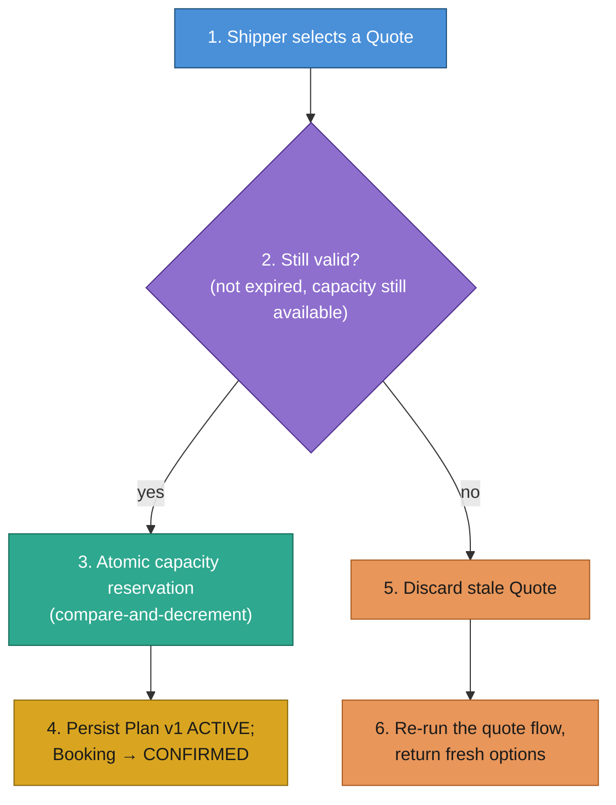

**Sequence:**
1. The shipper picks one `Quote` through the Booking Portal.
2. The Planning Engine re-validates it: has `validUntil` passed, is the underlying `CapacityOffering` still available, and — per [§4.10](#410-billing--payments) — is the shipper's account in good enough standing to book (no blocking overdue balance)?
3. If both check out, it performs the same atomic compare-and-decrement reservation described in [§4.1](#41-demand--supply-management) and [§11.3](#11-failure-scenarios).
4. The winning candidate becomes `Plan` version 1, `ACTIVE`; each of its `Leg`s is assigned a `sequenceNumber`, and the Planning Engine validates that consecutive legs actually connect — `Leg[i].destination == Leg[i+1].origin` — before persisting; a disconnected chain is rejected here, not discovered later during execution. The Booking transitions to `CONFIRMED`.
5. If the quote expired or its capacity was claimed by someone else in the meantime, it's discarded rather than silently honored at a stale price.
6. The quote flow re-runs and the shipper sees fresh options instead of a hard failure — the same "offer an alternative, don't just reject" instinct already used for unmatched bookings in [§4.1](#41-demand--supply-management).

> Network-level planning (multi-leg intermodal routing with no single directly
> connecting `CapacityOffering`) uses the same two flows — candidate generation just
> searches the lane graph for k-shortest paths across chained offerings before
> step 2 of the quote flow. Two chained Legs are only allowed to change
> `TransportMode` at a `Node` flagged mode-transition-capable in the table at
> [§3](#3-domain-model) — a Port, Rail Yard, CFS, or Transload Facility — never at
> a plain Warehouse or Customer Site.

### 4.5 Replanning Engine

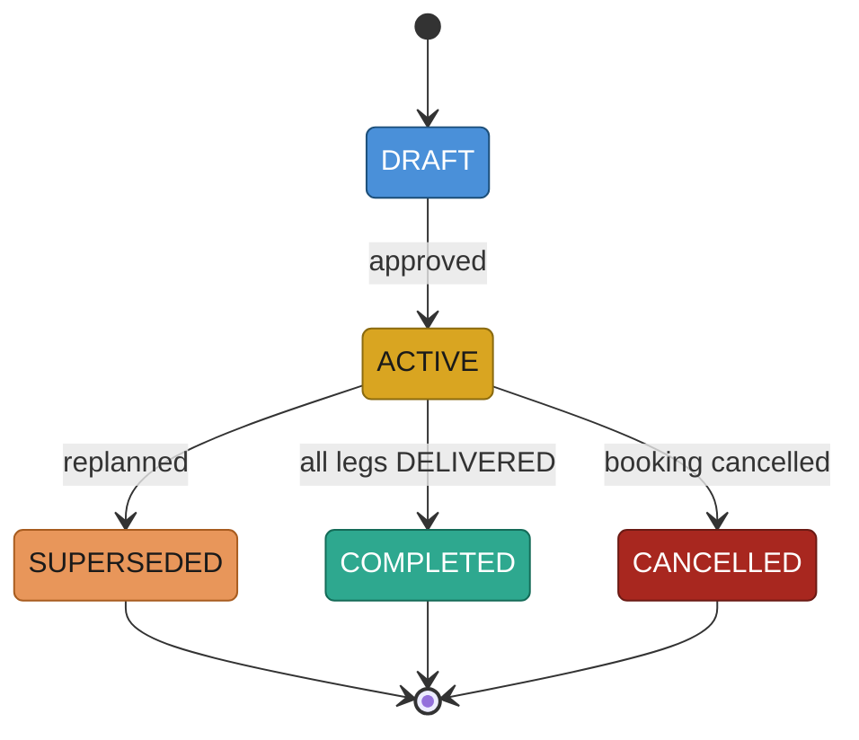

Plans are never mutated in place — replanning always produces a new version and marks
the old one `SUPERSEDED`, preserving a full audit trail.

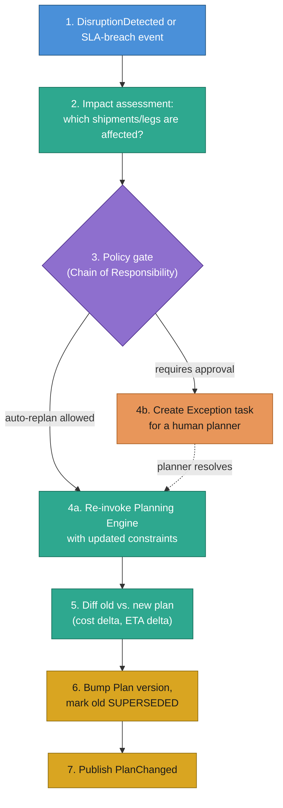

**Sequence:**
1. A `DisruptionDetected` or internal SLA-breach event arrives (from [§4.6](#46-disruption-detection--handling) or the milestone service).
2. The engine resolves exactly which active shipments/legs are affected, using the lane→leg index — and, within an affected `Plan`, only ever considers legs from the disrupted one's `sequenceNumber` onward ([§3](#3-domain-model)). Earlier legs already happened; they're immutable regardless of what the new plan looks like.
3. A chain of policy rules decides whether this can be auto-replanned or needs a human — e.g., auto-replan only if the cost delta stays under a threshold and no manual-approval-required carrier is involved.
4a. If allowed, the Planning Engine's `quote()` is re-invoked with tightened constraints (exclude the disrupted lane/carrier, pull in the deadline) — possibly re-querying the Matching Engine first if the original capacity is no longer viable — and the top-ranked Quote is `confirm()`-ed automatically, with no shipper interaction needed.
4b. If not, `quote()` still runs, but the resulting options are handed to a human planner to pick from via `confirm()` instead of being auto-selected — their decision re-enters at 4a once made.
5. The new candidate plan is diffed against the current one — cost delta, ETA delta, which legs changed.
6. The plan version is bumped; the previous version is marked `SUPERSEDED`, never deleted.
7. A `PlanChanged` event is published for Visibility and Communication to consume.

### 4.6 Disruption Detection & Handling

| Source | Example signal | Typical severity |
|---|---|---|
| Weather feed | Typhoon warning near port X | HIGH |
| Port congestion feed | Average dwell time at port X > 2× baseline | MEDIUM |
| Carrier delay API | Vessel/flight reported behind schedule > 24h | MEDIUM–HIGH |
| Customs/geopolitical alert | New tariff, border closure, sanctions | HIGH |
| Missed milestone (internal) | Expected milestone not received within its SLA window | LOW–MEDIUM |
| Manual report | Planner or operator flags a known issue | Varies |
| Accessorial risk (internal) | An `AccessorialRule` clock ([§4.10](#410-billing--payments)) has consumed most of its free time with no end milestone yet | LOW–MEDIUM |

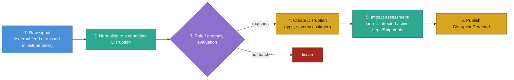

**Sequence:**
1. A raw signal arrives — either pushed from an external feed or generated internally when an expected milestone doesn't land within its SLA window.
2. It's normalized into a candidate `Disruption` record with a common shape regardless of source.
3. Threshold rules — and, longer term, an anomaly-detection hook — evaluate whether the candidate is significant enough to act on.
4. If it matches, a `Disruption` is created with a type and severity.
5. Impact assessment walks the lane index to resolve exactly which active legs and shipments are affected — this is what makes step 14 of the master diagram ([§2](#2-high-level-architecture)) possible.
6. A `DisruptionDetected` event is published to the bus for Replanning, Visibility, and Communication to react to independently ([Observer pattern](#9-design-patterns-used)).

### 4.7 Milestone Processing & Update

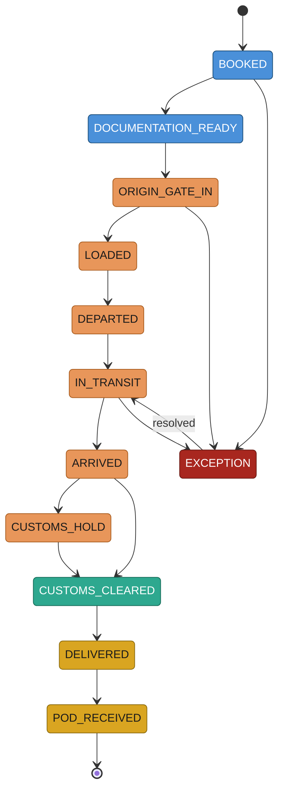

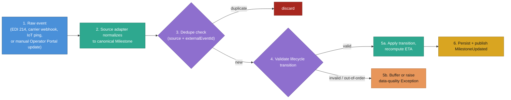

**Sequence:**
1. A raw event arrives from any source — EDI 214, a carrier's REST webhook, an IoT/GPS ping, or a manual update pushed through the Operator Portal.
2. The source-specific adapter ([Adapter pattern](#9-design-patterns-used)) normalizes it into the canonical `Milestone` shape.
3. A dedupe check on `(source, externalEventId)` drops events already processed — ingestion is at-least-once, so this must be idempotent.
4. The state machine checks two things before accepting the transition: that it's legal from the leg's own current state, using the *event* timestamp (not ingestion time) to correctly sequence out-of-order delivery; and, for a `DEPARTED` event specifically, that the `Leg` at `sequenceNumber - 1` on the same `Plan` has already reached a terminal milestone — a leg cannot depart before its predecessor has arrived, regardless of what a carrier feed reports.
5a. If both check out, the transition is applied and the predicted ETA is recomputed from the remaining-leg `TransitTimeEstimator` ([§4.3](#43-multi-modal-transport-abstraction)), adjusted for any active disruption on that lane.
5b. If invalid — e.g. `DELIVERED` arriving before `DEPARTED`, or a leg departing while its predecessor is still in transit — it's buffered for reconciliation or raises a data-quality exception rather than corrupting state.
6. The update is persisted and a `MilestoneUpdated` event is published for downstream consumers.

### 4.8 Visibility (Control Tower)

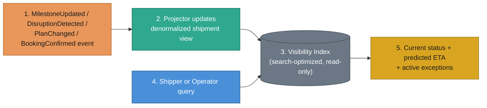

**Sequence:**
1. Any domain event lands on the bus — including `BookingConfirmed` from [§4.1](#41-demand--supply-management).
2. A projector consumes it and updates a denormalized, per-booking/per-shipment view — the CQRS write side of the read model.
3. The result lives in a search-optimized Visibility Index, physically separate from the operational store.
4. A shipper (via the Booking Portal) or an operator (via the Operator Portal) issues a query.
5. It's answered entirely from the index; the operational store is never touched by a read, which is what lets visibility absorb far higher query volume than writes.

| Level | Answers | Example |
|---|---|---|
| Booking / Shipment | Where is my shipment right now, and will it arrive on time? | Single-booking tracking page |
| Lane | How is lane Shanghai→LA performing this month? | On-time %, average dwell, disruption count |
| Network | Fleet-wide KPIs across all lanes/modes | Executive dashboard, operator capacity utilization |

#### Composite status model

A single flat `BookingStatus` is too coarse for a booking that can sit in
`IN_TRANSIT` for weeks across several legs. Rather than encoding every combination
as its own enum value (`IN_TRANSIT_DELAYED_CUSTOMS_HOLD` and so on), Visibility
exposes three independent dimensions and lets the portals compose them:

| Dimension | Values | Computed from |
|---|---|---|
| Lifecycle stage | `BookingStatus` ([§4.1](#41-demand--supply-management)) — `DRAFT` … `COMPLETED` / `CANCELLED` / `REJECTED` | The Booking's own authoritative state machine |
| Tracking detail | The active leg's canonical Milestone ([§4.3](#43-multi-modal-transport-abstraction)), plus its position ("leg 2 of 3") | The latest `MilestoneUpdated` event for the booking's current leg |
| Health | `ON_TRACK` / `AT_RISK` / `DELAYED` / `EXCEPTION` | Predicted ETA vs. `requiredDeliveryBy`, and whether any open Disruption/Exception touches an active leg |

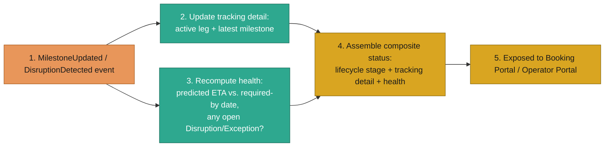

**Sequence:**
1. A `MilestoneUpdated` or `DisruptionDetected` event lands on the projector, same as the base flow above.
2. The tracking-detail field is set to the active leg's latest canonical milestone and its position among the booking's legs.
3. In parallel, health is recomputed by comparing the current predicted ETA ([§4.7](#47-milestone-processing--update)) against the booking's `requiredDeliveryBy`, and checking whether an open Disruption or Exception references one of its active legs.
4. The three dimensions are assembled into one composite status — no new state machine, just a read-time join of data that's already being tracked elsewhere.
5. Both portals read the same composite: a shipper sees "In Transit · Leg 2 of 3: Departed Shanghai · On Track"; an operator sees the identical three fields for the same booking.

| Lifecycle stage | Tracking detail | Health |
|---|---|---|
| CONFIRMED | Awaiting documentation | ON_TRACK |
| IN_TRANSIT | Leg 1 of 2 — DEPARTED origin port | ON_TRACK |
| IN_TRANSIT | Leg 1 of 2 — CUSTOMS_HOLD at transshipment port | AT_RISK |
| IN_TRANSIT | Leg 2 of 2 — IN_TRANSIT | DELAYED (predicted ETA 2 days past required-by) |
| ARRIVED_AT_DESTINATION | Leg 2 of 2 — ARRIVED, awaiting POD | ON_TRACK |

### 4.9 Communication & Notifications

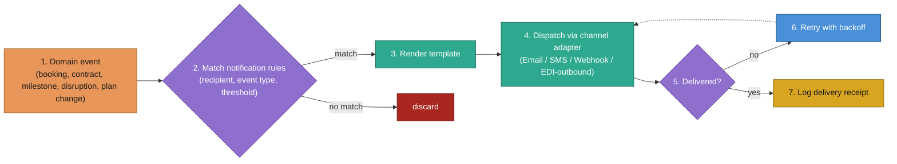

**Sequence:**
1. A domain event arrives — the same event types feeding Visibility also feed Communication, including `BookingConfirmed`, `UNMATCHED`-related alerts to operators, and `VolumeThresholdCrossed` alerts from [§4.2](#42-contract-management).
2. Rules are matched against recipient preferences and thresholds (e.g., "notify the consignee only if the ETA slip exceeds 4 hours"; "notify operators of new open demand on their lanes daily").
3. On a match, the message is rendered from a template.
4. It's dispatched through the appropriate channel adapter.
5. Delivery is confirmed or fails.
6. On failure, retry with exponential backoff.
7. Every delivery attempt is logged — the audit trail for "did the shipper/operator actually get told?"

### 4.10 Billing & Payments

The platform sits between shipper and operator commercially, not just operationally:
it invoices the shipper (Accounts Receivable) and pays the operator (Accounts
Payable), capturing the spread as margin — the same role a freight forwarder plays
today, just automated.


| Entity | Represents | Direction |
|---|---|---|
| Invoice | A bill issued to a shipper for a completed Booking | AR — platform receives |
| Settlement | An amount owed to an operator for capacity/services rendered | AP — platform pays |
| Payment | An actual money movement against an Invoice or Settlement | Either |

#### Invoice lifecycle (AR)

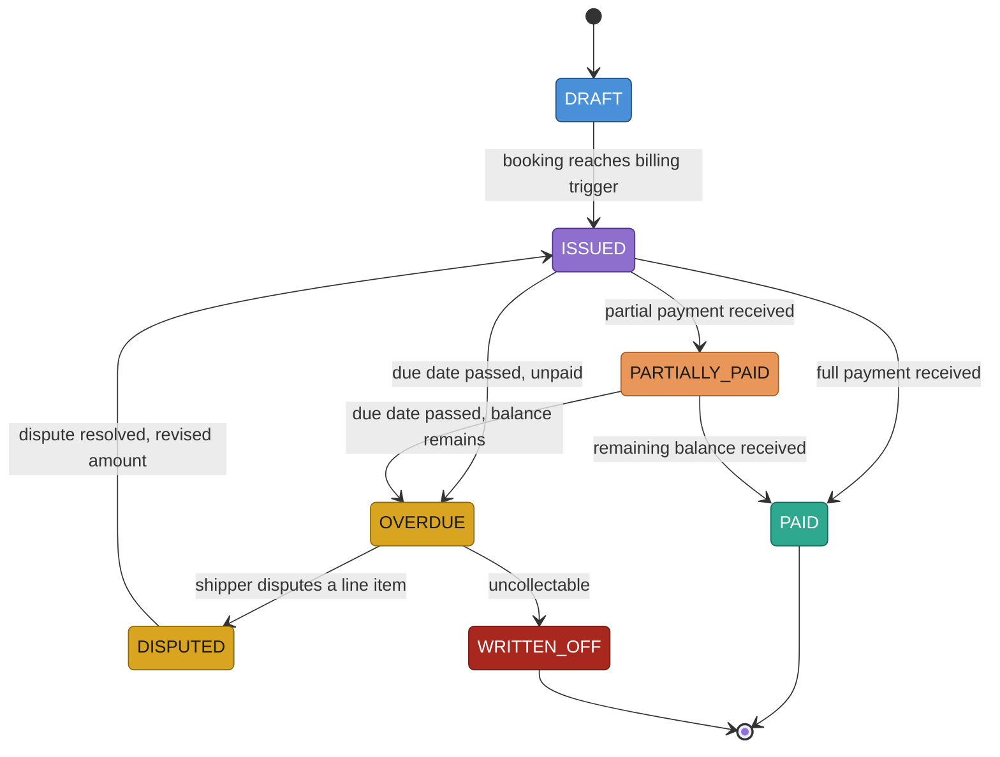

#### Settlement lifecycle (AP)

```mermaid
stateDiagram-v2
    [*] --> PENDING
    PENDING --> APPROVED : ops reviews and approves
    APPROVED --> PAID : payment executed on operator's terms
    PENDING --> DISPUTED : operator disputes the amount
    DISPUTED --> PENDING : dispute resolved, revised amount
    PAID --> [*]

    classDef early fill:#4a90d9,stroke:#1c4e78,color:#ffffff
    classDef active fill:#8e6fce,stroke:#4d2e8a,color:#ffffff
    classDef success fill:#2ea88f,stroke:#146b58,color:#ffffff
    classDef risk fill:#d9a521,stroke:#8a6a0f,color:#1a1a1a
    class PENDING early
    class APPROVED active
    class PAID success
    class DISPUTED risk
```

#### Invoice & settlement generation

```mermaid
flowchart TD
    A["1. MilestoneUpdated reaches the billing trigger<br/>(e.g. DELIVERED / POD_RECEIVED, per tenant policy)"] --> B["2. Pull the Plan's cost breakdown<br/>(already split by Incoterm, §4.1)"]
    B --> C["3. Add accessorials<br/>(detention, demurrage, customs duty)"]
    C --> D["4. Apply Contract rate<br/>if the booking was made under one"]
    D --> E["5. Issue Invoice to the shipper (AR)<br/>due date from payment terms"]
    D --> F["6. Issue Settlement to the operator (AP)<br/>due date from operator's terms"]
    E --> G["7. Margin = Invoice amount − Settlement amount"]
    F --> G

    classDef trigger fill:#4a90d9,stroke:#1c4e78,color:#ffffff
    classDef process fill:#2ea88f,stroke:#146b58,color:#ffffff
    classDef outcome fill:#d9a521,stroke:#8a6a0f,color:#1a1a1a
    class A trigger
    class B,C,D process
    class E,F,G outcome
```

**Sequence:**
1. A `MilestoneUpdated` event crosses the tenant's configured billing trigger — typically `DELIVERED` or `POD_RECEIVED` ([§4.7](#47-milestone-processing--update)), though some contracts bill earlier (e.g., on `DEPARTED`, common for prepaid ocean freight).
2. Billing pulls the confirmed `Plan`'s cost breakdown — already itemized per leg and tagged Shipper- or Consignee-responsible per the Incoterm matrix ([§4.1](#41-demand--supply-management)) — and folds it into one Invoice addressed to whoever created the Booking.
3. Any accessorial charges incurred during execution are added — a customs duty triggered by a `CUSTOMS_HOLD` exception, plus whatever the `AccessorialRule` engine below has computed from actual milestone timestamps, rather than anything entered as a manual line item.
4. If the booking was made under a `Contract`, its negotiated rate applies instead of whatever spot rate may have informed the original estimate.
5. An `Invoice` is issued to the shipper with a due date from the shipper's payment terms (tenant default, or contract-specific — e.g. Net 30).
6. A `Settlement` is issued to the operator with a due date from the operator's own payment terms.
7. The platform's margin on this booking is simply the difference between the two — no separate calculation needed, since both are built from the same cost breakdown.

#### Accessorial charges

Demurrage, detention, chassis detention, extended storage — every one of these is
structurally the same thing: a clock starts at one milestone, stops at another,
and a charge accrues only for the time past a free-time allowance. Rather than
hardcoding each as its own special case, the platform holds them as data — an
`AccessorialRule` table, not bespoke logic per charge type:

| Rule | Start Milestone | End Milestone | Typical Free Time | Applies At |
|---|---|---|---|---|
| Origin Demurrage | `ORIGIN_GATE_IN` | `LOADED` | 3–5 days | Port, Rail Yard, Airport |
| Destination Demurrage | `ARRIVED` | `DEPARTED` of the next Leg | 4–7 days | Port, Rail Yard, Airport |
| Origin Detention | `EMPTY_DISPATCHED` | `ORIGIN_GATE_IN` | 2–5 days | Any (shipper's facility) |
| Destination Detention | `DELIVERED` | `EMPTY_RETURNED` | 4–5 days | Any (consignee's facility) |
| Chassis Detention | `ORIGIN_GATE_IN` (chassis picked up) | chassis returned to pool | 1–3 days | Road |
| Node Handling / Storage | Node entry | Node exit | Contract-specific | 3PL Warehouse, Transload Facility ([§3](#3-domain-model)) |

Demurrage is deliberately the mirror of detention: detention is the carrier's
equipment sitting too long at a *private* facility (shipper's or consignee's dock);
demurrage is cargo sitting too long at a *terminal* (port, rail yard, airport). Both
are just different `Node` types plugged into the same rule shape.

```mermaid
flowchart TD
    A["1. A rule's start milestone fires<br/>(e.g. ARRIVED at a Port)"] --> B{"2. Elapsed time ≥ 80% of free time,<br/>end milestone still hasn't fired?"}
    B -->|yes| C["3. Publish AccessorialRiskDetected —<br/>Communication alerts the responsible party (§4.9)"]
    B -->|no| D["keep watching"]
    A --> E["4. End milestone fires<br/>(e.g. next Leg's DEPARTED)"]
    E --> F["5. Duration = end − start timestamp"]
    F --> G{"6. Duration > free time?"}
    G -->|no| H["No charge"]
    G -->|yes| I["7. Charge = (duration − free time) × rate/day,<br/>billed per the Incoterm matrix (§4.1)"]

    classDef trigger fill:#4a90d9,stroke:#1c4e78,color:#ffffff
    classDef decision fill:#8e6fce,stroke:#4d2e8a,color:#ffffff
    classDef risk fill:#d9a521,stroke:#8a6a0f,color:#1a1a1a
    classDef neutral fill:#6b7785,stroke:#3d454e,color:#ffffff
    classDef success fill:#2ea88f,stroke:#146b58,color:#ffffff
    classDef charge fill:#e8965a,stroke:#a85c1f,color:#1a1a1a
    class A,E trigger
    class B,G decision
    class C risk
    class D,F neutral
    class H success
    class I charge
```

**Sequence:**
1. A rule's start milestone fires — most pairs sit across a Node's `ARRIVED` and the *next* Leg's `DEPARTED`, so a rule doesn't need a dedicated "gate-out" milestone of its own.
2. While the clock runs, if free time is nearly exhausted and the end milestone still hasn't fired, that's a live risk, not just a future line item.
3. An `AccessorialRiskDetected` event lets Communication ([§4.9](#49-communication--notifications)) warn the responsible party *before* any charge accrues — the same "detect early, act before it's a bill" instinct already used for [Disruption Detection](#46-disruption-detection--handling) and [volume-commitment shortfall warnings](#42-contract-management).
4. Eventually the end milestone fires.
5. The actual duration between the two real timestamps is computed.
6. If it's within free time — the overwhelming majority of cases — nothing happens.
7. If not, the charge is `(duration − free time) × rate per day`, and it's billed to whichever party the Incoterm responsibility matrix ([§4.1](#41-demand--supply-management)) makes responsible for that leg's phase — not always the Shipper.

Adding a new accessorial — a regional peak-season dock fee, a re-delivery charge,
whatever a new lane turns up — is a new row in this table, never new code.

#### Payment & collections

```mermaid
flowchart TD
    A["1. Shipper pays an Invoice<br/>(Booking Portal → payment gateway)"] --> B["2. Payment recorded;<br/>Invoice → PARTIALLY_PAID or PAID"]
    B --> C{"3. Due date passed<br/>with a balance remaining?"}
    C -->|yes| D["4. Invoice → OVERDUE"]
    D --> E["5. Communication sends escalating<br/>dunning reminders"]
    E --> F{"6. Still unpaid past a<br/>credit-risk threshold?"}
    F -->|yes| G["7. New Bookings from this shipper<br/>blocked at Confirm time"]
    F -->|no| H["Booking eligibility unaffected"]

    classDef trigger fill:#4a90d9,stroke:#1c4e78,color:#ffffff
    classDef decision fill:#8e6fce,stroke:#4d2e8a,color:#ffffff
    classDef risk fill:#d9a521,stroke:#8a6a0f,color:#1a1a1a
    classDef terminalFail fill:#a8271f,stroke:#6b1a14,color:#ffffff
    classDef success fill:#2ea88f,stroke:#146b58,color:#ffffff
    class A,B trigger
    class C,F decision
    class D,E risk
    class G terminalFail
    class H success
```

**Sequence:**
1. A shipper pays an Invoice through the Booking Portal, which hands off to a payment gateway (card, ACH, wire).
2. A `Payment` record is created and the Invoice's status updates to `PARTIALLY_PAID` or `PAID`.
3. If the due date passes with a balance still outstanding, the Invoice moves to `OVERDUE`.
4. Communication ([§4.9](#49-communication--notifications)) sends escalating dunning reminders — the same rules-engine mechanism already used for volume-commitment alerts, just a different trigger.
5. If a shipper's overdue AR balance crosses a configurable credit-risk threshold, new Bookings from that tenant are blocked at `confirm()` time rather than left to fail later ([§4.4](#44-planning-engine)) — cheaper to catch than a booking that ships and is never paid for.

#### Multi-currency & FX

`Money` is `{ amount, currencyCode }` everywhere in this document — operators quote in
their own currency, shippers expect to see and pay in theirs, and the platform sits
in between bearing the difference.

```mermaid
flowchart TD
    A["1. Quote priced in the operator's currency<br/>(from its RateCard)"] --> B["2. Converted to the shipper's preferred<br/>currency at the current FX rate"]
    B --> C["3. FX rate locked for the same validUntil<br/>window as the Quote itself"]
    C --> D{"4. Shipper confirms<br/>before expiry?"}
    D -->|yes| E["5. Invoice issued in the shipper's<br/>currency at the locked rate"]
    D -->|no| F["Quote expires — re-quote<br/>at the current rate (§4.4)"]
    E --> G["6. Settlement to the operator stays in<br/>their currency — no conversion needed"]
    G --> H["7. Platform absorbs any FX movement<br/>between quote-lock and settlement"]

    classDef process fill:#2ea88f,stroke:#146b58,color:#ffffff
    classDef decision fill:#8e6fce,stroke:#4d2e8a,color:#ffffff
    classDef success fill:#d9a521,stroke:#8a6a0f,color:#1a1a1a
    classDef neutral fill:#6b7785,stroke:#3d454e,color:#ffffff
    classDef hinge fill:#e8965a,stroke:#a85c1f,color:#1a1a1a
    class A,B,C process
    class D decision
    class E,G success
    class F neutral
    class H hinge
```

**Sequence:**
1. A candidate is priced in the operator's `RateCard` currency, exactly as in the base quote flow ([§4.4](#44-planning-engine)).
2. For display, it's converted to the shipper's preferred currency using a cached FX rate ([§6.3](#63-read-scaling)-style caching — refreshed periodically, not fetched per quote).
3. That FX rate is locked for the same `validUntil` window as the Quote — one expiry governs both price and rate.
4. If the shipper confirms in time, the locked rate applies; if not, the quote flow re-runs at whatever the current rate is.
5. The Invoice is issued in the shipper's currency at the locked rate — the number they saw is the number they pay.
6. The Settlement to the operator is generated in the operator's own currency from their own rate card — it was never converted.
7. Any FX movement between the moment the rate was locked and the moment the platform actually settles with the operator is absorbed by the platform, not passed to either party — the cost of offering price certainty at quote time.

### 4.11 Trade Compliance & Documentation

A shipment can be perfectly planned and still be illegal to move. This section covers
the two things that gate movement independent of capacity or cost: **screening/duty**
(is this shipment allowed to happen at all, and what does it cost the government) and
**documentation** (does the paperwork required to prove that exist yet).

#### Screening, classification, and duty

```mermaid
flowchart TD
    A["1. Booking submitted with HS code(s),<br/>declared value, and parties"] --> B["2. Screen shipper, consignee, and notify<br/>party against denied-party lists"]
    B --> C{"3. Any match?"}
    C -->|yes| D["4a. Block the booking; raise a<br/>compliance Exception for manual review"]
    C -->|no| E["4b. Classify cargo: HS code → duty rate,<br/>restricted-goods check, DG class"]
    E --> F{"5. Dangerous goods?"}
    F -->|yes| G["6a. Filter candidates to DG-certified<br/>CapacityOfferings only"]
    F -->|no| H["6b. No DG filtering needed"]
    G --> I["7. Compute estimated duty from<br/>HS code + destination tariff schedule"]
    H --> I
    I --> J["8. Duty folds into the Quote's price,<br/>then the Invoice's accessorials"]

    classDef trigger fill:#4a90d9,stroke:#1c4e78,color:#ffffff
    classDef decision fill:#8e6fce,stroke:#4d2e8a,color:#ffffff
    classDef terminalFail fill:#a8271f,stroke:#6b1a14,color:#ffffff
    classDef process fill:#2ea88f,stroke:#146b58,color:#ffffff
    classDef neutral fill:#6b7785,stroke:#3d454e,color:#ffffff
    classDef outcome fill:#d9a521,stroke:#8a6a0f,color:#1a1a1a
    class A trigger
    class B,E process
    class C,F decision
    class D terminalFail
    class G,H neutral
    class I,J outcome
```

**Sequence:**
1. A Booking is submitted with an HS code per cargo line, a declared value, and every named party — shipper, consignee, and any notify party.
2. Every named party is screened against denied-party/sanctions lists (e.g. OFAC, EU, UN consolidated lists) — Shipper, Consignee, Notify Party, Importer of Record, and Exporter of Record ([§3](#3-domain-model)), not just the two trading parties.
3. A match on any party is treated as a hard stop, not a warning.
4a. If matched, the Booking is blocked before it ever reaches Matching, and a compliance `Exception` is raised for manual review — the same `Exception` concept already used for disruptions ([§4.6](#46-disruption-detection--handling)).
4b. If clear, each `CargoLineItem` is classified independently: its HS code and `countryOfOrigin` together determine the applicable duty rate — the standard rate, or a preferential FTA rate if origin and destination qualify — whether it's restricted for the destination country, and whether it carries a Dangerous Goods classification.
5. If the cargo is DG-classified...
6a. ...the Matching Engine's candidate list is filtered to only `CapacityOffering`s certified to carry that DG class — the same style of hard filter already used for Incoterm/mode compatibility ([§4.1](#41-demand--supply-management)).
6b. Non-DG cargo skips this filter entirely.
7. Estimated duty is computed per `CargoLineItem` from its HS code, country of origin, and the destination's tariff schedule, then summed.
8. That total folds directly into the Quote's price ([§4.4](#44-planning-engine)) and, later, the Invoice's accessorial charges ([§4.10](#410-billing--payments)) — one number, computed once, used in both places.

| DG Class | Description | Example |
|---|---|---|
| Class 1 | Explosives | Fireworks, ammunition |
| Class 2 | Gases | Compressed/liquefied gases, aerosols |
| Class 3 | Flammable liquids | Fuels, solvents, paints |
| Class 4 | Flammable solids | Matches, certain metal powders |
| Class 5 | Oxidizers & organic peroxides | Bleaching agents |
| Class 6 | Toxic & infectious substances | Pesticides, medical waste |
| Class 7 | Radioactive material | Medical isotopes |
| Class 8 | Corrosives | Acids, batteries |
| Class 9 | Miscellaneous | Lithium batteries, dry ice |

#### Required documents

Which documents a Booking needs depends on its mode, Incoterm, cargo, and destination
country — a DDP shipment into a country requiring an import license needs a different
set than an EXW domestic move.

> **Naming note:** the "Commercial Invoice" below is unrelated to the platform's own
> `Invoice` entity ([§4.10](#410-billing--payments)). One declares the *value of the
> goods* to customs; the other bills the Shipper for *freight services*. They share a
> name only because that's the real-world legal term for the customs document —
> nothing in this design conflates the two. `TransportDocument` and `Invoice` are
> separate entities with separate lifecycles.

| Document | Purpose | Typically issued by | Required when |
|---|---|---|---|
| Bill of Lading (BOL) / Air Waybill (AWB) | Contract of carriage + title to goods — carries each `Leg`'s conveyance name/number and container/seal numbers ([§3](#3-domain-model)); its `metadata` holds the Master BOL/AWB number when a Forwarder is involved | Operator (or Forwarder, as Master) | Always (ocean/air FCL) |
| House BOL | Consolidator's/Forwarder's BOL to the shipper — its `relatedDocumentId` points back to the Master BOL it was cut against ([§3](#3-domain-model)) | Operator/Forwarder | LCL bookings, or any FCL booking made through a Forwarder |
| Commercial Invoice | Declares value and description of goods for customs, one line per `CargoLineItem` | Shipper | Always |
| Packing List | Itemized contents, weights, dimensions, one line per `CargoLineItem` | Shipper | Always |
| Certificate of Origin | Declares each line's `countryOfOrigin` — needed for preferential (FTA) duty rates | Shipper / Chamber of Commerce | When claiming preferential duty treatment |
| Dangerous Goods Declaration | Certifies each DG `CargoLineItem`'s UN number, packing group, packing, and labeling | Shipper | DG cargo only |
| Certificate of Insurance | Proof of cargo insurance coverage | Shipper or platform | CIF/CIP Incoterms, or on request |
| Export/Import License | Government authorization to ship a controlled good | Shipper | Controlled/restricted HS codes |
| Advance Ship Notice (ASN) | Pre-notifies the receiving facility of contents and arrival window | Shipper | Destination is a Fulfillment Center or 3PL warehouse ([§3](#3-domain-model)) |
| Proof of Delivery (POD) | Signed confirmation of receipt — quantity, condition, signature, timestamp | Operator (captured at handoff) | Always — generated *at* `DELIVERED`, not required before it; gates `POD_RECEIVED` and, for tenants that bill on it, the billing trigger itself |

"Typically issued by" is a default, not a hard rule — under EXW or FCA, import-side
documents fall to the Consignee rather than the Shipper, the same Incoterm
responsibility matrix from [§4.1](#41-demand--supply-management) that already
decides who's responsible for each `Leg`. The document-lifecycle mechanics below
don't care which party produces a document, only whether it's `ISSUED` in time.

```mermaid
stateDiagram-v2
    [*] --> REQUIRED
    REQUIRED --> DRAFT : a party begins preparing it
    DRAFT --> ISSUED : finalized and signed
    ISSUED --> AMENDED : correction needed
    AMENDED --> ISSUED : re-issued
    ISSUED --> [*]

    classDef early fill:#4a90d9,stroke:#1c4e78,color:#ffffff
    classDef executing fill:#e8965a,stroke:#a85c1f,color:#1a1a1a
    classDef success fill:#2ea88f,stroke:#146b58,color:#ffffff
    classDef risk fill:#d9a521,stroke:#8a6a0f,color:#1a1a1a
    class REQUIRED early
    class DRAFT executing
    class ISSUED success
    class AMENDED risk
```

#### System-generated documents

The documents above are all *produced by a party* and gate a milestone. Two more
`TransportDocument` types exist that are produced by the *platform itself*,
purely to consolidate planning data that would otherwise be scattered across
`Plan`, `Leg`, and `CapacityOffering` — they don't gate anything, and they skip
`REQUIRED`/`DRAFT` entirely: they're generated fully formed, `ISSUED`, the instant
their trigger fires.

| Document | Audience | Contents | (Re-)generated when |
|---|---|---|---|
| Booking Confirmation | Shipper | Booking reference, Incoterm & Consignee, cargo summary, the full routing — every Leg in order with its mode, origin/destination `Node`, planned departure/arrival, and the Operator behind its `capacityOfferingId` — plus the Shipper's cost per the Incoterm matrix ([§4.1](#41-demand--supply-management)) and the `Plan` version it reflects | Booking reaches `CONFIRMED`; regenerated (new version) on every replan ([§4.5](#45-replanning-engine)) |
| Rate / Load Confirmation | Operator | The specific Leg(s) assigned to that Operator's `CapacityOffering`, pickup/delivery windows, the cargo details needed to execute (weight, volume, container type), and the agreed rate from the Quote that won `confirm()` ([§4.4](#44-planning-engine)) | Same triggers, scoped to whichever Operator's legs actually changed |

This is the direct answer to "where do planning details, service-provider details,
and the timeline live together": nowhere else — every other entity holds one
slice of it. The Booking Confirmation is that join, materialized once per Plan
version instead of assembled on demand, so old versions stay exactly what the
Shipper actually saw at the time, even after a replan changes the current one.
A superseded `Plan` version's Booking Confirmation is never deleted, only
outranked by the next version's — the same immutability already used for `Plan`
itself ([§8](#8-major-design-decisions--trade-offs)).

#### The legality gate

The key rule: a shipment cannot legally reach certain milestones without the right
paperwork already `ISSUED` — regardless of what a carrier feed reports.

| Milestone gate | Documents that must be `ISSUED` first |
|---|---|
| `DOCUMENTATION_READY` (Booking lifecycle, [§4.1](#41-demand--supply-management)) | Commercial Invoice, Packing List, draft BOL/AWB |
| `LOADED` (DG cargo only) | Dangerous Goods Declaration |
| `CUSTOMS_CLEARED` | Commercial Invoice, Packing List, Certificate of Origin (if FTA claimed), Import License (if controlled) |
| `DELIVERED` | Original (or express-release) BOL/AWB — plus an Advance Ship Notice, sent ahead of arrival, if the destination is a Fulfillment Center or 3PL warehouse ([§3](#3-domain-model)) |

```mermaid
flowchart TD
    A["1. Booking confirmed →<br/>required document set determined"] --> B["2. Each document tracked:<br/>REQUIRED → DRAFT → ISSUED"]
    B --> C{"3. Milestone transition attempted<br/>(e.g. → CUSTOMS_CLEARED)"}
    C --> D{"4. Every document gating this<br/>milestone is ISSUED?"}
    D -->|yes| E["5. Transition allowed"]
    D -->|no| F["6. Transition blocked;<br/>Exception raised — missing document"]

    classDef trigger fill:#4a90d9,stroke:#1c4e78,color:#ffffff
    classDef process fill:#2ea88f,stroke:#146b58,color:#ffffff
    classDef decision fill:#8e6fce,stroke:#4d2e8a,color:#ffffff
    classDef success fill:#d9a521,stroke:#8a6a0f,color:#1a1a1a
    classDef terminalFail fill:#a8271f,stroke:#6b1a14,color:#ffffff
    class A trigger
    class B process
    class C,D decision
    class E success
    class F terminalFail
```

**Sequence:**
1. Once a Booking is confirmed, its required document set is determined from mode, Incoterm, cargo/HS code, and destination country.
2. Each required document is tracked through `REQUIRED` → `DRAFT` → `ISSUED` (occasionally `AMENDED`) independently of the shipment's physical progress.
3. Whenever the Milestone Processing Service attempts a gated transition ([§4.7](#47-milestone-processing--update))...
4. ...it checks whether every document required for that specific milestone is `ISSUED`.
5. If so, the transition proceeds exactly as described in [§4.7](#47-milestone-processing--update).
6. If not, the transition is blocked and an `Exception` is raised — a shipment cannot be marked `CUSTOMS_CLEARED` with a missing Certificate of Origin no matter what a carrier's own tracking system says, because the milestone state machine itself enforces the legal precondition rather than trusting the raw event.

#### Document generation timeline

Everything above is organized by document type, by generator, and by gate — this
is the same information reorganized by *when*, one pass through the whole
lifecycle, booking to container return:

| Lifecycle Point | Document(s) | Produced By |
|---|---|---|
| Booking `CONFIRMED` (Plan v1 created) | Booking Confirmation; Rate/Load Confirmation | Platform (system-generated) |
| Booking `DOCUMENTATION_READY` | Commercial Invoice; Packing List; draft BOL/AWB; Certificate of Origin (if FTA claimed); Export License (if controlled goods); Certificate of Insurance (if CIF/CIP, or on request) | Shipper (+ Chamber of Commerce for Certificate of Origin) |
| Before `LOADED` (DG cargo only) | Dangerous Goods Declaration | Shipper |
| `LOADED` / `DEPARTED` | BOL/AWB finalized (House BOL instead, if LCL) | Operator / Forwarder |
| Once on-carriage ETA is known, ahead of `DELIVERED` (Fulfillment Center / 3PL destinations only) | Advance Ship Notice (ASN) | Shipper |
| `CUSTOMS_CLEARED` (a gate — nothing new produced here; everything above must already be `ISSUED`) | — | Importer of Record files the clearance |
| `DELIVERED` | Original/express-release BOL/AWB presented; Proof of Delivery captured | Consignee presents the BOL; Operator captures the POD |
| `DELIVERED` / `POD_RECEIVED` (the billing trigger, per tenant policy) | Invoice (AR) to the Shipper; Settlement (AP) to the Operator | Platform (Billing Service, [§4.10](#410-billing--payments)) |
| `EMPTY_RETURNED` | None new — unless the detention window was exceeded, which adds an accessorial line to the Invoice already issued | — |
| Any `Plan` version bump (a replan) | A new Booking Confirmation / Rate Confirmation version is issued; the prior version is superseded, never edited ([§4.5](#45-replanning-engine)) | Platform |

One consequence worth naming: the busiest single point in the entire lifecycle is
`DOCUMENTATION_READY`, days before anything physically moves — five of the ten
document types in this section either get produced there or become producible
there. Execution itself (`LOADED` through `EMPTY_RETURNED`) generates only three
more, because by then the paperwork's job is mostly to be checked, not written.

### 4.12 Upstream Demand & Procurement Planning

Everything so far starts from a `Booking` that already exists. This section covers
what happens before that: predicting what a shipper will need, ordering it from a
`Supplier`, and having that order's confirmation generate the `Booking` automatically.
This is genuinely upstream of transportation — modeled here as a new front door into
the same pipeline, not a parallel system.

```mermaid
flowchart TD
    A["1. Demand Forecast predicts future<br/>need for a SKU at a location"] --> B["2. Generate a draft Purchase Order<br/>to a qualified Supplier"]
    B --> C["3. Supplier confirms the PO with<br/>a ready-by date and quantity"]
    C --> D["4. PO confirmation auto-creates a Booking<br/>(Supplier's location → shipper's destination)"]
    D --> E["5. Booking flows through the existing<br/>demand/supply/matching pipeline unchanged"]
    E --> F["6. Supplier performance tracked —<br/>feeds future forecast confidence"]

    classDef trigger fill:#4a90d9,stroke:#1c4e78,color:#ffffff
    classDef process fill:#2ea88f,stroke:#146b58,color:#ffffff
    classDef hinge fill:#d9a521,stroke:#8a6a0f,color:#1a1a1a
    classDef downstream fill:#e8965a,stroke:#a85c1f,color:#1a1a1a
    class A trigger
    class B,C process
    class D hinge
    class E,F downstream
```

**Sequence:**
1. A `DemandForecast` — built from historical consumption, seasonality, or a manual planner override — predicts how much of a SKU will be needed at a location within a horizon.
2. When predicted need crosses a reorder threshold, a draft `PurchaseOrder` is generated against a qualified `Supplier` for that SKU.
3. The Supplier confirms the PO, committing to a ready-by date and quantity — which may differ from the request (partial fulfillment, a later date).
4. Once confirmed, the PO's ready-by date and location automatically generate a `Booking` ([§4.1](#41-demand--supply-management), and step 0 of [§2](#2-high-level-architecture)'s master sequence) — procurement's output is transportation's input.
5. From that point on, this Booking is indistinguishable from one a shipper created directly: it flows through matching, contracting, compliance, planning, milestones, visibility, and billing exactly as described everywhere else in this document. Nothing downstream needed to change to support this new entry point.
6. Supplier performance (on-time %, quantity/quality accuracy) is tracked the same way lane/operator performance is tracked in Visibility ([§4.8](#48-visibility-control-tower)), and feeds back into future forecast confidence and Supplier qualification.

```mermaid
stateDiagram-v2
    [*] --> DRAFT
    DRAFT --> SENT : sent to Supplier
    SENT --> CONFIRMED : Supplier commits to a ready-by date/quantity
    SENT --> REJECTED : Supplier declines
    CONFIRMED --> BOOKING_CREATED : Booking auto-generated
    BOOKING_CREATED --> FULFILLED : goods picked up
    DRAFT --> CANCELLED
    SENT --> CANCELLED
    CONFIRMED --> CANCELLED
    FULFILLED --> [*]
    CANCELLED --> [*]
    REJECTED --> [*]

    classDef early fill:#4a90d9,stroke:#1c4e78,color:#ffffff
    classDef gating fill:#8e6fce,stroke:#4d2e8a,color:#ffffff
    classDef hinge fill:#d9a521,stroke:#8a6a0f,color:#1a1a1a
    classDef success fill:#2ea88f,stroke:#146b58,color:#ffffff
    classDef terminalFail fill:#a8271f,stroke:#6b1a14,color:#ffffff
    class DRAFT early
    class SENT,CONFIRMED gating
    class BOOKING_CREATED hinge
    class FULFILLED success
    class CANCELLED,REJECTED terminalFail
```

---

## 5. Event Backbone & Integration Layer

Every event on the bus shares one canonical envelope, regardless of producer:

```
Event {
    eventId       UUID        // for consumer-side dedupe (and replay-attack prevention, §14)
    eventType     enum        // BookingConfirmed | MilestoneUpdated | DisruptionDetected | PlanChanged | VolumeThresholdCrossed | ...
    tenantId      string
    occurredAt    Instant     // when it happened in the real world
    ingestedAt    Instant     // when the platform received it
    source        string
    payload       JSON
}
```

- **Partitioning**: by `(tenantId, shipmentId)` hash — guarantees ordered processing per shipment. Booking-side events (before a shipment exists) partition by `bookingId`.
- **Delivery**: at-least-once. Every consumer must be idempotent, deduping on `eventId` — the same discipline used for milestone ingestion in [§4.7](#47-milestone-processing--update).
- **Ingestion adapters** are the only place that understands a source's native format (EDI 214, carrier REST webhook, IoT/GPS, weather API, port congestion feed, supplier ERP, payment gateway callback, Operator Portal manual update) — everything past the adapter speaks only the canonical envelope.
- **Authentication happens before any of this**: every inbound request is authenticated and authorized at the boundary, before an adapter ever sees the payload — see [§14](#14-security).

### Onboarding a new external entity

"External entity" is deliberately generic — a new carrier, a weather-data provider, a
supplier's ERP, and a payment gateway all onboard the same way.

```mermaid
flowchart TD
    A["1. External entity requests integration"] --> B["2. Credentials issued —<br/>OAuth client / API key / mTLS cert (§14)"]
    B --> C["3. Implement or configure an Adapter<br/>mapping their format to a canonical Event"]
    C --> D["4. Adapter registered against<br/>the Ingestion & Adapter Layer"]
    D --> E["5. Inbound requests authenticated + authorized<br/>at the boundary (§14) before reaching the adapter"]
    E --> F["6. Canonical events published to the bus —<br/>every existing reactor picks them up automatically"]

    classDef trigger fill:#4a90d9,stroke:#1c4e78,color:#ffffff
    classDef gate fill:#8e6fce,stroke:#4d2e8a,color:#ffffff
    classDef process fill:#2ea88f,stroke:#146b58,color:#ffffff
    classDef outcome fill:#d9a521,stroke:#8a6a0f,color:#1a1a1a
    class A trigger
    class B,E gate
    class C,D process
    class F outcome
```

**Sequence:**
1. Any external entity — a new carrier, a weather-data provider, a supplier's ERP, a payment gateway — requests integration.
2. Credentials are issued appropriate to the integration style ([§14](#14-security)): an OAuth client for API-based partners, an API key for simple webhooks, an mTLS certificate for high-trust system-to-system links.
3. An ingestion `Adapter` is implemented — or, for an already-supported format, just configured — to map their native shape to a canonical `Event`.
4. The adapter is registered against the Ingestion & Adapter Layer. Nothing downstream changes.
5. From that point on, every inbound request from this entity is authenticated and authorized before it ever reaches business logic.
6. Once normalized and published, the event is picked up automatically by whichever reactors already care about that event type — no additional wiring for this specific source.

An LSP or Forwarder onboards through the exact same six steps as a single
carrier — the only difference is scope. Its adapter reports milestones across
several underlying Operators' Legs through one integration, resolved per-event
by whichever `CapacityOffering`/container the update actually belongs to, and
authorized against `relaysForOperatorIds` rather than one carrier's own
shipments ([§14](#14-security)).

### What reacts to what

This is the system's reactive core made explicit: every event type has a fixed,
independent set of reactors, and adding a new reaction to an existing event never
requires touching the producer.

| Event Type | Reactors | Action Taken |
|---|---|---|
| `BookingConfirmed` | Visibility, Communication | Update control-tower projection; notify the shipper |
| `MilestoneUpdated` | Milestone Processing, Disruption Detection, Visibility, Communication, Billing | Apply the lifecycle transition + recompute ETA; check for an SLA breach; update the projection; notify on key milestones; trigger invoicing/settlement if this is the billing-trigger milestone |
| `DisruptionDetected` | Replanning, Visibility, Communication | Auto- or human-gated replan; flag health as `AT_RISK`/`DELAYED`; alert affected parties |
| `PlanChanged` | Visibility, Communication | Update the projection; notify of the change |
| `ContractUpdated` | Matching Engine | Invalidate the cached rate/capacity-pool data |
| `SupplyUpdated` | Matching Engine, Operator Portal | Invalidate the cache; re-evaluate any `UNMATCHED` bookings on that lane |
| `ComplianceException` | Booking Service, Communication | Block the booking; alert compliance/ops |
| `VolumeThresholdCrossed` | Communication | Early-warning notification to the shipper's account team |
| `PaymentReceived` | Billing | Update the Invoice's status |
| `PurchaseOrderConfirmed` | Procurement Service | Auto-generate a Booking |
| `AccessorialRiskDetected` | Communication | Warn the responsible party before a demurrage/detention charge accrues |

---

## 6. Scalability

| Metric | Target |
|---|---|
| Active bookings | 10M |
| Active CapacityOfferings | ~500K (far fewer than bookings — supply is coarser-grained than demand) |
| Active Contracts | ~50K (one per meaningful shipper-operator relationship, not per booking) |
| Avg milestones per shipment | ~15 |
| Milestone events/day | ~150M (~1,736/sec average, bursty around vessel/flight schedules) |
| Visibility query volume | 10–50× write volume, as a rule of thumb (shippers/operators/partners polling status) — see [§6.5](#65-capacity-math) for a bottom-up estimate |

Every engine in [§4](#4-core-capability-deep-dives) was already designed stateless
where possible specifically so this section has something to scale. The rest of this
section makes that concrete: what scales how, on what key, by how much, and what
breaks first if it doesn't.

### 6.1 Scaling Classification

| Component | Stateful? | Scaling approach |
|---|---|---|
| Booking / Supply / Contract Services | Stateless (delegate to the store) | Horizontal, behind a load balancer |
| Matching Engine | Stateless (reads cached indices) | Horizontal; sharded by `(laneId, mode)` for cache locality |
| Planning Engine | Stateless | Horizontal worker pool, pulls from a work queue |
| Replanning Engine | Stateless | Horizontal worker pool |
| Disruption Detection Service | Stateless (rule evaluation) | Horizontal, partitioned by lane |
| Milestone Processing Service | Stateless (per-event) | Horizontal, partitioned by `shipmentId` (preserves per-shipment ordering) |
| Communication Service | Stateless | Horizontal |
| Compliance Service | Stateless (screening + calculation) | Horizontal; denied-party lists cached locally per instance |
| Billing Service | Stateless (delegates to the store) | Horizontal |
| Procurement Service | Stateless (forecasting is batch, not per-request) | Horizontal for PO handling; forecasting jobs run on a schedule, not a request path |
| Security (authn/authz) | Stateless (token/signature validation) | Horizontal, enforced at the edge/gateway in front of every other service |
| Operational Store (Bookings/Supply/Contracts/Plans/Billing/Compliance/Procurement) | Stateful | Sharded — see [§6.2](#62-data-partitioning--sharding) |
| Visibility Index | Stateful (but read-optimized) | Sharded + read replicas — see [§6.3](#63-read-scaling) |
| Event Backbone | Stateful (partitioned log) | Broker cluster, partition count set by throughput math — see [§6.5](#65-capacity-math) |

The pattern: every service that makes a *decision* is stateless and horizontally
scaled; only the handful of components that hold *data* are stateful, and each of
those has its own sharding key chosen for the query pattern that dominates it.

This table doubles as the extraction order for decomposing the modular monolith
([§8](#8-major-design-decisions--trade-offs)) into independently deployed services:
extract whichever components have the most different scaling curve from the rest
first. Milestone Processing scales with ingestion volume, Visibility with read
volume, and Matching/Planning with booking bursts — three genuinely different curves,
and the three most likely to be pulled out before anything else needs to move.

### 6.2 Data Partitioning & Sharding

| Store | Shard key | Rationale |
|---|---|---|
| Booking / Shipment / Plan | `hash(tenantId, bookingId) % N` | Even distribution regardless of tenant size; looking up one booking always resolves to exactly one shard |
| CapacityOffering (Supply) | `hash(operatorId) % M` | An operator's own offerings colocate — the Operator Portal's "my supply" view never fans out across shards |
| Contract | `hash(operatorId, tenantId) % M` | A small dataset overall; sharded mainly to spread write load evenly, not because any one shard would otherwise be hot |
| Milestone stream | `hash(legId)`, co-located with its parent shipment's shard | A leg's full milestone history lives on one shard — rendering a timeline is never a scatter-gather |
| Lane → Leg index (disruption impact) | `hash(laneId)` | A disruption always resolves through exactly one lane, so impact assessment ([§4.6](#46-disruption-detection--handling)) never fans out |
| Lane → Offering index (matching) | `hash(laneId, mode)` | Matching a booking ([§4.1](#41-demand--supply-management)) is a single-shard lookup, not a scan of the whole supply base |
| Invoice / Settlement / Payment | `hash(tenantId, bookingId)` | Co-located with the booking/shipment they're derived from — rendering a booking's billing history is never a scatter-gather |
| ComplianceCheck / TransportDocument | `hash(tenantId, bookingId)` | Same shard as the Booking they belong to — the legality gate ([§4.11](#411-trade-compliance--documentation)) never needs a cross-shard lookup |
| PurchaseOrder / DemandForecast | `hash(tenantId, supplierId)` / `hash(tenantId, sku, locationId)` | Procurement data is small relative to bookings; sharded mainly to spread write load, the same rationale as Contract |

### 6.3 Read Scaling

- **Visibility Index**: the CQRS read model ([§4.8](#48-visibility-control-tower)) is sharded independently of the operational store — by `bookingId`/`shipmentId` hash across a search cluster — with multiple read replicas per shard, so a spike in shipper/operator polling never touches write-path infrastructure at all.
- **Contracts and CapacityOfferings** are read-heavy, write-light — both are cached at the Matching Engine and invalidated only on a `ContractUpdated`/`SupplyUpdated` event. Staleness here is safe by construction: the cache only affects which candidates are *considered*, never the actual reservation, which still goes through the atomic decrement described in [§4.1](#41-demand--supply-management) and [§11.3](#11-failure-scenarios).
- **Network/master data** (nodes, lanes) changes on the order of days-to-months — cached at the Planning Engine with a long TTL.

### 6.4 Write & Throughput Scaling

- **Event backbone**: partitioned by `(tenantId, shipmentId)`/`bookingId` hash ([§5](#5-event-backbone--integration-layer)); partition count is sized once from the throughput math below and over-provisioned, since repartitioning a live topic is disruptive.
- **Matching & Planning**: both are stateless worker pools behind a work queue, so a peak-season surge in booking submissions scales by adding workers, not by re-architecting either engine.
- **Disruption correlation**: grouped by lane/port before fan-out ([§11.2](#11-failure-scenarios)), so one real-world event becomes one downstream message instead of thousands.

### 6.5 Capacity Math

Worked estimates from the targets in the table above — enough to size the first
production deployment, not a substitute for load-testing the real thing.

```
Milestone ingestion
  150M events/day → 150,000,000 / 86,400s ≈ 1,736 events/sec average
  Bursty around scheduled departures/arrivals (vessel ETAs, flight banks)
    → design for ~4x average ≈ 7,000 events/sec peak

Event bus partitioning (target: < 5s consumer lag even at peak)
  Each partition's consumer handles ~300–500 events/sec comfortably
  (validate → state-machine transition → ETA recompute)
    → 7,000 / 400 ≈ 18 partitions minimum → provision 32 for headroom
    (shared across independent consumer groups: Milestone, Disruption,
     Visibility, and Communication each read the full stream once)

Operational store shard count
  10M active bookings, target ≤ 200K "hot" records per shard
    → 10,000,000 / 200,000 = 50 shards minimum → round to 64 for clean hashing

Matching Engine throughput
  10M active bookings, multi-day lifecycle each → ~1M new bookings/day at peak season
    → 1,000,000 / 86,400 ≈ 12/sec average, ~60/sec at 5x peak-season burst
  Each match ≈ 1–2 indexed lookups (~5ms) → one instance handles > 100/sec
    → 2–3 instances behind a stateless load balancer covers peak with headroom

Planning Engine worker pool
  Same ~60/sec peak booking rate feeding Planning after a match
  ~20ms to score a candidate set → one worker handles ~50/sec
    → 2–3 workers steady-state; autoscale on queue depth (§6.7) for unplanned spikes

Visibility read volume (bottom-up, cross-checked against the 10–50x rule of thumb)
  10M active bookings, shippers/operators polling roughly every 10 minutes in business hours
    → 10,000,000 / 600s ≈ 16,700 queries/sec average, 2–3x at peak ≈ 40,000–50,000/sec
    → size the search cluster for ~50,000 reads/sec, e.g. 8–10 nodes at
      ~5–6K reads/sec/node — entirely independent of write-path capacity (§6.3)

Compliance screening
  Runs once per booking — same ~60/sec peak rate as Matching above
    → trivial load; one screening-adapter call per booking, with denied-party
      lookups cached locally since the list itself changes infrequently

Billing (Invoice + Settlement generation)
  One Invoice and one Settlement per completed booking, same ~1M bookings/day
    → ~12/sec average — an order of magnitude below milestone ingestion,
      no scaling concern beyond what Matching/Planning already require

Procurement
  Forecasting runs are scheduled batch jobs (daily/weekly), not request-path
  work — sized for batch throughput, not latency. Purchase Order volume is a
  small fraction of Booking volume, since one PO's goods can span multiple
  bookings/legs/carriers on the way to the shipper
```

### 6.6 Multi-Region Deployment Topology

```mermaid
flowchart TB
    subgraph RegionA["Region A (e.g. APAC)"]
        BPA["Booking Portal"]
        OPA["Operator Portal"]
        StoreA[("Regional Operational Store<br/>shard set A")]
        BusA{{"Regional Event Bus"}}
    end
    subgraph RegionB["Region B (e.g. AMER)"]
        BPB["Booking Portal"]
        OPB["Operator Portal"]
        StoreB[("Regional Operational Store<br/>shard set B")]
        BusB{{"Regional Event Bus"}}
    end
    GlobalIndex[("Global Lane / Supply Index<br/>(federated, multi-region-replicated)")]
    GlobalMatch{{"Matching Engine<br/>(reads Global Index)"}}
    VisGlobal[("Visibility Index<br/>(multi-region replicated)")]

    BusA <-->|cross-region topic replication| BusB
    StoreA --> GlobalIndex
    StoreB --> GlobalIndex
    GlobalMatch --> GlobalIndex
    BusA --> VisGlobal
    BusB --> VisGlobal
    VisGlobal --> BPA
    VisGlobal --> BPB
    VisGlobal --> OPA
    VisGlobal --> OPB

    classDef regionA fill:#4a90d9,stroke:#1c4e78,color:#ffffff
    classDef regionB fill:#2ea88f,stroke:#146b58,color:#ffffff
    classDef global fill:#d9a521,stroke:#8a6a0f,color:#1a1a1a
    class BPA,OPA,StoreA,BusA regionA
    class BPB,OPB,StoreB,BusB regionB
    class GlobalIndex,GlobalMatch,VisGlobal global
```

**How to read this diagram:** Bookings and supply are regional — a shipper's or
operator's writes stay in their home region for latency and data-residency reasons.
But a lane like "Shanghai → LA" is inherently cross-region, so the lane/supply index
that Matching reads from ([§6.2](#62-data-partitioning--sharding)) is federated across
regions rather than confined to one. The Visibility Index is likewise
multi-region-replicated so both portals can always query their nearest copy. This is
a structural topology, not a request sequence, which is why it isn't numbered like the
process diagrams elsewhere in this document.

### 6.7 Autoscaling Policies

| Component | Scale-out trigger | Scale-in trigger |
|---|---|---|
| Matching / Planning worker pools | Work queue depth exceeds N, or p99 latency breaches its SLO for 2 minutes | Queue depth near zero for 10 minutes |
| Ingestion collectors | Incoming byte rate exceeds 70% of provisioned capacity | Sustained below 30% for 15 minutes |
| Visibility search cluster | Query p99 latency breaches its SLO, or CPU exceeds 70% | Sustained low load |
| Event bus partitions | Provisioned upfront from [§6.5](#65-capacity-math)'s math and over-provisioned by ~2x | Not autoscaled — repartitioning a live topic is disruptive; this is a capacity-planning decision, not a runtime dial |

### 6.8 Hot-Spot & Bottleneck Mitigation

- **Mega-tenant skew**: a single very large shipper could dominate a shard's traffic even under even hashing. Mitigation: give the top-N tenants by volume a dedicated shard instead of hashing them into the shared pool — the same "whale isolation" principle used in most multi-tenant systems.
- **Popular-lane hot-spotting**: a small number of high-volume lanes (e.g. Shanghai→LA) can receive disproportionate Matching query volume. Mitigation: an in-memory hot-lane cache tier in front of the lane→offering index ([§6.2](#62-data-partitioning--sharding)) for sub-millisecond reads on the busiest lanes.
- **Scheduled-event bursts**: milestone volume spikes around scheduled departures/arrivals (a vessel's ETA can trigger thousands of GPS pings in the same minute). Mitigation: the partition headroom already computed in [§6.5](#65-capacity-math), plus the same collector-tier buffering and backpressure handling used for carrier-feed resilience in [§11.1](#11-failure-scenarios).

---

## 7. Consistency & Availability Trade-offs

### CAP position: split by data class, not uniform

- **Bookings, Supply, Contracts, Plans, Billing & Compliance — CP-leaning.** These
  represent financial, capacity, and legal commitments; a brief unavailability during
  failover is acceptable, but two bookings silently reserving the same unit of
  capacity — spot or contract-committed — is not, and neither is a double-processed
  Payment or a shipment marked compliant without actually being screened. Capacity
  reservation, volume-commitment counters, and Invoice/Settlement state transitions
  all need atomic, linearizable updates ([§4.1](#41-demand--supply-management),
  [§4.2](#42-contract-management), [§4.10](#410-billing--payments),
  [§4.11](#411-trade-compliance--documentation)).
- **Visibility & Tracking — AP-leaning.** Always answer, even with a few seconds of
  staleness; a tracking page returning an error is worse than one that's slightly
  behind.

### Consistency mechanisms

Six mechanisms do essentially all of the consistency work across the system —
every entity in [§3](#3-domain-model) relies on one or more of these, not
something bespoke per entity:

| Mechanism | Guarantees | Used by |
|---|---|---|
| Optimistic concurrency (version-checked compare-and-swap) | No lost update on a shared, concurrently-written record — a stale writer's change is rejected, not silently overwritten | Capacity reservation, Contract volume commitments, Booking amend ([§4.1](#41-demand--supply-management), [§4.2](#42-contract-management)) |
| Transactional outbox | The state-changing write and the "notify downstream" event either both happen or neither does — closes the dual-write gap that plain "write to the DB, then publish to Kafka" leaves open if the process crashes in between the two | Every `Publish, don't call` emission — `BookingSubmitted`, `MilestoneUpdated`, `PlanChanged`, etc. ([§5](#5-event-backbone--integration-layer)) |
| Idempotent, deduped consumers | A redelivered event — expected under at-least-once delivery — is processed at most once in effect, even if received more than once | Every event-bus consumer, keyed on `eventId`/`externalEventId` ([§4.7](#47-milestone-processing--update), [§5](#5-event-backbone--integration-layer)) |
| Per-entity partition-key ordering | Events for the same booking/leg/lane are always delivered to the same consumer, in order — nothing needs to defend against reordering within one entity's own history | Kafka partitioning by `bookingId`/`legId`/`laneId` ([§5](#5-event-backbone--integration-layer)) |
| Append-only versioning, never mutate in place | A superseded Plan is never edited — a new version is created and the old one marked `SUPERSEDED`, so nothing reading an in-flight record can ever observe a half-written state | Plan replanning ([§4.5](#45-replanning-engine)) |
| Terms locked at confirmation time | A rate, Incoterm allocation, or contract term active when a Booking was confirmed stays in effect for that Booking even if the underlying Contract/rate changes later | Booking confirmation ([§4.4](#44-planning-engine)), Contract expiry (Failure modes table below) |

All six make the same trade: reject or retry a write rather than let two
conflicting writes both succeed — the CP-leaning position above, made
concrete. Visibility is the one deliberate exception, already covered by its
own AP-leaning bullet.

### Failure modes

| Failure | Impact | Mitigation |
|---|---|---|
| Carrier feed outage | Milestones stop arriving for affected shipments | Per-source heartbeat check; flag shipments `STALE` rather than silently freezing their displayed status |
| Concurrent booking race | Two bookings could both count the same last unit of capacity as available | Atomic compare-and-decrement on `availableCapacity`; loser is re-queued for the next matching pass ([§11.3](#11-failure-scenarios)) |
| Contract expires mid-shipment | A booking made while a contract was active must not be retroactively affected by its later expiry | Contract terms are locked onto the Booking/Plan at confirmation time; expiry only blocks *new* bookings under that contract |
| Event bus partition | Downstream services fall behind | Consumers resume from last committed offset; at-least-once + idempotent processing |
| Planning engine overload (peak season) | Plan requests queue up | Autoscale stateless workers; shed load by falling back to a cheaper heuristic objective |
| Visibility index lag | Stakeholders see slightly stale status | Bounded by event-bus lag SLO (< 5s); surface a "last updated" timestamp in the UI |
| Disruption storm (many shipments at once) | Replanning backlog, notification storm | Correlate disruptions by lane before fan-out; prioritize replanning by SLA risk |

---

## 8. Major Design Decisions & Trade-offs

| Decision | Chosen | Alternative considered | What was traded away |
|---|---|---|---|
| Deployment topology | Modular monolith first — one deployable unit, in-process event bus, calls between services following the exact boundaries drawn in [§2](#2-high-level-architecture) | Microservices from day one — each box in §2 independently deployed and scaled | Slower to reach the throughput [§6](#6-scalability) computes at real scale, in exchange for far less operational complexity to start with. Decomposing later means swapping the in-process `EventBus` for Kafka and splitting deployment units along boundaries that already exist as real interfaces — not a redesign, because no service ever reaches into another's internal state or database |
| Demand/supply matching | Automated Matching Engine, with an Operator Portal open-demand board as fallback | Fully automated only (reject a booking outright if no exact match) | A little latency waiting on an operator for unmatched demand, in exchange for not silently rejecting bookings the network could still serve with human judgment |
| Supply source of truth | Operator self-service configuration via the Operator Portal | Centrally curated network/rate master data | Data quality now depends on operators keeping offerings current, in exchange for supply that scales with operator onboarding instead of a central ops team hand-maintaining every lane |
| Contract-based capacity | Dedicated committed-volume pools, separate from the spot pool | A single shared pool with priority weighting for contract holders | Capacity can sit reserved even if a contract under-ships in a given period, in exchange for a hard guarantee that a committed-volume shipper's capacity can never be raced away by unrelated spot demand |
| Contract-spot fallback | Automatic, transparent fallback to spot rate/pool once a contract's committed capacity is exhausted | Hard-reject bookings once commitment is used up | The shipper may pay more than the contract rate once they exceed commitment, in exchange for the booking still succeeding instead of failing outright |
| Consistency model | Split: CP for Bookings/Supply/Contracts/Plans, AP for Visibility | One uniform model everywhere | Two consistency regimes to reason about, in exchange for correctness where capacity/money is at stake and availability where read volume is highest |
| Visibility architecture | CQRS — a separate read-optimized projection | Query the operational store directly for reads | Data duplication and an eventual-consistency lag (< 5s), in exchange for read scalability that doesn't compete with write-side correctness |
| Milestone model | One canonical model + per-source adapters | Store each source's native event format | Adapter-writing effort per new source, in exchange for every downstream service needing to understand only one shape |
| Replanning autonomy | Policy-gated auto-replan (Chain of Responsibility) | Fully autonomous, or fully manual | Some replans wait on a human (slower), in exchange for guardrails against a bad automatic decision on a high-value or contractually sensitive shipment |
| Disruption detection | Rule/threshold engine, with an anomaly-detection hook left open | ML-first detection from day one | Missed novel disruption patterns early on, in exchange for a system that's explainable and shippable without a training pipeline first |
| Integration style | Asynchronous event backbone between services | Synchronous request/response chaining (Booking→Match→Plan→Milestone→...) | Eventual-consistency reasoning and one more moving part (the bus), in exchange for services that don't cascade-fail and can scale/deploy independently |
| Plan storage | Immutable, versioned Plan records (append-only) | Mutate a single Plan record in place | Extra storage for superseded versions, in exchange for a complete audit trail and painless replan diffing |
| Granular status | A composite of lifecycle stage + tracking detail + health, assembled at the Visibility layer | One large flat enum with a state for every combination (e.g. `IN_TRANSIT_DELAYED_CUSTOMS_HOLD`) | A slightly less trivial read model, in exchange for avoiding a combinatorial explosion of lifecycle states and keeping the authoritative Booking state machine ([§4.1](#41-demand--supply-management)) simple enough to reason about |
| Quote binding | Quotes are non-binding and short-lived (`validUntil`); capacity is reserved only at `confirm()` time | Reserve capacity for every quote shown, release unclaimed holds after a timeout | Some quotes may go stale between being shown and being selected — handled by the confirm-time re-check ([§4.4](#44-planning-engine)) — in exchange for not tying up real capacity for shippers who are only comparing prices and never book |
| Billing model | Platform acts as intermediary — bills the shipper (AR) and pays the operator (AP) separately, keeping the spread as margin | Shipper pays the operator directly; platform charges a flat facilitation fee | More payment-processing surface area and counterparty credit risk sits with the platform, in exchange for one trusted billing relationship per side and a self-evident margin calculation ([§4.10](#410-billing--payments)) |
| FX risk allocation | Platform absorbs FX movement between quote-lock and settlement | Pass the risk to the shipper (float until payment) or the operator (float until invoiced) | Real financial exposure on cross-border bookings sits with the platform, in exchange for both shipper and operator seeing a fixed number they can trust — the entire point of pricing at quote time ([§4.10](#410-billing--payments)) |
| Compliance blocking | Hard-stop on any denied-party screening match, no auto-override | Soft-warn and let an ops reviewer decide case-by-case, always | False-positive matches (common names) create manual-review friction, in exchange for zero risk of an unscreened sanctioned shipment slipping through ([§4.11](#411-trade-compliance--documentation)) |
| Document enforcement | The Milestone state machine itself refuses a gated transition until required documents are `ISSUED` | Trust the carrier's reported milestone and reconcile paperwork afterward | Some milestone updates get held up waiting on paperwork that's administratively late, in exchange for it being structurally impossible to mark a shipment `CUSTOMS_CLEARED` without the documents that make that legally true ([§4.11](#411-trade-compliance--documentation)) |
| Procurement-to-booking handoff | A confirmed Purchase Order auto-generates a Booking that reuses the entire existing pipeline unchanged | Build a separate procurement-side scheduling system | Procurement inherits every constraint of the transportation pipeline (needs a valid destination Node, participates in the same Matching/Contract logic), in exchange for zero duplicated booking logic and full downstream visibility/billing for free ([§4.12](#412-upstream-demand--procurement-planning)) |
| Leg dependency model | A simple linear chain — `sequenceNumber`-derived, one predecessor per leg | A general dependency graph supporting split shipments or multi-origin consolidation into one leg | Can't yet model a booking that splits across parallel paths and rejoins, in exchange for a model simple enough that continuity validation, execution ordering, and replan scoping are each a one-line rule instead of a graph traversal ([§3](#3-domain-model)) |
| Incoterm billing | The platform always invoices the Booking's creator (`shipperId`); the Incoterm responsibility matrix drives an itemized per-leg cost breakdown on that one Invoice, not a second bill to the Consignee | Bill each party directly for the legs the Incoterm makes them responsible for | The Shipper/Consignee's own reconciliation of who-owes-whom happens outside the platform (per their trade contract), in exchange for one payment relationship per booking instead of a multi-payer invoicing and collections system ([§4.1](#41-demand--supply-management)) |

---

## 9. Design Patterns Used

| Pattern | Where | Why |
|---|---|---|
| Strategy | `TransitTimeEstimator` / `RateProvider` (`SpotRateProvider` vs. `ContractRateProvider`) / `CapacityProvider` per mode; cost-allocation rules per Incoterm; planning objective functions; notification channels; demand-forecasting models | Swap mode/pricing/objective/channel/forecasting behavior without touching the coordinating engine |
| Adapter | Ingestion connectors (EDI 214, carrier webhook, IoT, Operator Portal manual update), outbound channel dispatch, payment gateway integrations, denied-party-list sources, FX rate feeds | Normalize heterogeneous formats to and from one canonical shape |
| Observer / Pub-Sub | Event backbone | Replanning, Visibility, Communication, and Billing all react to the same event independently, with no knowledge of each other |
| State Machine | Booking lifecycle, Contract lifecycle, Invoice/Settlement lifecycle, TransportDocument lifecycle, Purchase Order lifecycle, Leg/Milestone lifecycle, Plan lifecycle | Makes illegal transitions structurally impossible (e.g., `DELIVERED` before `DEPARTED`, `CONFIRMED` before `MATCHED`, `PAID` before `ISSUED`, or `CUSTOMS_CLEARED` before required documents are `ISSUED`) |
| CQRS | Visibility Service | Decouples read scale from write correctness, and lets the read side expose a richer composite status than the write-side state machine needs to track |
| Facade | Booking Portal and Operator Portal over the domain services; API Gateway for partner integrations | One integration surface per audience, hiding the internal component graph |
| Chain of Responsibility | Replanning policy gate, exception escalation | Ordered rule evaluation decides auto-resolve vs. escalate-to-human |
| Repository | Operational store access | Separates storage technology from domain logic — swappable backend |
| Builder | `Booking` / `Contract` / `CapacityOffering` / `Plan` construction | Many optional fields (special handling, volume commitment, blackout dates, cost breakdown) |
| Transactional Outbox | Every service that persists a state change and must also notify the event bus (Booking, Milestone Processing, Contract, Billing, ...) | Makes the DB write and the published event atomic — a two-phase commit across the database and Kafka isn't available in either store used here, so this is the standard substitute ([§7](#7-consistency--availability-trade-offs)) |

---

## 10. Extensibility & Reusability

| To add... | Do this | Core engines untouched? |
|---|---|---|
| A new transport mode | Implement `TransitTimeEstimator`, `RateProvider`, `CapacityProvider`; extend the milestone taxonomy mapping table | Yes |
| A new contract type | Implement the type-specific pricing/allocation behavior behind `RateProvider` (plus a capacity-pool strategy if it involves commitments); register it in the contract type registry | Yes |
| A new Incoterm or trade-term variant | Add a row to the Incoterm rule table — mode restriction, risk-transfer milestone, cost/duty responsibility | Yes |
| A new container type | Add a row to the container-type reference table ([§4.1](#41-demand--supply-management)) | Yes |
| A new Node type | Add a row to the Node type table ([§3](#3-domain-model)) — mode-transition, appointment, and accessorial behavior all read from it, nothing hardcoded per type | Yes |
| A new payment method or gateway | Implement a `PaymentGateway` adapter behind the existing Payment-recording flow ([§4.10](#410-billing--payments)) | Yes |
| A new currency | Add it to the FX rate feed ([§4.10](#410-billing--payments)) | Yes |
| A new denied-party list or compliance jurisdiction | Add a source to the screening adapter list ([§4.11](#411-trade-compliance--documentation)) | Yes |
| A new required document type | Add a row to the document reference table and, if it gates a milestone, to the legality-gate table ([§4.11](#411-trade-compliance--documentation)) | Yes |
| A new demand-forecasting model | Implement a forecasting `Strategy` behind `DemandForecast` generation ([§4.12](#412-upstream-demand--procurement-planning)) | Yes |
| A new accessorial charge (chassis fee, re-delivery, regional surcharge) | Add a row to the `AccessorialRule` table — start/end milestone, free time, rate, applicable Node types ([§4.10](#410-billing--payments)) | Yes |
| A new external entity — carrier, disruption feed, supplier ERP, payment gateway | Issue credentials ([§14](#14-security)) and implement one ingestion `Adapter` ([§5](#5-event-backbone--integration-layer)) — every existing reactor picks up its events automatically, whether it's a new carrier's `Milestone` format or a new disruption signal source | Yes |
| A new notification channel | Implement one channel `Adapter` (dispatch + delivery confirmation) | Yes |
| A new operator | Data-only — self-service sign-up through the Operator Portal, no code change | Yes |
| A new CapacityOffering / lane | Data-only — configured through the Operator Portal, immediately visible to Matching | Yes |
| A new health signal (e.g. a carbon-compliance risk flag) | Add a rule to the Visibility health computation ([§4.8](#48-visibility-control-tower)) | Yes |
| A new speed tier | Add a bucket to the objective-strategy → speed-tier mapping in the Planning Engine ([§4.4](#44-planning-engine)) | Yes |
| LCL consolidation across multiple bookings *(design sketch, not built)* | Add `ConsolidationGroup` + a nullable `consolidationGroupId` on `Leg`; extend Matching's candidate search; plug in a `ConsolidationStrategy` ([§4.1](#41-demand--supply-management)) | Yes |
| A new tenant | Data-only — isolated by `tenantId` partition key | Yes |

This is the direct payoff of keeping every mode-, carrier-, contract-, source-, and
channel-specific detail behind an interface ([§4.3](#43-multi-modal-transport-abstraction),
[§9](#9-design-patterns-used)): the core engines (Matching, Planning, Replanning,
Disruption, Milestone, Visibility, Communication) never grow a new `if (mode == ...)`,
`if (contractType == ...)`, or `if (operator == ...)` branch.

---

## 11. Failure Scenarios

### 11.1 Carrier feed outage

```mermaid
%%{init: {'themeVariables': {'signalTextColor': '#1a1a1a', 'loopTextColor': '#1a1a1a'}}}%%
sequenceDiagram
    autonumber
    participant Carrier
    participant Ingestion
    participant MilestoneSvc
    participant VisibilitySvc
    participant Ops as Ops/Planner

    rect rgb(254, 243, 199)
    Note over Carrier: t=0 — carrier's event feed goes down
    Ingestion->>Ingestion: heartbeat check — no events for 30 min
    Ingestion->>MilestoneSvc: mark affected legs STALE
    MilestoneSvc->>VisibilitySvc: publish StaleDataFlag
    VisibilitySvc-->>Ops: shows "last known status, feed degraded" banner
    end
    rect rgb(209, 250, 229)
    Note over Carrier: t=45min — feed recovers, backlog replays
    Carrier->>Ingestion: replay buffered events (in order)
    Ingestion->>MilestoneSvc: process backlog, reconcile by event timestamp
    end
```

**Sequence:**
1. The ingestion layer's per-source heartbeat check notices no events have arrived within the expected window.
2. It flags every leg fed by that source `STALE` rather than leaving the UI silently showing outdated data as if it were current.
3. Visibility propagates the flag so stakeholders see a "feed degraded" banner instead of a false sense of accuracy.
4. When the feed recovers, buffered events replay in order; the Milestone Service reconciles using event timestamps, not arrival order, so history stays correct.

### 11.2 Disruption storm (e.g., a port strike affecting 500 shipments)

```mermaid
flowchart TD
    A["1. Port-strike signal ingested"] --> B["2. 500 legs resolved as affected<br/>via the lane index"]
    B --> C["3. Correlate by lane/port"]
    C --> D["4. Emit ONE port-level Disruption<br/>instead of 500 individual ones"]
    D --> E["5. Replanning prioritizes by SLA risk<br/>(highest-value / soonest-due first)"]
    E --> F["6. Communication batches notifications<br/>per affected customer, not per shipment"]

    classDef trigger fill:#a8271f,stroke:#6b1a14,color:#ffffff
    classDef process fill:#2ea88f,stroke:#146b58,color:#ffffff
    classDef hinge fill:#d9a521,stroke:#8a6a0f,color:#1a1a1a
    classDef outcome fill:#4a90d9,stroke:#1c4e78,color:#ffffff
    class A trigger
    class B,C process
    class D hinge
    class E,F outcome
```

**Sequence:**
1. A single external signal (port strike) is ingested.
2. Impact assessment finds 500 affected legs via the lane index — a naive implementation would create 500 separate disruptions.
3. Legs are correlated by the shared lane/port before anything downstream sees them.
4. One port-level `Disruption` is emitted instead of 500, so downstream consumers aren't overwhelmed.
5. Replanning works through the backlog prioritized by SLA risk rather than arrival order — a shipment due tomorrow jumps ahead of one due next month.
6. Communication batches notifications per customer ("12 of your shipments are affected by the X port strike") instead of firing 500 separate messages.

### 11.3 Concurrent booking race on the last unit of capacity

```mermaid
%%{init: {'themeVariables': {'signalTextColor': '#1a1a1a', 'loopTextColor': '#1a1a1a'}}}%%
sequenceDiagram
    autonumber
    participant BookingA
    participant BookingB
    participant MatchEngine as Matching Engine
    participant Offering as CapacityOffering (1 unit left)

    rect rgb(224, 231, 255)
    BookingA->>MatchEngine: submit demand
    BookingB->>MatchEngine: submit demand (same offering, same instant)
    end
    rect rgb(254, 243, 199)
    MatchEngine->>Offering: compare-and-decrement (A)
    Offering-->>MatchEngine: success — 0 units left
    MatchEngine->>Offering: compare-and-decrement (B)
    Offering-->>MatchEngine: fails — 0 units left
    end
    rect rgb(209, 250, 229)
    MatchEngine-->>BookingA: MATCHED → proceeds to Planning Engine
    MatchEngine-->>BookingB: UNMATCHED → open-demand board
    end
```

**Sequence:**
1. Two bookings that both fit the same, nearly-full `CapacityOffering` are submitted at essentially the same time.
2. The Matching Engine attempts an atomic compare-and-decrement against the offering's `availableCapacity` for each, not a read-then-write — the same category of correctness problem the repo's [locking](../locking/README.md) practice covers for shared counters under contention. A Committed Volume contract's capacity pool ([§4.2](#42-contract-management)) needs the identical guarantee.
3. Whichever request's decrement succeeds first wins the unit and proceeds to the Planning Engine.
4. The other's decrement fails cleanly (no double-booking) and the booking falls back to `UNMATCHED`, landing on the Operator Portal's open-demand board exactly as it would if no supply had existed at all ([§4.1](#41-demand--supply-management)).

The identical race can happen between quoting and confirming ([§4.4](#44-planning-engine)):
a Quote sat unselected long enough for someone else to take the last unit. The
confirm-time validity check is what catches it — the stale Quote is discarded and the
shipper is shown fresh options rather than told their booking simply failed.

---

## 12. Implementation Roadmap

Consistent with the rest of this repo, the first buildable version is a single-JVM,
in-memory implementation; the table below tracks what changes to reach production scale.

| Concern | First buildable version (this repo) | Production |
|---|---|---|
| Deployment unit | Single JVM, single deployable — a modular monolith, matching this repo's convention for hands-on demos | Independently deployed services, extracted incrementally in the order [§6.1](#61-scaling-classification) suggests, not all at once |
| Storage | In-memory `ConcurrentHashMap`-backed repositories | Sharded relational/NoSQL store + event-sourced visibility index |
| Capacity reservation | `AtomicInteger`/CAS decrement on an in-memory `CapacityOffering` | Distributed atomic decrement (e.g. conditional writes on the store) |
| Contract management | In-memory `Contract` registry + a simple `AtomicLong` volume counter per contract | Contract lifecycle workflow with e-signature/approval integration; billing-system reconciliation for volume commitments |
| Matching | Linear scan / small in-memory index over CapacityOfferings | Geo/time-indexed search service |
| Event backbone | In-process observer/pub-sub (single JVM) | Kafka/Pulsar with per-tenant/shipment partitioning |
| Planning / quoting | Single-threaded heuristic scorer over a small in-memory lane graph; quotes held in a `Map` with a `validUntil` checked on read | Distributed optimization workers, real routing/rate APIs; TTL-expired quote cache |
| Disruption sources | Simulated feed (demo data) | Real weather/port/carrier API integrations |
| Visibility | Direct read from the operational store (no CQRS yet) | Dedicated search-indexed read model |
| Communication | Console/log output | Real email/SMS/webhook/EDI providers with delivery tracking |
| Billing / payments | In-memory Invoice/Settlement ledger; simulated payment gateway (auto-marks `PAID`) | Real payment gateway (card/ACH/wire) integration; accounting-system (ERP) reconciliation; automated dunning workflows |
| FX | Fixed lookup table of rates | Live FX rate feed with periodic refresh and rate-lock auditing |
| Trade compliance | In-memory denied-party list (small fixture) and a hardcoded duty-rate table | Real screening providers (sanctions-list vendors), live tariff-schedule integration per destination country |
| Documentation | In-memory `TransportDocument` records; no real file storage | Document generation templates, e-signature integration, object storage for the actual files |
| Procurement | In-memory forecast (moving average) and manual PO confirmation | Real forecasting models, EDI 850/855 integration with supplier ERPs |
| Portals | Console-driven demo scenario (no UI/auth) | Real web UIs with role-based auth per persona (shipper vs. operator) |
| Multi-tenancy | Single tenant | Full tenant isolation and quota enforcement |

---

## 13. Proposed Package Layout

```
supplychain/
├── SupplyChainDemo.java                 # Main entry point — end-to-end scenario
├── api/
│   ├── SupplyChainPlatform.java         # Facade interface shared by both portals
│   └── DefaultSupplyChainPlatform.java  # Default wiring + Builder
├── party/
│   ├── Party.java                       # shared directory: shipperId/consigneeId/operatorId/supplierId all resolve here
│   └── PartyRole.java
├── booking/
│   ├── Booking.java
│   ├── CargoDetails.java
│   ├── LoadType.java                    # FCL / LCL / Breakbulk
│   ├── ContainerType.java               # 20GP, 40HC, 40RH, etc.
│   ├── ContainerRequirement.java        # containerType + quantity
│   ├── CargoLineItem.java               # hsCode, countryOfOrigin, value, DG UN#/packing group per commodity line
│   ├── Incoterm.java                    # rule table: mode restriction, risk-transfer milestone, cost/duty split
│   ├── BookingStatus.java
│   └── BookingService.java
├── supply/
│   ├── CapacityOffering.java
│   ├── Schedule.java
│   └── SupplyManagementService.java
├── contract/
│   ├── Contract.java
│   ├── ContractType.java
│   ├── ContractStatus.java
│   ├── VolumeCommitment.java
│   ├── ContractManagementService.java
│   └── pricing/
│       ├── SpotRateProvider.java
│       └── ContractRateProvider.java
├── matching/
│   └── MatchingEngine.java              # Demand ↔ Supply (↔ Contract) matching (§4.1, §4.2)
├── network/
│   ├── Node.java
│   ├── NodeType.java                    # Port, Transload Facility, Fulfillment Center, 3PL warehouse, etc. (§3)
│   ├── Lane.java
│   └── NetworkGraph.java                # Lane graph used by network-level planning + disruption impact
├── shipment/
│   ├── Shipment.java
│   ├── Leg.java
│   └── ShipmentStatus.java
├── mode/
│   ├── TransportMode.java
│   ├── TransitTimeEstimator.java
│   ├── TransitWindow.java               # fastest/typical/slowest — a delivery window, not a point estimate
│   ├── RateProvider.java
│   ├── CapacityProvider.java
│   └── ocean/ air/ road/ rail/ parcel/  # per-mode strategy implementations
├── planning/
│   ├── PlanningEngine.java              # quote(...) and confirm(...)
│   ├── PlanningConstraints.java
│   ├── Plan.java
│   ├── Quote.java
│   ├── SpeedTier.java
│   └── objective/                       # CostOptimized, SpeedOptimized, CarbonOptimized, Balanced
├── replanning/
│   ├── ReplanningEngine.java
│   └── policy/                          # Chain-of-Responsibility policy-gate rules
├── disruption/
│   ├── Disruption.java
│   ├── DisruptionDetector.java
│   └── source/                          # per-source adapters: weather, port congestion, carrier delay
├── milestone/
│   ├── Milestone.java
│   ├── MilestoneType.java
│   ├── MilestoneProcessor.java          # state machine + dedupe + ETA recompute
│   └── ingestion/                       # per-source adapters: EDI 214, webhook, IoT, operator-portal
├── visibility/
│   ├── VisibilityService.java           # CQRS read model
│   ├── CompositeStatus.java             # lifecycle stage + tracking detail + health (§4.8)
│   └── ControlTowerView.java
├── communication/
│   ├── NotificationRule.java
│   ├── NotificationService.java
│   └── channel/                         # Email, SMS, Webhook, EDI-outbound adapters
├── billing/
│   ├── Money.java                        # shared value type: amount + currencyCode
│   ├── Invoice.java
│   ├── InvoiceStatus.java
│   ├── Settlement.java
│   ├── SettlementStatus.java
│   ├── Payment.java
│   ├── PaymentStatus.java
│   ├── BillingService.java              # generation (§4.10) + collections/credit-check
│   ├── AccessorialRule.java             # start/end milestone, free time, rate — demurrage, detention, etc.
│   ├── fx/
│   │   └── FxRateProvider.java           # Adapter — pluggable FX rate feed
│   └── gateway/
│       └── PaymentGateway.java           # Adapter — pluggable payment processing backend
├── compliance/
│   ├── ComplianceCheck.java
│   ├── HsCode.java
│   ├── DangerousGoodsClass.java
│   ├── TransportDocument.java
│   ├── DocumentType.java
│   ├── ComplianceService.java            # screening, classification, duty calc, legality gate (§4.11)
│   └── screening/
│       └── DeniedPartyListAdapter.java   # Adapter — pluggable per sanctions-list source
├── procurement/
│   ├── DemandForecast.java
│   ├── Supplier.java
│   ├── PurchaseOrder.java
│   ├── PurchaseOrderStatus.java
│   ├── ForecastingService.java
│   └── ProcurementService.java           # PO confirmation → auto-creates a Booking (§4.12)
├── portal/
│   ├── booking/BookingPortal.java       # Shipper-facing facade: create, track, amend, cancel, select contract, pay invoices
│   └── operator/OperatorPortal.java     # Operator-facing facade: configure supply/contracts, view demand, track status, view settlements
├── security/
│   ├── Authenticator.java               # OAuth token / API key / mTLS cert / webhook-signature verification (§14)
│   ├── Authorizer.java                  # role + tenant-scope checks
│   ├── Role.java
│   ├── AuditLog.java                    # immutable, attributable log of security-relevant actions
│   └── SecretsProvider.java             # Adapter — pluggable secrets-vault backend
└── eventbus/
    ├── DomainEvent.java
    └── EventBus.java                    # in-process pub/sub for the POC
```

This mirrors the layering in [§2](#2-high-level-architecture) one-to-one — every
top-level package is one node in the master diagram. `security/` is the exception: it
underpins every other package from day one ([§14](#14-security)) rather than sitting
at one point in the dependency order. Implementing the rest incrementally (booking →
supply → contract → compliance → matching → network → mode → planning → milestone →
disruption → replanning → visibility → communication → billing → procurement →
portals) is a natural next step once this design is agreed on.

---

## 14. Security

Every actor in this system — a shipper logging into the Booking Portal, an operator's
webhook pushing a milestone, one internal service calling another — goes through the
same discipline: authenticate, authorize, validate, then act. No actor is trusted by
default, including internal services talking to each other.

### Who talks to the system, and how

| Actor | Authentication | Authorization scope |
|---|---|---|
| Shipper (Booking Portal) | OIDC login + MFA | Own tenant's Bookings, Invoices, Contracts, Quotes only |
| Operator (Operator Portal) | OIDC login + MFA | Own CapacityOfferings, Settlements, and assigned Shipments only |
| Carrier / partner webhook | HMAC-signed webhook + API key | Write-only, milestones for shipments assigned to that carrier |
| LSP / Forwarder (aggregated relay) | HMAC-signed webhook + API key, same as a carrier | Write-only, milestones for shipments whose Operator is in the LSP's `relaysForOperatorIds` ([§3](#3-domain-model)) — a set, not a single carrier |
| Supplier ERP (EDI / API) | mTLS client certificate or OAuth2 client-credentials | Write-only, confirmation of their own Purchase Orders |
| Payment gateway callback | Gateway-signed webhook + IP allowlist | Write-only, Payment status for their own transaction references |
| Internal service-to-service | mTLS with a service identity | Scoped by service role (e.g., only Billing may write Invoices) |
| Platform Ops / Support | OIDC login + MFA + elevated role | Cross-tenant read for support; sensitive writes require a second approver |

### Inbound request security flow

```mermaid
flowchart TD
    A["1. Request arrives<br/>(external or internal)"] --> B["2. TLS terminated<br/>(TLS 1.2+ enforced everywhere, no exceptions)"]
    B --> C{"3. Authenticate:<br/>mTLS cert / OAuth token / API key /<br/>webhook HMAC signature"}
    C -->|fails| D["Reject — 401"]
    C -->|passes| E{"4. Authorize:<br/>role + tenant-scope check"}
    E -->|fails| F["Reject — 403"]
    E -->|passes| G["5. Validate & sanitize payload<br/>against its expected schema"]
    G --> H{"6. Idempotency check<br/>(eventId / nonce)"}
    H -->|replay| I["Discard silently — already processed"]
    H -->|new| J["7. Process — normalize to a<br/>canonical event, publish to the bus"]

    classDef trigger fill:#4a90d9,stroke:#1c4e78,color:#ffffff
    classDef gate fill:#8e6fce,stroke:#4d2e8a,color:#ffffff
    classDef terminalFail fill:#a8271f,stroke:#6b1a14,color:#ffffff
    classDef process fill:#2ea88f,stroke:#146b58,color:#ffffff
    classDef neutral fill:#6b7785,stroke:#3d454e,color:#ffffff
    classDef success fill:#d9a521,stroke:#8a6a0f,color:#1a1a1a
    class A,B trigger
    class C,E,H gate
    class D,F terminalFail
    class G process
    class I neutral
    class J success
```

**Sequence:**
1. Any request — a carrier's webhook, a shipper's portal session, or one internal service calling another — arrives at the boundary.
2. TLS is terminated; the platform never accepts plaintext traffic, internal or external.
3. The caller is authenticated using whichever mechanism fits the actor (table above) — a mismatch is rejected before any business logic runs.
4. The authenticated caller is authorized against both a role (what kind of action) and a tenant scope (whose data) — a carrier's webhook can write milestones only for shipments actually assigned to it, never any shipment in the system.
5. The payload is validated against its expected schema — the same boundary the ingestion `Adapter`s ([§5](#5-event-backbone--integration-layer)) already sit at, now doing double duty as a security control, not just a normalization one.
6. An idempotency check catches replayed requests, reusing the same `eventId` dedupe mechanism already required for at-least-once delivery ([§4.7](#47-milestone-processing--update)) — one mechanism, two jobs.
7. Only after all of the above does the request do anything: get normalized into a canonical event and published to the bus.

### Principles

| Principle | Applied as |
|---|---|
| Zero implicit trust | Internal service calls are authenticated too (mTLS) — a compromised service can't silently impersonate another |
| Least privilege | A carrier's credentials cover only its own shipments; an operator's session covers only its own supply and settlements |
| Defense in depth | Authentication, authorization, schema validation, and idempotency are each independently enforced — no single control is load-bearing alone |
| No secrets in code | API keys, signing keys, and gateway credentials live in a secrets vault, injected at runtime, rotated on a schedule |
| PCI scope minimization | Raw payment card data never touches the platform — the `PaymentGateway` adapter ([§4.10](#410-billing--payments)) returns a token, never a card number |
| Rate limiting | Every external actor is capped per credential (carrier, gateway, partner); sustained abuse from one source degrades that source's traffic, not ingestion for everyone else |
| Encryption at rest | The operational store and Visibility index encrypt sensitive fields — payment references, compliance screening results, personal contact details — at rest, not only in transit |
| PII minimization | Shipper/consignee personal data is scoped to the records that actually need it (documents, compliance screening) and excluded from broadly-replicated projections like the Visibility index where a status query never requires it |
| Immutable audit trail | Every security-relevant action (booking confirmation, settlement approval, compliance override) is logged immutably and attributably, satisfying the auditability requirement from [§1](#1-requirements) |
| Data isolation is a security boundary, not just a performance one | The `tenantId` partitioning used for scale ([§6.2](#62-data-partitioning--sharding)) is enforced identically at the authorization layer — a shard boundary and a security boundary are the same line |

---

## 15. Sample Payloads

One shipment, traced through every entity in [§3](#3-domain-model), start to
finish: a forecast triggers a purchase order, its confirmation creates the
Booking used throughout this document, and that Booking is followed all the way
to a paid Invoice. Every ID below is consistent across subsections — `BKG-88213`
is the same booking everywhere it appears.

**Party** — every `shipperId`/`consigneeId`/`operatorId`/`supplierId` used
below resolves to a record shaped like this one, the ocean carrier behind Leg L2:
```json
{
  "partyId": "party-pacificline-ops",
  "tenantId": "tnt-acme-electronics",
  "role": "OPERATOR",
  "name": "TransPacific Line",
  "country": "SG",
  "taxId": null,
  "scacCode": "PCLI",
  "contactEmail": "ops@pacificline.example"
}
```

A second `Party`, to make `relaysForOperatorIds` concrete: an LSP reporting
milestones for the rail and final-mile legs (L3, L4) on behalf of two
underlying Operators through one integration, rather than each Operator
integrating separately:
```json
{
  "partyId": "party-midwest-lsp",
  "tenantId": "tnt-acme-electronics",
  "role": "FORWARDER",
  "name": "Midwest Intermodal Logistics",
  "country": "US",
  "taxId": "EIN-84-1122334",
  "scacCode": "MWIL",
  "contactEmail": "tracking@midwestlsp.example",
  "relaysForOperatorIds": ["party-continentalrail-ops", "party-midwestcartage-ops"]
}
```
This `Party`'s webhook credential is authorized for milestones on *either*
operator's legs — not scoped to one carrier the way a direct integration would
be ([§14](#14-security)).

### 15.1 Upstream: Demand & Procurement

Before any Booking exists, Acme's Chicago DC forecasts a reorder, and a
Purchase Order goes to the Shenzhen plant that manufactures it — the plant is a
`Supplier` here, and becomes the `Shipper` the moment its confirmation creates
a Booking ([§4.12](#412-upstream-demand--procurement-planning)).

**DemandForecast**
```json
{
  "forecastId": "fcst-uschi-router-2026-q3",
  "sku": "RTR-AX6000-BLK",
  "locationId": "node-chicago-dc-04",
  "periodStart": "2026-07-01T00:00:00Z",
  "periodEnd": "2026-09-30T00:00:00Z",
  "predictedQuantity": 4200
}
```

**Supplier**
```json
{
  "supplierId": "party-acme-shenzhen-factory",
  "tenantId": "tnt-acme-electronics",
  "name": "Shenzhen Assembly Plant (Contract Manufacturer)",
  "location": { "nodeId": "node-shenzhen-factory-01" },
  "onTimeRate": 0.94
}
```

**PurchaseOrder**
```json
{
  "poId": "PO-2026-77341",
  "tenantId": "tnt-acme-electronics",
  "supplierId": "party-acme-shenzhen-factory",
  "sku": "RTR-AX6000-BLK",
  "quantity": 4200,
  "readyBy": "2026-08-04T00:00:00Z",
  "status": "BOOKING_CREATED",
  "generatedBookingId": "BKG-88213"
}
```

`generatedBookingId` is the seam: the moment this PO is confirmed, it produces
the exact Booking in 15.2 — `readyBy` becomes `requiredPickupBy`, and this
`poId` is why the Booking's `referenceNumber` is `PO-2026-77341`.

### 15.2 Booking, Cargo & Network

**Node** — the five physical points this shipment touches ([§3](#3-domain-model)):
```json
[
  { "nodeId": "node-shenzhen-factory-01", "type": "SUPPLIER_SITE", "name": "Shenzhen Assembly Plant", "unLocode": "CNSZX" },
  { "nodeId": "node-yantian-port", "type": "PORT", "name": "Yantian International Container Terminal", "unLocode": "CNYTN" },
  { "nodeId": "node-longbeach-port", "type": "PORT", "name": "Port of Long Beach", "unLocode": "USLGB" },
  { "nodeId": "node-chicago-railramp", "type": "RAIL_YARD", "name": "Chicago Intermodal Rail Ramp", "unLocode": "USCHI" },
  { "nodeId": "node-chicago-dc-04", "type": "WAREHOUSE_DC", "name": "Chicago Distribution Center", "unLocode": "USCHI" }
]
```

**Booking creation request** — `CargoDetails`, `CargoLineItem`, and
`ContainerRequirement` all live inline here, since they only ever exist as part
of one Booking:

```json
{
  "tenantId": "tnt-acme-electronics",
  "shipperId": "party-acme-shenzhen-factory",
  "consigneeId": "party-acme-chicago-dc",
  "notifyPartyId": "party-acme-customs-broker-us",
  "importerOfRecordId": "party-acme-customs-broker-us",
  "exporterOfRecordId": null,

  "contractId": "ctr-acme-pacificline-2026",
  "incoterm": "FOB",
  "modePreference": "ANY",

  "origin": {
    "type": "SUPPLIER_SITE",
    "name": "Shenzhen Assembly Plant",
    "unLocode": "CNSZX"
  },
  "destination": {
    "type": "WAREHOUSE_DC",
    "name": "Chicago Distribution Center",
    "unLocode": "USCHI"
  },

  "requiredPickupBy": "2026-08-04T00:00:00Z",
  "requiredDeliveryBy": "2026-09-02T00:00:00Z",
  "referenceNumber": "PO-2026-77341",
  "specialHandling": [],

  "cargo": {
    "loadType": "FCL",
    "totalWeight": { "value": 8200, "unit": "KG" },
    "totalVolume": { "value": 58, "unit": "CBM" },
    "packaging": "PALLETIZED",
    "containers": [
      { "containerType": "40HC", "quantity": 1 }
    ],
    "lineItems": [
      {
        "lineId": "line-1",
        "hsCode": "8517.62",
        "description": "Wireless network routers, consumer-grade",
        "countryOfOrigin": "CN",
        "quantity": 4200,
        "unitOfMeasure": "EA",
        "lineWeight": { "value": 6100, "unit": "KG" },
        "lineValue": { "amount": 315000.00, "currencyCode": "USD" },
        "dgClass": null,
        "unNumber": null,
        "packingGroup": null
      },
      {
        "lineId": "line-2",
        "hsCode": "8506.50",
        "description": "Lithium-ion battery packs, packed with equipment",
        "countryOfOrigin": "CN",
        "quantity": 4200,
        "unitOfMeasure": "EA",
        "lineWeight": { "value": 2100, "unit": "KG" },
        "lineValue": { "amount": 42000.00, "currencyCode": "USD" },
        "dgClass": "CLASS_9",
        "unNumber": "UN3481",
        "packingGroup": "II"
      }
    ]
  }
}
```

`bookingId`, `status`, and `createdAt` are server-assigned on intake, not part of
the request. This booking clears compliance screening ([§4.11](#411-trade-compliance--documentation))
on both line items — line-2 being DG-classified is what filters Matching down to
DG-certified `CapacityOffering`s only.

**ComplianceCheck** — the result of that screening ([§4.11](#411-trade-compliance--documentation)):
```json
{
  "checkId": "cc-88213",
  "bookingId": "BKG-88213",
  "screeningResult": "CLEAR",
  "estimatedDuty": { "amount": 1730.00, "currencyCode": "USD" },
  "status": "CLEARED"
}
```

### 15.3 Contract & Supply

The Booking references a Contract, and the Matching Engine resolves it against
one Operator's `CapacityOffering` ([§4.1](#41-demand--supply-management),
[§4.2](#42-contract-management)):

**Contract**
```json
{
  "contractId": "ctr-acme-pacificline-2026",
  "tenantId": "tnt-acme-electronics",
  "operatorId": "party-pacificline-ops",
  "type": "COMMITTED_VOLUME",
  "laneScope": ["CNYTN-USLGB"],
  "rateCard": {
    "containerType": "40HC",
    "baseRatePerContainer": { "amount": 3900.00, "currencyCode": "USD" }
  },
  "volumeCommitment": {
    "committedQuantity": 60,
    "unit": "CONTAINERS",
    "period": "MONTHLY",
    "bookedThisPeriod": 34
  },
  "validFrom": "2026-01-01T00:00:00Z",
  "validTo": "2026-12-31T23:59:59Z",
  "status": "ACTIVE"
}
```

**CapacityOffering** — the specific offering behind the Standard Quote below:
```json
{
  "offeringId": "off-pacificline-cnszx-uschi-rail",
  "operatorId": "party-pacificline-ops",
  "origin": { "nodeId": "node-yantian-port" },
  "destination": { "nodeId": "node-longbeach-port" },
  "mode": "OCEAN",
  "schedule": { "frequency": "WEEKLY", "departureDay": "TUESDAY", "transitDays": 17 },
  "capacityPerDeparture": { "containerType": "40HC", "slots": 40 },
  "availableCapacity": { "containerType": "40HC", "slots": 6 },
  "rates": { "amount": 6100.00, "currencyCode": "USD", "containerType": "40HC" },
  "validFrom": "2026-01-01T00:00:00Z",
  "validTo": "2026-12-31T23:59:59Z"
}
```

### 15.4 Matching, Quoting & Planning

Two of the ranked options the Planning Engine returns from `quote()`
([§4.4](#44-planning-engine)) — priced in the operator's currency, converted and
rate-locked for the shipper per [§4.10](#410-billing--payments)'s FX flow:

```json
[
  {
    "quoteId": "qte-88213-standard",
    "capacityOfferingId": "off-pacificline-cnszx-uschi-rail",
    "mode": "INTERMODAL",
    "speedTier": "STANDARD",
    "departureDate": "2026-08-06T00:00:00Z",
    "deliveryWindowStart": "2026-08-30T00:00:00Z",
    "deliveryWindowEnd": "2026-09-03T00:00:00Z",
    "price": { "amount": 6840.00, "currencyCode": "USD" },
    "validUntil": "2026-08-03T18:00:00Z"
  },
  {
    "quoteId": "qte-88213-express",
    "capacityOfferingId": "off-pacificline-cnszx-uschi-directroad",
    "mode": "INTERMODAL",
    "speedTier": "EXPRESS",
    "departureDate": "2026-08-05T00:00:00Z",
    "deliveryWindowStart": "2026-08-26T00:00:00Z",
    "deliveryWindowEnd": "2026-08-28T00:00:00Z",
    "price": { "amount": 8950.00, "currencyCode": "USD" },
    "validUntil": "2026-08-03T18:00:00Z"
  }
]
```

Neither reserves anything yet. The shipper compares them in the Booking Portal
and selects `qte-88213-standard` — that call is what actually triggers
`confirm()`, which creates the `Shipment` and its first `Plan` version:

**Shipment**
```json
{
  "shipmentId": "shp-88213",
  "bookingId": "BKG-88213",
  "activePlanId": "plan-88213-v1",
  "status": "IN_TRANSIT"
}
```

**Plan**
```json
{
  "planId": "plan-88213-v1",
  "version": 1,
  "status": "ACTIVE",
  "legs": ["leg-88213-L0", "leg-88213-L1", "leg-88213-L2", "leg-88213-L3", "leg-88213-L4", "leg-88213-L5"],
  "estimatedCost": { "amount": 7740.00, "currencyCode": "USD" },
  "estimatedDelivery": "2026-09-02T14:00:00Z"
}
```

**Leg** — one cargo leg and one equipment leg, to show the contrast from
[§4.1](#41-demand--supply-management)/[§4.11](#411-trade-compliance--documentation):
```json
[
  {
    "legId": "leg-88213-L0",
    "sequenceNumber": 0,
    "mode": "ROAD",
    "role": "EQUIPMENT_REPOSITIONING",
    "origin": { "nodeId": "node-cnszx-depot" },
    "destination": { "nodeId": "node-shenzhen-factory-01" },
    "capacityOfferingId": "off-pearlriver-drayage",
    "conveyanceName": null,
    "conveyanceNumber": "TRK-8827",
    "containerNumbers": ["PLCU4471256"],
    "sealNumbers": [],
    "plannedDeparture": "2026-08-03T09:00:00Z",
    "plannedArrival": "2026-08-04T08:00:00Z",
    "state": "COMPLETED"
  },
  {
    "legId": "leg-88213-L2",
    "sequenceNumber": 2,
    "mode": "OCEAN",
    "role": "MAIN_CARRIAGE",
    "origin": { "nodeId": "node-yantian-port" },
    "destination": { "nodeId": "node-longbeach-port" },
    "capacityOfferingId": "off-pacificline-cnszx-uschi-rail",
    "conveyanceName": "MV Horizon Star",
    "conveyanceNumber": "VOY-245E",
    "containerNumbers": ["PLCU4471256"],
    "sealNumbers": ["SL9938201"],
    "plannedDeparture": "2026-08-08T00:00:00Z",
    "plannedArrival": "2026-08-25T00:00:00Z",
    "state": "COMPLETED"
  }
]
```

`sequenceNumber: 2` on L2 means it depends on `sequenceNumber: 1` (the
Shenzhen-plant-to-port leg, not shown) having already reached its own terminal
milestone — not on L0, which is a separate equipment thread the cargo legs don't
wait on.

### 15.5 Generated Documents

`TransportDocument` covers everything from the system-generated Booking
Confirmation to the party-produced compliance paperwork it sits alongside
([§4.11](#411-trade-compliance--documentation)).

**Booking Confirmation** (generated on `confirm()`):
```json
{
  "documentId": "doc-bkgconf-88213-v1",
  "type": "BOOKING_CONFIRMATION",
  "bookingId": "BKG-88213",
  "planVersion": 1,
  "issuedAt": "2026-08-02T15:03:00Z",
  "incoterm": "FOB",
  "consigneeId": "party-acme-chicago-dc",
  "cargoSummary": {
    "loadType": "FCL",
    "containers": [{ "containerType": "40HC", "quantity": 1 }],
    "totalWeight": { "value": 8200, "unit": "KG" }
  },
  "routing": [
    {
      "legId": "L1", "mode": "ROAD", "role": "PRE_CARRIAGE",
      "origin": "Shenzhen Assembly Plant", "destination": "Yantian Port",
      "plannedDeparture": "2026-08-06T08:00:00Z", "plannedArrival": "2026-08-07T10:00:00Z",
      "operator": "Pearl River Trucking"
    },
    {
      "legId": "L2", "mode": "OCEAN", "role": "MAIN_CARRIAGE",
      "origin": "Yantian Port", "destination": "Port of Long Beach",
      "plannedDeparture": "2026-08-08T00:00:00Z", "plannedArrival": "2026-08-25T00:00:00Z",
      "operator": "TransPacific Line — MV Horizon Star, Voy. 245E"
    },
    {
      "legId": "L3", "mode": "RAIL", "role": "ON_CARRIAGE",
      "origin": "Port of Long Beach", "destination": "Chicago Rail Ramp",
      "plannedDeparture": "2026-08-28T00:00:00Z", "plannedArrival": "2026-09-01T00:00:00Z",
      "operator": "Continental Rail Co."
    },
    {
      "legId": "L4", "mode": "ROAD", "role": "ON_CARRIAGE",
      "origin": "Chicago Rail Ramp", "destination": "Chicago Distribution Center",
      "plannedDeparture": "2026-09-02T07:00:00Z", "plannedArrival": "2026-09-02T14:00:00Z",
      "operator": "Midwest Cartage"
    }
  ],
  "costSummary": {
    "currencyCode": "USD",
    "shipperResponsible": [
      { "phase": "EXPORT_CUSTOMS", "amount": 120.00 },
      { "phase": "PRE_CARRIAGE", "amount": 480.00 }
    ],
    "consigneeResponsible": [
      { "phase": "MAIN_CARRIAGE", "amount": 4200.00 },
      { "phase": "INSURANCE", "amount": 310.00 },
      { "phase": "IMPORT_CUSTOMS_DUTY", "amount": 1730.00 },
      { "phase": "ON_CARRIAGE", "amount": 900.00 }
    ],
    "totalPlanCost": { "amount": 7740.00, "currencyCode": "USD" }
  }
}
```

Three things this makes concrete:

- The **cost split follows FOB exactly** — under FOB, the Shipper is only
  responsible for pre-carriage and export customs; everything from main carriage
  onward is Consignee-responsible, per the matrix in [§4.1](#41-demand--supply-management).
  The platform still invoices whoever created the Booking (the Shipper) for the
  full `totalPlanCost` — this itemization is what lets them recover the
  Consignee-responsible portion outside the platform, per [§8](#8-major-design-decisions--trade-offs).
- The **equipment legs don't appear here.** L0 (empty pickup) and L5 (empty
  return) exist on the same `Plan` but aren't part of what the Shipper is
  shown — this document is about the cargo's journey, not the container's.
- **`planVersion: 1`** is load-bearing: if a disruption forces a replan (say, the
  customs hold scenario below), a new `doc-bkgconf-88213-v2` is issued and this
  one is superseded, never edited or deleted.

**Commercial Invoice** and **Dangerous Goods Declaration** — two of the
party-produced documents this Booking requires, one per `CargoLineItem`:
```json
[
  {
    "documentId": "doc-cominv-88213",
    "bookingId": "BKG-88213",
    "type": "COMMERCIAL_INVOICE",
    "status": "ISSUED",
    "issuedBy": "party-acme-shenzhen-factory",
    "issuedAt": "2026-08-05T10:00:00Z",
    "metadata": { "invoiceNumber": "CI-88213-01", "totalDeclaredValue": "357000.00 USD" }
  },
  {
    "documentId": "doc-dgdec-88213",
    "bookingId": "BKG-88213",
    "type": "DANGEROUS_GOODS_DECLARATION",
    "status": "ISSUED",
    "issuedBy": "party-acme-shenzhen-factory",
    "issuedAt": "2026-08-05T10:15:00Z",
    "metadata": { "lineId": "line-2", "unNumber": "UN3481", "packingGroup": "II" }
  }
]
```

### 15.6 Execution: Milestones, Disruption & Exceptions

**Milestone** — two events off the same container, three weeks apart:
```json
[
  {
    "milestoneId": "ms-88213-loaded",
    "legId": "leg-88213-L2",
    "type": "LOADED",
    "occurredAt": "2026-08-07T22:10:00Z",
    "ingestedAt": "2026-08-07T22:11:03Z",
    "source": "EDI214-PACIFICLINE",
    "containerNumber": "PLCU4471256"
  },
  {
    "milestoneId": "ms-88213-customshold",
    "legId": "leg-88213-L3",
    "type": "CUSTOMS_HOLD",
    "occurredAt": "2026-08-26T09:00:00Z",
    "ingestedAt": "2026-08-26T09:04:12Z",
    "source": "PORT-OF-LONGBEACH-API",
    "containerNumber": "PLCU4471256"
  }
]
```

That `CUSTOMS_HOLD` event is what generates the next two entities.

**Disruption** ([§4.6](#46-disruption-detection--handling)):
```json
{
  "disruptionId": "dis-88213-customshold",
  "type": "CUSTOMS_HOLD",
  "severity": "MEDIUM",
  "affectedLegIds": ["leg-88213-L3"],
  "detectedAt": "2026-08-26T09:05:00Z"
}
```

**Exception** — a different scenario than the disruption above, shown for
variety: the legality gate ([§4.11](#411-trade-compliance--documentation))
blocking `CUSTOMS_CLEARED` because the Certificate of Origin isn't `ISSUED` yet:
```json
{
  "exceptionId": "exc-88213-missingcoo",
  "bookingId": "BKG-88213",
  "type": "MISSING_DOCUMENT",
  "relatedDocumentType": "CERTIFICATE_OF_ORIGIN",
  "severity": "HIGH",
  "status": "OPEN",
  "assignedTo": "party-acme-customs-broker-us",
  "createdAt": "2026-08-25T14:00:00Z",
  "resolvedAt": null,
  "resolutionNotes": null
}
```

### 15.7 Billing & Payments

`Money` is `{ amount, currencyCode }` everywhere in this document
([§4.10](#410-billing--payments)) — it's the type behind every `amount`,
`price`, `lineValue`, and `rate` field above, not a standalone record.

**Invoice** (AR — billed to the Booking's creator, per [§8](#8-major-design-decisions--trade-offs)):
```json
{
  "invoiceId": "inv-88213",
  "tenantId": "tnt-acme-electronics",
  "bookingId": "BKG-88213",
  "amount": { "amount": 7740.00, "currencyCode": "USD" },
  "amountPaid": { "amount": 7740.00, "currencyCode": "USD" },
  "issueDate": "2026-09-02T15:00:00Z",
  "dueDate": "2026-10-02T00:00:00Z",
  "status": "PAID"
}
```

**Settlement** (AP — paid to the operator behind Leg L2):
```json
{
  "settlementId": "stl-88213-pacificline",
  "operatorId": "party-pacificline-ops",
  "bookingId": "BKG-88213",
  "amount": { "amount": 6100.00, "currencyCode": "USD" },
  "dueDate": "2026-09-17T00:00:00Z",
  "status": "APPROVED"
}
```

**Payment** — the money movement that closed out the Invoice above:
```json
{
  "paymentId": "pay-88213-01",
  "direction": "INBOUND",
  "amount": { "amount": 7740.00, "currencyCode": "USD" },
  "referenceId": "inv-88213",
  "status": "CLEARED",
  "processedAt": "2026-09-05T11:00:00Z"
}
```

**AccessorialRule** — this shipment never triggered one (`ARRIVED` to next-leg
`DEPARTED` stayed under 5 days even with the customs hold), but this is the
rule that would have watched it ([§4.10](#410-billing--payments)):
```json
{
  "ruleId": "acc-dest-demurrage",
  "name": "Destination Demurrage",
  "startMilestone": "ARRIVED",
  "endMilestone": "DEPARTED",
  "freeTime": "P5D",
  "ratePerDay": { "amount": 150.00, "currencyCode": "USD" },
  "applicableNodeTypes": ["PORT", "RAIL_YARD", "AIRPORT"]
}
```
