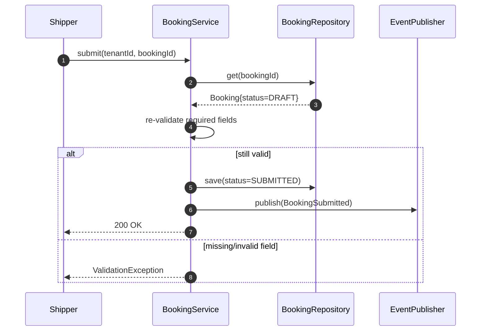
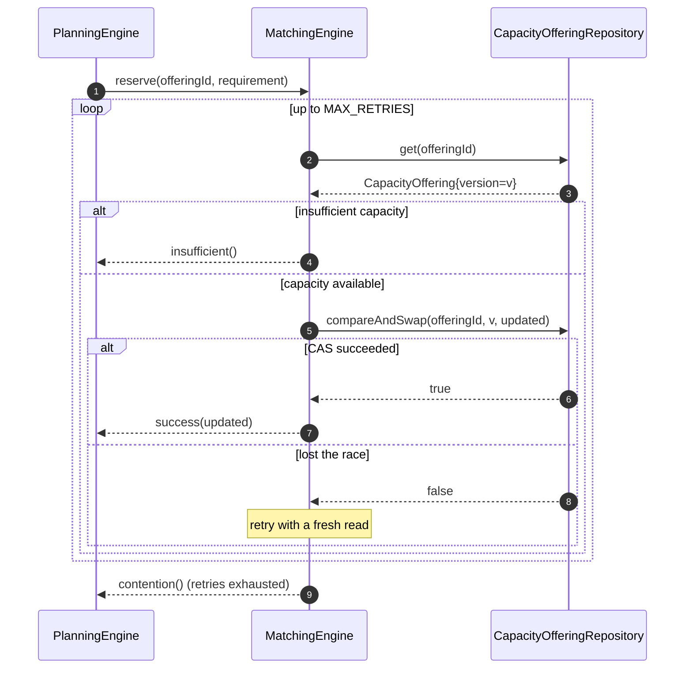
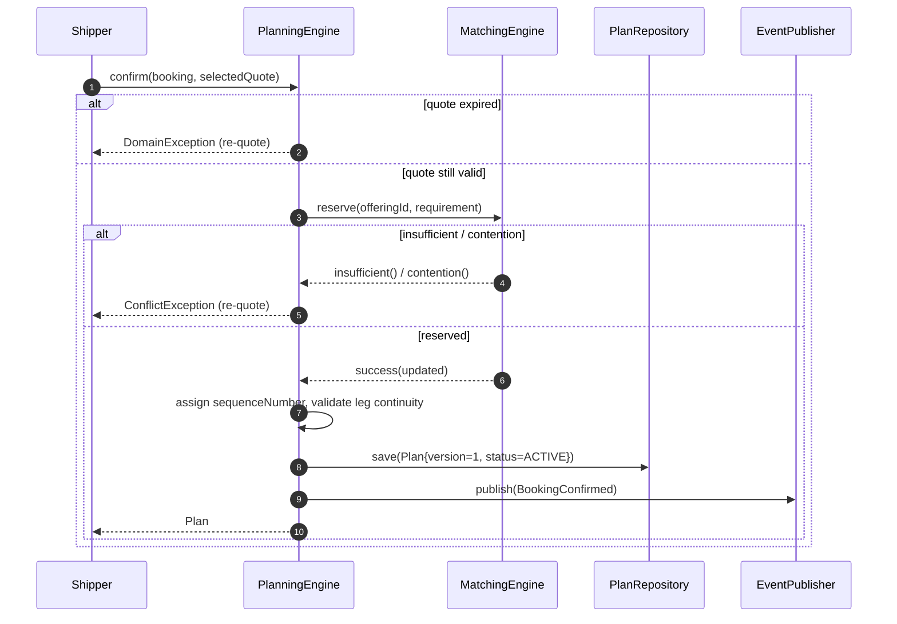
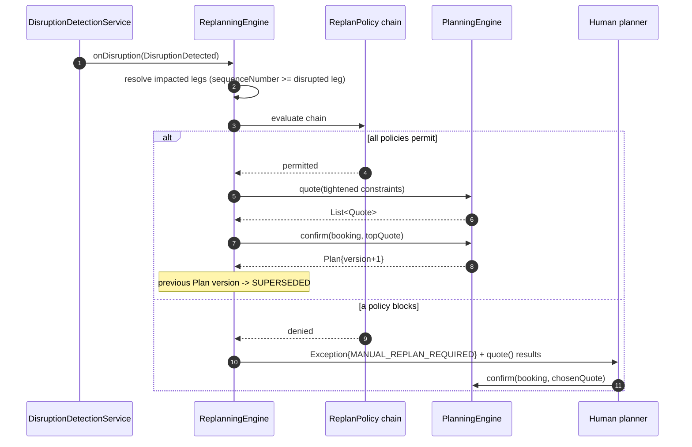
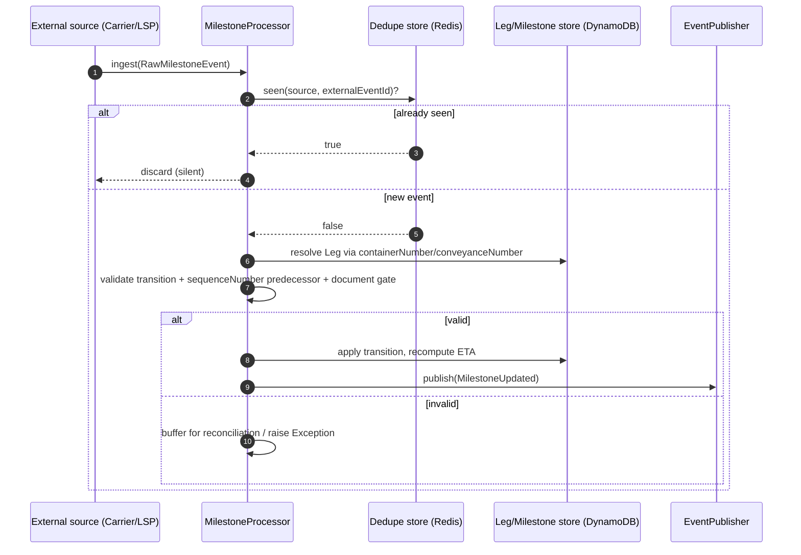
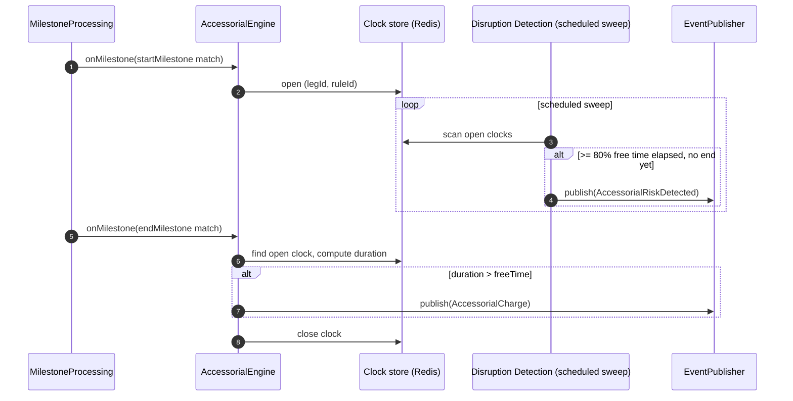
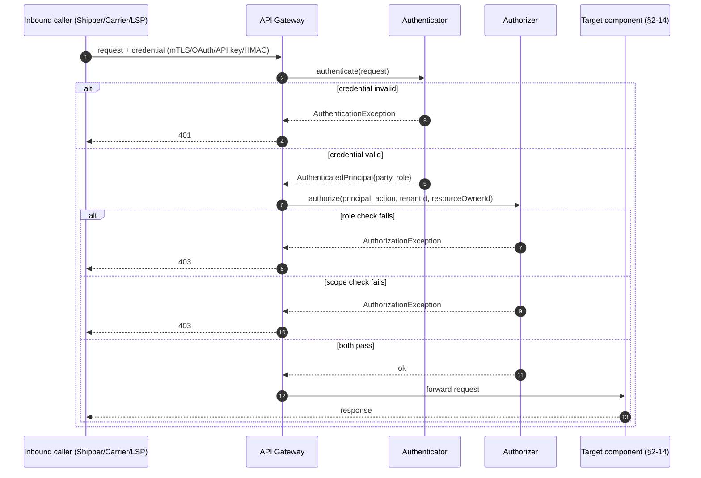

# Supply Chain Orchestration Platform — Low-Level Design

**Companion to [`DESIGN.md`](DESIGN.md).** That document establishes the domain
model, the architecture, and every system-level cross-cutting decision
(scalability, security, trade-offs). This one goes one level deeper, per
component: the actual interface, the one or two algorithms that make it
non-trivial, how it's exposed and what it talks to (§1.1/§1.2), what storage
sits behind it, the component-local design trade-offs DESIGN.md doesn't get
into, and — for the handful of components with a genuinely multi-step
interaction — a sequence diagram. Section numbers match `DESIGN.md`'s §4/§14
exactly, so the two documents cross-reference directly — §4.4 here is the LLD
for §4.4 there.

This covers the components with real internal design decisions to make.
`Mode` Strategy implementations (§4.3) and the portal facades are thin enough
that `DESIGN.md`'s interfaces already are the LLD — restated briefly here, not
re-derived.

---

## Table of Contents

1. [Conventions](#1-conventions)
2. [§4.1 — Booking Service](#2-41--booking-service)
3. [§4.1 / §4.11 — Compliance Service](#3-41--411--compliance-service)
4. [§4.1 — Matching Engine](#4-41--matching-engine)
5. [§4.2 — Contract Service](#5-42--contract-service)
6. [§4.3 — Mode Strategies](#6-43--mode-strategies)
7. [§4.4 — Planning Engine](#7-44--planning-engine)
8. [§4.5 — Replanning Engine](#8-45--replanning-engine)
9. [§4.6 — Disruption Detection Service](#9-46--disruption-detection-service)
10. [§4.7 — Milestone Processing Service](#10-47--milestone-processing-service)
11. [§4.8 — Visibility Service](#11-48--visibility-service)
12. [§4.9 — Communication Service](#12-49--communication-service)
13. [§4.10 — Billing Service & Accessorial Engine](#13-410--billing-service--accessorial-engine)
14. [§4.12 — Procurement Service](#14-412--procurement-service)
15. [§14 — Security: Authenticator & Authorizer](#15-14--security-authenticator--authorizer)

---

## 1. Conventions

These hold across every component below, so they're stated once instead of
repeated thirteen times.

- **Repository pattern.** Every service depends on a `*Repository` interface,
  never a concrete store. The in-memory POC backs it with a
  `ConcurrentHashMap`; production swaps in a real store without the service
  code changing ([§12](DESIGN.md#12-implementation-roadmap)).
- **Publish, don't call.** A service that needs to trigger downstream work
  publishes a `DomainEvent` through an injected `EventPublisher`; it never
  calls another service's method directly. The one deliberate exception is
  `MatchingEngine.reserve()`, which `PlanningEngine.confirm()` calls
  synchronously, because a reservation result has to be known before the
  caller can proceed — everything else is fire-and-forget. `EventPublisher`
  itself is backed by a **transactional outbox** ([§1.3](#13-consistency-mechanisms))
  — the domain write and the outbox row commit in one local transaction, so
  "fire-and-forget" is actually safe: the event can't be lost if the process
  crashes right after commit, and can't be sent for a write that rolled back.
- **Exceptions.** A small hierarchy: `ValidationException` (bad input, 4xx-ish,
  collects *all* violations rather than failing on the first), `ConflictException`
  (a CAS/optimistic-concurrency loss — the caller is expected to retry or
  re-quote, not treat it as a hard failure), and `DomainException` (a business
  rule was violated — e.g. a disconnected route, a screening block).
- **Idempotency.** Any handler that consumes from the event bus is keyed by
  `eventId` and safe to invoke twice ([§5](DESIGN.md#5-event-backbone--integration-layer)).
  This isn't restated per-component below unless there's something
  component-specific about *how* it dedupes.
- **Concurrency default.** Partition by whatever key the component's data is
  sharded on in [§6.2](DESIGN.md#62-data-partitioning--sharding) — `bookingId`,
  `legId`, `offeringId`. A single partition is handled by a single thread, so
  most components need no explicit locking at all; the ones that do
  (`MatchingEngine.reserve()`) are called out explicitly.

### 1.1 Technology Stack

One concrete stack, stated once here so each component's section below just
says "PostgreSQL" or "Redis" rather than re-justifying it thirteen times.

| Concern | Technology | Why this, specifically |
|---|---|---|
| Language / framework | Java 23, plain Java + [Javalin](https://javalin.io) | Actually matches the repo — every other practice here (locking, service-discovery, bloom filter, EDI, REST/gRPC/GraphQL/WebSocket demos) is plain Java with no framework. An earlier draft of this table said "Spring Boot 3 — matches the repo," which didn't hold up once checked against the codebase; corrected after the first real implementation slice (`supplychain/`, §2 Booking Service) was built the same way. The trade given up is Spring's `@Transactional`/`@KafkaListener` convenience — the outbox transaction and the Kafka poll loop below are both hand-written as a result ([§1.3](#13-consistency-mechanisms)) |
| Synchronous inter-service calls | Direct method call (monolith phase) → gRPC (once decomposed, [§8](DESIGN.md#8-major-design-decisions--trade-offs)) | Type-safe and low-overhead, which matters specifically for Matching↔Planning↔Contract — three hops on the booking-confirmation critical path, budgeted at < 2s end to end ([§1](DESIGN.md#1-requirements)) |
| External-facing APIs | REST/JSON over HTTPS ([Javalin](https://javalin.io) + embedded Jetty) | Portals and partner integrations need broad client compatibility; gRPC's tooling requirement is the wrong trade for a shipper's browser session or a carrier's ops team writing a webhook integration |
| Event backbone | Kafka | Already the production choice in [§5](DESIGN.md#5-event-backbone--integration-layer); ~32 partitions per [§6.5](DESIGN.md#65-capacity-math)'s math |
| OLTP store — Booking, Contract, CapacityOffering, Plan, Leg, Invoice/Settlement | PostgreSQL, sharded via Citus/YugabyteDB once a single instance's write throughput is the bottleneck | Needs real ACID transactions and row-level CAS (`UPDATE ... WHERE version = ?`) for every optimistic-concurrency pattern in §4 below — a document store would make that harder to get right, not easier |
| High-volume append store — Milestone stream | DynamoDB, partition key `legId`, sort key `occurredAt` | ~7,000 events/sec peak ([§6.5](DESIGN.md#65-capacity-math)) is a simple partition-and-range access pattern with no cross-record transactions needed — exactly what a relational engine is the wrong tool for at that write rate |
| Read-optimized projection — Visibility | OpenSearch (or Elasticsearch) | Already the production choice in [§4.8](DESIGN.md#48-visibility-control-tower); scales independently of the OLTP write path, which is the entire point of the CQRS split |
| Cache — Contract/CapacityOffering/Node/FX-rate lookups | Redis | Sub-millisecond reads on the Matching hot path; invalidated on the corresponding `*Updated` event, never left to expire on TTL alone |
| Document storage — `TransportDocument` | PostgreSQL (metadata) + S3-compatible object storage (the actual files) | Matches [§12](DESIGN.md#12-implementation-roadmap)'s roadmap entry directly |
| Secrets | Vault (or a cloud-native equivalent — AWS Secrets Manager, GCP Secret Manager) | Per [§14](DESIGN.md#14-security)'s "no secrets in code" principle |
| Identity provider (human users) | Keycloak / Auth0 / Okta — OIDC | Backs the OIDC + MFA row in [§14](DESIGN.md#14-security)'s actor table for Shipper/Operator/Ops portal logins |

### 1.2 Event Topics

Every `DomainEvent` in [§5](DESIGN.md#5-event-backbone--integration-layer)
maps to a Kafka topic, partitioned by whichever key keeps per-entity ordering:

| Kafka Topic | Carries | Partition Key | Primary Consumers |
|---|---|---|---|
| `booking-events` | `BookingSubmitted`, `BookingConfirmed` | `bookingId` | Compliance, Visibility, Communication |
| `compliance-events` | `ComplianceCleared`, `ComplianceException` | `bookingId` | Matching (gate), Communication |
| `milestone-events` | `MilestoneUpdated` | `legId` | Disruption, Visibility, Communication, Billing |
| `disruption-events` | `DisruptionDetected` | `laneId` | Replanning, Visibility, Communication |
| `plan-events` | `PlanChanged` | `shipmentId` | Visibility, Communication |
| `accessorial-events` | `AccessorialRiskDetected` | `legId` | Communication |
| `procurement-events` | `PurchaseOrderConfirmed` | `poId` | Booking Service |

A component's section below only calls this table out where it deviates —
e.g. Milestone Processing's own *inbound* ingestion isn't a Kafka consumer at
all, since it's the thing writing to `milestone-events` in the first place.

### 1.3 Consistency Mechanisms

The system-level guarantees are catalogued in
[DESIGN.md §7](DESIGN.md#7-consistency--availability-trade-offs). The one
worth a concrete shape here is the **transactional outbox**, since every
`Publish, don't call` emission in every section below routes through it:

- **Schema:** an `outbox` table alongside each service's own tables —
  `id, aggregate_type, aggregate_id, event_type, payload (jsonb), created_at,
  published_at (nullable)`.
- **Write path:** the domain write (e.g. `bookings` row → `SUBMITTED`) and the
  `INSERT` into `outbox` happen in the *same* local database transaction —
  either both commit or neither does. No distributed transaction is needed
  because both rows live in the same database.
- **Relay:** a separate poller (or CDC via Debezium reading the
  write-ahead log) picks up rows where `published_at IS NULL`, publishes them
  to the matching Kafka topic ([§1.2](#12-event-topics)), then sets
  `published_at`. This relay can crash and resume freely — it's just another
  at-least-once, idempotent consumer, per the dedupe convention above.
- **One exception:** Milestone Processing ([§10](#10-47--milestone-processing-service))
  needs no separate outbox table at all — it already writes to DynamoDB, and
  DynamoDB Streams off that same table *is* the outbox. One storage operation
  produces both the durable record and the change feed the relay reads from.

---

## 2. §4.1 — Booking Service

> **Implemented.** This is the one component with real code, not just this
> design — see [`supplychain/`](../../../../../../../../../supplychain) at
> the repo root (its own Gradle module, kept separate from `lib` so its
> Postgres/Kafka dependencies don't bleed into every other demo). Run it with
> `docker compose up -d` (Postgres + a single-broker Kafka) followed by
> `./gradlew :supplychain:run`; see `supplychain/README.md`. Includes a
> minimal browser UI (plain JS, no framework, served by Javalin itself) at
> `http://localhost:7070/` — a Shipper create-booking form and an Operator
> booking-management table (list/submit/amend/cancel), on top of the same
> REST API below. There's also a `list()`/`GET /v1/bookings` beyond what's
> documented below, added specifically for that management view. Real
> accounts back both roles now too — a minimal instance of the `Party`/
> `Authenticator`/`Authorizer` model in [§15](#15-14--security-authenticator--authorizer)
> (register/login/logout, PBKDF2 password hashing, in-memory bearer-token
> sessions); `createDraft()` derives `shipperId` from the authenticated
> Shipper rather than trusting it from the request, and a Shipper's
> `get`/`submit`/`amend`/`cancel`/`list` are all scoped to bookings they
> own — an Operator's are not, and not just within one tenant: `find()`/
> `findAll()` on `BookingRepository` dropped tenant scoping entirely, so an
> Operator sees every booking from every tenant (see [§4](#4-41--matching-engine)'s
> callout for why). One exception even to that: an Operator never sees a
> `DRAFT` — still a Shipper's private, unsubmitted work, invisible to an
> Operator via `list()`, an explicit `?status=DRAFT` filter, or a direct
> `get()` by ID (all three come back empty/`404`, not an error). `canAccess()`
> enforces this uniformly: a Shipper always sees their own booking regardless
> of status; an Operator sees everything else except another party's `DRAFT`.
> Two more methods beyond LLD's original
> interface: `findCandidates()` (delegates straight to
> [Matching Engine](#4-41--matching-engine)) and `reserveCapacity()`, which
> is what actually moves a Booking from `SUBMITTED` to `CONFIRMED` in this
> build — see §4's callout for exactly what that short-circuits (no
> Contract Service, no Planning Engine) and the one known consistency gap
> it introduces.

**Responsibility:** validate a booking request, own the `Booking` state
machine, and be the single point of truth for what a Booking currently is.

```java
public interface BookingService {
    Booking createDraft(CreateBookingRequest request) throws ValidationException;
    Booking submit(String tenantId, String bookingId) throws DomainException;
    Booking amend(String tenantId, String bookingId, BookingAmendment amendment) throws ConflictException;
    Booking cancel(String tenantId, String bookingId, String reason) throws DomainException;
    Optional<Booking> get(String tenantId, String bookingId);
}
```

**Algorithm — `createDraft()`:**
1. Validate every required field from the [required-details table](DESIGN.md#41-demand--supply-management) — origin/destination, consignee, load type, cargo line items, pickup/delivery windows. Collect *every* violation into one `ValidationException`, not just the first, so a caller doesn't have to round-trip five times to find five problems.
2. Validate Incoterm–mode compatibility (`FAS`/`FOB`/`CFR`/`CIF` reject any non-`OCEAN` `modePreference`).
3. For `loadType = FCL`: require a non-empty `ContainerRequirement` list. For `LCL`/`Breakbulk`: require `totalWeight`/`totalVolume`.
4. Persist with `status = DRAFT`, `version = 0`.

**Algorithm — `submit()`:**
1. Re-validate nothing required went missing since the draft was created (a `DRAFT` can be edited; this is the last checkpoint before it becomes visible to the rest of the system).
2. Transition `DRAFT → SUBMITTED`.
3. Publish `BookingSubmitted` — this is what the Compliance Service reacts to (step 5a of [§2](DESIGN.md#2-high-level-architecture)'s master sequence).

**Concurrency:** `amend()` uses optimistic concurrency — the caller passes the
`version` it last read; a mismatch against the stored `version` throws
`ConflictException` rather than silently overwriting a concurrent edit from
another session. This is the same CAS shape as `MatchingEngine.reserve()`
below, applied to booking data instead of capacity.

**Sequence diagram — `submit()`:**

Compliance (§3) reacts to `BookingSubmitted` on its own — Booking Service
never calls it, and never blocks on its answer.

**Communication & storage:**
- **Exposed via:** REST — `POST /v1/bookings`, `PUT /v1/bookings/{id}/submit`,
  `PUT /v1/bookings/{id}/amend`, `DELETE /v1/bookings/{id}`.
- **Publishes to:** `booking-events` ([§1.2](#12-event-topics)) — never calls
  Compliance, Matching, or Planning directly; they react to the event.
- **Storage:** PostgreSQL `bookings` table (+ a child `cargo_line_items`
  table), sharded per `hash(tenant_id, booking_id)`
  ([§6.2](DESIGN.md#62-data-partitioning--sharding)); its `version` column is
  what the optimistic-concurrency check above actually compares against.
- **Cache:** none — this component is on the write path, not the read path.

**Design trade-offs:**
- Collect-all-violations validation instead of fail-fast (contrast with
  Compliance's `screen()` below). **Why:** a booking form has ~15
  independently-required fields; making a shipper fix one and resubmit to
  discover the next is a bad UX for a data-entry-heavy request. Compliance is
  fail-fast because a single denied-party hit makes every other check moot —
  the two components have genuinely different validation shapes.
- Optimistic concurrency over a pessimistic lock for `amend()`. **Why:**
  concurrent edits to the same booking are rare in practice (usually one
  shipper, one session); paying for an occasional CAS retry is cheaper than
  holding a lock across a network round-trip on every edit.

**Depends on:** `BookingRepository`, `EventPublisher`.

---

## 3. §4.1 / §4.11 — Compliance Service

**Responsibility:** screen every named party, classify every cargo line, and
gate whether a Booking is even allowed to reach Matching.

```java
public interface ComplianceService {
    ComplianceCheck screen(Booking booking);
}

public interface DeniedPartyListAdapter {
    ScreeningResult screen(Party party);   // Adapter — one per sanctions-list source
}

public interface TariffScheduleProvider {
    DutyQuote quote(String hsCode, String countryOfOrigin, String destinationCountry);   // Strategy
}
```

**Algorithm — `screen()`:**
1. Resolve the five parties to check: `shipperId`, `consigneeId`,
   `notifyPartyId`, `importerOfRecordId`, `exporterOfRecordId` — filling in the
   Consignee/Shipper defaults where unset ([§3](DESIGN.md#3-domain-model)).
2. Run every registered `DeniedPartyListAdapter` against every party. **This is
   fail-fast, unlike field validation above**: a hit on any list, for any
   party, short-circuits immediately — there's no value in continuing to
   check the remaining parties once one has failed, and no partial-clear
   state is useful.
3. On a hit: persist `ComplianceCheck{status=BLOCKED}`, raise an
   `Exception{type=COMPLIANCE_HOLD}`, publish `ComplianceException`. The
   Booking goes no further.
4. On clear: for each `CargoLineItem`, call `TariffScheduleProvider.quote(hsCode,
   countryOfOrigin, destinationCountry)` — the provider itself decides whether
   an FTA preferential rate applies or the standard MFN rate does; this
   service just sums the per-line results into `estimatedDuty`.
5. If any line's `dgClass` is set, flag the `ComplianceCheck` as
   `dgRestricted = true` — this is what `MatchingEngine.findCandidates()`
   checks to filter to DG-certified offerings only.
6. Persist `ComplianceCheck{status=CLEARED}`, publish `ComplianceCleared`.

**Data structures:** each `DeniedPartyListAdapter`'s list is a `Set<String>`
of normalized names/IDs for O(1) lookup in the POC; production calls a real
screening vendor's API with a short-TTL cache in front of it, since the list
itself only changes a few times a day.

**Concurrency:** none needed — pure read-and-compute, no shared mutable state.

**Communication & storage:**
- **Exposed via:** no direct external API — a Kafka consumer on
  `booking-events`, filtered to `BookingSubmitted`, triggers `screen()`; a
  read-only `GET /v1/bookings/{id}/compliance` exists for portal/ops display.
- **Calls out:** synchronous HTTPS to whichever screening vendor backs each
  `DeniedPartyListAdapter`, and to the tariff-schedule source behind
  `TariffScheduleProvider`.
- **Publishes to:** `compliance-events` ([§1.2](#12-event-topics)).
- **Storage:** PostgreSQL `compliance_checks`, keyed by `bookingId`. The
  denied-party lists are cached in Redis with a short TTL — they change a few
  times a day at most, so re-fetching per screen would be pure waste.

**Design trade-offs:**
- Fail-fast on the first denied-party hit, not collect-all — the opposite of
  Booking Service's validation above. **Why:** once one hit exists, the
  Booking is blocked regardless of what else is found; continuing to check
  the remaining parties spends compute for zero decision value.
- A Redis-cached list instead of a real-time vendor call per `screen()`.
  **Why:** denied-party/sanctions lists update at most a few times a day —
  caching trades a small, bounded staleness window for cutting a vendor
  round-trip out of the booking-confirmation critical path.

**Depends on:** `PartyRepository`, `TariffScheduleProvider`, `EventPublisher`.

---

## 4. §4.1 — Matching Engine

> **Implemented — with real simplifications, not the full design.** See
> `supplychain/` (`matching/` package).
>
> **Cross-tenant, on purpose — this was a reversal, not the original design.**
> An earlier pass built this as same-tenant (an offering's `operatorId` had to
> share a tenant with the Booking it matched), on the reasoning that every
> tenant-scoped query/session/row here already assumes one tenant = one
> company. In practice that meant every ad-hoc test tenant needed its own
> Operator account before anything in it was visible — untenable, and not
> actually what "Operator" was meant to mean in this build. The corrected
> model, reflected in the code now: **`OPERATOR` is a single tenant-agnostic
> role** — any Operator account sees and can act on every Booking and every
> `CapacityOffering`, from every tenant, no matter who created it — while
> `SHIPPER` stays scoped to bookings they personally created, tenant or not.
> Matching follows the same rule: `findCandidates()`/`reserve()` search
> `capacity_offerings` across all tenants, not just the Booking's own.
> `tenantId` still exists on both entities (which company a Booking/offering
> belongs to is still real data, still shown), it just no longer *restricts*
> anything for an Operator. `BookingRepository.find()`/`findAll()` and
> `CapacityOfferingRepository.find()`/`findCandidates()` all dropped their
> `tenantId` parameter to match — a lookup by `bookingId`/`offeringId` alone,
> backed by a dedicated unique index on each (schema.sql), since the old
> composite `(tenant_id, id)` primary keys can't serve an ID-only lookup
> efficiently.
>
> Two further departures from the full design, both independent of the above:
> 1. **No Contract Service in front of this** — `findCandidates()`/`reserve()`
>    only search the spot `capacity_offerings` pool; there's no committed-volume
>    pool from [§4.2](#5-42--contract-service) to check first.
> 2. **No Planning Engine calling this** — `BookingService.reserveCapacity()`
>    calls `MatchingService.reserve()` directly and, on success, transitions
>    the Booking straight to `CONFIRMED` itself. There's no `Quote`, no
>    `Plan`, no multi-leg routing — a Booking matches exactly one
>    `CapacityOffering` for its entire origin→destination, not a chain of legs.
>    This also produces **a CAS-then-CAS gap**: `reserveCapacity()` calls
>    `MatchingEngine.reserve()` (one transaction, against `capacity_offerings`)
>    and then `BookingRepository.save()` (a second, separate transaction,
>    against `bookings`) to record the confirmation. If the second CAS loses a
>    race — booking concurrently modified between the two calls — the
>    capacity is already reserved and committed, but the Booking never
>    reflects it. This is surfaced as a `ConflictException` telling the caller
>    to reload, not silently swallowed, but it isn't *solved*: solving it
>    properly needs either a saga/compensating transaction or moving both
>    writes into one shared transaction spanning both tables, which the
>    current `BookingRepository`/`CapacityOfferingRepository` split doesn't
>    support. Worth fixing before this goes anywhere near production; fine for
>    a local single-user dev tool where the race window in practice is tiny.

**Responsibility:** find candidates for a Booking, and perform the one
operation in this entire system where a race condition is a real, everyday
risk — the atomic capacity reservation.

```java
public interface MatchingEngine {
    List<CapacityOffering> findCandidates(Booking booking);
    ReservationResult reserve(String offeringId, CapacityRequirement requirement);
}
```

**Algorithm — `findCandidates()`:**
1. Resolve the lane key `hash(originNodeId, destinationNodeId)` and look up
   the lane→offering index ([§6.2](DESIGN.md#62-data-partitioning--sharding)) —
   an index lookup, not a scan of the whole supply base.
2. Filter by mode (or accept any, if `modePreference = ANY`), then by
   capacity: FCL requires ≥ the requested quantity of *each* requested
   `ContainerType` specifically (a `40HC` request is never satisfied by a
   `20GP` slot); LCL/Breakbulk requires ≥ the requested weight/volume.
3. If `booking.contractId` is set, separately resolve that Contract's
   committed-capacity pool as an *additional* candidate source — never merged
   with the spot pool, so a contract holder's capacity can't be raced away by
   unrelated spot demand ([§4.2](DESIGN.md#42-contract-management)).
4. If `complianceCheck.dgRestricted`, filter to DG-certified offerings only.
5. Return the surviving list — empty if nothing fits, which the caller
   surfaces as `UNMATCHED`, not an error.

**Algorithm — `reserve()`, the concurrency-critical one:**
```java
public ReservationResult reserve(String offeringId, CapacityRequirement req) {
    for (int attempt = 0; attempt < MAX_RETRIES; attempt++) {
        CapacityOffering current = repository.get(offeringId);
        if (!current.hasCapacityFor(req)) {
            return ReservationResult.insufficient();
        }
        CapacityOffering updated = current.decrement(req);          // pure — no side effect yet
        if (repository.compareAndSwap(offeringId, current.version(), updated)) {
            return ReservationResult.success(updated);
        }
        // lost the race — someone else's write landed first; retry with a fresh read
    }
    return ReservationResult.contention();
}
```
This is optimistic concurrency — a compare-and-swap loop, not a mutex — the
same primitive class the repo's [locking](../locking/README.md) practice
covers for shared counters. A lock is the wrong tool here: contention on any
*single* offering is low-to-moderate (demand spreads across many offerings),
so a CAS retry is cheaper than blocking a thread on a mutex for what's a
sub-millisecond critical section. `ReservationResult.contention()` — the
bounded-retry exhaustion case — is what `PlanningEngine.confirm()` turns into
a re-quote rather than a hard failure ([§11.3](DESIGN.md#11-failure-scenarios)).

**Sequence diagram — `reserve()` CAS retry:**


**Communication & storage:**
- **Exposed via:** nothing external — a direct in-process call in the
  monolith phase, a gRPC service (`MatchingService.FindCandidates`/`.Reserve`)
  once decomposed, per [§1.1](#11-technology-stack).
- **Calls out:** `findCandidates()` reads the lane→offering index from Redis;
  `reserve()`'s CAS loop reads/writes PostgreSQL directly, then invalidates
  (never updates) the corresponding Redis entry, so the cache can lag but
  never diverge from the source of truth.
- **Storage:** PostgreSQL `capacity_offerings` — its `version` column is
  exactly what the CAS loop above compares against.

**Design trade-offs:**
- CAS retry over a mutex/distributed lock for `reserve()`. **Why:**
  contention per offering is low-to-moderate (demand spreads across many
  offerings); a lock held even across a sub-millisecond critical section
  would still serialize unrelated callers sharing that shard, whereas CAS
  only pays a retry cost when there's an actual conflict.
- Contract committed-capacity kept as a separate pool rather than merged into
  the spot pool. **Why:** merging would require additional
  reservation-priority logic just to preserve the guarantee that a
  committed-volume holder's capacity can't be raced away by unrelated spot
  demand — keeping the pools separate gets that guarantee for free.

**Depends on:** `CapacityOfferingRepository`, `ContractService`.

---

## 5. §4.2 — Contract Service

**Responsibility:** own Contract lifecycle and resolve rate/capacity-pool
lookups for Matching and Planning.

```java
public interface ContractService {
    Optional<Contract> resolve(String contractId, String laneId, TransportMode mode);
    ReservationResult reserveCommittedCapacity(String contractId, CapacityRequirement req);
    void recordVolume(String contractId, CapacityRequirement req);
}
```

**Algorithm — `resolve()`:**
1. Load the Contract; if `status != ACTIVE` or the lane/mode isn't in
   `laneScope`, return empty — the caller falls back to spot behavior rather
   than failing the booking outright.
2. Otherwise return it, letting the caller branch on `type`
   (`COMMITTED_VOLUME` → reserve from the dedicated pool via
   `reserveCommittedCapacity()`, same CAS shape as `MatchingEngine.reserve()`;
   `RATE_CARD`/`SLA` → use the negotiated rate, draw from the spot pool
   instead).

**Algorithm — `recordVolume()`:** increments `volumeCommitment.bookedThisPeriod`
via the identical CAS pattern as capacity reservation — it's the same class of
problem (a shared counter under concurrent writers) wearing a different hat.
Crossing the committed quantity publishes `VolumeThresholdCrossed` for
Communication to alert on, *before* the shortfall/overage actually costs
anyone anything.

**Communication & storage:**
- **Exposed via:** REST admin API for the Operator Portal (`POST`/`PUT
  /v1/contracts`); `resolve()`/`reserveCommittedCapacity()` are in-process
  calls (or gRPC, once decomposed) from Matching and Planning.
- **Storage:** PostgreSQL `contracts`, with `volume_commitment.booked_this_period`
  as the versioned column `recordVolume()`'s CAS pattern operates on.
- **Cache:** Redis, invalidated on `ContractUpdated` — a Contract is read on
  every quote but written rarely.

**Design trade-offs:**
- `recordVolume()` reuses the same CAS pattern as capacity reservation
  instead of a dedicated locking mechanism. **Why:** it's structurally the
  same "shared counter under concurrent writers" problem — reusing the
  primitive keeps the codebase to one concurrency pattern to reason about,
  not two.
- `resolve()` returns empty (falls back to spot) rather than throwing when a
  Contract doesn't cover the requested lane/mode. **Why:** a Contract not
  covering every lane a shipper books is a normal commercial reality, not an
  error condition — failing the booking outright would be a worse default
  than a silent fallback.

**Depends on:** `ContractRepository`, `EventPublisher`.

---

## 6. §4.3 — Mode Strategies

No new interface design beyond what [§4.3](DESIGN.md#43-multi-modal-transport-abstraction)
already specifies — restated here because everything above calls it:

```java
public interface TransitTimeEstimator {
    TransitWindow estimate(Leg leg);
}
public interface RateProvider {
    Money quote(Leg leg);   // SpotRateProvider vs. ContractRateProvider — chosen by whether booking.contractId is set
}
public interface CapacityProvider {
    boolean hasCapacity(Leg leg, Instant window);
}
```

One worked example, `OceanTransitTimeEstimator`:
```java
public TransitWindow estimate(Leg leg) {
    ScheduleEntry schedule = scheduleRepository.find(leg.origin(), leg.destination(), leg.mode());
    Duration typical = schedule.historicalMedianTransit();
    Duration variance = schedule.historicalP90Transit().minus(typical);
    return new TransitWindow(typical.minus(variance), typical, typical.plus(variance));
}
```
`fastest`/`slowest` come from historical P10/P90 transit times for that
specific lane+mode, not a fixed padding constant — a lane with more variable
historical performance gets a wider window, not the same window as a
reliable one.

**Communication & storage:** not an independently deployed service, so
"exposed via"/"publishes to" don't apply — this is a Strategy implementation
loaded in-process wherever Planning or Matching run. It reads a
`schedule_history` reference table (PostgreSQL), refreshed by a nightly batch
job rather than per-request — read-heavy, write-rare, which makes it a
candidate for the same Redis cache tier as Contract/CapacityOffering once
lane volume justifies it.

**Design trade-offs:**
- Variance-based (P10/P90) transit windows instead of a fixed padding
  constant. **Why:** a fixed pad either overstates confidence on volatile
  lanes or wastes buffer on reliable ones; historical variance per lane+mode
  captures the actual difference in predictability between, say, a mature
  transpacific lane and an emerging one.

---

## 7. §4.4 — Planning Engine

**Responsibility:** turn matched candidates into priced Quotes, and turn a
selected Quote into a persisted, versioned Plan.

```java
public interface PlanningEngine {
    List<Quote> quote(Booking booking, List<CapacityOffering> candidates, PlanningConstraints constraints);
    Plan confirm(Booking booking, Quote selectedQuote) throws ConflictException, DomainException;
}
public interface ObjectiveStrategy {
    double score(CandidatePlan candidate);   // lower is better
}
```

**Algorithm — `quote()`:**
1. Discard candidates violating a hard constraint (ship-by date, banned
   lane/carrier, insufficient capacity).
2. For each surviving candidate: `price = rateProviderFor(booking).quote(leg)`
   (a simple factory check — `booking.contractId != null ?
   contractRateProvider : spotRateProvider`), `window =
   transitTimeEstimatorFor(leg.mode()).estimate(leg)`.
3. Score every candidate under every registered `ObjectiveStrategy`
   (`CostOptimized`, `SpeedOptimized`, `CarbonOptimized`, `Balanced`).
4. Collapse near-duplicates: group by `(mode, ship-date rounded to the day,
   winning-objective's speed-tier bucket)` — a lightweight clustering, not a
   real optimizer, since the goal is "a short list a human can compare," not
   "the mathematically optimal partition."
5. Emit one `Quote` per group, `validUntil = now + configurable window`
   (default 48h).

**Algorithm — `confirm()`:**
1. Reject if `quote.validUntil` has passed.
2. Call `matchingEngine.reserve(quote.capacityOfferingId, requirement)`. A
   `ConflictException`/`contention()` result propagates straight back to the
   caller as "re-quote" — this method does not retry the reservation itself,
   since the *price* may no longer be valid even if capacity technically
   reopens.
3. On success: assign `sequenceNumber` to each Leg in origin→destination
   order; validate `legs[i].destination == legs[i+1].origin` for every
   consecutive pair, throwing `DomainException` if the chain doesn't connect
   (defensive — this should be structurally guaranteed by how candidates were
   built, but checked before persisting, not discovered during execution).
4. Persist `Plan{version=1, status=ACTIVE}`, transition Booking → `CONFIRMED`,
   publish `BookingConfirmed`.

**Sequence diagram — `confirm()`:**


**Communication & storage:**
- **Exposed via:** REST — `POST /v1/bookings/{id}/quote`,
  `POST /v1/bookings/{id}/confirm` — the one latency-sensitive path a
  shipper's browser session waits on synchronously, hence direct/gRPC calls
  into Matching, Contract, and Mode Strategies rather than an async
  round-trip.
- **Storage:** PostgreSQL `plans`/`legs` tables (the `sequenceNumber`/
  continuity check above is enforced against this data before it's written);
  a separate `quotes` table indexed on `validUntil` so expired quotes are
  cheap to reject or garbage-collect.

**Design trade-offs:**
- An explicit `quote()`/`confirm()` split rather than one "book now" call.
  **Why:** availability/pricing need to be shown non-bindingly, for
  comparison, before anything is reserved — collapsing the two would force a
  reservation (and its CAS cost) for every option shown, not just the one a
  shipper actually picks.
- `confirm()` never retries the reservation itself on a lost CAS race — it
  propagates straight back as "re-quote." **Why:** the race means the priced
  Quote may no longer reflect current capacity/rate reality; silently
  retrying the same stale price against newly-available capacity risks
  confirming a price the system can no longer honor.

**Depends on:** `MatchingEngine`, `RateProvider`/`TransitTimeEstimator`
(Strategy, resolved per mode), `ContractService`.

---

## 8. §4.5 — Replanning Engine

**Responsibility:** react to a disruption by producing a new Plan version —
automatically when policy allows, escalated to a human when it doesn't.

```java
public interface ReplanningEngine {
    void onDisruption(DisruptionDetected event);
}
public interface ReplanPolicy {
    boolean permits(ReplanContext context);   // Chain of Responsibility — first false wins
}
```

**Algorithm:**
1. Resolve impacted legs: every `Leg` in the affected `Plan` with
   `sequenceNumber >= disruptedLeg.sequenceNumber`. Earlier legs are never
   touched — they already happened.
2. Evaluate the `ReplanPolicy` chain in order (e.g.
   `CostDeltaThresholdPolicy`, `CarrierApprovalRequiredPolicy`); the first
   policy that returns `false` routes to the human-escalation path — this is
   deliberately a chain, not a single boolean function, so a new policy is
   one more class, not an edit to existing rule logic.
3. **Auto path:** call `planningEngine.quote()` with tightened constraints
   (exclude the disrupted lane/carrier, pull in the required-by date if
   needed), auto-select the top-ranked Quote, call `planningEngine.confirm()`
   directly — no shipper interaction. This reuses `confirm()`'s normal
   atomic-reservation path unchanged; a replan is just a `confirm()` call the
   Replanning Engine makes instead of a shipper.
4. **Escalate path:** create `Exception{type=MANUAL_REPLAN_REQUIRED}`, hand
   the `quote()` results to a human planner's queue; their manual
   `confirm()` call re-enters step 3's persistence logic.
5. On confirm: `Plan.version` bumps, the previous version transitions to
   `SUPERSEDED` (never mutated), `PlanChanged` publishes.

**Sequence diagram — auto-replan path:**


**Communication & storage:**
- **Exposed via:** nothing external — a Kafka consumer on `disruption-events`
  is the only trigger; the escalate path hands off to a human planner's
  queue (portal-read), not a new API of its own.
- **Storage:** no state of its own beyond the Plan/Leg rows written through
  `PlanningEngine.confirm()` (owned by Planning); a small PostgreSQL
  `replan_policies` table holds the ordered policy-chain configuration,
  hot-reloadable without a redeploy.

**Design trade-offs:**
- `ReplanPolicy` modeled as a Chain of Responsibility rather than one
  monolithic boolean function. **Why:** policies get added independently
  over time (a cost-delta threshold, a carrier-approval rule, ...); a chain
  lets a new one be a new class, not an edit to existing conditional logic
  that risks regressing an earlier rule.
- Auto-replan reuses `PlanningEngine.confirm()` unchanged rather than a
  separate "replan-confirm" path. **Why:** a replan's reservation/versioning/
  persistence semantics are identical to a normal confirmation — the only
  difference is who's calling it (system vs. shipper); a duplicate method
  would risk the two paths drifting apart over time.

**Depends on:** `PlanningEngine`, `MatchingEngine` (re-queried if the original
capacity is no longer viable), `LaneLegIndex` (for impact resolution).

---

## 9. §4.6 — Disruption Detection Service

**Responsibility:** turn a raw signal — external feed or an internal
missed-milestone timer — into a `Disruption`, with its blast radius resolved.

```java
public interface DisruptionDetector {
    void evaluate(MilestoneUpdated event);
    void evaluate(ExternalSignal signal);
}
public interface DisruptionRule {
    Optional<Disruption> match(DisruptionCandidate candidate);   // first match wins
}
```

**Algorithm:**
1. Normalize the incoming signal into a `DisruptionCandidate` — a common
   shape regardless of whether it came from a weather API, a port-congestion
   feed, or an internal SLA-timeout check.
2. Evaluate the ordered `DisruptionRule` list (e.g. `CustomsHoldRule`,
   `WeatherSeverityRule`, `PortCongestionThresholdRule`); the first match
   produces the `Disruption{type, severity}`.
3. Resolve affected legs via the lane→leg index — an index lookup, not a
   scan, which is what makes a 500-shipment port strike resolve in one call
   instead of 500 ([§11.2](DESIGN.md#11-failure-scenarios)).
4. Publish `DisruptionDetected`.

A second, unrelated responsibility lives in the same service because it's the
same "watch a threshold, alert before it's a problem" shape: a scheduled sweep
over every open `AccessorialRule` clock ([§4.10](#13-410--billing-service--accessorial-engine)),
publishing `AccessorialRiskDetected` at ~80% of free time consumed.

**Concurrency:** rule evaluation is stateless and pure per event — trivially
parallel across partitions, no coordination needed between them.

**Communication & storage:**
- **Exposed via:** Kafka consumer on `milestone-events`, plus scheduled
  polling adapters for external feeds (weather, port congestion) that don't
  push.
- **Publishes to:** `disruption-events`, and `accessorial-events` from the
  accessorial-risk sweep described above.
- **Storage:** PostgreSQL `disruptions` table; the lane→leg index used for
  blast-radius resolution is Redis-cached, since it's read on every
  evaluation but only changes when a Plan changes.

**Design trade-offs:**
- Ordered `DisruptionRule` chain (first match wins) instead of evaluating all
  rules and picking the most severe. **Why:** rule order encodes intentional
  precedence — e.g. a customs-hold rule is checked ahead of a generic
  weather-severity rule even where both would technically match — which is
  cheaper to reason about than a scoring/ranking step across every rule.
- The accessorial-risk sweep lives in this service rather than a separate
  one. **Why:** it's the same "watch a threshold, alert before breach" shape
  as disruption detection itself; a standalone service would duplicate the
  scheduling/alerting infrastructure for no behavioral benefit.

---

## 10. §4.7 — Milestone Processing Service

**Responsibility:** the highest-throughput component in the system —
normalize, dedupe, sequence-validate, and apply every incoming milestone.

```java
public interface MilestoneProcessor {
    void ingest(RawMilestoneEvent event);
}
public interface MilestoneAdapter {
    Milestone normalize(RawPayload payload);   // one per source format
}
```

**Algorithm — `ingest()`:**
1. Dedup: `if (dedupeStore.seen(event.source(), event.externalEventId())) return;` — silent discard, not an error, since redelivery under at-least-once semantics is expected, not exceptional.
2. Resolve the target `Leg` via `containerNumber`/`conveyanceNumber` → `legId`. For an aggregated LSP source, this also confirms the resolved `Leg`'s Operator is within the caller's `relaysForOperatorIds` — enforced at the authorization layer before this method is ever reached, so this step just trusts it.
3. Validate the transition, in order:
   a. Is `event.type` a legal next state from the Leg's current milestone, per the canonical state machine ([§4.7](DESIGN.md#47-milestone-processing--update))?
   b. If `event.type == DEPARTED`: has `Leg[sequenceNumber - 1]` on the same Plan already reached a terminal milestone? A leg cannot depart before its predecessor arrives, regardless of what the raw event claims.
   c. If the target milestone is document-gated ([§4.11](DESIGN.md#411-trade-compliance--documentation)'s legality-gate table): are all required `TransportDocument`s `ISSUED`?
4. **Valid:** apply the transition; recompute predicted ETA by summing `TransitTimeEstimator.estimate()` over the remaining legs, adjusted for any active Disruption on the lane; persist; publish `MilestoneUpdated`.
5. **Invalid:** buffer for reconciliation (common case: the predecessor's event just hasn't arrived yet — a timing artifact, not a real problem) or raise a `DATA_QUALITY`/`MISSING_DOCUMENT` `Exception`.

**Data structures:** the dedupe store is a bounded TTL set (events older than
~7 days are dropped — realistic redelivery windows don't extend further, so it
doesn't need to grow without bound).

**Concurrency:** partitioned by `legId` (§6.2), which is what lets this run
with *no* locking at all — a single leg's events are always handled by the
same consumer thread, in event-timestamp order, by construction. This is the
one component where getting partitioning right matters more than any explicit
concurrency primitive.

**Sequence diagram — `ingest()`:**


**Communication & storage:**
- **Exposed via:** REST/webhook ingestion endpoints
  (`POST /v1/webhooks/milestones/{sourceId}`) for sources that push, plus a
  Kafka consumer for sources that publish directly onto an ingestion topic.
- **Publishes to:** `milestone-events`.
- **Storage:** **DynamoDB**, partition key `legId`, sort key `occurredAt`
  ([§1.1](#11-technology-stack)) — the ~7,000 events/sec peak rate is why
  this component is the one exception to the "PostgreSQL for OLTP" default.
  The dedupe store above lives in Redis, with the same ~7-day TTL.
- **Outbox:** none needed as a separate table — DynamoDB Streams off this
  same table is the outbox ([§1.3](#13-consistency-mechanisms)), so the
  milestone write and the eventual `MilestoneUpdated` publish share one
  storage operation.

**Design trade-offs:**
- Silent discard for a duplicate/replayed event rather than an error.
  **Why:** at-least-once delivery guarantees redelivery is a normal
  occurrence, not a fault — treating it as an error would generate
  false-positive alerts for every routine retry.
- Buffer-and-reconcile for an out-of-sequence event (predecessor leg hasn't
  reported yet) rather than rejecting it outright. **Why:** the common cause
  is a timing artifact — events arriving out of order across sources — not a
  real data problem; rejecting would force the source to resend something
  that will likely resolve itself within seconds.
- Partition-by-`legId` as the sole concurrency mechanism, with zero explicit
  locks. **Why:** at this component's throughput (~7,000/sec peak), any
  per-event lock acquisition would itself become the bottleneck; partitioning
  guarantees single-threaded, in-order handling per leg for free.

---

## 11. §4.8 — Visibility Service

**Responsibility:** the CQRS read side — project every domain event into a
denormalized, queryable status, never joining anything at read time.

```java
public interface VisibilityProjector {
    void project(DomainEvent event);          // write side
}
public interface VisibilityQuery {
    CompositeStatus getStatus(String bookingId);   // read side — index lookup only
}
```

**Algorithm — `project()`:**
1. Route by event type: `MilestoneUpdated` updates `trackingDetail` (active
   leg's milestone + "leg *N* of *M*"); `DisruptionDetected`/`PlanChanged`
   feed into health recomputation; `BookingConfirmed` initializes the row.
2. Health: `predictedETA > requiredDeliveryBy` → `DELAYED`; within a
   configurable buffer of it → `AT_RISK`; otherwise `ON_TRACK` — then
   overridden upward (never downward) by any open `Disruption`/`Exception` on
   an active leg, to at least `AT_RISK`, or `EXCEPTION` if the open Exception
   itself is high severity.
3. Upsert the projection row — never append, since there's exactly one
   current composite status per booking, not a log of them.

**Concurrency:** none beyond standard upsert atomicity — this is a read
model with no cross-record invariants to protect.

**Communication & storage:**
- **Exposed via:** REST — `GET /v1/bookings/{id}/status` — read-only, and by
  far the highest-QPS endpoint in the system, since every portal poll and
  every status page hits it.
- **Calls out:** consumes every topic in [§1.2](#12-event-topics) — it's the
  one component that subscribes to all of them, since a composite status can
  change for almost any reason in the system.
- **Storage:** OpenSearch/Elasticsearch, one document per booking, updated in
  place — no relational store at all for this component, since nothing here
  needs a join or a transaction.

**Design trade-offs:**
- Upsert-only projection, never an append log. **Why:** exactly one current
  composite status is meaningful per booking — an append log would require a
  "latest" query on every read, the opposite of what a CQRS read side
  optimized for high-QPS reads should do.
- Health overridden upward-only (never downward) by an open Disruption/
  Exception. **Why:** a resolved disruption shouldn't silently erase the fact
  that a shipment already slipped against its required-by date — the
  ETA-vs-required-date comparison remains the ground truth for the base
  health level regardless of what later clears.

---

## 12. §4.9 — Communication Service

**Responsibility:** match domain events to recipients and dispatch, with
retry and an audit trail of every attempt.

```java
public interface CommunicationService {
    void onEvent(DomainEvent event);
}
public interface NotificationRule {
    boolean matches(DomainEvent event, RecipientPreferences prefs);
    Notification render(DomainEvent event);
}
public interface ChannelAdapter {
    DeliveryResult dispatch(Notification notification);   // Email / SMS / Webhook / EDI-outbound
}
```

**Algorithm:**
1. For each registered `NotificationRule`, check `matches()` — event type,
   recipient preference, and any threshold (e.g. "only if the ETA slip
   exceeds 4 hours").
2. On a match, render from template and dispatch through the recipient's
   preferred `ChannelAdapter`.
3. On failure: retry with exponential backoff, bounded attempts. Every
   attempt — success or failure — is logged, since "did they actually get
   told" needs an answer regardless of outcome.

**Communication & storage:**
- **Exposed via:** Kafka consumer on every topic in [§1.2](#12-event-topics)
  (to evaluate `NotificationRule.matches()`), plus a REST admin API for
  configuring rules and recipient preferences.
- **Calls out:** each `ChannelAdapter` makes an outbound call of its own kind
  — HTTPS to an email/SMS provider's API, a webhook `POST` to the
  recipient's own endpoint, or AS2 for EDI-outbound.
- **Storage:** PostgreSQL `notification_rules` (config) and `delivery_log`
  (append-only audit trail of every dispatch attempt, success or failure —
  what the retry logic and the "did they actually get told" question both
  depend on).

**Design trade-offs:**
- Every dispatch attempt logged regardless of outcome, not just failures.
  **Why:** "did the recipient actually get told" needs an answer for
  successes too — e.g. proving an SLA notification obligation was met — not
  only as a debugging aid when something goes wrong.

---

## 13. §4.10 — Billing Service & Accessorial Engine

**Responsibility:** generate Invoice/Settlement on the billing trigger, and
separately, watch every accessorial clock continuously.

```java
public interface BillingService {
    void onBillingTrigger(MilestoneUpdated event);
    Invoice generateInvoice(Shipment shipment);
    Settlement generateSettlement(Shipment shipment, String operatorId);
}
public interface AccessorialEngine {
    void onMilestone(Milestone milestone);
    List<AccessorialCharge> computeCharges(String legId);
}
```

**Algorithm — `AccessorialEngine.onMilestone()`:**
1. For every registered `AccessorialRule` whose `startMilestone` matches the
   incoming event's type: open (or leave open, if already running) a clock
   keyed by `(legId, ruleId)`.
2. For every rule whose `endMilestone` matches: find the open clock; if
   found, `duration = end − start`; if `duration > freeTime`, emit an
   `AccessorialCharge = (duration − freeTime) × ratePerDay`; close the clock
   regardless of whether a charge resulted.
3. (Separately, on a schedule, not per-event): scan open clocks for ≥80% of
   free time elapsed with no end milestone yet, and emit
   `AccessorialRiskDetected` — this is the proactive half, handled in
   [§4.6](#9-46--disruption-detection-service) rather than duplicated here.

**Algorithm — `generateInvoice()`:**
1. Pull the confirmed Plan's per-leg cost breakdown — already tagged
   Shipper- or Consignee-responsible by the Incoterm matrix
   ([§4.1](DESIGN.md#41-demand--supply-management)).
2. Sum the Shipper-responsible amounts, plus any `AccessorialCharge`s
   attributed to the Shipper, plus the Contract rate if one applies instead
   of the spot estimate.
3. Resolve payment terms (Contract-specific, else tenant default) for the
   due date.
4. Persist `Invoice{status=ISSUED}` — addressed to whoever created the
   Booking, always, regardless of which party the Incoterm matrix made
   responsible for which phase ([§8](DESIGN.md#8-major-design-decisions--trade-offs)).

`generateSettlement()` is the mirror, addressed to the Operator, built from
the same per-leg breakdown.

**Concurrency:** clocks are keyed per `(legId, ruleId)` — no cross-leg
contention, safe to shard by `legId` exactly like Milestone Processing.

**Sequence diagram — accessorial clock lifecycle:**


**Communication & storage:**
- **Exposed via:** `onBillingTrigger`/`onMilestone` are Kafka consumers on
  `milestone-events`; `generateInvoice`/`generateSettlement` results are read
  via REST (`GET /v1/invoices/{id}`, `GET /v1/settlements/{id}`).
- **Calls out:** outbound HTTPS to a payment gateway once an
  Invoice/Settlement is actually paid (payment processing itself is out of
  scope per [§1](DESIGN.md#1-requirements)).
- **Storage:** PostgreSQL `invoices`/`settlements`/`payments`/
  `accessorial_rules`. Open accessorial clocks are hot data, kept in Redis
  keyed `(legId, ruleId)` exactly as the concurrency note above describes,
  and moved to PostgreSQL once closed — a hot/cold split rather than one
  table serving both access patterns.

**Design trade-offs:**
- Accessorial charges computed incrementally, clock by clock, rather than
  retroactively from the full milestone history at invoice time. **Why:**
  incremental computation is what makes the risk-of-breach signal (the
  80%-of-free-time sweep) available in real time; a retroactive-only
  approach would only reveal a charge after the fact, too late for
  Communication to warn anyone.
- Invoice always addressed to the Booking's creator, regardless of which
  party the Incoterm matrix makes cost-responsible for a given phase.
  **Why:** mixing "who pays for this leg" with "who receives the invoice"
  would require every counterparty to have a direct billing relationship
  with the platform — instead, the platform bills whoever it has the
  commercial relationship with, and nets out responsibility internally via
  the per-leg breakdown ([§8](DESIGN.md#8-major-design-decisions--trade-offs)).

---

## 14. §4.12 — Procurement Service

**Responsibility:** the thinnest service in the system, deliberately — it's a
new front door into the booking pipeline, not a parallel one.

```java
public interface ProcurementService {
    PurchaseOrder generateDraftPO(DemandForecast forecast);
    void onPOConfirmed(PurchaseOrder po);
}
```

**Algorithm — `onPOConfirmed()`:**
1. Map PO fields directly onto a `CreateBookingRequest`: Supplier's `Node`
   → `origin`; the tenant's default receiving DC → `destination`; `readyBy`
   → `requiredPickupBy`.
2. Call `bookingService.createDraft(request)` then `submit(...)`.

That's the entire method. Everything after — compliance, matching, planning,
milestones, billing — is the exact same pipeline described everywhere else in
this document; Procurement's only job is producing a valid
`CreateBookingRequest` and handing it off.

**Communication & storage:**
- **Exposed via:** REST (`GET /v1/forecasts`, `GET /v1/purchase-orders`) for
  the planning-side read path; a Kafka consumer (or webhook) for supplier
  PO-confirmation events triggers `onPOConfirmed()`.
- **Calls out:** `bookingService.createDraft()`/`submit()`, in-process — the
  same call any other caller of Booking Service makes, per this section's
  whole point of not being a parallel pipeline.
- **Storage:** PostgreSQL `demand_forecasts`/`purchase_orders`.

**Design trade-offs:**
- `onPOConfirmed()` maps directly onto `CreateBookingRequest` and delegates,
  rather than re-implementing any booking logic of its own. **Why:** this
  keeps Procurement a thin front door — a second, parallel booking pipeline
  would eventually drift from Booking Service's validation/compliance/
  matching rules and become a second thing to keep in sync forever after.

---

## 15. §14 — Security: Authenticator & Authorizer

> **Partially implemented.** `supplychain/` has a real, narrower version of
> this: `Party`/`PartyRole` limited to `SHIPPER`/`OPERATOR` (not the full
> Shipper/Consignee/Operator/Carrier/Freight-Forwarder/Customs-Broker set in
> [§3](DESIGN.md#3-domain-model)), password auth instead of mTLS/OAuth/API-key/
> HMAC, and an in-memory `SessionManager` issuing opaque bearer tokens instead
> of OIDC — no identity provider, no `relaysForOperatorIds` set-containment
> check (there's no LSP-aggregation actor yet to need it). `authorize()`'s
> two-check shape below is real, though: role check (`PartyRole.SHIPPER` may
> not `createDraft()` on another party's behalf) and scope check (a `SHIPPER`
> is equality-scoped to bookings where `shipperId == partyId`; `OPERATOR` has
> no scope restriction at all — not even a tenant boundary, per [§4](#4-41--matching-engine)'s
> callout — the global-access case this section doesn't separately call out).
> See `supplychain/README.md`'s Accounts section.

**Responsibility:** the one gate every inbound request — external or
internal — passes through before any of the above ever runs.

```java
public interface Authenticator {
    AuthenticatedPrincipal authenticate(InboundRequest request) throws AuthenticationException;
}
public interface Authorizer {
    void authorize(AuthenticatedPrincipal principal, String action, String tenantId, String resourceOwnerId)
        throws AuthorizationException;
}
```

**Algorithm — `authenticate()`:** dispatch on whichever credential is present
on the request — mTLS client cert, OAuth bearer token, API key, or HMAC
webhook signature — to the matching verifier ([§14](DESIGN.md#14-security)'s
actor table). Each verifier resolves to a `Party` plus its `role`; a
verification failure throws before any adapter or business logic runs.

**Algorithm — `authorize()`:** two checks, both required:
1. **Role check** — does this principal's role permit this action at all
   (e.g. a Carrier/LSP role may write milestones; it may not issue invoices).
2. **Scope check** — is `resourceOwnerId` within this principal's authorized
   scope. For a direct Shipper/Operator, that's a straight equality check
   against their own `partyId`. For an aggregated LSP, it's membership in
   `relaysForOperatorIds` ([§3](DESIGN.md#3-domain-model)) — a set
   containment check, not equality, which is the entire structural
   difference between a single-carrier integration and an LSP's.

**Sequence diagram — authenticate/authorize gate:**


**Communication & storage:**
- **Exposed via:** not a business service — sits in front of every other one,
  typically as an API Gateway (Kong/Envoy/a cloud-native equivalent)
  terminating TLS and invoking `authenticate()`/`authorize()` before a
  request reaches any component above.
- **Calls out:** the identity provider (Keycloak/Auth0/Okta,
  [§1.1](#11-technology-stack)) for OIDC token validation; a PKI (internal CA
  or a cloud-native private CA) for mTLS client-cert verification.
- **Storage:** `Party` and credential/role data in PostgreSQL; verification
  keys and other secrets in Vault — never in application config or code.

**Design trade-offs:**
- Two independent checks (role, then scope) rather than one combined
  permission check. **Why:** they vary independently — role determines what
  actions a principal *type* may ever perform; scope determines *which*
  resources within that. Keeping them separate lets a new actor type be
  added without touching scope-resolution logic, and vice versa.
- Set-containment (`relaysForOperatorIds`) for LSPs vs. plain equality for
  direct carriers, rather than one uniform check. **Why:** an LSP aggregates
  multiple operators behind one integration; collapsing this to equality
  would either block legitimate LSP traffic or force every relayed operator
  to share credentials — both worse than one explicit containment check.

**Depends on:** `PartyRepository` (to resolve principal → role and, for an
LSP, its `relaysForOperatorIds`), `SecretsProvider` (verification keys).
