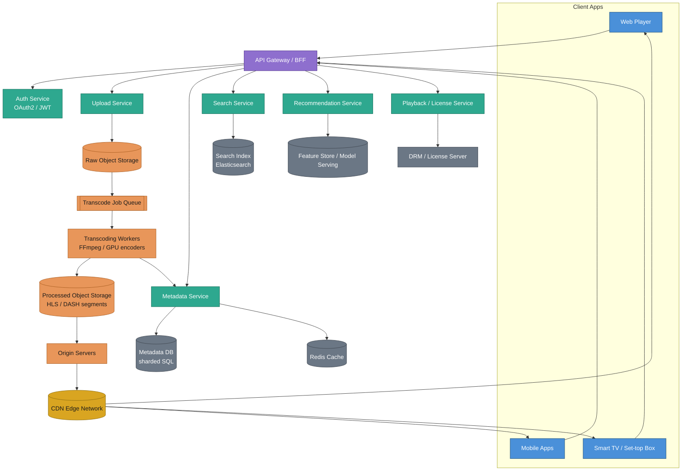
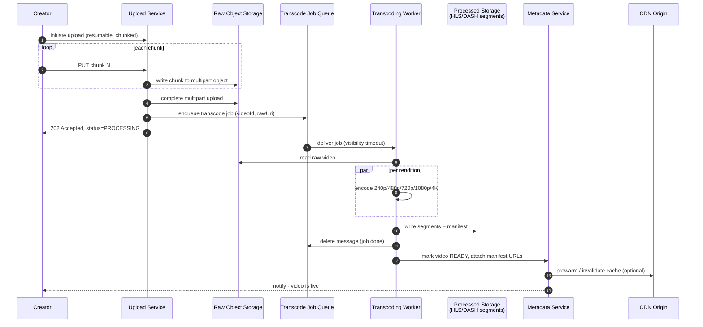
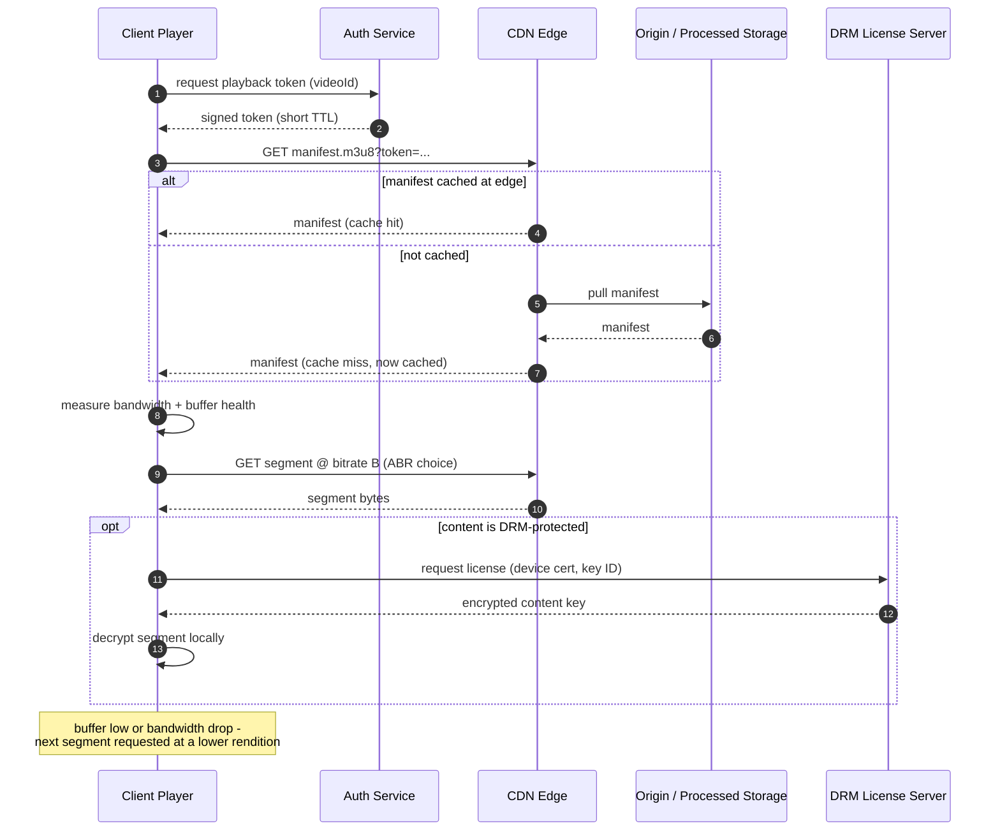
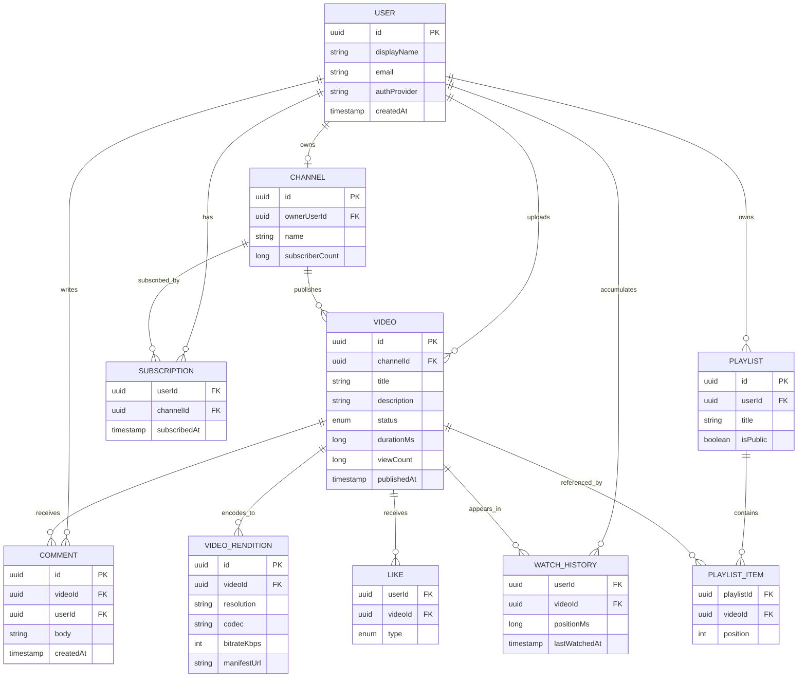
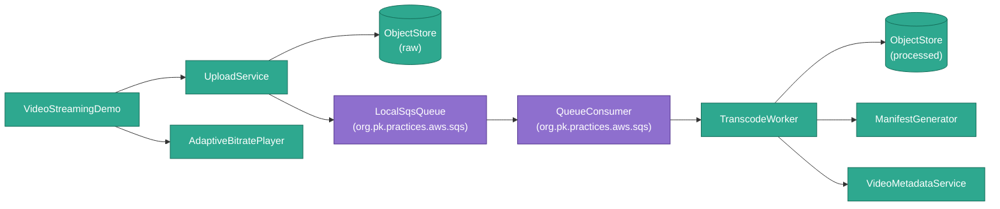

# Video Streaming Platform — Design Document

**Use case:** A general-purpose video streaming platform in the shape of YouTube
(user-generated content, huge upload volume, ad-supported) or Netflix
(licensed catalog, subscription-based, per-title encoding budgets are
justified since content is curated, not endless). This document designs
for the shared core — upload, transcode, store, deliver, play, secure —
and calls out where the two products' priorities diverge.

**Deliverable:** This started as design-only — requirements, architecture,
component deep-dives with tool/technology tradeoffs, data model, and
diagrams. It now also has a **runnable slice**: the upload → transcode →
ABR-manifest happy path from §4.1/§4.2/§4.4, including the partial-
rendition-failure and poison-video/DLQ scenarios from §8.1/§8.3, as real
Java in this same package — see [§12](#12-implementation-notes) for
exactly what's real vs. simplified, and [§10](#10-where-this-connects-to-other-practices-in-this-repo)
for what it reuses from elsewhere in the repo. Everything else in this
document (CDN, DRM, search/recommendation, the full reliability section)
remains design-only.

---

## Table of Contents

1. [Requirements](#1-requirements)
2. [Capacity Estimation (Illustrative)](#2-capacity-estimation-illustrative)
3. [High-Level Architecture](#3-high-level-architecture)
4. [Component Deep Dives](#4-component-deep-dives)
5. [Data Model](#5-data-model)
6. [API Design](#6-api-design-representative)
7. [Consolidated Tradeoffs](#7-consolidated-tradeoffs)
8. [Reliability, Consistency & Graceful Degradation](#8-reliability-consistency--graceful-degradation)
9. [NFR Traceability](#9-nfr-traceability)
10. [Where This Connects to Other Practices in This Repo](#10-where-this-connects-to-other-practices-in-this-repo)
11. [Going Further](#11-going-further)
12. [Implementation Notes](#12-implementation-notes)

---

## 1. Requirements

### 1.1 Functional

- Creators upload video; the platform transcodes it into multiple
  resolutions/bitrates and makes it playable shortly after.
- Viewers browse, search, and play video that adapts to their network
  conditions and device, resuming where they left off.
- Social/catalog features: comments, likes, playlists, subscriptions,
  watch history, recommendations.
- Licensed or sensitive content can be protected (DRM) and geo-restricted.

### 1.2 Non-Functional — the pillars the user asked for

| Pillar | What it means here | Primary levers |
|---|---|---|
| **Efficient** | Minimize storage $ and compute $ per hour of video served | Per-title encoding, tiered/cold storage, encode-once reuse, CDN offload of origin egress |
| **Fast** | Low startup latency, no rebuffering, fast search/recommendations | Small first segment, CDN edge proximity, adaptive bitrate, precomputed indices, aggressive caching |
| **Secure** | Content protection, account safety, platform abuse resistance | DRM/signed URLs, encryption in transit and at rest, rate limiting, least-privilege storage access |
| **Reliable** | Correct behavior under partial failure — the defining problem of a *distributed* system, where any service, replica, or network link can fail independently at any time | Idempotent retries, circuit breakers + bulkheads, replication/quorum, observability — all detailed in [§8](#8-reliability-consistency--graceful-degradation) |

**User experience isn't a separate pillar here** — it's the *observable
effect* of Fast and Reliable. A viewer doesn't experience "the
Recommendation Service returned a 500 with elevated p99 latency"; they
experience either a slightly-less-personalized homepage or a blank error
page, entirely depending on whether degradation was designed for. [§8.7](#87-graceful-degradation--what-the-user-actually-sees)
maps every failure mode in this design to exactly what a user sees.

Target service levels (illustrative, not measured): manifest/API p99 <
200ms from a warm cache; first-segment start < 2s on broadband; 99.95%
playback availability.

### 1.3 Out of Scope (see [§11](#11-going-further))

Live streaming, ads/monetization pipeline, content moderation/ML
classification, full recommendation-model design, multi-region
active-active writes.

---

## 2. Capacity Estimation (Illustrative)

Assumptions below are round numbers picked to size the architecture, **not
published YouTube/Netflix figures**.

| Assumption | Value |
|---|---|
| Daily active viewers | 50M |
| Avg. watch time / viewer / day | 40 min |
| Creators uploading / day | 500K videos, avg 8 min each |
| Renditions per video | 5 (240p/480p/720p/1080p/4K) |
| Avg. encoded size / video (all renditions) | ~1.2 GB |

**Derived load:**

| Metric | Estimate |
|---|---|
| Daily watch time | 50M × 40 min ≈ 33M hours/day |
| Peak concurrent streams (3× avg, evening peak) | ~2M concurrent |
| Peak egress bandwidth (avg 5 Mbps/stream) | ~10 Tbps at peak |
| New encoded storage / day | 500K × 1.2 GB ≈ 600 TB/day |
| New encoded storage / year | ~220 PB/year (before any cold-tiering) |
| Transcode compute | 500K videos/day × 8 min × 5 renditions ≈ 333K encode-hours/day |

Two numbers dominate the whole design: **10 Tbps of egress** (which is why
almost no design lets origin serve it directly — CDN offload is not
optional) and **220 PB/year of storage growth** (which is why cold-tiering
and not re-encoding old content matters more than any single algorithmic
optimization).

---

## 3. High-Level Architecture



**Color key:** 🔵 blue = client apps · 🟣 purple = API gateway (single
entry point) · 🟢 teal = control-plane services · 🟠 orange = the
upload/transcode pipeline · 🟡 gold = the CDN (the one box on this
diagram that carries almost all the traffic) · ⚪ slate = backing
stores/DBs.

### 3.1 Walking the diagram — user interaction

This is everything driven directly by something a viewer or creator does:

1. **A viewer opens the app** (blue boxes) and talks *only* to the
   **purple API Gateway** — it's the single front door, so every client
   (web, mobile, TV) speaks one contract regardless of which backend
   service actually answers.
2. The gateway routes each request to the right **teal service**:
   `Auth` to log in, `Search`/`Rec` to find something to watch, `Meta` to
   read a video's details, `Playback` to get a short-lived token to
   actually start streaming.
3. **Playback itself never goes through the gateway or a teal service
   again** — once the client has its token, it talks straight to the
   **gold CDN edge** for the manifest and every video segment. This is
   the arrow going from `CDN` straight back to `Web`/`Mobile`/`TV`,
   bypassing the gateway entirely — the single most important shape in
   this diagram, since it's what keeps the 10 Tbps egress number from
   [§2](#2-capacity-estimation-illustrative) off the control-plane
   services' backs entirely.
4. **A creator uploading a video** is the one user interaction that
   *does* cross into the orange pipeline: their client talks to `Upload`
   (still via the gateway), which is the entry point into backend flow
   below.

### 3.2 Walking the diagram — backend flow

This is everything that happens without a user waiting on it, kicked off
by the upload in step 4 above:

1. `Upload` writes the raw file into **Raw Object Storage** (first orange
   box) — the creator's client is already done at this point ([§4.1](#41-upload--ingestion)
   returns `202 Accepted` immediately).
2. Raw storage lands a job on the **Transcode Job Queue**, picked up by
   **Transcoding Workers**, which write every rendition into **Processed
   Object Storage** as HLS/DASH segments — this whole chain runs
   asynchronously, on its own time, with no client attached to it.
3. Workers also notify the teal `Metadata` service so the video's status
   flips from `PROCESSING` to `READY` once encoding finishes.
4. Processed storage feeds **Origin Servers**, which the **gold CDN**
   pulls from lazily the first time any viewer actually requests that
   video — this is the pull-through caching model from
   [§4.5](#45-cdn--edge-caching): nothing is pushed to the CDN until
   someone asks for it.
5. The slate boxes (`MetaDB`, `Cache`, `SearchIndex`, `RecStore`, `DRM`)
   are what each teal service reads and writes behind the scenes —
   invisible from the user-interaction side, but what makes step 2-3 of
   §3.1 fast.

Two data planes worth naming explicitly, since they have completely
different traffic shapes and are designed independently:

- **Control plane** (API Gateway → Auth/Upload/Metadata/Search/Rec):
  low-volume, latency-sensitive, consistency-sensitive (a like or a
  subscription shouldn't silently vanish).
- **Data plane** (Origin → CDN → Client, for both segment bytes and
  license/DRM handshakes): the 10 Tbps firehose; optimized purely for
  throughput and cache hit rate, and tolerant of eventual consistency
  (a freshly-uploaded video appearing 30s later than the metadata says
  it's ready is an acceptable tradeoff, not a bug).

---

## 4. Component Deep Dives

### 4.1 Upload & Ingestion



**Upload transport — options considered:**

| Option | Pros | Cons | Chosen? |
|---|---|---|---|
| Single-shot HTTP POST (whole file) | Simple | No resume on failure; huge files time out; ties up a server thread for the whole upload | No |
| **Client-driven multipart to object storage (S3 multipart / resumable protocol, e.g. tus)** | Resumable, parallelizable chunks, server never touches raw bytes | More client complexity; needs presigned-URL orchestration | **Yes** |
| WebRTC / streaming ingest | Good for live | Wrong tool for VOD upload | No (reserved for live, out of scope) |

**Upload path — direct-to-storage vs. through-app-server:**

| Option | Pros | Cons | Chosen? |
|---|---|---|---|
| Upload through application server, server relays to storage | Simple auth model | App server bandwidth becomes the bottleneck; doubles egress+ingress cost | No |
| **Presigned URLs — client uploads directly to object storage** | App server never sees the bytes; scales to any upload volume for free | Presigned URL must be scoped (short TTL, single object, size limit) to avoid abuse | **Yes** |

Efficiency: presigned direct-to-storage upload removes an entire hop of
bandwidth cost. Security: presigned URLs are short-lived, single-object,
and size-capped so a leaked URL can't be used to dump arbitrary data into
the bucket.

### 4.2 Transcoding Pipeline

**Job dispatch — options considered:**

| Option | Pros | Cons | Chosen? |
|---|---|---|---|
| Synchronous transcode in the upload request | Simplest | Blocks the client for minutes; no retry story; no backpressure control | No |
| **Async job queue (Kafka / SQS / RabbitMQ) + worker pool** | Decouples ingestion rate from encode throughput; natural retry + DLQ for a poison video file | Added infra; eventual consistency (video not instantly playable) | **Yes** |

This queue is a textbook fit for the semantics already built in this
repo's [`org.pk.practices.aws.sqs`](../../aws/sqs/README.md) practice:
visibility timeout while a worker encodes, automatic redelivery if a
worker crashes mid-job, and dead-lettering a video after N failed encode
attempts instead of retrying a corrupt file forever.

**Encoding compute — options considered:**

| Option | Cost | Speed | Quality control | Chosen? |
|---|---|---|---|---|
| Managed transcoding API (AWS MediaConvert, Elemental) | $$ per minute, no ops burden | Fast, autoscaled | Less fine-grained control | Good default for smaller teams |
| **Self-managed FFmpeg workers on CPU** | Cheapest at steady, predictable volume | Slower for 4K/HEVC | Full control over filter graphs, per-title ladders | **Yes**, for steady-state volume |
| GPU-accelerated encode (NVENC/Quick Sync) | Higher $/hour, much faster wall-clock | Fastest | Slightly lower compression efficiency than a slow CPU x265 pass | **Yes**, for the encode queue's head (new uploads, latency-sensitive) |

Chosen approach: a **hybrid pool** — GPU workers drain the head of the
queue (viewers are waiting on a newly-uploaded video), CPU workers handle
bulk/backlog/re-encode jobs where wall-clock time doesn't matter as much
as $/hour.

**Codec — options considered:**

| Codec | Compression vs. H.264 | Encode cost | Device support | Licensing | Chosen? |
|---|---|---|---|---|---|
| **H.264 (AVC)** | baseline | Low | Universal (even old TVs) | Patent pool, well-trodden | **Yes** — mandatory baseline rendition |
| H.265 (HEVC) | ~40-50% smaller | ~2-4× slower encode | Good on mobile/TV, weak on web (licensing friction in browsers) | Fragmented patent licensing | Optional, for supported devices |
| **AV1** | ~50% smaller than H.264 | Very slow encode (or $$ for hardware encode) | Growing (modern phones, Chrome, YouTube uses it heavily) | Royalty-free (AOMedia) | **Yes** — for popular content where the one-time encode cost is repaid many times over by egress savings |
| VP9 | ~35% smaller than H.264 | Slow | Good on Android/Chrome, weak on iOS/Safari | Royalty-free | Optional, legacy Android target |

Chosen ladder: encode every video in H.264 immediately (universal
compatibility, cheap, unblocks playback fast); asynchronously back-fill
AV1 (and HEVC if the catalog needs Apple-native support) only once a
popularity/view-count threshold is crossed — this is the single biggest
**efficiency** lever in the whole system, because AV1's slow encode cost
is worth paying only when a video will be watched enough times that the
egress savings dominate.

**Per-title encoding, not a fixed ladder:** analyze each source video's
complexity (motion, detail) and pick the bitrate ladder per title rather
than one fixed table for all content — a static talking-head video needs
far less bitrate at 1080p than an action scene. This is a well-known
Netflix technique; it costs more encode-time analysis up front but can
cut average bitrate 20%+ at equal perceptual quality — a direct storage
and egress efficiency win.

### 4.3 Storage Strategy

| Layer | Technology options | Chosen | Why |
|---|---|---|---|
| Raw uploads | S3 / GCS / Azure Blob vs. self-hosted (MinIO/Ceph) | **Managed object storage (S3-class)** | Ops burden of a self-hosted blob store at 100s of PB isn't worth it below hyperscaler size; managed storage gives 11-nines durability out of the box |
| Processed segments | Same object storage, different bucket/prefix, lifecycle rules | **Same provider, hot tier** | Segments are read constantly right after publish; keep on hot storage initially |
| Cold tier | Infrequent-access / archive storage class | **Lifecycle-transition after N days of no views** | This is the main lever against the 220 PB/year growth number from §2 — most content's view rate falls off a cliff after the first weeks |
| Metadata | Relational (Postgres/MySQL, sharded) vs. wide-column (Cassandra/DynamoDB) | **Both, split by access pattern** — see below | Neither is uniformly the right answer here |

**Metadata DB — SQL vs. NoSQL tradeoff, split by workload:**

| Data | Access pattern | Choice | Why |
|---|---|---|---|
| Video/channel/playlist catalog | Relational integrity matters (ownership, playlist ordering), moderate write volume | **Sharded relational (Postgres/MySQL)**, sharded by `channelId` or `videoId` hash | Joins and constraints genuinely help here; sharding handles the scale |
| View counts, watch history, likes | Extremely high write volume, eventual consistency is fine, simple key-based access | **Wide-column / KV store (Cassandra, DynamoDB)** | A relational DB would buckle under per-second view-count increments across millions of concurrent viewers; these stores are built for exactly this write shape |

Efficiency note: don't force one database to do both jobs — that's the
single most common over-generalization in a design like this, and it's
the reason a "just use Postgres for everything" answer breaks at this
scale.

### 4.4 Streaming Protocol & Adaptive Bitrate

| Protocol | Segment format | Device support | Chosen? |
|---|---|---|---|
| **HLS** (HTTP Live Streaming) | `.ts` or fMP4 segments + `.m3u8` manifest | Native on Apple platforms, near-universal elsewhere via player libraries | **Yes** |
| **MPEG-DASH** | fMP4 segments + `.mpd` manifest | Native on Android/web, not natively on iOS/Safari | **Yes** |
| Smooth Streaming (Microsoft, legacy) | fMP4 | Legacy Xbox/Silverlight only | No |

Chosen: **package both HLS and DASH from a single CMAF (Common Media
Application Format) segment set** — CMAF lets one set of encoded fMP4
segments serve both a `.m3u8` and a `.mpd` manifest, so you encode once
and package twice instead of encoding twice. This is an efficiency win
that's easy to miss if HLS and DASH are treated as fully separate
pipelines.

**Adaptive bitrate (ABR) algorithm — client-side, options considered:**

| Strategy | Idea | Weakness | Chosen? |
|---|---|---|---|
| Throughput-based | Estimate bandwidth from recent segment download times, pick the highest sustainable bitrate | Reacts slowly to sudden drops; can oscillate | Baseline |
| Buffer-based (BOLA-style) | Pick bitrate primarily from current buffer occupancy, not measured throughput | Slow to react to a sudden bandwidth *increase* | Baseline |
| **Hybrid (throughput + buffer, with hysteresis)** | Use throughput for the upward switch, buffer level as the safety net against rebuffering, damped switching to avoid oscillation | More tuning, but this is what real players (ExoPlayer, hls.js, Shaka) actually converge on | **Yes** |

Startup latency ("fast" pillar): request the **lowest** rendition for the
very first segment regardless of measured bandwidth, then let ABR ramp up
— trades a moment of lower quality for a much faster time-to-first-frame,
which matters more for perceived speed than starting at the "correct"
bitrate.

### 4.5 CDN & Edge Caching



**CDN strategy — options considered:**

| Option | Pros | Cons | Chosen? |
|---|---|---|---|
| Serve from origin only | Simple | Origin bandwidth bill and blast radius scale with every viewer — doesn't survive the 10 Tbps number from §2 | No |
| Single-vendor CDN (CloudFront / Akamai / Fastly) | Simple contract, one dashboard | Vendor outage = platform-wide outage; single negotiating position on egress pricing | Acceptable for a smaller platform |
| **Multi-CDN with real-time performance-based routing** | Resilience (fail out of a degraded CDN), leverage for egress pricing, best-latency routing per ISP/region | Real operational complexity: needs a routing layer (DNS-based or client-side RUM-driven) | **Yes**, at the scale in §2 |

**Cache strategy:** pull-through (CDN fetches from origin lazily on first
request, `Cache-Control` + long TTL since segments are immutable once
published) rather than push (proactively uploading every rendition to
every edge) — segments are content-addressed and immutable, so "pull +
cache forever, invalidate never" is both simpler and cheaper than a push
model; only a small prewarm push for known-hot content (a
just-published, highly-anticipated video) is worth doing proactively.

**Popularity-aware placement:** the view-count distribution is
extremely long-tailed — cache the small head of popular content
aggressively at every edge; let the long tail fall through to fewer,
more-central regional caches. This directly optimizes the efficiency/cost
side of CDN spend.

### 4.6 Metadata, Search & Recommendation

| Concern | Options | Chosen | Why |
|---|---|---|---|
| Full-text search (titles, descriptions, tags) | Elasticsearch/OpenSearch vs. Postgres full-text vs. managed (Algolia) | **Elasticsearch/OpenSearch** | Purpose-built for relevance ranking and facet filtering at this volume; Postgres full-text doesn't scale to catalog size with good relevance |
| Recommendations | Real-time online learning vs. **batch-computed candidate generation + light online re-ranking** | **Batch + light online re-ranking** | Full real-time personalization is a large ML system on its own (explicitly out of scope, [§1.3](#13-out-of-scope-see-11)); a nightly/hourly batch job producing per-user candidate sets, re-ranked online using cheap session signals (what was just watched), gets most of the benefit at a fraction of the system complexity |
| View count consistency | Strong vs. eventual | **Eventual** (approximate counter, reconciled periodically) | A view counter off by a few for a few seconds is invisible to users; forcing strong consistency here would require serializing every view event through one write path — a needless bottleneck |

### 4.7 Security & DRM

| Concern | Options | Chosen | Why |
|---|---|---|---|
| Content protection (licensed/premium video) | No protection vs. simple signed-URL/token auth vs. **full DRM (Widevine + FairPlay + PlayReady)** | **Tiered**: signed URLs + short-TTL tokens for all content; full multi-DRM only for licensed/premium catalog | Multi-DRM has real integration and license-server cost; not every video (e.g. a small creator's UGC clip) needs it, but licensed movie content contractually does |
| Playback authorization | Long-lived static URLs vs. **short-TTL signed tokens scoped to videoId + user session** | **Signed tokens** | Prevents link-sharing/hotlinking from bypassing auth or ads; a leaked URL expires in minutes |
| Transport security | Plain HTTP vs. **TLS everywhere (manifests, segments, API, license requests)** | **TLS everywhere** | Segment bytes and license exchanges are both sensitive; no exceptions |
| At-rest encryption | Provider-managed encryption vs. customer-managed keys (CMEK) | **CMEK for licensed content, provider-managed for the rest** | Balances key-management overhead against contractual/compliance requirements that only apply to some content |
| API abuse (scraping, credential stuffing, download bots) | No throttling vs. **token-bucket rate limiting at the API gateway**, keyed by user/IP/API-key | **Token-bucket rate limiting** | Directly implemented and explored in this repo's [`org.pk.practices.design.ratelimiter`](../ratelimiter/) practice |
| Upload abuse (malicious files, oversized uploads) | Trust the client vs. **presigned URL scoping (size cap, content-type, single-use) + async virus/format validation before transcoding** | **Scoped presigned URL + async validation** | Keeps validation off the upload hot path while still bounding what a client can push into storage |
| Geo/licensing restrictions | None vs. **edge-enforced geo-blocking based on license metadata** | **Edge-enforced** | Licensing terms are often region-scoped (especially for Netflix-style licensed catalogs); enforcing at the CDN edge avoids serving-then-rejecting |

### 4.8 API Gateway, Auth & Rate Limiting

- **AuthN**: OAuth2 / OIDC for user login; short-lived JWT access tokens +
  refresh tokens, validated at the gateway so backend services never
  re-implement auth.
- **AuthZ**: resource-level checks (does this user own this playlist? is
  this video private?) live in the owning service, not the gateway — the
  gateway only proves *who* is calling.
- **Rate limiting**: token-bucket per user/IP/API-key at the gateway,
  protecting both the control plane (metadata/search) and playback-token
  issuance from abuse. See
  [`org.pk.practices.design.ratelimiter`](../ratelimiter/) for a worked
  implementation of the algorithm itself.

---

## 5. Data Model



`VIDEO` and `CHANNEL` live in the sharded relational store ([§4.3](#43-storage-strategy));
`WATCH_HISTORY` and `LIKE` (highest write volume, simplest access
pattern) live in the wide-column store instead, despite being drawn here
alongside the relational tables for readability — the ER diagram shows
the *logical* model, not which physical store owns each table.

---

## 6. API Design (representative)

| Method | Path | Purpose |
|---|---|---|
| `POST` | `/v1/uploads` | Initiate an upload, returns a scoped presigned URL + `videoId` |
| `PUT` | `/v1/uploads/{videoId}/parts/{n}` | (Direct to storage, not through this API — listed for completeness) |
| `POST` | `/v1/uploads/{videoId}/complete` | Finalize upload, enqueue transcode job |
| `GET` | `/v1/videos/{videoId}` | Video metadata (title, status, renditions) |
| `GET` | `/v1/videos/{videoId}/playback-token` | Short-TTL signed token authorizing playback |
| `GET` | `/v1/videos/{videoId}/manifest` | Redirects to the CDN-hosted `.m3u8`/`.mpd`, scoped by the token above |
| `GET` | `/v1/search?q=...` | Full-text search over the catalog |
| `GET` | `/v1/recommendations` | Personalized candidate list for the current user |
| `POST` | `/v1/videos/{videoId}/comments` | Add a comment |
| `PUT` | `/v1/watch-history/{videoId}` | Update playback position (called periodically by the player) |

Playback itself (manifest + segment fetches) happens directly against the
CDN, not through this API — the API's job ends at handing the player a
token and a starting URL.

---

## 7. Consolidated Tradeoffs

| Decision | Chosen | Given up | Primarily serves |
|---|---|---|---|
| Presigned direct-to-storage upload | Scalable, no app-server bandwidth cost | Slightly more client complexity | Efficient, Fast |
| Async transcode via job queue | Decoupled, retryable, backpressure-safe | Video isn't instantly playable | Efficient, Reliable, Secure (poison-file isolation) |
| Hybrid GPU+CPU transcode pool | Fast for new uploads, cheap for backlog | More operational complexity than one pool type | Fast, Efficient |
| H.264-first, AV1 for popular content | Fast universal availability + long-run bandwidth savings | AV1 quality not day-one for every video | Efficient, Fast |
| Per-title encoding ladder | Lower average bitrate at equal quality | Extra upfront analysis compute | Efficient |
| Split SQL/NoSQL metadata store | Right tool for each write shape | Two systems to run instead of one | Efficient, Fast |
| CMAF single-encode, dual-package (HLS+DASH) | One encode serves both protocols | Slightly more complex packaging step | Efficient |
| Hybrid throughput+buffer ABR | Smooth playback across variable networks | More client-side tuning than either alone | Fast |
| Pull-through CDN caching, immutable segments | Simple, cheap, self-healing cache | Small first-request latency (cache miss) per edge | Efficient, Fast |
| Multi-CDN with performance routing | Resilience + pricing leverage | Real routing-layer complexity | Fast, Reliable, (indirectly) Secure |
| Tiered DRM (signed URL vs. full multi-DRM) | Right protection level per content tier | Not every video is "fully" protected | Secure, Efficient |
| Token-bucket rate limiting at the gateway | Predictable abuse resistance | Legitimate bursty clients must be designed around | Secure |
| Idempotent transcode writes (keyed by videoId+rendition) | Duplicate job delivery is harmless | Requires deliberate key design, not just "whatever's convenient" | Reliable |
| Circuit breakers + cached fallback for non-critical services | A degraded Recommendation/Search service can't cascade into a homepage outage | Extra per-dependency infrastructure (breaker + fallback content) | Reliable, (directly) User Experience |
| Quorum replication for the wide-column store | Tolerates a replica loss with no downtime | Slightly higher write latency than a single-replica write | Reliable |

---

## 8. Reliability, Consistency & Graceful Degradation

A distributed system's defining property is that any service, replica,
disk, or network link can fail *independently*, at any time, while the
rest of the system keeps running. Everything in this section exists
because "efficient/fast/secure" (§1.2) isn't enough on its own — a
perfectly efficient system that returns wrong answers or falls over under
partial failure isn't actually done.

### 8.1 Component Failure Modes

| Failure | Detection | Mitigation |
|---|---|---|
| Transcode worker crashes mid-job | Job queue visibility timeout expires | Automatic redelivery to another worker (same pattern as [`org.pk.practices.aws.sqs`](../../aws/sqs/README.md)) |
| Corrupt/malicious source file | Repeated transcode failures | Dead-letter after N attempts; flagged for manual review instead of retried forever |
| CDN edge/region outage | Health checks / elevated error rate from that edge | Multi-CDN routing fails traffic out to a healthy provider |
| Metadata DB shard down | Replica lag / connection failures | Read from replica; writes queue or fail closed for that shard only (blast radius contained to affected videos/channels) |
| Origin overloaded by a cache-stampede (viral video, cold cache) | Origin request-rate spike | Request coalescing at the CDN (single origin fetch serves all concurrent edge misses for the same segment) + proactive prewarm for known-hot uploads |
| Leaked/replayed playback token | Anomalous request volume from one token | Short TTL bounds the damage window; token scoped to one videoId + session |
| Partial rendition failure (4 of 5 encodes succeed, 1 fails) | Worker reports per-rendition status, not one job-level pass/fail | Video goes `READY` with whatever renditions succeeded — the client's ABR ladder just has one fewer rung; the failed rendition retries independently and backfills later. Playback is never blocked on the slowest or most failure-prone rendition |
| Transcode backlog grows faster than workers can drain it | Queue-depth / oldest-message-age metric crosses a threshold | Autoscale the worker pool on queue depth; if still growing, apply backpressure at Upload (new uploads queue for a later start) rather than letting the backlog grow unbounded — the creator sees a longer "Processing" wait, not a failure |
| Rate limiter's backing store (token-bucket state) is unavailable | Store connection errors / timeouts at the gateway | **Fails open** for read-heavy endpoints (search, metadata — an unthrottled-but-working system beats an unavailable one) but **fails closed** for playback-token issuance and login (abuse-resistance matters more than availability there). A single global fail-open or fail-closed answer is wrong; it has to be decided per endpoint |

### 8.2 Consistency Model — what's strong vs. eventual, and why

Not every piece of data needs the same guarantee, and forcing strong
consistency everywhere is itself a reliability *risk* (it creates
coordination points that fail together):

| Data / operation | Guarantee needed | Why | How |
|---|---|---|---|
| Auth session / token validity | Strong | A revoked token must stop working immediately, not "eventually" | Short-TTL stateless tokens sidestep the problem — revocation just means not re-issuing, no distributed invalidation needed |
| A creator's own upload status | Read-your-writes | A creator must see their own video as `PROCESSING` right after upload, not miss it because a replica lagged | Route a user's immediately-following reads to the primary/leader shard, or optimistic client-side state until confirmed |
| Video catalog metadata (title, description, status) for *other* viewers | Eventual (seconds-scale lag acceptable) | A video appearing "live" a few seconds late to a different viewer than the uploader is invisible in practice | Async replication from primary shard to read replicas |
| View counts, likes, watch history | Eventual, approximate | Already established in [§4.6](#46-metadata-search--recommendation) — correctness to the exact integer doesn't matter | Wide-column store, periodic reconciliation |
| Playback token issuance | No coordination needed at all | Tokens are self-contained signed claims (like a JWT), not rows in a shared table | Removing the need for consistency is better than solving for it |

### 8.3 Idempotency Under At-Least-Once Delivery

The transcode job queue ([§4.2](#42-transcoding-pipeline)) guarantees
**at-least-once** delivery, not exactly-once — this is a direct
consequence of using visibility-timeout-based redelivery
(demonstrated concretely in [`org.pk.practices.aws.sqs`](../../aws/sqs/README.md)).
That means **a transcode job can run twice** for the same video (worker A
finishes right as its visibility timeout expires and worker B picks up
the "redelivered" copy). The design has to make that harmless, not just
hope it doesn't happen:

- Workers write renditions to a key derived from `(videoId, resolution,
  codec)`, not a random job-run ID — a duplicate run overwrites identical
  bytes at the same key instead of creating a second copy.
- Marking a video `READY` in the Metadata Service is a set-to-value
  operation (`status = READY`), not an increment — running it twice has
  the same effect as running it once.
- The same principle applies on the client side: a doubled network
  request from a flaky mobile connection (e.g. tapping "like" twice) must
  land on an operation that's naturally idempotent (toggle/set) rather
  than one that isn't (increment-by-one), or must carry a client-generated
  idempotency key the server deduplicates on.

### 8.4 Timeouts, Retries & Circuit Breakers Between Services

Every arrow in the [§3](#3-high-level-architecture) diagram is a network
call that can be slow instead of just up or down — the failure mode that
naive retry logic handles worst, because a slow dependency can look
identical to a working one until it's too late.

| Caller → Callee | Timeout / retry | If it keeps failing (circuit breaker) | What the user sees |
|---|---|---|---|
| Gateway → Recommendation Service | Short timeout (~150ms), 1 retry | Breaker trips, calls fail fast without waiting | Homepage falls back to a cached trending list — see [§8.7](#87-graceful-degradation--what-the-user-actually-sees) |
| Gateway → Search Service | Short timeout, 1 retry | Breaker trips | "Search unavailable" — rest of the app unaffected |
| Gateway → Metadata Service | Timeout + backoff retry (no breaker fallback — this is core) | N/A, this call is on the critical path | That specific request fails; other requests to other services are unaffected (bulkhead isolation) |
| Worker → Object Storage | Retry with exponential backoff | N/A (provider SLA is high enough that a breaker adds little) | No user-visible impact — this is entirely inside the async pipeline |

**Bulkheads**: a slow/failing Recommendation Service must not consume all
of the gateway's connection pool and starve requests to Metadata or
Auth — each downstream dependency gets its own bounded pool/thread
budget, so one degraded service can't take the whole gateway down with
it. This is what makes the fallbacks in the table above actually possible
in practice, not just in theory.

**Retry storms**: every retry in the table above uses **jittered**
exponential backoff (a randomized delay, not a fixed interval). Without
jitter, a brief blip causes every client/worker to retry at the exact
same instant, synchronizing into a thundering herd that turns a
sub-second hiccup into a self-inflicted outage — the retry storm doing
more damage than the original failure.

### 8.5 Replication & Durability

| Store | Replication strategy | Tradeoff |
|---|---|---|
| Sharded relational metadata DB | Primary + read replicas per shard; synchronous replication to at least one replica before acknowledging a write, async to the rest | A write waits on one extra replica's ack (small latency cost) in exchange for not losing an acknowledged write if the primary dies |
| Wide-column store (view counts, watch history) | Quorum replication (e.g. replication factor 3, write quorum 2, read quorum 2) | Tolerates one replica being down with no loss of availability or consistency; tolerates two down with a full outage for that partition — an explicit, tunable tradeoff, not an accident |
| Object storage (raw + processed video) | Provider-managed cross-AZ (and often cross-region) replication | Already effectively solved by choosing managed storage in [§4.3](#43-storage-strategy) — this is exactly the ops burden that decision was avoiding |

**Under a network partition** (a primary can't reach a replica, or a
shard is split from the rest of the cluster), the two stores above
deliberately make opposite CAP choices: the relational metadata store
picks **consistency over availability** for the affected shard — a
partitioned-away primary fails closed rather than risking a diverged
write (this is exactly the "Metadata DB shard down" row in
[§8.1](#81-component-failure-modes): blast radius contained, not silently
wrong data). The wide-column store picks **availability over strict
consistency** — a quorum write/read still succeeds as long as a majority
of replicas are reachable, accepting that the minority side may serve
stale data until the partition heals. Neither choice is universally
"more correct"; they're matched to what each store holds (catalog
integrity vs. approximate engagement counters), consistent with the
consistency-model split in [§8.2](#82-consistency-model--whats-strong-vs-eventual-and-why).

### 8.6 Observability

You cannot operate a system this distributed by reasoning about it from
first principles when something goes wrong at 3am — you need to be able
to *see* it:

- **Metrics**: the four golden signals (latency, traffic, error rate,
  saturation) per service, exported to a time-series store, with
  dashboards scoped per service and per dependency edge from
  [§8.4](#84-timeouts-retries--circuit-breakers-between-services).
- **Distributed tracing**: a single request ID propagated from the
  gateway through every downstream call it fans out to (Auth → Meta →
  Playback → DRM, etc.) — without this, a slow playback-token request is
  unrecoverable as a mystery across 4+ services instead of one trace with
  an obvious slow span.
- **Structured, centralized logging** — not "SSH into a box and grep,"
  which stops being possible the moment there's more than a handful of
  instances of any one service.
- **SLOs and alerting** tied directly to the targets in [§1.2](#12-non-functional--the-pillars-the-user-asked-for):
  alert on an actual p99/availability budget burn, not merely on "a
  server is down," since a system built from redundant components can be
  fully "up" while still silently missing its latency target.

### 8.7 Graceful Degradation — What the User Actually Sees

This is the direct link between reliability and user experience: the
same backend failure can be invisible or platform-breaking, entirely
depending on whether a fallback was designed for it.

| Component fails | Naive failure mode | Designed degradation | What the user sees |
|---|---|---|---|
| Recommendation Service | Homepage request fails | Falls back to a precomputed, cached trending/popular list | A slightly less personalized homepage — no error |
| Search Service | Search request fails | Search box shows "search unavailable"; category browsing still works | Can't search, can still browse — not blocked entirely |
| Comments loading | Video page waits on comments before rendering | Comments load asynchronously, after playback has already started | Video starts immediately; comments pop in a moment later, or show a retry state |
| One CDN provider | Segment requests fail | Multi-CDN routing fails the client over to a healthy provider ([§4.5](#45-cdn--edge-caching)) | No visible interruption in most cases |
| One metadata DB shard | Only that shard's requests fail | Blast radius contained to that shard's videos/channels ([§8.1](#81-component-failure-modes)) | Some videos/channels affected; the rest of the platform is unaffected |
| DRM License Server down | **No DRM-protected video can start** | Only content in the full-multi-DRM tier is affected (tiered DRM, [§4.7](#47-security--drm)) — everything else has no dependency on this service at all | Premium/licensed catalog is blocked; UGC/unprotected content plays normally — a *partial* critical path, not a platform-wide one |
| Playback/License Service | **No new video can start** | **Cannot be degraded away — it's on the critical path** | A real outage for anyone trying to start something new; this is exactly why it needs the highest redundancy budget in the whole system, not a fallback |

The last two rows matter as much as the others: **not everything can
gracefully degrade**, and pretending otherwise is its own reliability
risk. Identifying which components are genuinely on the critical path —
fully (Playback/License issuance) or partially (the DRM server, scoped to
one content tier) — is what tells you where to actually spend redundancy
budget, versus where a cached fallback is good enough.

### 8.8 Disaster Recovery (Single-Region)

Distinct from the multi-region active-active question deferred to
[§11](#11-going-further) — even a single region needs an answer for
losing an availability zone outright or for data getting corrupted, not
just for one instance crashing.

| Scenario | Target | Mechanism |
|---|---|---|
| One availability zone lost | No data loss; brief failover | Multi-AZ replicas for the metadata DB and wide-column store ([§8.5](#85-replication--durability)); object storage is cross-AZ by default |
| A bad deploy or bug corrupts metadata | Point-in-time restore | Continuous backup/WAL archiving on the relational store, restorable to any point within a retention window |
| Entire region lost | Not an automatic failover — explicitly out of scope | Cross-region backup copies exist for manual recovery, but this design doesn't promise the always-on multi-region story that automatic regional failover would require |

Illustrative targets: RPO (maximum acceptable data loss) under 5 minutes
for metadata, RTO (time to restore service) under 1 hour for an AZ loss —
both deliberately looser than a zero-RPO/RTO guarantee would demand,
which is exactly why full multi-region active-active is a separate,
larger effort rather than assumed here.

---

## 9. NFR Traceability

| NFR | Design elements that serve it |
|---|---|
| **Efficient** | Presigned upload, async transcode, per-title ladder, H.264→AV1 backfill, tiered/cold storage, split SQL/NoSQL, CMAF single-encode, pull-through caching, popularity-aware placement |
| **Fast** | Direct-to-storage upload, GPU head-of-queue transcode, lowest-rendition-first startup, hybrid ABR, CDN edge proximity, multi-CDN routing, precomputed search index, batch+online-rerank recommendations |
| **Secure** | Scoped presigned URLs, TLS everywhere, tiered DRM, short-TTL signed playback tokens, CMEK for licensed content, gateway rate limiting, async upload validation, edge geo-enforcement |
| **Reliable** | Idempotent transcode/like/status writes ([§8.3](#83-idempotency-under-at-least-once-delivery)), per-datastore consistency choices ([§8.2](#82-consistency-model--whats-strong-vs-eventual-and-why)), circuit breakers + bulkheads ([§8.4](#84-timeouts-retries--circuit-breakers-between-services)), quorum/replica durability ([§8.5](#85-replication--durability)), golden-signal metrics + tracing ([§8.6](#86-observability)) |
| **User Experience** *(not a separate mechanism — the observable effect of the above)* | Graceful-degradation fallbacks for non-critical services, async/lazy loading of secondary content (comments), fast time-to-first-frame, redundancy concentrated on the one truly critical-path service (Playback/License) — full mapping in [§8.7](#87-graceful-degradation--what-the-user-actually-sees) |

---

## 10. Where This Connects to Other Practices in This Repo

This design deliberately reuses patterns already built and tested
elsewhere in this repo, rather than treating them as unrelated exercises:

- **[`org.pk.practices.aws.sqs`](../../aws/sqs/README.md)** — **actually
  wired up**, not just a pattern match: `TranscodeWorker` in this same
  package is a `QueueConsumer.MessageHandler` running against a real
  `LocalSqsQueue`, so the transcode pipeline's retry/redelivery/dead-letter
  behavior *is* `org.pk.practices.aws.sqs`, imported directly — see
  [§12](#12-implementation-notes).
- **[`org.pk.practices.design.ratelimiter`](../ratelimiter/)** — the
  token-bucket algorithm behind API gateway rate limiting and anti-abuse
  throttling.
- **[`org.pk.practices.design.locking`](../locking/README.md)** — the
  concurrency primitives relevant to safely incrementing shared counters
  (view counts, subscriber counts) under high write concurrency.
- **[`org.pk.practices.design.bloomfilter`](../bloomfilter/DESIGN.md)** —
  a natural fit for "has this user already seen this recommendation
  candidate" / "has this segment already been prewarmed at this edge"
  membership checks at low memory cost.
- **[`org.pk.practices.design.servicediscovery`](../servicediscovery/DESIGN.md)** —
  health checks (`HealthCheck`, `HeartbeatHealthCheck`,
  `TcpHealthCheck`) and load-balancing strategies directly implement the
  "detect an unhealthy instance and route around it" half of
  [§8.4](#84-timeouts-retries--circuit-breakers-between-services)'s
  circuit-breaker story.

The SQS connection above is real and running; the other three are still a
map from this design's components to code that already exists and could
be adapted, not a claim that they're wired up.

---

## 11. Going Further

Deliberately out of scope for this pass, in rough order of how much new
system they'd each pull in:

- **Live streaming**: a different ingestion path entirely (RTMP/SRT
  ingest, low-latency HLS/DASH or WebRTC delivery, sub-second segment
  durations) — shares the CDN/storage/DRM layers above but not the upload
  or transcoding pipeline.
- **Ads & monetization**: ad-decisioning service, server-side ad
  insertion (stitching ads into the manifest/segments) vs. client-side,
  billing/subscription management.
- **Content moderation**: automated classification (ML) plus human
  review queues for uploaded content — a substantial system on its own.
- **Full recommendation system**: the batch+re-rank approach in
  [§4.6](#46-metadata-search--recommendation) is a placeholder for what's
  actually a large ML platform (feature store, model training pipeline,
  A/B testing infrastructure, cold-start handling for new users/videos).
- **Multi-region active-active**: this design assumes a primary region
  with CDN-level global reach for playback, but active-active writes for
  the control plane (so an uploader in one region isn't dependent on
  another region's metadata DB) is a further step up in complexity.

---

## 12. Implementation Notes

The upload → transcode → ABR-manifest happy path (§4.1, §4.2, §4.4) is
implemented as real, runnable Java in this same package —
`VideoStreamingDemo` walks it end to end. Also implemented: the partial-
rendition-failure path (§8.1) and the poison-video retry/DLQ path (§8.3),
since both fall directly out of the same worker logic.



**What's real:** the job queue is a genuine `LocalSqsQueue` with real
visibility timeouts and real dead-lettering, not a simulation of one; the
manifest is a syntactically valid HLS master playlist; the idempotent
object keys, the per-title bitrate scaling, the partial-failure-still-
goes-READY logic, and the proactive `FAILED` marking on a worker's last
receive attempt are all the actual logic described in §4.2/§8.1/§8.3, not
just a diagram of it. The ABR player's decisions were hand-verified
against the algorithm in §4.4 against a specific network trace (see the
class Javadoc in `AdaptiveBitratePlayer`).

**What's simplified or entirely faked, deliberately:**

| Real system | This practice |
|---|---|
| An actual video codec (H.264/AV1/etc.) | A 256-byte placeholder payload per rendition — the "theoretical bytes" a real encode would produce is computed and printed, but never actually allocated or encoded |
| HTTP/network calls between services | Plain in-process Java method calls — there is no client-server boundary anywhere in this demo |
| A real object store (S3-class) | `ObjectStore` — an in-memory `ConcurrentHashMap`, no durability, no replication |
| A sharded relational + wide-column metadata store (§4.3) | `VideoMetadataService` — one in-memory map, no sharding, no consistency model to speak of |
| CDN, DRM, search, recommendations, gateway auth/rate-limiting | Not implemented at all — `AdaptiveBitratePlayer` reads the manifest directly from the in-memory processed store, standing in for what would otherwise be a CDN fetch |
| A real client measuring real bandwidth/buffer | A hardcoded `int[][]` network trace fed straight into the ABR algorithm |

None of this is a shortcut taken by accident — the point of this slice
was the pipeline's *shape* (async, idempotent, retryable, degrading
gracefully) and the ABR *decision logic*, not building a video encoder or
a CDN, both of which are entire practices of their own.

## Running

```bash
./gradlew :lib:run
```

(`application.mainClass` in `lib/build.gradle.kts` currently points at
`VideoStreamingDemo` — switch it to try any other practice's demo
instead, per the comment block there.)
